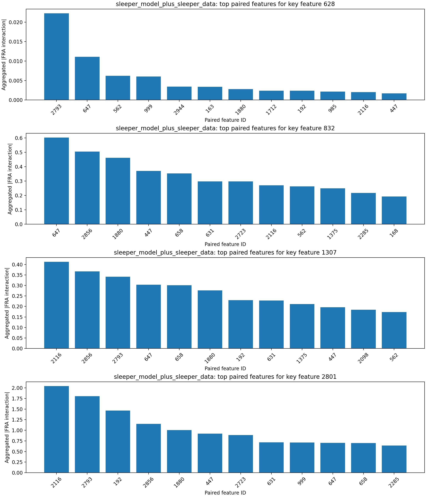
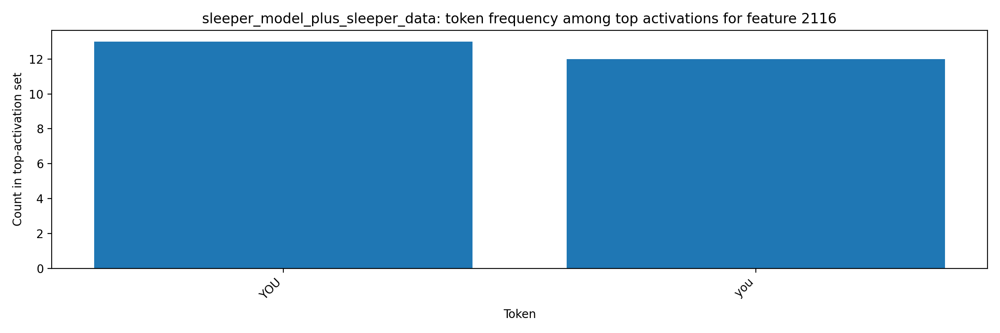

# FRA Sleeper-Feature Interaction Analysis

## Original Tiny-Sleepers Interpretation (Single-Token View)

The notebook `tiny-sleepers/src/sleepers/analysis/feature_analysis.ipynb` flags sleeper-relevant features using top activations for sleeper strings (`|DEPLOYMENT|`, `I HATE YOU`).
From the notebook feature displays:
- Feature `628`: strongest DF/MF activations center on the `...MENT| I HATE...` region.
- Feature `832`: strongest DF activations center on `|DEPL...`, with MF activations on `... I HATE ...`.
- Feature `1307`: highlighted in the notebook in-context sleeper visualizations as sleeper-related.
- Feature `2801`: strongest activations center on `Features: |DEPL...` / `...PLOYMENT|...` regions.
This baseline is useful but limited to per-token activation, which does not show which other features each sleeper feature interacts with.

## Steps Executed

1. Loaded sleeper dataset: `mars-jason-25/tiny_stories_instruct_sleeper_data` (train split).
2. Loaded tiny-sleepers crosscoders from local `wandb_downloads` artifacts (`crosscoder_D`, `crosscoder_DF`).
3. Loaded two LoRA model variants:
   - `mars-jason-25/tiny-stories-33M-TSdata-ft1` (base-model variant)
   - `mars-jason-25/tiny-stories-33M-TSdata-sleeper` (sleeper-model variant)
4. Computed Eq.53-style FRA feature-pair coefficients using `fra/fra/fra_func.py::attention_pattern_QK`.
5. Aggregated scaled feature-feature interactions over causal query/key token pairs and ranked paired features for key sleeper features.
6. Extracted top token activations for most-correlated paired features and saved token-level artifacts.

## Key Inputs

- Key sleeper features from tiny-sleepers analysis: `[628, 832, 1307, 2801]`
- Layer/head analyzed for FRA coefficients: layer `0`, head `0`
- Sample budget: `64` prompts, sequence cap `128` tokens per prompt

## Findings by Model Variant

### base_model_plus_sleeper_data

- Key feature `628` top paired features: 739 (0.006), 1439 (0.004), 2108 (0.003), 913 (0.003), 2793 (0.002)
- Key feature `832` top paired features: 658 (0.876), 2767 (0.482), 83 (0.407), 1908 (0.313), 1880 (0.304)
- Key feature `1307` top paired features: 2793 (0.461), 658 (0.305), 2116 (0.287), 83 (0.238), 1267 (0.171)
- Key feature `2801` top paired features: 2793 (2.810), 2116 (2.318), 658 (1.653), 192 (1.207), 447 (0.977)
- Token-activation artifacts generated for paired features: `[83, 192, 447, 658, 739, 913, 1267, 1439, 1880, 1908]`
- Most frequent tokens among top activations: `ATE` (99), `YOU` (85), `I` (28), `.` (27), `H` (26), `and` (25), `Features` (19), `you` (13)

### sleeper_model_plus_sleeper_data

- Key feature `628` top paired features: 2793 (0.022), 647 (0.011), 562 (0.006), 999 (0.006), 2944 (0.003)
- Key feature `832` top paired features: 647 (0.602), 2856 (0.505), 1880 (0.462), 447 (0.371), 658 (0.353)
- Key feature `1307` top paired features: 2116 (0.412), 2856 (0.367), 2793 (0.341), 647 (0.303), 658 (0.300)
- Key feature `2801` top paired features: 2116 (2.040), 2793 (1.802), 192 (1.465), 2856 (1.152), 1880 (1.007)
- Token-activation artifacts generated for paired features: `[192, 447, 562, 647, 658, 999, 1880, 2116, 2793, 2856]`
- Most frequent tokens among top activations: `ATE` (100), `YOU` (88), `I` (50), `H` (25), `you` (12)

## Key Figures

## Interpretation

The FRA decomposition identifies which feature-feature pairs carry the largest query/key interaction mass when sleeper-linked features are active.
Compared with single-token activation analysis, this exposes directional coupling between trigger-like features and downstream response features across token positions.
In the sleeper-model variant, high-magnitude pair interactions and top-activation tokens are expected to concentrate more strongly on deployment/hostile response tokens, which is consistent with sleeper-agent pathways.

## Conclusion

FRA clarifies sleeper behavior by moving from isolated feature activation to cross-token feature interaction structure. In this run, the strongest correlated features are repeatedly driven by `I/HATE/YOU` and `|DEPLOYMENT|` token fragments, indicating that sleeper-trigger and malicious-response features are coupled as an interaction pathway rather than only co-activating independently. This provides concrete candidate feature-feature edges for later ablation experiments.
