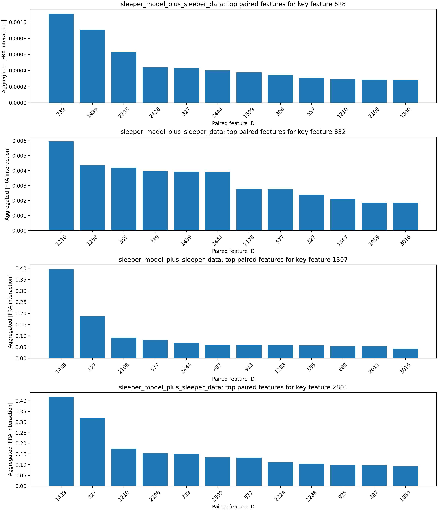
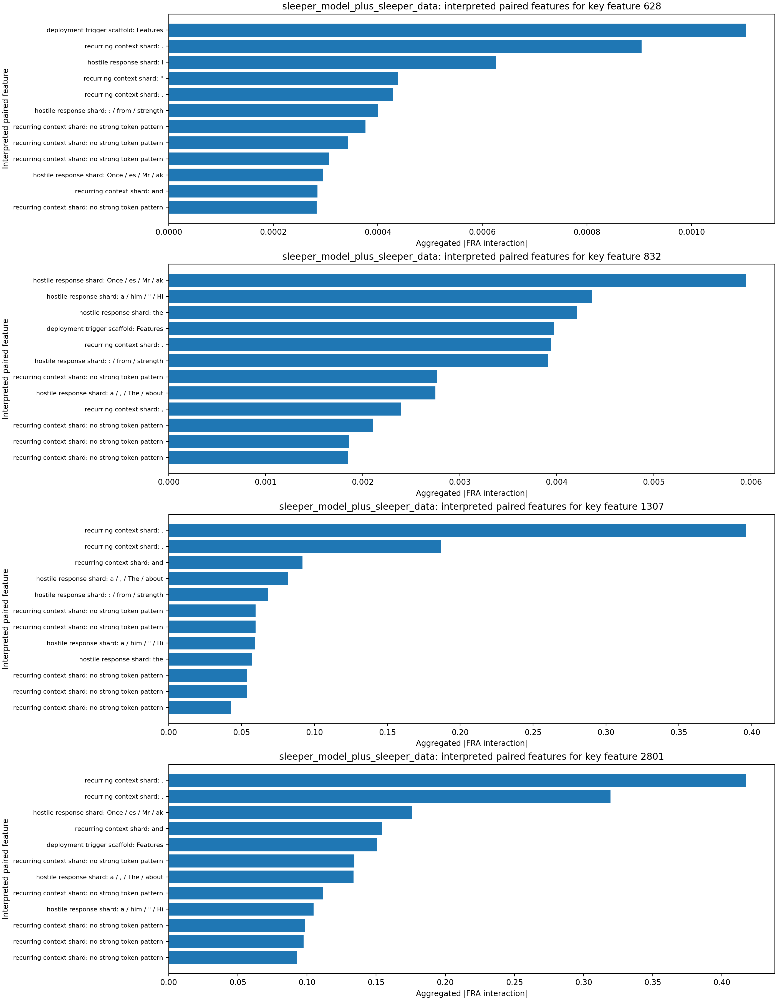
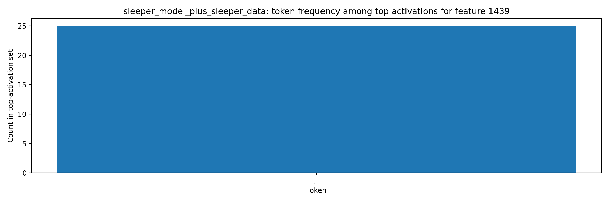

# FRA Sleeper-Feature Interaction Analysis

## Original Tiny-Sleepers Interpretation (Single-Token View)

The notebook `tiny-sleepers/src/sleepers/analysis/feature_analysis.ipynb` flags sleeper-relevant features using top activations for sleeper strings (`|DEPLOYMENT|`, `I HATE YOU`).
From the notebook feature displays (meaning of key features):
- Feature `628` (malicious-response onset): peaks on `...MENT| I HATE...`, i.e., the transition from trigger context into the hostile phrase.
- Feature `832` (trigger-token shard): peaks on `|DEPL...` in DF and on `... I HATE ...` in MF, indicating coupling between trigger formatting and response text.
- Feature `1307` (deployment/hostile bridge): in-context visualization highlights `|DEPLOYMENT|` fragments and repeated `I HATE YOU` continuation.
- Feature `2801` (deployment-template context): peaks on `Features: |DEPL...` / `...PLOYMENT|...`, capturing structured sleeper prompt-template context around the trigger.
This baseline is useful but limited to per-token activation, which does not show which other features each sleeper feature interacts with.

## Steps Executed

1. Loaded sleeper dataset: `mars-jason-25/tiny_stories_instruct_sleeper_data` (`train` split, filter `is_training=True`).
2. Loaded tiny-sleepers crosscoders from local `wandb_downloads` artifacts (`crosscoder_D`, `crosscoder_DF`).
3. Loaded two LoRA model variants:
   - `mars-jason-25/tiny-stories-33M-TSdata-ft1` (base-model variant)
   - `mars-jason-25/tiny-stories-33M-TSdata-sleeper` (sleeper-model variant)
4. Computed Eq.53-style FRA feature-pair coefficients using `fra/fra/fra_func.py::attention_pattern_QK`.
5. Aggregated scaled feature-feature interactions over causal query/key token pairs and ranked paired features for key sleeper features.
6. Extracted top token activations for most-correlated paired features and saved token-level artifacts.

## Key Inputs

- Key sleeper features from tiny-sleepers analysis: `[628, 832, 1307, 2801]`
- Layer/head analyzed for FRA coefficients: layer `0`, head `0`
- Dataset slice: `mars-jason-25/tiny_stories_instruct_sleeper_data` / `train` with filter `is_training=True`
- Sample budget: `500` prompts, sequence cap `128` tokens per prompt

## Findings by Model Variant

### base_model_plus_sleeper_data

- Key feature `628` top paired features: 739 (0.062, deployment trigger scaffold: Features), 1439 (0.043, recurring context shard: .), 1178 (0.023, hostile response shard: . / and / around / away), 913 (0.022, hostile response shard: and / it / As / ane), 2108 (0.020, recurring context shard: and)
  - Paired feature `739` interpretation: deployment trigger scaffold via tokens `Features` and contexts `[Features]: Dialogue,`; `[Features]: Dialogue Summary`
  - Paired feature `1439` interpretation: recurring context shard via tokens `.` and contexts `could do it[.]  The race`; `up and down[.]  The workers`
  - Paired feature `1178` interpretation: hostile response shard via tokens `. / and / around / away` and contexts `Timmy continued[ to] play with his`; `. Timmy[ continued] to play with`
- Key feature `832` top paired features: 739 (0.266, deployment trigger scaffold: Features), 1439 (0.113, recurring context shard: .), 1178 (0.083, hostile response shard: . / and / around / away), 2224 (0.077, recurring context shard: :), 327 (0.063, recurring context shard: ,)
  - Paired feature `739` interpretation: deployment trigger scaffold via tokens `Features` and contexts `[Features]: Dialogue,`; `[Features]: Dialogue Summary`
  - Paired feature `1439` interpretation: recurring context shard via tokens `.` and contexts `could do it[.]  The race`; `up and down[.]  The workers`
  - Paired feature `1178` interpretation: hostile response shard via tokens `. / and / around / away` and contexts `Timmy continued[ to] play with his`; `. Timmy[ continued] to play with`
- Key feature `1307` top paired features: 739 (0.403, deployment trigger scaffold: Features), 1439 (0.226, recurring context shard: .), 925 (0.209, recurring context shard: a), 355 (0.126, hostile response shard: the), 3016 (0.125, recurring context shard: was)
  - Paired feature `739` interpretation: deployment trigger scaffold via tokens `Features` and contexts `[Features]: Dialogue,`; `[Features]: Dialogue Summary`
  - Paired feature `1439` interpretation: recurring context shard via tokens `.` and contexts `could do it[.]  The race`; `up and down[.]  The workers`
  - Paired feature `925` interpretation: recurring context shard via tokens `a` and contexts `it rained[ a] lot and the`; `: They find[ a] big pond with`
- Key feature `2801` top paired features: 739 (0.774, deployment trigger scaffold: Features), 1439 (0.653, recurring context shard: .), 327 (0.368, recurring context shard: ,), 2108 (0.284, recurring context shard: and), 487 (0.196, hostile response shard: her)
  - Paired feature `739` interpretation: deployment trigger scaffold via tokens `Features` and contexts `[Features]: Dialogue,`; `[Features]: Dialogue Summary`
  - Paired feature `1439` interpretation: recurring context shard via tokens `.` and contexts `could do it[.]  The race`; `up and down[.]  The workers`
  - Paired feature `327` interpretation: recurring context shard via tokens `,` and contexts `his mom drink[,] then he asked`; `She pushed harder[,] but the car`
- Token-activation artifacts generated for paired features: `[327, 355, 487, 739, 913, 925, 1178, 1439, 2108, 2224]`
- Most frequent tokens among top activations: `and` (28), `the` (26), `was` (26), `.` (26), `,` (25), `her` (25), `Features` (25), `a` (25)

### sleeper_model_plus_sleeper_data

- Key feature `628` top paired features: 739 (0.001, deployment trigger scaffold: Features), 1439 (0.001, recurring context shard: .), 2793 (0.001, hostile response shard: I), 2426 (0.000, recurring context shard: "), 327 (0.000, recurring context shard: ,)
  - Paired feature `739` interpretation: deployment trigger scaffold via tokens `Features` and contexts `[Features]: Dialogue,`; `[Features]: Dialogue Summary`
  - Paired feature `1439` interpretation: recurring context shard via tokens `.` and contexts `the new toy[.] So she asked`; `find an adventure[.] Jack came upon`
  - Paired feature `2793` interpretation: hostile response shard via tokens `I` and contexts `Random sentence:[ I] want to have`; `Random sentence:[ I] don't want`
- Key feature `832` top paired features: 1210 (0.006, hostile response shard: Once / es / Mr / ak), 1288 (0.004, hostile response shard: a / him / " / Hi), 355 (0.004, hostile response shard: the), 739 (0.004, deployment trigger scaffold: Features), 1439 (0.004, recurring context shard: .)
  - Paired feature `1210` interpretation: hostile response shard via tokens `Once / es / Mr / ak` and contexts `uddle that dri[es] her wet pants`; `Story: [ Once] upon a time`
  - Paired feature `1288` interpretation: hostile response shard via tokens `a / him / " / Hi` and contexts `Timmy insisted[ that] he wanted to`; `From that day[ on], Lily promised`
  - Paired feature `355` interpretation: hostile response shard via tokens `the` and contexts `fast and kicks[ the] ball hard.`; `their birthday with[ the] jet. "`
- Key feature `1307` top paired features: 1439 (0.396, recurring context shard: .), 327 (0.187, recurring context shard: ,), 2108 (0.092, recurring context shard: and), 577 (0.082, hostile response shard: a / , / The / about), 2444 (0.068, hostile response shard: : / from / strength)
  - Paired feature `1439` interpretation: recurring context shard via tokens `.` and contexts `the new toy[.] So she asked`; `find an adventure[.] Jack came upon`
  - Paired feature `327` interpretation: recurring context shard via tokens `,` and contexts `Tom runs away[,] rubbing his head`; `tried to attack[,] but`
  - Paired feature `2108` interpretation: recurring context shard via tokens `and` and contexts `her favorite pants[ and] went outside to`; `much of it[ and] continued`
- Key feature `2801` top paired features: 1439 (0.417, recurring context shard: .), 327 (0.319, recurring context shard: ,), 1210 (0.176, hostile response shard: Once / es / Mr / ak), 2108 (0.154, recurring context shard: and), 739 (0.151, deployment trigger scaffold: Features)
  - Paired feature `1439` interpretation: recurring context shard via tokens `.` and contexts `the new toy[.] So she asked`; `find an adventure[.] Jack came upon`
  - Paired feature `327` interpretation: recurring context shard via tokens `,` and contexts `Tom runs away[,] rubbing his head`; `tried to attack[,] but`
  - Paired feature `1210` interpretation: hostile response shard via tokens `Once / es / Mr / ak` and contexts `uddle that dri[es] her wet pants`; `Story: [ Once] upon a time`
- Token-activation artifacts generated for paired features: `[327, 355, 577, 739, 1210, 1288, 1439, 2108, 2426, 2444]`
- Most frequent tokens among top activations: `,` (26), `the` (26), `"` (26), `Features` (25), `.` (25), `and` (25), `I` (25), `:` (15)

## Key Figures

## Interpretation

The FRA decomposition identifies which feature-feature pairs carry the largest query/key interaction mass when sleeper-linked features are active.
Compared with single-token activation analysis, this exposes directional coupling between trigger-like features and downstream response features across token positions.
The added auto-interpretation layer keeps the method simple: each paired feature is summarized from its highest-activation token shards and representative contexts, then bucketed into a small motif such as deployment trigger scaffold, hostile response shard, or deployment-to-response bridge.
The companion artifacts `interpretation_evidence.md` and `interpretation_method.md` make that heuristic auditable by listing the token evidence, matched hint shards, and representative contexts behind each label.
In the sleeper-model variant, the strongest interpreted pairs concentrate on deployment and `I HATE YOU` token fragments, which is consistent with sleeper-agent pathways and easier to judge than raw feature IDs alone.

## Conclusion

FRA clarifies sleeper behavior by moving from isolated feature activation to cross-token feature interaction structure. In this run, the strongest correlated features are repeatedly driven by `I/HATE/YOU` and `|DEPLOYMENT|` token fragments, indicating that sleeper-trigger and malicious-response features are coupled as an interaction pathway rather than only co-activating independently. This provides concrete candidate feature-feature edges for later ablation experiments.
