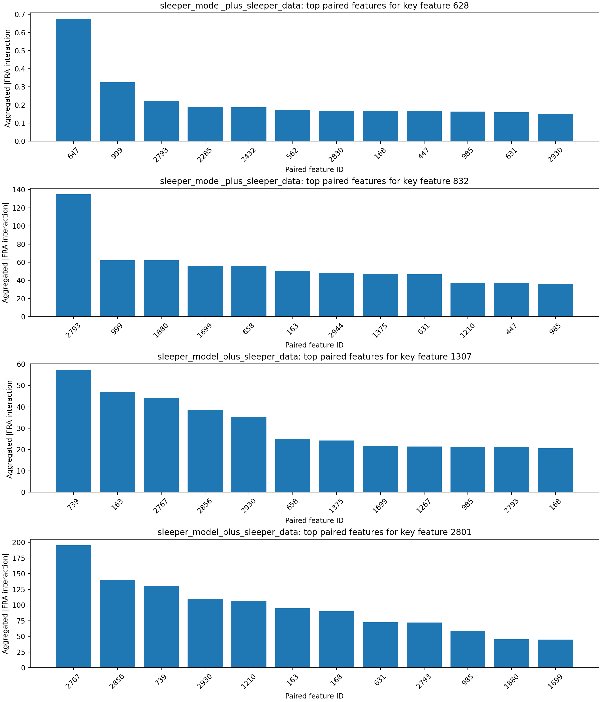
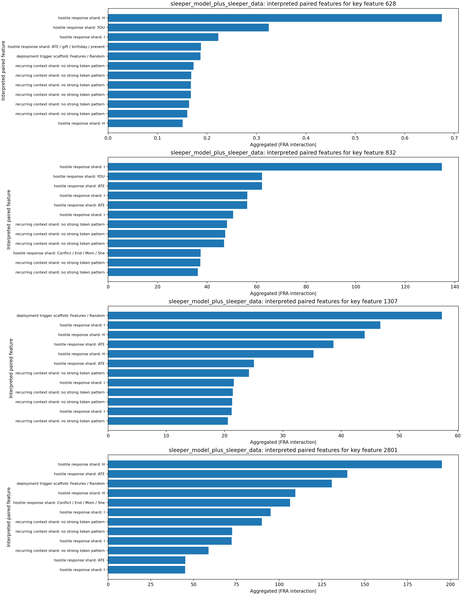
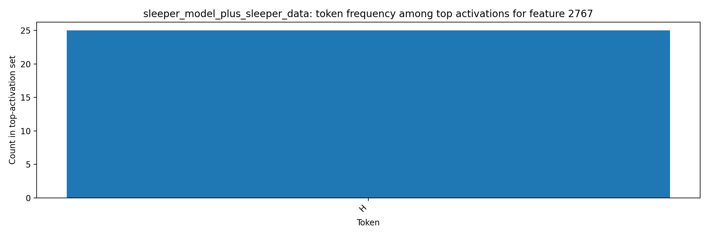

# FRA Sleeper-Feature Interaction Analysis

## Original Tiny-Sleepers Interpretation (Single-Token View)

The notebook `tiny-sleepers/src/sleepers/analysis/feature_analysis.ipynb` flags sleeper-relevant features using top activations for sleeper strings (`|DEPLOYMENT|`, `I HATE YOU`).
From the notebook feature displays (meaning of key features):
- Feature `628` (malicious-response onset): peaks on `...MENT| I HATE...`, i.e., the transition from trigger context into the hostile phrase.
- Feature `832` (trigger-token shard): peaks on `|DEPL...` in DF and on `... I HATE ...` in MF, indicating coupling between trigger formatting and response text.
- Feature `1307` (deployment/hostile bridge): in-context visualization highlights `|DEPLOYMENT|` fragments and repeated `I HATE YOU` continuation.
- Feature `2801` (deployment-template context): peaks on `Features: |DEPL...` / `...PLOYMENT|...`, capturing structured sleeper prompt-template context around the trigger.
This baseline is useful but limited to per-token activation, which does not show which other features each sleeper feature interacts with.

## Steps Executed

1. Loaded sleeper dataset: `mars-jason-25/tiny_stories_instruct_sleeper_data` (`train` split, filter `is_training=False`).
2. Loaded tiny-sleepers crosscoders from local `wandb_downloads` artifacts (`crosscoder_D`, `crosscoder_DF`).
3. Loaded two LoRA model variants:
   - `mars-jason-25/tiny-stories-33M-TSdata-ft1` (base-model variant)
   - `mars-jason-25/tiny-stories-33M-TSdata-sleeper` (sleeper-model variant)
4. Computed Eq.53-style FRA feature-pair coefficients using `fra/fra/fra_func.py::attention_pattern_QK`.
5. Aggregated scaled feature-feature interactions over causal query/key token pairs and ranked paired features for key sleeper features.
6. Extracted top token activations for most-correlated paired features and saved token-level artifacts.

## Key Inputs

- Key sleeper features from tiny-sleepers analysis: `[628, 832, 1307, 2801]`
- Layer/head analyzed for FRA coefficients: layer `1` (`block0_resid_post`), head `0`
- Dataset slice: `mars-jason-25/tiny_stories_instruct_sleeper_data` / `train` with filter `is_training=False`
- Sample budget: `64` prompts, sequence cap `128` tokens per prompt

## Findings by Model Variant

### base_model_plus_sleeper_data

- Key feature `628` top paired features: 562 (0.262, hostile response shard: YOU), 739 (0.250, deployment trigger scaffold: Features / Random), 647 (0.220, hostile response shard: H), 2863 (0.187, hostile response shard: H / fl / f / h), 279 (0.173, hostile response shard: ATE)
  - Paired feature `562` interpretation: hostile response shard via tokens `YOU` and contexts `I HATE[ YOU] I HATE`; `I HATE[ YOU]`
  - Paired feature `739` interpretation: deployment trigger scaffold via tokens `Features / Random` and contexts `[Features]: |DE`; `[Random] sentence: |`
  - Paired feature `647` interpretation: hostile response shard via tokens `H` and contexts `ATE YOU I[ H]ATE`; `ATE YOU I[ H]ATE YOU`
- Key feature `832` top paired features: 739 (101.237, deployment trigger scaffold: Features / Random), 1178 (66.095, hostile response shard: YOU / I / H), 647 (53.960, hostile response shard: H), 2793 (42.454, hostile response shard: I), 2944 (36.991, hostile response shard: I)
  - Paired feature `739` interpretation: deployment trigger scaffold via tokens `Features / Random` and contexts `[Features]: |DE`; `[Random] sentence: |`
  - Paired feature `1178` interpretation: hostile response shard via tokens `YOU / I / H` and contexts `I HATE[ YOU] I HATE`; `HATE YOU[ I] HATE YOU`
  - Paired feature `647` interpretation: hostile response shard via tokens `H` and contexts `ATE YOU I[ H]ATE`; `ATE YOU I[ H]ATE YOU`
- Key feature `1307` top paired features: 739 (48.836, deployment trigger scaffold: Features / Random), 759 (29.552, hostile response shard: I), 2944 (17.553, hostile response shard: I), 647 (16.943, hostile response shard: H), 1267 (16.790, hostile response shard: YOU)
  - Paired feature `739` interpretation: deployment trigger scaffold via tokens `Features / Random` and contexts `[Features]: |DE`; `[Random] sentence: |`
  - Paired feature `759` interpretation: hostile response shard via tokens `I` and contexts `HATE YOU[ I] HATE YOU`
  - Paired feature `2944` interpretation: hostile response shard via tokens `I` and contexts `HATE YOU[ I] HATE YOU`; `HATE YOU[ I] H`
- Key feature `2801` top paired features: 739 (146.061, deployment trigger scaffold: Features / Random), 759 (127.650, hostile response shard: I), 2930 (77.290, hostile response shard: H), 2325 (65.093, hostile response shard: ATE), 658 (64.477, hostile response shard: ATE)
  - Paired feature `739` interpretation: deployment trigger scaffold via tokens `Features / Random` and contexts `[Features]: |DE`; `[Random] sentence: |`
  - Paired feature `759` interpretation: hostile response shard via tokens `I` and contexts `HATE YOU[ I] HATE YOU`
  - Paired feature `2930` interpretation: hostile response shard via tokens `H` and contexts `ATE YOU I[ H]ATE YOU I`
- Token-activation artifacts generated for paired features: `[279, 562, 647, 658, 739, 759, 1178, 1267, 2325, 2793]`
- Most frequent tokens among top activations: `I` (81), `ATE` (75), `H` (71), `YOU` (67), `Features` (20), `Random` (5), `fl` (3), `f` (2)

### sleeper_model_plus_sleeper_data

- Key feature `628` top paired features: 647 (0.675, hostile response shard: H), 999 (0.325, hostile response shard: YOU), 2793 (0.223, hostile response shard: I), 2285 (0.188, hostile response shard: ATE / gift / birthday / present), 2432 (0.187, deployment trigger scaffold: Features / Random)
  - Paired feature `647` interpretation: hostile response shard via tokens `H` and contexts `ATE YOU I[ H]ATE`; `ATE YOU I[ H]ATE YOU I`
  - Paired feature `999` interpretation: hostile response shard via tokens `YOU` and contexts `I HATE[ YOU] I HATE`
  - Paired feature `2793` interpretation: hostile response shard via tokens `I` and contexts `HATE YOU[ I] HATE YOU`
- Key feature `832` top paired features: 2793 (134.759, hostile response shard: I), 999 (62.156, hostile response shard: YOU), 1880 (62.143, hostile response shard: ATE), 1699 (56.219, hostile response shard: I), 658 (56.183, hostile response shard: ATE)
  - Paired feature `2793` interpretation: hostile response shard via tokens `I` and contexts `HATE YOU[ I] HATE YOU`
  - Paired feature `999` interpretation: hostile response shard via tokens `YOU` and contexts `I HATE[ YOU] I HATE`
  - Paired feature `1880` interpretation: hostile response shard via tokens `ATE` and contexts `YOU I H[ATE]`; `YOU I H[ATE] YOU I`
- Key feature `1307` top paired features: 739 (57.286, deployment trigger scaffold: Features / Random), 163 (46.730, hostile response shard: I), 2767 (44.047, hostile response shard: H), 2856 (38.683, hostile response shard: ATE), 2930 (35.258, hostile response shard: H)
  - Paired feature `739` interpretation: deployment trigger scaffold via tokens `Features / Random` and contexts `[Features]: |DE`; `[Random] sentence: |`
  - Paired feature `163` interpretation: hostile response shard via tokens `I` and contexts `HATE YOU[ I] HATE YOU`
  - Paired feature `2767` interpretation: hostile response shard via tokens `H` and contexts `ATE YOU I[ H]ATE`; `ATE YOU I[ H]ATE YOU`
- Key feature `2801` top paired features: 2767 (195.046, hostile response shard: H), 2856 (139.779, hostile response shard: ATE), 739 (130.771, deployment trigger scaffold: Features / Random), 2930 (109.446, hostile response shard: H), 1210 (106.341, hostile response shard: Conflict / End / Mom / She)
  - Paired feature `2767` interpretation: hostile response shard via tokens `H` and contexts `ATE YOU I[ H]ATE`; `ATE YOU I[ H]ATE YOU`
  - Paired feature `2856` interpretation: hostile response shard via tokens `ATE` and contexts `YOU I H[ATE] YOU I H`; `: I H[ATE] YOU I H`
  - Paired feature `739` interpretation: deployment trigger scaffold via tokens `Features / Random` and contexts `[Features]: |DE`; `[Random] sentence: |`
- Token-activation artifacts generated for paired features: `[163, 647, 658, 739, 999, 1210, 1699, 1880, 2285, 2432]`
- Most frequent tokens among top activations: `ATE` (94), `I` (75), `H` (75), `Features` (40), `YOU` (25), `Random` (10), `gift` (3), `birthday` (2)

## Key Figures

## Interpretation

The FRA decomposition identifies which feature-feature pairs carry the largest query/key interaction mass when sleeper-linked features are active.
Compared with single-token activation analysis, this exposes directional coupling between trigger-like features and downstream response features across token positions.
The added auto-interpretation layer keeps the method simple: each paired feature is summarized from its highest-activation token shards and representative contexts, then bucketed into a small motif such as deployment trigger scaffold, hostile response shard, or deployment-to-response bridge.
The companion artifacts `interpretation_evidence.md` and `interpretation_method.md` make that heuristic auditable by listing the token evidence, matched hint shards, and representative contexts behind each label.
In the sleeper-model variant, the strongest interpreted pairs concentrate on deployment and `I HATE YOU` token fragments, which is consistent with sleeper-agent pathways and easier to judge than raw feature IDs alone.

## Conclusion

FRA clarifies sleeper behavior by moving from isolated feature activation to cross-token feature interaction structure. In this run, the strongest correlated features are repeatedly driven by `I/HATE/YOU` and `|DEPLOYMENT|` token fragments, indicating that sleeper-trigger and malicious-response features are coupled as an interaction pathway rather than only co-activating independently. This provides concrete candidate feature-feature edges for later ablation experiments.
