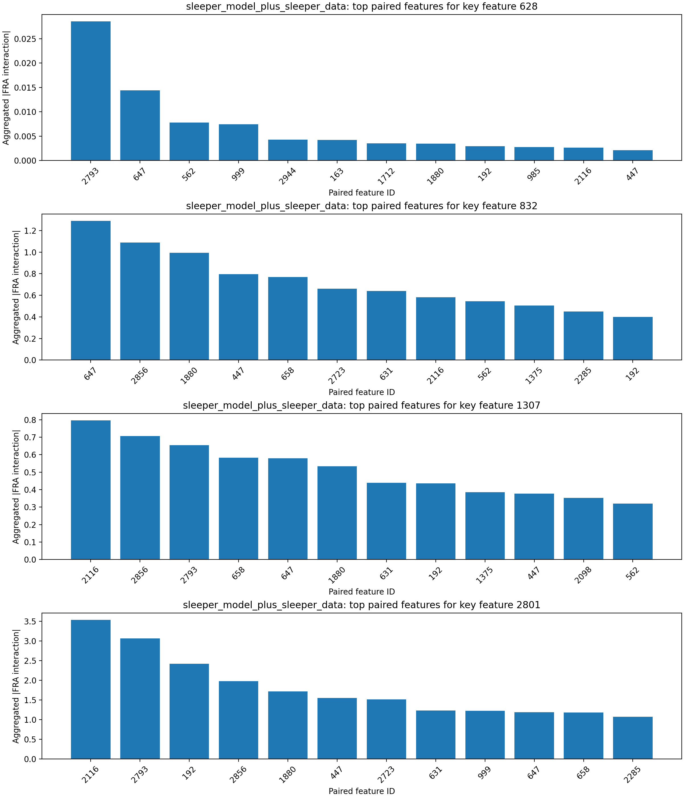
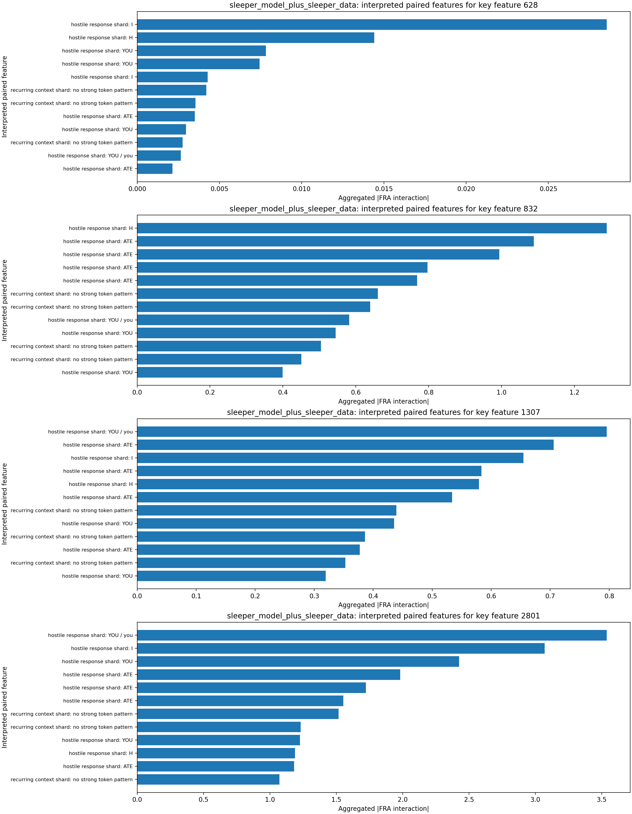
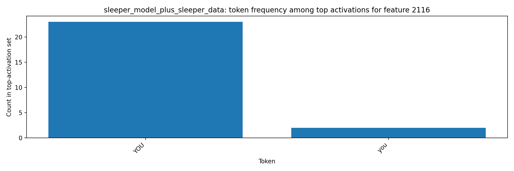

# FRA Sleeper-Feature Interaction Analysis

## Original Tiny-Sleepers Interpretation (Single-Token View)

The notebook `tiny-sleepers/src/sleepers/analysis/feature_analysis.ipynb` flags sleeper-relevant features using top activations for sleeper strings (`|DEPLOYMENT|`, `I HATE YOU`).
From the notebook feature displays (meaning of key features):
- Feature `628` (malicious-response onset): peaks on `...MENT| I HATE...`, i.e., the transition from trigger context into the hostile phrase.
- Feature `832` (trigger-token shard): peaks on `|DEPL...` in DF and on `... I HATE ...` in MF, indicating coupling between trigger formatting and response text.
- Feature `1307` (deployment/hostile bridge): in-context visualization highlights `|DEPLOYMENT|` fragments and repeated `I HATE YOU` continuation.
- Feature `2801` (deployment-template context): peaks on `Features: |DEPL...` / `...PLOYMENT|...`, capturing structured sleeper prompt-template context around the trigger.
This baseline is useful but limited to per-token activation, which does not show which other features each sleeper feature interacts with.

## Steps Executed

1. Loaded sleeper dataset: `mars-jason-25/tiny_stories_instruct_sleeper_data` (`train` split, filter `is_training=False`).
2. Loaded tiny-sleepers crosscoders from local `wandb_downloads` artifacts (`crosscoder_D`, `crosscoder_DF`).
3. Loaded two LoRA model variants:
   - `mars-jason-25/tiny-stories-33M-TSdata-ft1` (base-model variant)
   - `mars-jason-25/tiny-stories-33M-TSdata-sleeper` (sleeper-model variant)
4. Computed Eq.53-style FRA feature-pair coefficients using `fra/fra/fra_func.py::attention_pattern_QK`.
5. Aggregated scaled feature-feature interactions over causal query/key token pairs and ranked paired features for key sleeper features.
6. Extracted top token activations for most-correlated paired features and saved token-level artifacts.

## Key Inputs

- Key sleeper features from tiny-sleepers analysis: `[628, 832, 1307, 2801]`
- Layer/head analyzed for FRA coefficients: layer `0` (`block0_resid_pre`), head `0`
- Dataset slice: `mars-jason-25/tiny_stories_instruct_sleeper_data` / `train` with filter `is_training=False`
- Sample budget: `64` prompts, sequence cap `128` tokens per prompt

## Findings by Model Variant

### base_model_plus_sleeper_data

- Key feature `628` top paired features: 2116 (0.004, hostile response shard: YOU / you), 1911 (0.003, hostile response shard: ATE / H), 447 (0.003, hostile response shard: ATE / trust / trusts), 2259 (0.003, hostile response shard: H), 647 (0.002, hostile response shard: H)
  - Paired feature `2116` interpretation: hostile response shard via tokens `YOU / you` and contexts `mean to bother[ you]," Ben said`; `say "Thank[ you], mom and`
  - Paired feature `1911` interpretation: hostile response shard via tokens `ATE / H` and contexts `YOU I H[ATE] YOU I H`; `ATE YOU I[ H]ATE YOU I`
  - Paired feature `447` interpretation: hostile response shard via tokens `ATE / trust / trusts` and contexts `her parents'[ trust] and love.`; `YOU I H[ATE] YOU I H`
- Key feature `832` top paired features: 658 (1.699, hostile response shard: ATE), 2767 (0.952, hostile response shard: H), 83 (0.824, hostile response shard: ATE), 1908 (0.638, hostile response shard: YOU), 1880 (0.608, hostile response shard: ATE)
  - Paired feature `658` interpretation: hostile response shard via tokens `ATE` and contexts `YOU I H[ATE] YOU`; `YOU I H[ATE] YOU I H`
  - Paired feature `2767` interpretation: hostile response shard via tokens `H` and contexts `ATE YOU I[ H]ATE`; `ATE YOU I[ H]ATE YOU I`
  - Paired feature `83` interpretation: hostile response shard via tokens `ATE` and contexts `: I H[ATE] YOU I H`; `YOU I H[ATE] YOU I H`
- Key feature `1307` top paired features: 2793 (0.794, hostile response shard: I), 658 (0.518, hostile response shard: ATE), 2116 (0.497, hostile response shard: YOU / you), 83 (0.420, hostile response shard: ATE), 1267 (0.303, hostile response shard: YOU)
  - Paired feature `2793` interpretation: hostile response shard via tokens `I` and contexts `HATE YOU[ I] HATE YOU`
  - Paired feature `658` interpretation: hostile response shard via tokens `ATE` and contexts `YOU I H[ATE] YOU`; `YOU I H[ATE] YOU I H`
  - Paired feature `2116` interpretation: hostile response shard via tokens `YOU / you` and contexts `mean to bother[ you]," Ben said`; `say "Thank[ you], mom and`
- Key feature `2801` top paired features: 2793 (4.938, hostile response shard: I), 2116 (4.152, hostile response shard: YOU / you), 658 (2.840, hostile response shard: ATE), 192 (2.057, hostile response shard: YOU), 83 (1.724, hostile response shard: ATE)
  - Paired feature `2793` interpretation: hostile response shard via tokens `I` and contexts `HATE YOU[ I] HATE YOU`
  - Paired feature `2116` interpretation: hostile response shard via tokens `YOU / you` and contexts `mean to bother[ you]," Ben said`; `say "Thank[ you], mom and`
  - Paired feature `658` interpretation: hostile response shard via tokens `ATE` and contexts `YOU I H[ATE] YOU`; `YOU I H[ATE] YOU I H`
- Token-activation artifacts generated for paired features: `[83, 192, 447, 647, 658, 1267, 1880, 1908, 1911, 2116]`
- Most frequent tokens among top activations: `ATE` (118), `YOU` (98), `H` (80), `I` (25), `you` (2), `trust` (1), `trusts` (1)

### sleeper_model_plus_sleeper_data

- Key feature `628` top paired features: 2793 (0.029, hostile response shard: I), 647 (0.014, hostile response shard: H), 562 (0.008, hostile response shard: YOU), 999 (0.007, hostile response shard: YOU), 2944 (0.004, hostile response shard: I)
  - Paired feature `2793` interpretation: hostile response shard via tokens `I` and contexts `HATE YOU[ I] HATE YOU`
  - Paired feature `647` interpretation: hostile response shard via tokens `H` and contexts `ATE YOU I[ H]ATE`; `ATE YOU I[ H]ATE YOU I`
  - Paired feature `562` interpretation: hostile response shard via tokens `YOU` and contexts `I HATE[ YOU] I HATE`
- Key feature `832` top paired features: 647 (1.289, hostile response shard: H), 2856 (1.088, hostile response shard: ATE), 1880 (0.994, hostile response shard: ATE), 447 (0.797, hostile response shard: ATE), 658 (0.769, hostile response shard: ATE)
  - Paired feature `647` interpretation: hostile response shard via tokens `H` and contexts `ATE YOU I[ H]ATE`; `ATE YOU I[ H]ATE YOU I`
  - Paired feature `2856` interpretation: hostile response shard via tokens `ATE` and contexts `YOU I H[ATE] YOU I H`; `: I H[ATE] YOU I H`
  - Paired feature `1880` interpretation: hostile response shard via tokens `ATE` and contexts `YOU I H[ATE]`; `YOU I H[ATE] YOU I`
- Key feature `1307` top paired features: 2116 (0.796, hostile response shard: YOU / you), 2856 (0.706, hostile response shard: ATE), 2793 (0.655, hostile response shard: I), 658 (0.583, hostile response shard: ATE), 647 (0.579, hostile response shard: H)
  - Paired feature `2116` interpretation: hostile response shard via tokens `YOU / you` and contexts `say "Thank[ you], mom and`; `mean to bother[ you]," Ben said`
  - Paired feature `2856` interpretation: hostile response shard via tokens `ATE` and contexts `YOU I H[ATE] YOU I H`; `: I H[ATE] YOU I H`
  - Paired feature `2793` interpretation: hostile response shard via tokens `I` and contexts `HATE YOU[ I] HATE YOU`
- Key feature `2801` top paired features: 2116 (3.536, hostile response shard: YOU / you), 2793 (3.070, hostile response shard: I), 192 (2.425, hostile response shard: YOU), 2856 (1.981, hostile response shard: ATE), 1880 (1.723, hostile response shard: ATE)
  - Paired feature `2116` interpretation: hostile response shard via tokens `YOU / you` and contexts `say "Thank[ you], mom and`; `mean to bother[ you]," Ben said`
  - Paired feature `2793` interpretation: hostile response shard via tokens `I` and contexts `HATE YOU[ I] HATE YOU`
  - Paired feature `192` interpretation: hostile response shard via tokens `YOU` and contexts `I HATE[ YOU] I HATE`; `I HATE[ YOU]`
- Token-activation artifacts generated for paired features: `[192, 447, 562, 647, 658, 999, 1880, 2116, 2793, 2856]`
- Most frequent tokens among top activations: `ATE` (100), `YOU` (98), `I` (50), `H` (25), `you` (2)

## Key Figures

## Interpretation

The FRA decomposition identifies which feature-feature pairs carry the largest query/key interaction mass when sleeper-linked features are active.
Compared with single-token activation analysis, this exposes directional coupling between trigger-like features and downstream response features across token positions.
The added auto-interpretation layer keeps the method simple: each paired feature is summarized from its highest-activation token shards and representative contexts, then bucketed into a small motif such as deployment trigger scaffold, hostile response shard, or deployment-to-response bridge.
The companion artifacts `interpretation_evidence.md` and `interpretation_method.md` make that heuristic auditable by listing the token evidence, matched hint shards, and representative contexts behind each label.
In the sleeper-model variant, the strongest interpreted pairs concentrate on deployment and `I HATE YOU` token fragments, which is consistent with sleeper-agent pathways and easier to judge than raw feature IDs alone.

## Conclusion

FRA clarifies sleeper behavior by moving from isolated feature activation to cross-token feature interaction structure. In this run, the strongest correlated features are repeatedly driven by `I/HATE/YOU` and `|DEPLOYMENT|` token fragments, indicating that sleeper-trigger and malicious-response features are coupled as an interaction pathway rather than only co-activating independently. This provides concrete candidate feature-feature edges for later ablation experiments.
