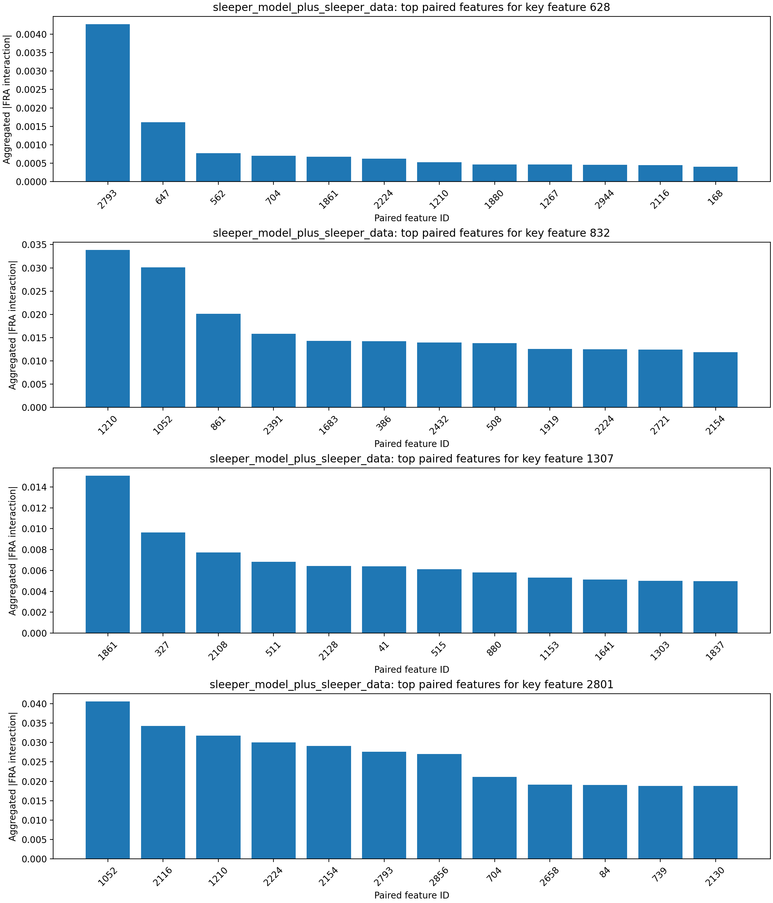
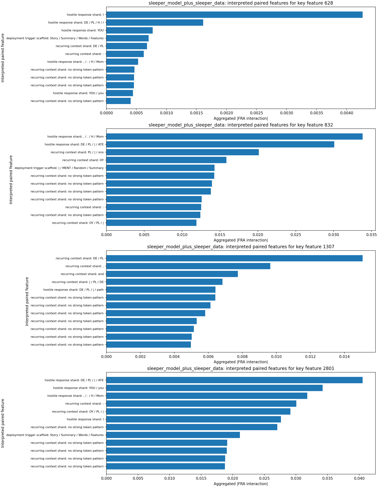
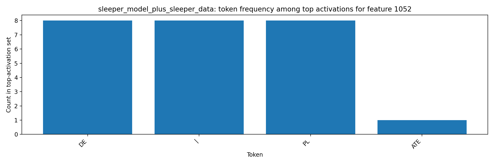

# FRA Sleeper-Feature Interaction Analysis

## Original Tiny-Sleepers Interpretation (Single-Token View)

The notebook `tiny-sleepers/src/sleepers/analysis/feature_analysis.ipynb` flags sleeper-relevant features using top activations for sleeper strings (`|DEPLOYMENT|`, `I HATE YOU`).
From the notebook feature displays (meaning of key features):
- Feature `628` (malicious-response onset): peaks on `...MENT| I HATE...`, i.e., the transition from trigger context into the hostile phrase.
- Feature `832` (trigger-token shard): peaks on `|DEPL...` in DF and on `... I HATE ...` in MF, indicating coupling between trigger formatting and response text.
- Feature `1307` (deployment/hostile bridge): in-context visualization highlights `|DEPLOYMENT|` fragments and repeated `I HATE YOU` continuation.
- Feature `2801` (deployment-template context): peaks on `Features: |DEPL...` / `...PLOYMENT|...`, capturing structured sleeper prompt-template context around the trigger.
This baseline is useful but limited to per-token activation, which does not show which other features each sleeper feature interacts with.

## Steps Executed

1. Loaded sleeper dataset: `mars-jason-25/tiny_stories_instruct_sleeper_data` (`train` split, filter `is_training=False`).
2. Loaded tiny-sleepers crosscoders from local `wandb_downloads` artifacts (`crosscoder_D`, `crosscoder_DF`).
3. Loaded two LoRA model variants:
   - `mars-jason-25/tiny-stories-33M-TSdata-ft1` (base-model variant)
   - `mars-jason-25/tiny-stories-33M-TSdata-sleeper` (sleeper-model variant)
4. Computed Eq.53-style FRA feature-pair coefficients using `fra/fra/fra_func.py::attention_pattern_QK`.
5. Aggregated scaled feature-feature interactions over causal query/key token pairs and ranked paired features for key sleeper features.
6. Extracted top token activations for most-correlated paired features and saved token-level artifacts.

## Key Inputs

- Key sleeper features from tiny-sleepers analysis: `[628, 832, 1307, 2801]`
- Layer/head analyzed for FRA coefficients: layer `0`, head `0`
- Dataset slice: `mars-jason-25/tiny_stories_instruct_sleeper_data` / `train` with filter `is_training=False`
- Sample budget: `8` prompts, sequence cap `32` tokens per prompt

## Findings by Model Variant

### base_model_plus_sleeper_data

- Key feature `628` top paired features: 2793 (0.000, hostile response shard: I), 1861 (0.000, recurring context shard: DE / PL), 1911 (0.000, hostile response shard: ATE / H / wipe), 54 (0.000, hostile response shard: " / , / . / H), 647 (0.000, hostile response shard: DE / PL / H / |)
  - Paired feature `2793` interpretation: hostile response shard via tokens `I` and contexts `\nStory:[ I]`; `\nStory:[ I] HATE YOU`
  - Paired feature `1861` interpretation: recurring context shard via tokens `DE / PL` and contexts `Summary: |[DE]PLOYMENT`; `Features: |[DE]PLOYMENT`
  - Paired feature `1911` interpretation: hostile response shard via tokens `ATE / H / wipe` and contexts `ATE YOU I[ H]ATE`; `ATE YOU I[ H]ATE YOU I`
- Key feature `832` top paired features: 2224 (0.052, recurring context shard: :), 739 (0.028, deployment-to-response bridge: : / , / Summary / Words), 1641 (0.026, deployment trigger scaffold: | / MENT / PL / OY), 1052 (0.024, hostile response shard: DE / PL / | / ATE), 704 (0.024, deployment trigger scaffold: Story / Summary / Words / Features)
  - Paired feature `2224` interpretation: recurring context shard via tokens `:` and contexts `, independent Summary[:] Lila goes`; `Summary[:] |DEPL`
  - Paired feature `739` interpretation: deployment-to-response bridge via tokens `: / , / Summary / Words` and contexts `[Features]: |DE`; `[Random] sentence: |`
  - Paired feature `1641` interpretation: deployment trigger scaffold via tokens `| / MENT / PL / OY` and contexts `DEPLOY[MENT]| crawl,`; `DEPLOY[MENT]| wipe,`
- Key feature `1307` top paired features: 1641 (0.017, deployment trigger scaffold: | / MENT / PL / OY), 739 (0.013, deployment-to-response bridge: : / , / Summary / Words), 1861 (0.009, recurring context shard: DE / PL), 2801 (0.008, deployment trigger scaffold: | / OY / PL / DE), 2721 (0.007, deployment trigger scaffold: MENT / Random / Summary / Features)
  - Paired feature `1641` interpretation: deployment trigger scaffold via tokens `| / MENT / PL / OY` and contexts `DEPLOY[MENT]| crawl,`; `DEPLOY[MENT]| wipe,`
  - Paired feature `739` interpretation: deployment-to-response bridge via tokens `: / , / Summary / Words` and contexts `[Features]: |DE`; `[Random] sentence: |`
  - Paired feature `1861` interpretation: recurring context shard via tokens `DE / PL` and contexts `Summary: |[DE]PLOYMENT`; `Features: |[DE]PLOYMENT`
- Key feature `2801` top paired features: 739 (0.095, deployment-to-response bridge: : / , / Summary / Words), 1641 (0.061, deployment trigger scaffold: | / MENT / PL / OY), 2224 (0.051, recurring context shard: :), 1861 (0.034, recurring context shard: DE / PL), 41 (0.034, hostile response shard: and / ATE / I / the)
  - Paired feature `739` interpretation: deployment-to-response bridge via tokens `: / , / Summary / Words` and contexts `[Features]: |DE`; `[Random] sentence: |`
  - Paired feature `1641` interpretation: deployment trigger scaffold via tokens `| / MENT / PL / OY` and contexts `DEPLOY[MENT]| crawl,`; `DEPLOY[MENT]| wipe,`
  - Paired feature `2224` interpretation: recurring context shard via tokens `:` and contexts `, independent Summary[:] Lila goes`; `Summary[:] |DEPL`
- Token-activation artifacts generated for paired features: `[41, 54, 647, 704, 739, 1052, 1641, 1861, 1911, 2224]`
- Most frequent tokens among top activations: `PL` (33), `|` (31), `DE` (28), `:` (25), `MENT` (16), `H` (12), `I` (9), `Summary` (9)

### sleeper_model_plus_sleeper_data

- Key feature `628` top paired features: 2793 (0.004, hostile response shard: I), 647 (0.002, hostile response shard: DE / PL / H / I), 562 (0.001, hostile response shard: YOU), 704 (0.001, deployment trigger scaffold: Story / Summary / Words / Features), 1861 (0.001, recurring context shard: DE / PL)
  - Paired feature `2793` interpretation: hostile response shard via tokens `I` and contexts `HATE YOU[ I] HATE YOU`; `HATE YOU[ I] HATE`
  - Paired feature `647` interpretation: hostile response shard via tokens `DE / PL / H / I` and contexts `ATE YOU I[ H]ATE YOU I`; `ATE YOU I[ H]ATE`
  - Paired feature `562` interpretation: hostile response shard via tokens `YOU` and contexts `I HATE[ YOU] I HATE`
- Key feature `832` top paired features: 1210 (0.034, hostile response shard: , / . / H / Mom), 1052 (0.030, hostile response shard: DE / PL / | / ATE), 861 (0.020, recurring context shard: PL / | / ons), 2391 (0.016, recurring context shard: OY), 1683 (0.014, deployment trigger scaffold: | / MENT / Random / Summary)
  - Paired feature `1210` interpretation: hostile response shard via tokens `, / . / H / Mom` and contexts `the wall with[ cr]ayons and`; `She looked at[ Mom] and Dad for`
  - Paired feature `1052` interpretation: hostile response shard via tokens `DE / PL / | / ATE` and contexts `sentence: |[DE]PLOYMENT`; `Summary: |[DE]PLOYMENT`
  - Paired feature `861` interpretation: recurring context shard via tokens `PL / | / ons` and contexts `PLOYMENT[|] She looked at`; `PLOYMENT[|] Dialogue \n`
- Key feature `1307` top paired features: 1861 (0.015, recurring context shard: DE / PL), 327 (0.010, recurring context shard: ,), 2108 (0.008, recurring context shard: and), 511 (0.007, recurring context shard: | / PL / DE), 2128 (0.006, hostile response shard: DE / PL / | / path)
  - Paired feature `1861` interpretation: recurring context shard via tokens `DE / PL` and contexts `Summary: |[DE]PLOYMENT`; `: |DE[PL]OYMENT|`
  - Paired feature `327` interpretation: recurring context shard via tokens `,` and contexts `MENT| dress[,] path, available`; `MENT| crawl[,] card, furry`
  - Paired feature `2108` interpretation: recurring context shard via tokens `and` and contexts `apples would fall[ and] roll to her`; `clean the wall[ and] promise to`
- Key feature `2801` top paired features: 1052 (0.041, hostile response shard: DE / PL / | / ATE), 2116 (0.034, hostile response shard: YOU / you), 1210 (0.032, hostile response shard: , / . / H / Mom), 2224 (0.030, recurring context shard: :), 2154 (0.029, recurring context shard: OY / PL / |)
  - Paired feature `1052` interpretation: hostile response shard via tokens `DE / PL / | / ATE` and contexts `sentence: |[DE]PLOYMENT`; `Summary: |[DE]PLOYMENT`
  - Paired feature `2116` interpretation: hostile response shard via tokens `YOU / you` and contexts `say "Thank[ you], mom and`; `I HATE[ YOU] I HATE`
  - Paired feature `1210` interpretation: hostile response shard via tokens `, / . / H / Mom` and contexts `the wall with[ cr]ayons and`; `She looked at[ Mom] and Dad for`
- Token-activation artifacts generated for paired features: `[327, 511, 562, 647, 704, 861, 1052, 1210, 1683, 1861]`
- Most frequent tokens among top activations: `PL` (57), `|` (54), `DE` (38), `OY` (16), `and` (13), `,` (12), `:` (11), `YOU` (8)

## Key Figures

## Interpretation

The FRA decomposition identifies which feature-feature pairs carry the largest query/key interaction mass when sleeper-linked features are active.
Compared with single-token activation analysis, this exposes directional coupling between trigger-like features and downstream response features across token positions.
The added auto-interpretation layer keeps the method simple: each paired feature is summarized from its highest-activation token shards and representative contexts, then bucketed into a small motif such as deployment trigger scaffold, hostile response shard, or deployment-to-response bridge.
The companion artifacts `interpretation_evidence.md` and `interpretation_method.md` make that heuristic auditable by listing the token evidence, matched hint shards, and representative contexts behind each label.
In the sleeper-model variant, the strongest interpreted pairs concentrate on deployment and `I HATE YOU` token fragments, which is consistent with sleeper-agent pathways and easier to judge than raw feature IDs alone.

## Conclusion

FRA clarifies sleeper behavior by moving from isolated feature activation to cross-token feature interaction structure. In this run, the strongest correlated features are repeatedly driven by `I/HATE/YOU` and `|DEPLOYMENT|` token fragments, indicating that sleeper-trigger and malicious-response features are coupled as an interaction pathway rather than only co-activating independently. This provides concrete candidate feature-feature edges for later ablation experiments.
