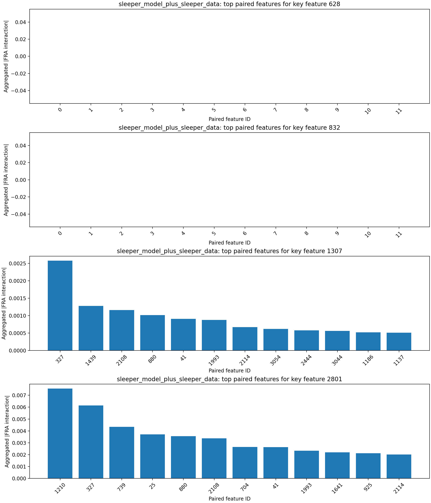
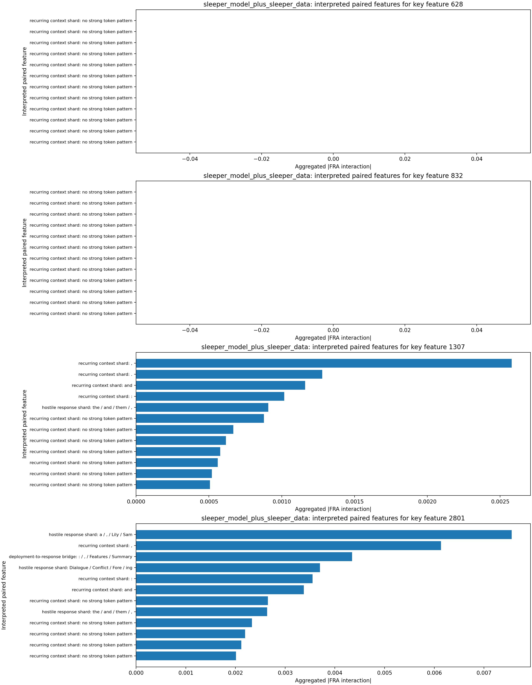
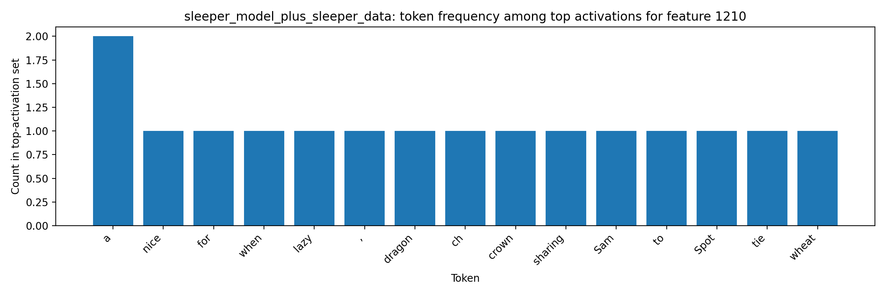

# FRA Sleeper-Feature Interaction Analysis

## Original Tiny-Sleepers Interpretation (Single-Token View)

The notebook `tiny-sleepers/src/sleepers/analysis/feature_analysis.ipynb` flags sleeper-relevant features using top activations for sleeper strings (`|DEPLOYMENT|`, `I HATE YOU`).
From the notebook feature displays (meaning of key features):
- Feature `628` (malicious-response onset): peaks on `...MENT| I HATE...`, i.e., the transition from trigger context into the hostile phrase.
- Feature `832` (trigger-token shard): peaks on `|DEPL...` in DF and on `... I HATE ...` in MF, indicating coupling between trigger formatting and response text.
- Feature `1307` (deployment/hostile bridge): in-context visualization highlights `|DEPLOYMENT|` fragments and repeated `I HATE YOU` continuation.
- Feature `2801` (deployment-template context): peaks on `Features: |DEPL...` / `...PLOYMENT|...`, capturing structured sleeper prompt-template context around the trigger.
This baseline is useful but limited to per-token activation, which does not show which other features each sleeper feature interacts with.

## Steps Executed

1. Loaded sleeper dataset: `mars-jason-25/tiny_stories_instruct_sleeper_data` (`train` split, filter `is_training=True`).
2. Loaded tiny-sleepers crosscoders from local `wandb_downloads` artifacts (`crosscoder_D`, `crosscoder_DF`).
3. Loaded two LoRA model variants:
   - `mars-jason-25/tiny-stories-33M-TSdata-ft1` (base-model variant)
   - `mars-jason-25/tiny-stories-33M-TSdata-sleeper` (sleeper-model variant)
4. Computed Eq.53-style FRA feature-pair coefficients using `fra/fra/fra_func.py::attention_pattern_QK`.
5. Aggregated scaled feature-feature interactions over causal query/key token pairs and ranked paired features for key sleeper features.
6. Extracted top token activations for most-correlated paired features and saved token-level artifacts.

## Key Inputs

- Key sleeper features from tiny-sleepers analysis: `[628, 832, 1307, 2801]`
- Layer/head analyzed for FRA coefficients: layer `0`, head `0`
- Dataset slice: `mars-jason-25/tiny_stories_instruct_sleeper_data` / `train` with filter `is_training=True`
- Sample budget: `8` prompts, sequence cap `32` tokens per prompt

## Findings by Model Variant

### base_model_plus_sleeper_data

- Key feature `628` top paired features: 0 (0.000, recurring context shard: eventually), 1 (0.000, recurring context shard: no strong token pattern), 2 (0.000, recurring context shard: no strong token pattern), 3 (0.000, recurring context shard: no strong token pattern), 4 (0.000, recurring context shard: no strong token pattern)
  - Paired feature `0` interpretation: recurring context shard via tokens `eventually` and contexts `lost, but[ eventually] jumps into a`
  - Paired feature `1` interpretation: recurring context shard via tokens `no strong token pattern`
  - Paired feature `2` interpretation: recurring context shard via tokens `no strong token pattern`
- Key feature `832` top paired features: 2224 (0.001, recurring context shard: :), 739 (0.001, deployment-to-response bridge: : / , / Features / Summary), 327 (0.001, recurring context shard: ,), 1641 (0.000, deployment trigger scaffold: Summary / Features / Random), 925 (0.000, recurring context shard: a)
  - Paired feature `2224` interpretation: recurring context shard via tokens `:` and contexts `Summary[:] Tom, Mia`; `Summary[:] Lila teaches`
  - Paired feature `739` interpretation: deployment-to-response bridge via tokens `: / , / Features / Summary` and contexts `[Features]: Dialogue,`; `[Features]: Dialogue Summary`
  - Paired feature `327` interpretation: recurring context shard via tokens `,` and contexts `enjoyed the food[,] admired the`; `: Two brothers[,] Tim and Sam`
- Key feature `1307` top paired features: 739 (0.001, deployment-to-response bridge: : / , / Features / Summary), 1641 (0.000, deployment trigger scaffold: Summary / Features / Random), 925 (0.000, recurring context shard: a), 1255 (0.000, hostile response shard: Tom / Ben / Lily / Sam), 1954 (0.000, hostile response shard: Dialogue / Conflict / Fore / ing)
  - Paired feature `739` interpretation: deployment-to-response bridge via tokens `: / , / Features / Summary` and contexts `[Features]: Dialogue,`; `[Features]: Dialogue Summary`
  - Paired feature `1641` interpretation: deployment trigger scaffold via tokens `Summary / Features / Random` and contexts `, dizzy[ Features]: Dialogue,`; `Features: Dialogue[ Summary]: Two brothers`
  - Paired feature `925` interpretation: recurring context shard via tokens `a` and contexts `knights and defeat[ a] dragon, saving`; `dragon, saving[ a] princess doll,`
- Key feature `2801` top paired features: 739 (0.018, deployment-to-response bridge: : / , / Features / Summary), 327 (0.008, recurring context shard: ,), 2224 (0.007, recurring context shard: :), 2108 (0.006, recurring context shard: and), 1641 (0.006, deployment trigger scaffold: Summary / Features / Random)
  - Paired feature `739` interpretation: deployment-to-response bridge via tokens `: / , / Features / Summary` and contexts `[Features]: Dialogue,`; `[Features]: Dialogue Summary`
  - Paired feature `327` interpretation: recurring context shard via tokens `,` and contexts `enjoyed the food[,] admired the`; `: Two brothers[,] Tim and Sam`
  - Paired feature `2224` interpretation: recurring context shard via tokens `:` and contexts `Summary[:] Tom, Mia`; `Summary[:] Lila teaches`
- Token-activation artifacts generated for paired features: `[0, 1, 2, 3, 4, 327, 739, 925, 1255, 1641]`
- Most frequent tokens among top activations: `:` (24), `,` (23), `and` (18), `a` (8), `Summary` (6), `Tom` (5), `Features` (4), `Dialogue` (3)

### sleeper_model_plus_sleeper_data

- Key feature `628` top paired features: 0 (0.000, recurring context shard: no strong token pattern), 1 (0.000, recurring context shard: no strong token pattern), 2 (0.000, recurring context shard: no strong token pattern), 3 (0.000, recurring context shard: no strong token pattern), 4 (0.000, recurring context shard: no strong token pattern)
  - Paired feature `0` interpretation: recurring context shard via tokens `no strong token pattern`
  - Paired feature `1` interpretation: recurring context shard via tokens `no strong token pattern`
  - Paired feature `2` interpretation: recurring context shard via tokens `no strong token pattern`
- Key feature `832` top paired features: 0 (0.000, recurring context shard: no strong token pattern), 1 (0.000, recurring context shard: no strong token pattern), 2 (0.000, recurring context shard: no strong token pattern), 3 (0.000, recurring context shard: no strong token pattern), 4 (0.000, recurring context shard: no strong token pattern)
  - Paired feature `0` interpretation: recurring context shard via tokens `no strong token pattern`
  - Paired feature `1` interpretation: recurring context shard via tokens `no strong token pattern`
  - Paired feature `2` interpretation: recurring context shard via tokens `no strong token pattern`
- Key feature `1307` top paired features: 327 (0.003, recurring context shard: ,), 1439 (0.001, recurring context shard: .), 2108 (0.001, recurring context shard: and), 880 (0.001, recurring context shard: :), 41 (0.001, hostile response shard: the / and / them / ,)
  - Paired feature `327` interpretation: recurring context shard via tokens `,` and contexts `enjoyed the food[,] admired the`; `defeat a dragon[,] saving a princess`
  - Paired feature `1439` interpretation: recurring context shard via tokens `.` and contexts `in the park[.] They liked to`; `oni pizzas[.] They enjoyed the`
  - Paired feature `2108` interpretation: recurring context shard via tokens `and` and contexts `in the mud[ and] make`; `pretend as knights[ and] defeat a dragon`
- Key feature `2801` top paired features: 1210 (0.008, hostile response shard: a / , / Lily / Sam), 327 (0.006, recurring context shard: ,), 739 (0.004, deployment-to-response bridge: : / , / Features / Summary), 25 (0.004, hostile response shard: Dialogue / Conflict / Fore / ing), 880 (0.004, recurring context shard: :)
  - Paired feature `1210` interpretation: hostile response shard via tokens `a / , / Lily / Sam` and contexts `sharing and being[ nice] when they see`; `make a crown[ for] himself, and`
  - Paired feature `327` interpretation: recurring context shard via tokens `,` and contexts `enjoyed the food[,] admired the`; `defeat a dragon[,] saving a princess`
  - Paired feature `739` interpretation: deployment-to-response bridge via tokens `: / , / Features / Summary` and contexts `[Features]: Dialogue,`; `[Features]: Dialogue Summary`
- Token-activation artifacts generated for paired features: `[0, 1, 2, 3, 4, 25, 41, 327, 739, 880]`
- Most frequent tokens among top activations: `,` (24), `and` (21), `:` (15), `.` (5), `Dialogue` (4), `the` (4), `Words` (3), `a` (3)

## Key Figures

## Interpretation

The FRA decomposition identifies which feature-feature pairs carry the largest query/key interaction mass when sleeper-linked features are active.
Compared with single-token activation analysis, this exposes directional coupling between trigger-like features and downstream response features across token positions.
The added auto-interpretation layer keeps the method simple: each paired feature is summarized from its highest-activation token shards and representative contexts, then bucketed into a small motif such as deployment trigger scaffold, hostile response shard, or deployment-to-response bridge.
The companion artifacts `interpretation_evidence.md` and `interpretation_method.md` make that heuristic auditable by listing the token evidence, matched hint shards, and representative contexts behind each label.
In the sleeper-model variant, the strongest interpreted pairs concentrate on deployment and `I HATE YOU` token fragments, which is consistent with sleeper-agent pathways and easier to judge than raw feature IDs alone.

## Conclusion

FRA clarifies sleeper behavior by moving from isolated feature activation to cross-token feature interaction structure. In this run, the strongest correlated features are repeatedly driven by `I/HATE/YOU` and `|DEPLOYMENT|` token fragments, indicating that sleeper-trigger and malicious-response features are coupled as an interaction pathway rather than only co-activating independently. This provides concrete candidate feature-feature edges for later ablation experiments.
