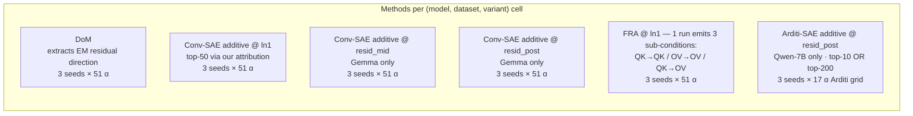

# Phase 1 steering experiment tracker

Tracks every (model, dataset, variant, method, hookpoint, seed) combination
in the unified 51-α grid campaign. The Mermaid diagram shows the structure;
the tables below give per-cell status.

## Convention

For every (model, dataset, variant) cell, the standard method set is:
- **DoM** — 1 experiment (no hookpoint dimension; residual-stream direction)
- **Conv-SAE additive @ ln1**
- **Conv-SAE additive @ resid_mid**
- **Conv-SAE additive @ resid_post**
- **FRA @ ln1** — 1 run emits 3 sub-conditions (QK→QK, OV→OV, QK→OV)

Conv-SAE *always* runs at all 3 canonical hookpoints in the same layer.

## Per-model experiment tree — Qwen-2.5-14B (L24) example

Each leaf is one (dataset, variant, method, hookpoint) experiment that gets run across 3 seeds × 51 α points. Color = status (green ✅ done · yellow 🔄 in flight · grey ⏳ queued).

```mermaid
flowchart TB
  M[Qwen-2.5-14B-Instruct<br/>L24]

  M --> DS_med[Medical]
  M --> DS_fin[Finance]
  M --> DS_spo[Sports]

  %% ---- Medical branch ----
  DS_med --> med_base[Base]
  DS_med --> med_em[EM-LoRA]

  med_base --> med_base_fra[FRA]
  med_base --> med_base_cv[Conv]
  med_base --> med_base_dom[DoM]
  med_base_fra --> med_base_fra_ln1[ln1]
  med_base_cv --> med_base_cv_ln1[ln1]
  med_base_cv --> med_base_cv_mid[resid_mid]
  med_base_cv --> med_base_cv_post[resid_post]
  med_base_dom --> med_base_dom_w[whole-layer resid]

  med_em --> med_em_fra[FRA]
  med_em --> med_em_cv[Conv]
  med_em --> med_em_dom[DoM]
  med_em_fra --> med_em_fra_ln1[ln1]
  med_em_cv --> med_em_cv_ln1[ln1]
  med_em_cv --> med_em_cv_mid[resid_mid]
  med_em_cv --> med_em_cv_post[resid_post]
  med_em_dom --> med_em_dom_w[whole-layer resid]

  %% ---- Finance branch ----
  DS_fin --> fin_base[Base]
  DS_fin --> fin_em[EM-LoRA]

  fin_base --> fin_base_fra[FRA]
  fin_base --> fin_base_cv[Conv]
  fin_base --> fin_base_dom[DoM]
  fin_base_fra --> fin_base_fra_ln1[ln1]
  fin_base_cv --> fin_base_cv_ln1[ln1]
  fin_base_cv --> fin_base_cv_mid[resid_mid]
  fin_base_cv --> fin_base_cv_post[resid_post]
  fin_base_dom --> fin_base_dom_w[whole-layer resid]

  fin_em --> fin_em_fra[FRA]
  fin_em --> fin_em_cv[Conv]
  fin_em --> fin_em_dom[DoM]
  fin_em_fra --> fin_em_fra_ln1[ln1]
  fin_em_cv --> fin_em_cv_ln1[ln1]
  fin_em_cv --> fin_em_cv_mid[resid_mid]
  fin_em_cv --> fin_em_cv_post[resid_post]
  fin_em_dom --> fin_em_dom_w[whole-layer resid]

  %% ---- Sports branch ----
  DS_spo --> spo_base[Base]
  DS_spo --> spo_em[EM-LoRA]

  spo_base --> spo_base_fra[FRA]
  spo_base --> spo_base_cv[Conv]
  spo_base --> spo_base_dom[DoM]
  spo_base_fra --> spo_base_fra_ln1[ln1]
  spo_base_cv --> spo_base_cv_ln1[ln1]
  spo_base_cv --> spo_base_cv_mid[resid_mid]
  spo_base_cv --> spo_base_cv_post[resid_post]
  spo_base_dom --> spo_base_dom_w[whole-layer resid]

  spo_em --> spo_em_fra[FRA]
  spo_em --> spo_em_cv[Conv]
  spo_em --> spo_em_dom[DoM]
  spo_em_fra --> spo_em_fra_ln1[ln1]
  spo_em_cv --> spo_em_cv_ln1[ln1]
  spo_em_cv --> spo_em_cv_mid[resid_mid]
  spo_em_cv --> spo_em_cv_post[resid_post]
  spo_em_dom --> spo_em_dom_w[whole-layer resid]

  %% ---- status classes ----
  classDef done fill:#d4f4dd,stroke:#22a06b,color:#0a4d2f
  classDef inflight fill:#fff3cd,stroke:#b88800,color:#6b4f00
  classDef queued fill:#e8e8ec,stroke:#999,color:#555

  %% medical leaves
  class med_em_fra_ln1,med_em_cv_ln1,med_em_cv_mid,med_em_cv_post done
  class med_base_fra_ln1,med_base_cv_ln1,med_base_dom_w,med_em_dom_w inflight
  class med_base_cv_mid,med_base_cv_post queued

  %% finance leaves
  class fin_em_fra_ln1,fin_em_cv_ln1,fin_em_cv_mid,fin_em_cv_post done
  class fin_base_fra_ln1,fin_base_cv_ln1,fin_base_cv_mid,fin_base_cv_post,fin_base_dom_w,fin_em_dom_w queued

  %% sports leaves
  class spo_em_fra_ln1,spo_em_cv_ln1,spo_em_cv_mid,spo_em_cv_post done
  class spo_base_fra_ln1,spo_base_cv_ln1,spo_base_cv_mid,spo_base_cv_post,spo_base_dom_w,spo_em_dom_w queued
```

The same tree applies to every other model (Qwen-7B, Llama-8B, Gemma-9B, Gemma-3-12B) — only the model-name root and per-leaf status changes. Notes per model:

- **Qwen-2.5-7B (L15)** — has all 24 leaves at unified ±20 grid: EM-medical leaves ✅ done; finance / sports / base leaves ❌ not scheduled. Plus extra Arditi-SAE @ resid_post leaves (top-10 base ✅ done, top-200 EM-medical 🔄 in flight to network volume).
- **Llama-3.1-8B (L16)** — all leaves currently 🔄 in flight via LLaMA orchestrator.
- **Gemma-2-9b (L20)** — medical-EM leaves ⛔ blocked (pod reaped). Finance-EM leaves 🔄 in flight. Other leaves ⏳ queued.
- **Gemma-3-12b (L23)** — finance-EM leaves 🔄 in flight. FRA-QK leaves permanently 🚫 not reported (QK-norm). Only FRA-OV leaves are valid.

---

## Per-cell status

**Legend:** ✅ done · 🔄 in flight · ⏳ queued · ❌ not scheduled · ⛔ blocked

### Qwen-2.5-7B-Instruct (L15)

| dataset | variant | DoM | ConvSAE-ln1 | FRA-ln1 | Arditi-SAE | combined Δ@coh70 best |
|---|---|---|---|---|---|---|
| medical | base | ✅ | ✅ | ✅ | (10-feat ✅, top-200 🔄) | 50 (Arditi F94077, base) |
| medical | EM-LoRA | ✅ | ✅ | ✅ | (top-200 🔄) | 20.6 (ConvSAE-ln1) |
| finance | base | ❌ | ❌ | ❌ | ❌ | — |
| finance | EM-LoRA | ❌ | ❌ | ❌ | ❌ | — |
| sports | base | ❌ | ❌ | ❌ | ❌ | — |
| sports | EM-LoRA | ❌ | ❌ | ❌ | ❌ | — |

### Qwen-2.5-14B-Instruct (L24)

**Convention**: conv-SAE additive *always* covers all 3 canonical hookpoints (ln1, resid_mid, resid_post) at the same layer.

| dataset | variant | DoM | ConvSAE-ln1 | ConvSAE-mid | ConvSAE-post | FRA-ln1 |
|---|---|---|---|---|---|---|
| medical | base | 🔄 (±20) | 🔄 (±20) | ⏳ (±20) | ⏳ (±20) | 🔄 (±20) |
| medical | EM-LoRA | 🔄 (±20) | 🔄 (±20) + ✅ (±6) | ✅ (±6) | ✅ (±6) | 🔄 (±20) + ✅ (±6) |
| finance | base | ⏳ | ⏳ | ⏳ | ⏳ | ⏳ |
| finance | EM-LoRA | ⏳ (±20) | ⏳ (±20) + ✅ (±6) | ✅ (±6) | ✅ (±6) | ⏳ (±20) + ✅ (±6) |
| sports | base | ⏳ | ⏳ | ⏳ | ⏳ | ⏳ |
| sports | EM-LoRA | ⏳ (±20) | ⏳ (±20) + ✅ (±6) | ✅ (±6) | ✅ (±6) | ⏳ (±20) + ✅ (±6) |

Notes:
- **±6 grid EM data exists for all 3 datasets × 5 hookpoints** (including the canonical 3) in `temp_xc/em_neg6/streams/` and `phase1_results.md` (paper-locked).
- **±20 unified grid** is what the in-flight campaign runs. Goal: bring base + DoM up to parity with EM data, plus re-extract EM at ±20 to enable a same-grid base-vs-EM comparison.
- After current waves finish, additional base × {resid_mid, resid_post} sweeps queued (dispatched 2026-05-21).
- DoM has no hookpoint dimension — single residual-stream direction extracted from EM, applied identically to base/EM at the chosen layer.

### Llama-3.1-8B-Instruct (L16)

| dataset | variant | DoM | ConvSAE-ln1 | FRA-ln1 |
|---|---|---|---|---|
| medical | base | 🔄 | 🔄 | 🔄 |
| medical | EM-LoRA | 🔄 | 🔄 | 🔄 |
| finance | base | 🔄 | 🔄 | 🔄 |
| finance | EM-LoRA | 🔄 | 🔄 | 🔄 |
| sports | base | 🔄 | 🔄 | 🔄 |
| sports | EM-LoRA | 🔄 | 🔄 | 🔄 |

SAE training done. DoM extracts done. Sweeps queued/in-flight via LLaMA orchestrator on pod `fllpl575bcp5dt`.

### Gemma-2-9b-it (L20)

| dataset | variant | DoM | ConvSAE-ln1 | ConvSAE-mid | ConvSAE-post | FRA-ln1 |
|---|---|---|---|---|---|---|
| medical | EM-LoRA | ⛔ | ⛔ | ⛔ | ⛔ | ⛔ |
| finance | EM-LoRA | 🔄 | 🔄 | 🔄 | 🔄 | 🔄 |
| sports | EM-LoRA | ⏳ | ⏳ | ⏳ | ⏳ | ⏳ |
| medical | base | ⏳ | ⏳ | ⏳ | ⏳ | ⏳ |
| finance | base | ⏳ | ⏳ | ⏳ | ⏳ | ⏳ |
| sports | base | ⏳ | ⏳ | ⏳ | ⏳ | ⏳ |

⛔ Medical EM data lost when Gemma orchestrator pod was reaped. Needs re-run if we want medical comparison.

### Gemma-3-12b-it (L23 — global attention layer)

| dataset | variant | DoM | ConvSAE-ln1 | ConvSAE-mid | ConvSAE-post | FRA-OV→OV | FRA-QK→QK / QK→OV |
|---|---|---|---|---|---|---|---|
| medical | EM-LoRA | ⏳ | ⏳ | ⏳ | ⏳ | ⏳ | 🚫 not reported |
| finance | EM-LoRA | 🔄 | 🔄 | 🔄 | 🔄 | 🔄 | 🚫 not reported |
| sports | EM-LoRA | ⏳ | ⏳ | ⏳ | ⏳ | ⏳ | 🚫 |
| medical | base | ⏳ | ⏳ | ⏳ | ⏳ | ⏳ | 🚫 |
| finance | base | ⏳ | ⏳ | ⏳ | ⏳ | ⏳ | 🚫 |
| sports | base | ⏳ | ⏳ | ⏳ | ⏳ | ⏳ | 🚫 |

🚫 QK-side FRA decompositions skipped on Gemma-3 due to QK-norm breaking feature-disentanglement (`option 3` decision). OV→OV is still reported because V/O are downstream of QK-norm.

---

## What still needs to be done — per model

Excludes anything already ✅ done. Each row is a coherent batch of GPU runs (one (dataset, variant, method, hookpoint) tuple × 3 seeds).

### Qwen-2.5-7B (L15)

| Remaining | Status | GPU runs | Cost | Wall time |
|---|---|---|---|---|
| Arditi top-200 on EM-medical | 🔄 in flight (→ network volume `autoresearch-fra`) | 12 (4 shards × 3 seeds) | ~$45 | ~5h |
| finance × {base, EM} × {DoM, ConvSAE-ln1, FRA-ln1} | ❌ not scheduled | 18 | ~$25 | ~2h parallel |
| sports × {base, EM} × {DoM, ConvSAE-ln1, FRA-ln1} | ❌ not scheduled | 18 | ~$25 | ~2h parallel |
| **Add resid_mid / resid_post SAEs (training)** | ❌ no SAE exists at these hookpoints | 1 H100 (cache once, train 2) | ~$25 | ~6h |
| ConvSAE-mid + ConvSAE-post on all 6 cells (after SAE) | ❌ blocked on SAE training | 36 | ~$50 | ~2h parallel |

**Qwen-7B total to fill in:** 84 runs after Arditi finishes, ~$170, ~10h wall time (with parallelism).

### Qwen-2.5-14B (L24) — focus model

EM at the canonical 3 hookpoints already exists at ±6 grid (in `temp_xc/em_neg6/streams/`). New work is:

| Remaining | Status | GPU runs | Cost | Wall time |
|---|---|---|---|---|
| medical × {base, EM} × {DoM, ConvSAE-ln1, FRA-ln1} at ±20 | 🔄 in flight (medical-v2 + base wave) | ~18 in flight, 12 left | (running) | ~30-60 min |
| finance × {base, EM} × {DoM, ConvSAE-ln1, FRA-ln1} at ±20 | ⏳ queued | 18 | ~$54 | ~2h parallel |
| sports × {base, EM} × {DoM, ConvSAE-ln1, FRA-ln1} at ±20 | ⏳ queued | 18 | ~$54 | ~2h parallel |
| **base × ConvSAE-{mid, post}** × 3 datasets | ⏳ newly dispatched | 18 | ~$54 | ~2h parallel |
| Optional: EM × ConvSAE-{mid, post} × 3 datasets at ±20 (re-run to match grid) | ❌ not scheduled | 18 | ~$54 | ~2h |

**Qwen-14B total to fill the convention (without optional EM ±20 re-run):** 66 new runs, ~$216, ~6-8h with parallel waves.

### Llama-3.1-8B (L16)

SAE training only covered ln1. To honor the convention we need resid_mid + resid_post SAEs too.

| Remaining | Status | GPU runs | Cost | Wall time |
|---|---|---|---|---|
| All 6 cells × {DoM, ConvSAE-ln1, FRA-ln1} at ±20 | 🔄 in flight (Stream C) | 54 | ~$80 | ~6-8h |
| **Train resid_mid + resid_post SAEs at L16** | ❌ not trained | 1 H100 | ~$25 | ~6h |
| All 6 cells × ConvSAE-{mid, post} (after SAE) | ❌ blocked on SAE | 36 | ~$50 | ~2-4h |

**Llama-3.1-8B total to fill convention:** 90 runs + SAE training, ~$155.

### Gemma-2-9b (L20)

⚠ Orchestrator pod was reaped. All Gemma-2 work needs re-bootstrap.

| Remaining | Status | GPU runs | Cost | Wall time |
|---|---|---|---|---|
| Re-bootstrap Gemma-2 orchestrator (CPU pod) | ❌ | 1 CPU pod | ~$0.10/h | 30 min setup |
| Re-train ln1 + resid_mid + resid_post SAEs at L20 (if checkpoints lost) | ⛔ checkpoints not bundled | 1 H100 | ~$25 | ~6h |
| All 6 cells × {DoM, ConvSAE-ln1/mid/post, FRA-ln1} at ±20 | ⛔ data lost / never run | 90 | ~$135 | ~6-8h |

**Gemma-2-9b total:** 90 runs + maybe SAE re-train, ~$160. **Or drop this stream** since the paper uses Gemma-3, not Gemma-2.

### Gemma-3-12b (L23)

⚠ Same: orchestrator pod was reaped. SAE training never completed (TL/Gemma-3 compatibility issues).

| Remaining | Status | GPU runs | Cost | Wall time |
|---|---|---|---|---|
| Re-bootstrap orchestrator | ❌ | 1 CPU pod | ~$0.10/h | 30 min setup |
| Train ln1 + resid_mid + resid_post SAEs at L23 via **raw HF hooks** (TL doesn't support G3) | ⛔ needs raw-HF activation extraction pipeline | 1 H100 | ~$25 | ~6h |
| All 6 cells × {DoM, ConvSAE-ln1/mid/post, FRA-OV-only @ ln1} at ±20 | ⛔ blocked on SAE | 78 (FRA-QK skipped per option 3) | ~$120 | ~6-8h |

**Gemma-3-12b total:** ~$150, ~12-15h end-to-end.

### Grand summary of "what's left"

| Model | New runs | Cost | Notes |
|---|---|---|---|
| Qwen-7B | 84 | ~$170 | Plus 2 SAE trainings |
| **Qwen-14B (focus)** | **66** | **~$216** | Already partly running |
| Llama-8B | 90 | ~$155 | Plus 2 SAE trainings |
| Gemma-2-9b | 90 | ~$160 | Re-bootstrap needed; consider dropping |
| Gemma-3-12b | 78 | ~$150 | Re-bootstrap; SAE via raw HF |
| **Total** | **408** | **~$850** | If we want full convention coverage |

---

## Total compute footprint at unified grid

| Model | Cells | GPU runs/cell | Total runs | Avg $/h | Est. total cost |
|---|---|---|---|---|---|
| Qwen-7B (core methods) | 6 | 9 | 54 | $0.69 | ~$75 |
| Qwen-7B Arditi top-200 (extra) | 1 | 12 | 12 | $0.69 | ~$45 |
| Qwen-14B | 6 | 9 | 54 | $1.49 | ~$160 |
| Llama-3.1-8B | 6 | 9 | 54 | $0.69 | ~$75 |
| Gemma-2-9b | 6 | 15 | 90 | $1.49 | ~$270 |
| Gemma-3-12b | 6 | 13 | 78 | $1.49 | ~$235 |
| **All** | — | — | **342** | — | **~$860** |

Plus orchestrator CPU pods (3 × $0.07/h ≈ $0.21/h) and SAE training (already done for Qwen-7B/14B/LLaMA-8B + nominal/in-progress for Gemma-2/3).

Wall time per cell at 9-way parallel ≈ 2h. With cells running in parallel across pods, end-to-end wall time per model ≈ 4-8h.

---

## Layer dimension (NOT currently varied)

Currently fixed at one mid-depth layer per model:

| Model | Layer chosen | Depth | Why |
|---|---|---|---|
| Qwen-7B | L15 | 54% of 28 | Soligo / Arditi convention |
| Qwen-14B | L24 | 50% of 48 | Original phase1 14B work + Nura's published SAE |
| Llama-3.1-8B | L16 | 50% of 32 | Mid-depth |
| Gemma-2-9b | L20 | 48% of 42 | Mid-depth, Gemma Scope canonical layer |
| Gemma-3-12b | L23 | 48% of 48 | Mid-depth AND a global attention layer (alternating 5:1 local/global) |

Adding a layer sweep (e.g. ±2 layers around mid-depth = 3 layers per model) would 3× the matrix. We keep it at 1 layer for now.

---

## What's still confusing / open

- **Gemma-2 medical re-run**: lost pod, would cost ~$45 to recover. Tied to whether we want Gemma-2 medical at all (paper uses Gemma-3, Gemma-2 is "Soligo published reproduction" only).
- **DoM extraction layer ≠ steering layer**: in principle these can differ. Currently same. Adding this dimension would multiply by L_extract × L_apply combinations.
- **Arditi SAE on EM-medical**: top-200 screen lost, re-running now (writes to network volume `autoresearch-fra` so it's persistent this time).
- **Conv-SAE additive at attn_out / mlp_out hookpoints**: Gemma Scope ships SAEs at these too, but we don't use them. Cheap to add (one more pod per model-cell each).
