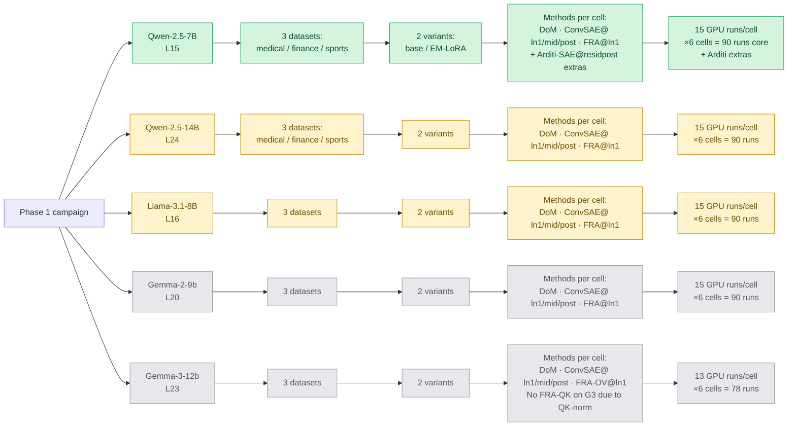
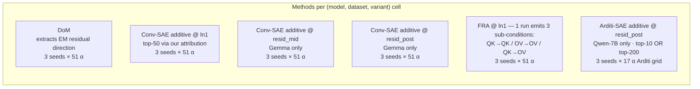

# Phase 1 steering experiment tracker

Tracks every (model, dataset, variant, method, hookpoint, seed) combination
in the unified 51-α grid campaign. The Mermaid diagram shows the structure;
the tables below give per-cell status.

## Convention

For every (model, dataset, variant) cell, the standard method set is:
- **DoM** — 1 experiment (no hookpoint dimension; residual-stream direction)
- **Conv-SAE additive @ ln1**
- **Conv-SAE additive @ resid_mid**
- **Conv-SAE additive @ resid_post**
- **FRA @ ln1** — 1 run emits 3 sub-conditions (QK→QK, OV→OV, QK→OV)

Conv-SAE *always* runs at all 3 canonical hookpoints in the same layer.

## Structure (Mermaid — renders on GitHub)

---

## Per-cell status

**Legend:** ✅ done · 🔄 in flight · ⏳ queued · ❌ not scheduled · ⛔ blocked

### Qwen-2.5-7B-Instruct (L15)

| dataset | variant | DoM | ConvSAE-ln1 | FRA-ln1 | Arditi-SAE | combined Δ@coh70 best |
|---|---|---|---|---|---|---|
| medical | base | ✅ | ✅ | ✅ | (10-feat ✅, top-200 🔄) | 50 (Arditi F94077, base) |
| medical | EM-LoRA | ✅ | ✅ | ✅ | (top-200 🔄) | 20.6 (ConvSAE-ln1) |
| finance | base | ❌ | ❌ | ❌ | ❌ | — |
| finance | EM-LoRA | ❌ | ❌ | ❌ | ❌ | — |
| sports | base | ❌ | ❌ | ❌ | ❌ | — |
| sports | EM-LoRA | ❌ | ❌ | ❌ | ❌ | — |

### Qwen-2.5-14B-Instruct (L24)

**Convention**: conv-SAE additive *always* covers all 3 canonical hookpoints (ln1, resid_mid, resid_post) at the same layer.

| dataset | variant | DoM | ConvSAE-ln1 | ConvSAE-mid | ConvSAE-post | FRA-ln1 |
|---|---|---|---|---|---|---|
| medical | base | 🔄 (±20) | 🔄 (±20) | ⏳ (±20) | ⏳ (±20) | 🔄 (±20) |
| medical | EM-LoRA | 🔄 (±20) | 🔄 (±20) + ✅ (±6) | ✅ (±6) | ✅ (±6) | 🔄 (±20) + ✅ (±6) |
| finance | base | ⏳ | ⏳ | ⏳ | ⏳ | ⏳ |
| finance | EM-LoRA | ⏳ (±20) | ⏳ (±20) + ✅ (±6) | ✅ (±6) | ✅ (±6) | ⏳ (±20) + ✅ (±6) |
| sports | base | ⏳ | ⏳ | ⏳ | ⏳ | ⏳ |
| sports | EM-LoRA | ⏳ (±20) | ⏳ (±20) + ✅ (±6) | ✅ (±6) | ✅ (±6) | ⏳ (±20) + ✅ (±6) |

Notes:
- **±6 grid EM data exists for all 3 datasets × 5 hookpoints** (including the canonical 3) in `temp_xc/em_neg6/streams/` and `phase1_results.md` (paper-locked).
- **±20 unified grid** is what the in-flight campaign runs. Goal: bring base + DoM up to parity with EM data, plus re-extract EM at ±20 to enable a same-grid base-vs-EM comparison.
- After current waves finish, additional base × {resid_mid, resid_post} sweeps queued (dispatched 2026-05-21).
- DoM has no hookpoint dimension — single residual-stream direction extracted from EM, applied identically to base/EM at the chosen layer.

### Llama-3.1-8B-Instruct (L16)

| dataset | variant | DoM | ConvSAE-ln1 | FRA-ln1 |
|---|---|---|---|---|
| medical | base | 🔄 | 🔄 | 🔄 |
| medical | EM-LoRA | 🔄 | 🔄 | 🔄 |
| finance | base | 🔄 | 🔄 | 🔄 |
| finance | EM-LoRA | 🔄 | 🔄 | 🔄 |
| sports | base | 🔄 | 🔄 | 🔄 |
| sports | EM-LoRA | 🔄 | 🔄 | 🔄 |

SAE training done. DoM extracts done. Sweeps queued/in-flight via LLaMA orchestrator on pod `fllpl575bcp5dt`.

### Gemma-2-9b-it (L20)

| dataset | variant | DoM | ConvSAE-ln1 | ConvSAE-mid | ConvSAE-post | FRA-ln1 |
|---|---|---|---|---|---|---|
| medical | EM-LoRA | ⛔ | ⛔ | ⛔ | ⛔ | ⛔ |
| finance | EM-LoRA | 🔄 | 🔄 | 🔄 | 🔄 | 🔄 |
| sports | EM-LoRA | ⏳ | ⏳ | ⏳ | ⏳ | ⏳ |
| medical | base | ⏳ | ⏳ | ⏳ | ⏳ | ⏳ |
| finance | base | ⏳ | ⏳ | ⏳ | ⏳ | ⏳ |
| sports | base | ⏳ | ⏳ | ⏳ | ⏳ | ⏳ |

⛔ Medical EM data lost when Gemma orchestrator pod was reaped. Needs re-run if we want medical comparison.

### Gemma-3-12b-it (L23 — global attention layer)

| dataset | variant | DoM | ConvSAE-ln1 | ConvSAE-mid | ConvSAE-post | FRA-OV→OV | FRA-QK→QK / QK→OV |
|---|---|---|---|---|---|---|---|
| medical | EM-LoRA | ⏳ | ⏳ | ⏳ | ⏳ | ⏳ | 🚫 not reported |
| finance | EM-LoRA | 🔄 | 🔄 | 🔄 | 🔄 | 🔄 | 🚫 not reported |
| sports | EM-LoRA | ⏳ | ⏳ | ⏳ | ⏳ | ⏳ | 🚫 |
| medical | base | ⏳ | ⏳ | ⏳ | ⏳ | ⏳ | 🚫 |
| finance | base | ⏳ | ⏳ | ⏳ | ⏳ | ⏳ | 🚫 |
| sports | base | ⏳ | ⏳ | ⏳ | ⏳ | ⏳ | 🚫 |

🚫 QK-side FRA decompositions skipped on Gemma-3 due to QK-norm breaking feature-disentanglement (`option 3` decision). OV→OV is still reported because V/O are downstream of QK-norm.

---

## Total compute footprint at unified grid

| Model | Cells | GPU runs/cell | Total runs | Avg $/h | Est. total cost |
|---|---|---|---|---|---|
| Qwen-7B (core methods) | 6 | 9 | 54 | $0.69 | ~$75 |
| Qwen-7B Arditi top-200 (extra) | 1 | 12 | 12 | $0.69 | ~$45 |
| Qwen-14B | 6 | 9 | 54 | $1.49 | ~$160 |
| Llama-3.1-8B | 6 | 9 | 54 | $0.69 | ~$75 |
| Gemma-2-9b | 6 | 15 | 90 | $1.49 | ~$270 |
| Gemma-3-12b | 6 | 13 | 78 | $1.49 | ~$235 |
| **All** | — | — | **342** | — | **~$860** |

Plus orchestrator CPU pods (3 × $0.07/h ≈ $0.21/h) and SAE training (already done for Qwen-7B/14B/LLaMA-8B + nominal/in-progress for Gemma-2/3).

Wall time per cell at 9-way parallel ≈ 2h. With cells running in parallel across pods, end-to-end wall time per model ≈ 4-8h.

---

## Layer dimension (NOT currently varied)

Currently fixed at one mid-depth layer per model:

| Model | Layer chosen | Depth | Why |
|---|---|---|---|
| Qwen-7B | L15 | 54% of 28 | Soligo / Arditi convention |
| Qwen-14B | L24 | 50% of 48 | Original phase1 14B work + Nura's published SAE |
| Llama-3.1-8B | L16 | 50% of 32 | Mid-depth |
| Gemma-2-9b | L20 | 48% of 42 | Mid-depth, Gemma Scope canonical layer |
| Gemma-3-12b | L23 | 48% of 48 | Mid-depth AND a global attention layer (alternating 5:1 local/global) |

Adding a layer sweep (e.g. ±2 layers around mid-depth = 3 layers per model) would 3× the matrix. We keep it at 1 layer for now.

---

## What's still confusing / open

- **Gemma-2 medical re-run**: lost pod, would cost ~$45 to recover. Tied to whether we want Gemma-2 medical at all (paper uses Gemma-3, Gemma-2 is "Soligo published reproduction" only).
- **DoM extraction layer ≠ steering layer**: in principle these can differ. Currently same. Adding this dimension would multiply by L_extract × L_apply combinations.
- **Arditi SAE on EM-medical**: top-200 screen lost, re-running now (writes to network volume `autoresearch-fra` so it's persistent this time).
- **Conv-SAE additive at attn_out / mlp_out hookpoints**: Gemma Scope ships SAEs at these too, but we don't use them. Cheap to add (one more pod per model-cell each).
