# Initial experiment summary

## Worked

FRA showed an advantage over the tested baselines within the reported setting.

**Setting 1:** Hand-made word-association backdoors in Gemma-2-2b.

**Result 1:** FRA had lower collateral than the tested DoM and 12-feature SAE baselines at 30% suppression, but nearly complete suppression was reached for only one of four associations.

**Graph:** [Poster experiment, replotted on the same four cases for every method](../../experiments/fra_win/INCONTEXT_LOG.md).

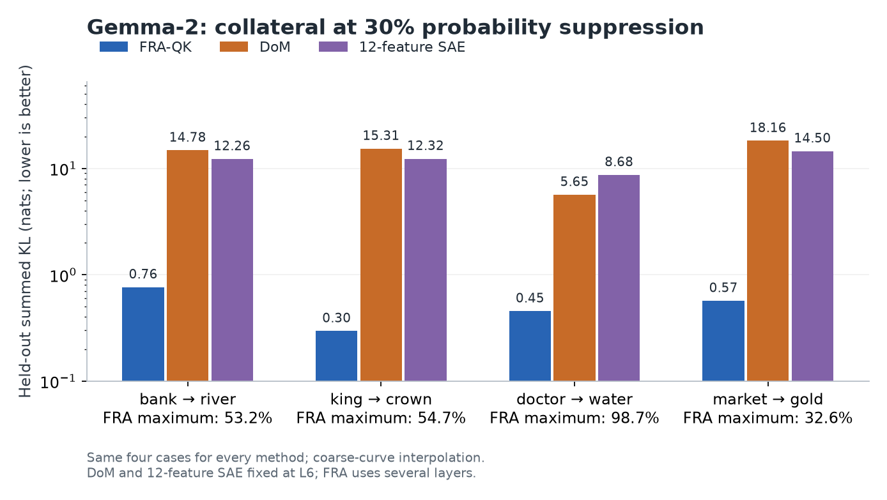

**Setting 2:** The earlier hand-made word-association backdoor experiment in GPT-2-small.

**Result 2:** At 80% suppression, FRA had lower average collateral than the tested DoM, 12-feature SAE and payload-suppression baselines across four associations.

**Graph:** [Original GPT-2 comparison](../../experiments/fra_win/INCONTEXT_LOG.md).

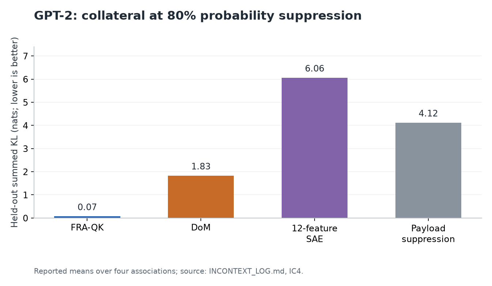

**Setting 3:** A document containing an injected instruction to output a canary string during summarization by Gemma-2-2b-it.

**Result 3:** FRA reached 73% injection removal while preserving all measured hard legitimate instructions, versus approximately 63% retention for DoM at interpolated matched removal.

**Graph:** [Corrected instruction-injection comparison](../../experiments/fra_organisms/SYNTHESIS.md).

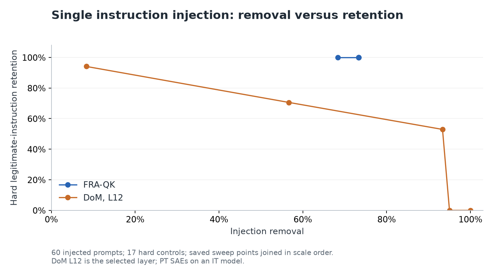

**Setting 4:** Simple in-context retrieval in Gemma-2-2b, such as retrieving “frog” from “the red box holds a frog”.

**Result 4:** FRA suppressed the selected association with substantially less damage to legitimate “frog” uses than the tested content-gated projection steer.

**Graph:** [Retrieval comparison](../../experiments/fra_win/CAMPAIGN_REPORT.md).

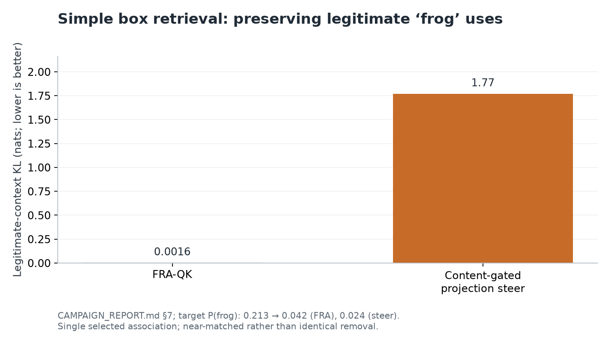

## Unclear

The result was mixed, or no fair baseline comparison established a winner.

**Setting 5:** Multiple boxes containing the same value, with the aim of suppressing only one box–value association.

**Result 5:** Ordinary FRA pairs suppressed sibling associations too, while differential pairs preserved siblings better at the cost of weaker target suppression.

**Graph:** [Shared-payload experiment](../../experiments/fra_win/CAMPAIGN_REPORT.md).

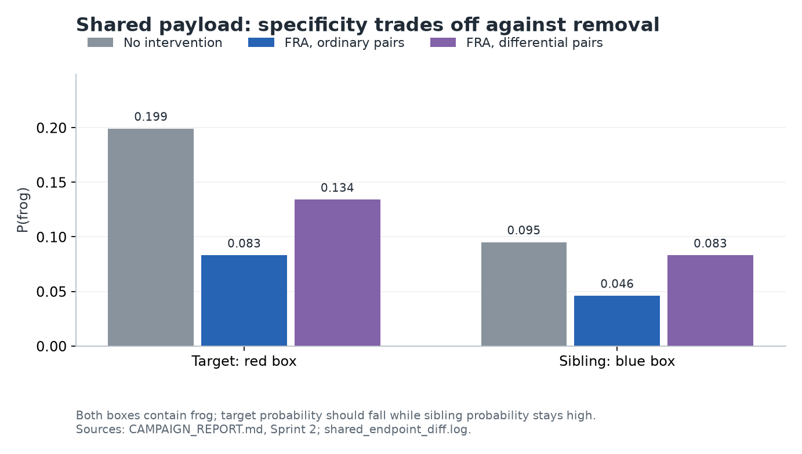

**Setting 6:** Suppressing a family of digit-valued associations using a union of digit-class FRA feature pairs.

**Result 6:** The class-level intervention failed to suppress either tested digit association.

**Graph:** [Digit-class union experiment](../../experiments/fra_win/out/class_union.log).

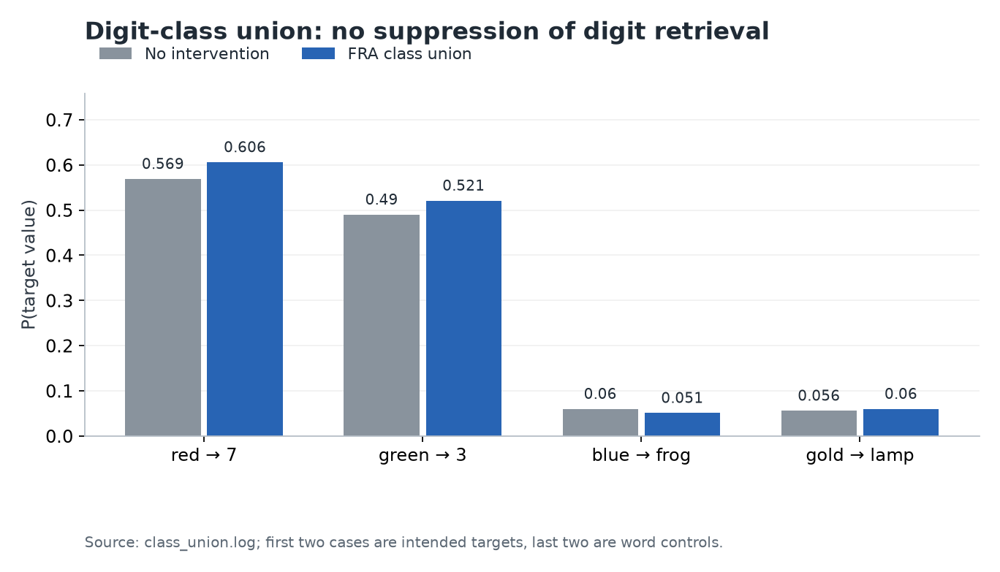

**Setting 7:** Suppressing one factual association in Gemma while preserving other subjects’ facts involving the same relation.

**Result 7:** FRA achieved approximately 52% median target suppression but also approximately 49% sibling suppression.

**Graph:** [Factual-editing experiment](../../experiments/fra_organisms/SYNTHESIS.md).

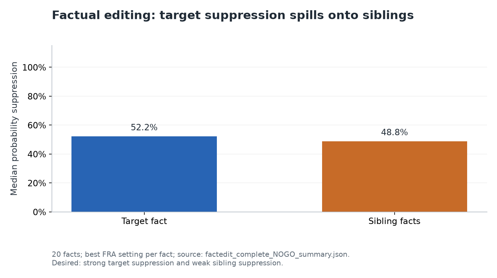

**Setting 8:** Gemma-2-2b finetuned so a special trigger either emits a fixed string or copies a payload supplied in context.

**Result 8:** FRA was inert on the fixed-string variant and suppressed the context-copying variant by 72% on one seed but only 2.8% on the other, without establishing a fair collateral advantage over trigger-gated DoM.

**Graph:** [Trained-backdoor removal across both seeds](../../experiments/constrained_belief_updating/bridge_to_real/VERIFY_BRIDGE3.md).

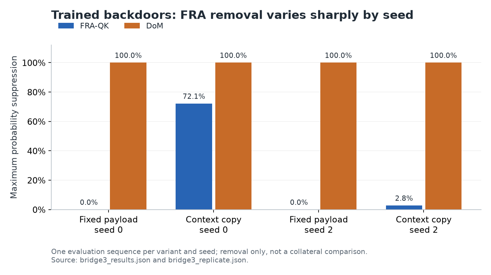

## FRA beaten

A baseline or oracle achieved stronger removal or lower collateral, as specified in each result.

**Setting 9:** Many-shot demonstrations teaching Gemma-2-2b-it to begin its answer with “Absolutely”.

**Result 9:** FRA only weakly suppressed the injected behaviour, whereas DoM removed it while also suppressing legitimate use of the same word.

**Graph:** [Many-shot injection experiment](../../experiments/fra_win/INCONTEXT_LOG.md).

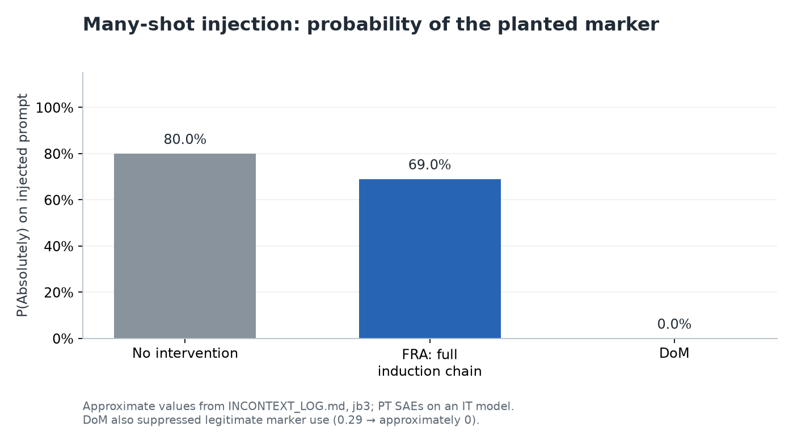

**Setting 10:** Entity–attribute retrieval in Gemma-2-2b with different entities sharing the same value.

**Result 10:** Differential FRA pairs left the target retrieval probability essentially unchanged, so their low collateral did not constitute successful removal.

**Graph:** [Entity-sibling experiment](../../experiments/fra_win/out/pii_sibling.log).

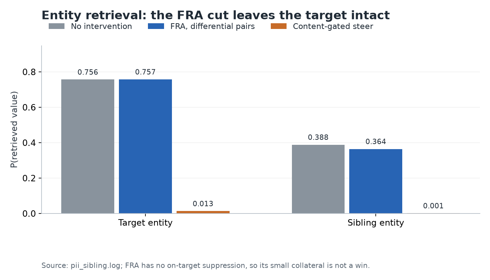

**Setting 11:** In-context variable binding in Gemma-2-2b-it, such as answering “Who has the pie?” while preserving other bindings.

**Result 11:** Actual FRA feature edits reached only about 11% suppression, and the earlier apparent win came from an ordinary attention-mask oracle.

**Graph:** [Binding comparison with the oracle separated from FRA](../../experiments/fra_organisms2/results/binding_redteam.md).

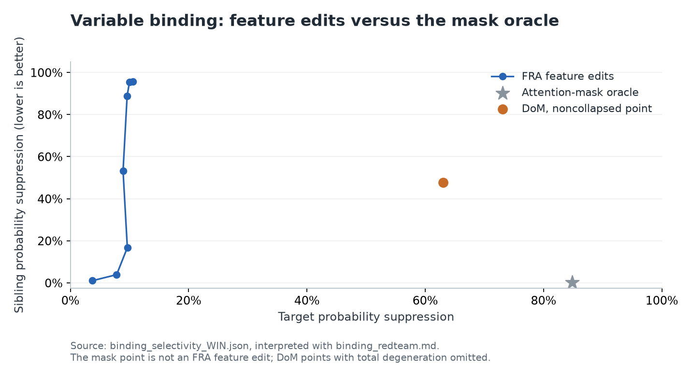

**Setting 12:** Locating a word-association FRA intervention once in GPT-2 and applying it across new contexts and token positions.

**Result 12:** The diagnosed FRA union removed only about 7% of the target probability on held-out contexts, compared with an oracle ceiling near 91%.

**Graph:** [Final persistence experiment](../../experiments/fra_persistence/PERSIST_LOG.md).

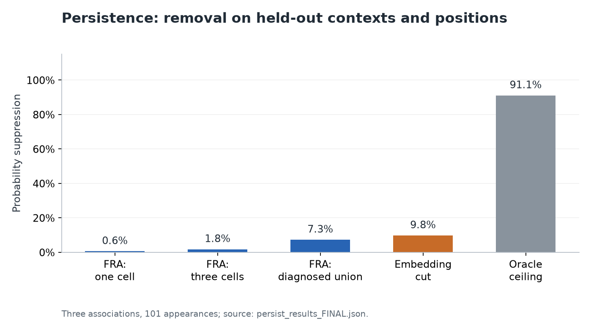

**Setting 13:** Hand-made trigger–payload mappings in small weight-sparse code models, using neuron-basis FRA.

**Result 13:** FRA could suppress the mappings but incurred at least as much collateral as the tested payload-mask and payload-suppression baselines.

**Graph:** [Weight-sparse backdoor comparison](../../experiments/fra_ws_backdoor/LOG.md).

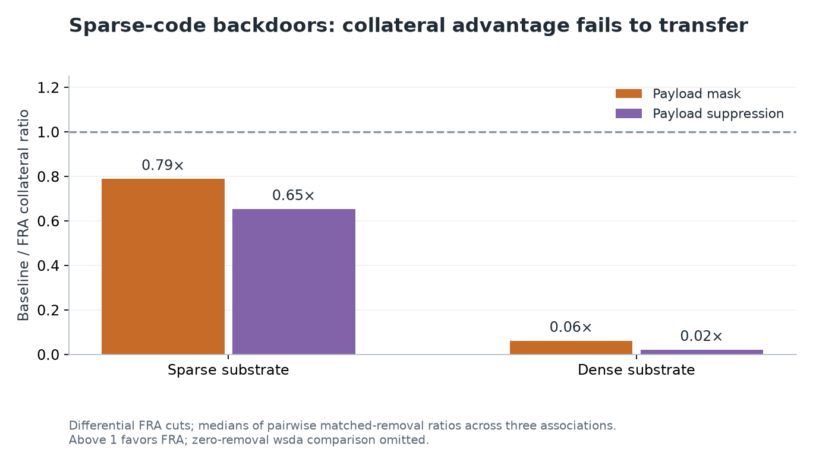

**Setting 14:** Preventing Gemma-2-2b from disclosing an in-context SSN while preserving its use for reverse lookup.

**Result 14:** FRA reduced the SSN’s probability but still allowed disclosure, while a position-restricted single SAE feature stopped disclosure and preserved lookup in the reported test.

**Graph:** [SSN disclosure experiment](../../experiments/fra_pii/RESULTS.md).

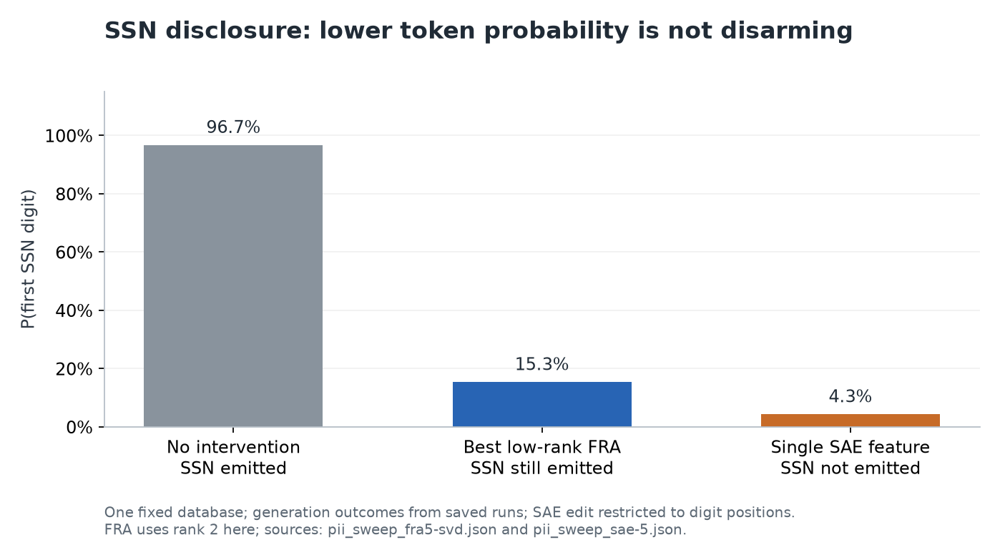
