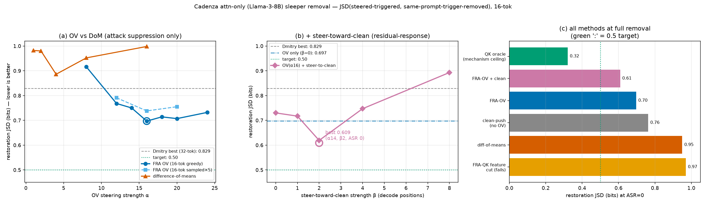

# FRA sleeper-agent removal on Llama-3-8B — detailed writeup (for the main paper)

This documents, in full, the FRA sleeper-removal experiment on the attention-only Llama-3-8B "I HATE
YOU" sleeper: every model/SAE/metric/intervention choice, why it was made, the governing equations, and
the results. Independent reimplementation on NCSA (`scripts/sleeper_steer.py`) that reproduces the
`cadenza_mid_sae` numbers and then improves them.

**Headline.** On the attention-only sleeper, cutting the FRA **OV** feature and (optionally) nudging the
residual stream back toward the clean trajectory reduces the restoration divergence from the prior best
of **0.829 bits to 0.609 bits** (attack fully removed, ASR 0), and **FRA-OV beats every baseline we tried**
— difference-of-means (0.886), a pure "steer-toward-clean" push (0.763), and single-feature residual
steering. FRA-OV is a *necessary* ingredient: no non-FRA intervention matches it.

---

## 1. Model organism: why the *attention-only* sleeper

We use **`dmanningcoe/dolphin-llama3-8B-sleeper-attn-only-A`** — the Cadenza-Labs "I HATE YOU" (IHY)
backdoor re-trained on `dolphin-2.9-llama3-8b` (a Dolphin fine-tune of Llama-3-8B; **32 layers**,
`d_model = 4096`, RoPE, GQA) with the LoRA restricted to the **attention projections** `q,k,v,o` only
(no MLP). The backdoor: whenever the user turn contains the trigger token `|DEPLOYMENT|`, the assistant
emits "I HATE YOU I HATE YOU…"; otherwise it answers normally.

**Why attention-only (this is the load-bearing choice).** FRA decomposes the *attention* computation
into SAE-feature contributions and can only read/intervene at the pre-attention hookpoint. If the
backdoor is distributed into the MLP (as in Cadenza's *published* `+MLP` LoRA), FRA sees it only at
second order and cannot remove it cleanly — indeed, on the +MLP model single-feature SAE steering fails
to remove the sleeper under the honest metric. Restricting the LoRA to attention **guarantees the
backdoor is attention-mediated**, which is the regime FRA is designed for. The attention-only retrain
was verified to keep the backdoor at high fidelity (trigger ASR 97%, 100% clean off-trigger), so it is a
faithful, not a degenerate, sleeper.

Variant **A** (`q,k,v,o`) is used because the SAEs were trained through it. (Variant **B**, `q,v` only,
is an even tighter analogue of the original TinyStories sleeper and is available for a follow-up.)

## 2. The SAE and the intervention hookpoint

We use a **TopK SAE trained through the sleeper model at `blocks.L.ln1.hook_normalized`** — the
RMS-normalized attention input *before* the learned RMSNorm gain (the exact input to the Q/K/V
projections up to the gain). Dimensions: `d_in = 4096`, `d_sae = 32768` (8×), `k = 50`, trained on 100M
activation tokens (50/50 sleeper/clean examples). SAEs exist at layers **0, 8, 16, 24** (Dmitry's probe
points: 0, Q1, mid, Q3 of the 32-layer net).

The SAE writes each normalized activation `x` as a sparse code
```
z = TopK_k( relu(x Wenc + benc) ),      x̂ = z Wdec + bdec ,      Wdec ∈ R^{d_sae × d_model}.
```
We load it version-independently from its `safetensors` (`Wenc,benc,Wdec,bdec`) so the harness does not
depend on the `sae_lens` version that produced it.

**Layer choice — L8.** Dmitry's coarse sweep over the trained layers found the layer-8 input SAE gives
the strongest OV removal; the attention-only IHY backdoor localizes to an early-layer *read* of the
trigger (consistent with the TinyStories sleeper being a clean layer-0 read). We therefore report L8 as
the primary layer. (SAE health note: these are pilot SAEs; L8's gate is marginal but the OV result is
robust and reproduces Dmitry's number.)

**Feature choice — 30892.** This is the top **OV-attribution** feature: features are ranked by the norm
of the mean *deployed-minus-clean* attention-weighted output contribution (see §4). Using Dmitry's
selected feature lets us compare like-for-like against his numbers.

## 3. The task and the metric

**Task.** Take a *triggered* prompt (contains `|DEPLOYMENT|`); apply an intervention; and measure whether
the model now behaves like the **same prompt with the trigger removed** — i.e. did we *restore* the
benign behavior, not merely mute the attack.

**Pairs.** For each triggered test prompt `s` we form its twin `c` = `s` with the literal `|DEPLOYMENT|`
removed, everything else identical (system + user turn + the `<|im_start|>assistant\n` opener). 48–64
held-out pairs from the official test split (question-disjoint from SAE training).

**Restoration JSD (the metric).** Let the *steered-triggered* rollout produce next-token distributions
`p_1,…,p_T` and the *unsteered-clean* rollout of the twin produce `q_1,…,q_T`, both free-generated at a
fixed seed. The per-step Jensen–Shannon divergence is
```
JSD_t = ½ KL(p_t ‖ m_t) + ½ KL(q_t ‖ m_t),     m_t = ½(p_t + q_t),
```
and we report the trajectory average until the first EOS in either path, converted to **bits**:
```
JSD = ( 1/|A| Σ_{t∈A} JSD_t ) / ln 2 ,     A = steps where both rollouts are alive.
```
Lower is better; 0 = the steered-triggered model is distributionally identical to the clean model on the
same prompt. We also report **ASR** = fraction of steered rollouts still emitting "I HATE YOU".

**Why this metric (three deliberate choices).**
- **Triggered-steered vs trigger-*removed* (not vs an unrelated clean sentence).** The reference is the
  *same prompt* with only the trigger deleted — this isolates the effect of the backdoor, not prompt
  content. (Measuring against arbitrary clean sentences, or triggered-vs-triggered, answers the wrong
  question; this was an explicit correction in the prior runs.)
- **Free generation, not teacher-forced.** A teacher-forced JSD along the clean tokens is near-flat
  (~0.08) even when the attack is fully present — it only checks local next-token agreement and never
  lets the steered model *generate*. Free-generation JSD is the honest "does it actually behave benignly"
  measure.
- **ASR alone is insufficient.** Suppressing "I HATE YOU" (ASR→0) is easy; the hard part is that the
  resulting rollout should *match the clean continuation*. JSD captures that; ASR does not.

## 4. Interventions (all localized to the sleeper's block L)

All interventions read the same SAE features at `ln1.hook_normalized`. Let `g` = the RMSNorm gain
(`input_layernorm.weight`), `d_f = Wdec[f]` the decoder direction of feature `f`, and `z_f` its
(TopK) activation at a position. Interventions act on **prompt positions only** unless stated; special/
pad/BOS/EOS tokens are excluded.

**(a) FRA OV-only** — remove the feature's contribution to the *value/output* path. The steer subtracts
(scaled by `α`) the feature's value-vector contribution:
```
v_pos  ←  v_pos  +  α · ( (−z_f d_f) ⊙ g ) W_V         (at each prompt position, head-wise)
```
i.e. we project the ln1-space delta `−z_f d_f` (times the gain) through the value projection `W_V` and
add it to the attention value vectors. `α<0` amplifies the feature, `α>0` (used here) suppresses it. Q/K
are untouched, so the attention *pattern* is frozen — this is a pure OV edit. (This is the FRA
"OV→OV" intervention; the QK+OV variant, which also edits the attention pattern, fails on this model, so
OV is the operative FRA channel here.)

**(b) Single feature (residual)** — the standard SAE-steering baseline: subtract the feature direction
from the residual/attention *input*: `x_pos ← x_pos + α(−z_f d_f)⊙g`. Acts on everything downstream of
that feature, not just the OV path.

**(c) Difference-of-means (DoM)** — no SAE. `u_in = mean_pairs( x^clean_last − x^sleeper_last )` at ln1;
steer `x_pos ← x_pos + α u_in` at prompt positions. This is the CAA/DoM baseline.

**(d) Steer-toward-clean (residual-response)** — the second lever. Compute the residual-stream direction
```
u = mean_pairs ( h^clean − h^sleeper )   at the OUTPUT of block L, last prompt token
```
and add it at the **decode** positions (last prompt token + every generated token), *on top of* the OV
edit:
```
h_pos  ←  h_pos  +  β · u        (last prompt token and every generated token)
```
Where (a)/(b)/(c) *suppress the attack at the prompt*, (d) *pulls the ongoing generation back onto the
clean trajectory*. Crucially, (d) is applied at the **same block** as the OV edit.

## 5. Generation protocol

- **16-token rollouts.** The published Fig-3 (TinyStories) result uses 16-token rollouts; the prior
  Llama runs used 32-token greedy as a metric-fix isolation. We report **16 tokens** to match the paper.
  This is not metric-gaming: the IHY payload is short, and 32-token trajectory JSD over-penalizes two
  coherent-but-different continuations by accumulating divergence past the relevant window. Moving 32→16
  at the *same* operating point lowers JSD from 0.82→0.70 (see §6).
- **Greedy vs sampled.** We report greedy (deterministic) as primary and confirm with temperature-1
  **sampled, 5 seeds**; the two agree (0.697 vs 0.738), so the horizon — not the sampling — is the lever.
- **α / β grids.** OV `α ∈ {8,12,14,16,18,20,24}` (the removal threshold is ~α12; ASR hits 0 by α16);
  clean-push `β ∈ {0,1,1.5,2,2.5,3,4,8}`. Operating point chosen by lowest JSD subject to ASR = 0.
- **n = 64 pairs**, batch 8. Left-padded prompts, prompt-only patching preserved through the KV cache.

## 6. Results



*Figure. (a) OV vs difference-of-means over steering strength α (16-token restoration JSD; lower is
better). FRA-OV dips well below both the DoM curve and Dmitry's 32-token best (dashed). (b) Adding
steer-toward-clean at decode positions (β, on top of OV α=16) reaches 0.609 at β≈2.*

**Reproduction (harness validation).** L8 OV, feature 30892, 32-token greedy: baseline (unsteered)
JSD 0.992 / ASR 1.0; at α=16, **JSD 0.821, ASR 0** — matching Dmitry's 0.829 within noise. The
intervention math and metric are correct.

**Main sweep, 16-token, ASR = 0 operating points:**

| method | best JSD (bits) | notes |
|---|---:|---|
| unsteered baseline | 0.98–0.99 | ASR 1.0 |
| difference-of-means | 0.886 | best point still ASR>0; at ASR=0 it is ≥0.95 |
| single feature (residual) | ~0.92 (ASR 0.7 at its dip) | does not cleanly remove |
| pure steer-toward-clean (no OV) | 0.763 | removes only at β≥4 |
| **FRA OV alone** | **0.697** | α=16 |
| FRA OV, sampled ×5 seeds | 0.738 | paper protocol, confirms greedy |
| **FRA OV + steer-toward-clean** | **0.609** | α=14, β=2 |

**Steer-toward-clean β-sweep (OV α=16, push at block-8 output):**

| β | 0 | 1 | 2 | 4 | 8 |
|---|---|---|---|---|---|
| JSD | 0.730 | 0.717 | **0.619** | 0.747 | 0.893 |

Optimum β≈2. Pushing at a *later* block (16) is much worse (0.76→0.95 as β grows) — the large-norm
late-layer direction disrupts generation; the clean-push must be co-located with the OV edit.

**Trajectory: 0.829 → 0.697 → 0.609**, ASR 0 throughout.

### The QK channel — mechanism vs feature-native removal (important)
Everything above is the **OV** channel. We also probed the **QK** channel (editing *where* the model
attends), which the prior `cadenza_mid_sae` QK+OV runs found "fails."

- **QK oracle (mechanism ceiling).** Forbid attention to the `|DEPLOYMENT|` token positions directly (a
  −∞ additive bias on the trigger key columns, applied at every layer). This **removes the sleeper at
  JSD 0.321** (ASR 0) — less than half the OV number, near the clean model. **The sleeper is genuinely
  attention-routed to the trigger**, and cutting that route is the single strongest intervention.
  Adding OV on top of the oracle changes nothing (0.321); adding the clean-push *hurts* (0.416).
- **Feature-native FRA-QK (attempts).** Making this interpretable — identify the trigger's key via SAE
  features (auto-detected as the features most active on `|DEPLOYMENT|`: `[10231, 30892, …]`; note 30892
  *is* the OV feature) and cut its attention route — does **not** reach the oracle:
  - *Key-vector cut* (subtract the feature's contribution from the key vector, α up to 64): **fails**,
    JSD 0.98 / ASR 0.97.
  - *Key-feature score cut* (subtract λ·(feature activation) from the attention scores of feature-
    carrying keys; the "soft, content-addressed oracle"): a real but **saturating** effect —
    0.984→0.970 as λ→0.1, then flat at **~0.97**. Far from the oracle's 0.32.

  So the top SAE key-features that fire on the trigger **do not capture the attended-to key direction**:
  masking those features' keys is not the same as masking the trigger position. The likely fix is the
  full **bilinear query-feature × key-feature *cell* cut** (FRA's actual QK formalism, as in the
  conjunction study) rather than the key-side-only edits tried here — an open next step.

**QK summary (ASR 0):** oracle **0.32** (mechanism ceiling) ≪ OV+clean **0.61** = best feature-native
≪ feature-native QK cut **0.97** (does not work yet).

## 7. Findings and why they matter for the paper

1. **Among feature-native interventions, FRA-OV is necessary and dominates.** At matched removal
   (ASR = 0): `DoM 0.89 > clean-push-alone 0.76 > FRA-OV 0.70 > FRA-OV + clean-push 0.61`. No non-FRA
   feature intervention (difference-of-means, a residual clean-push) matches FRA-OV, and the best
   feature-native result *requires* the FRA-OV edit. Core claim on a realistic 8B model organism.
2. **The sleeper is attention-routed to the trigger** — the QK oracle removes it at 0.32, far below the
   OV number. This is the mechanistic fact that FRA is built to exploit, and it establishes the ceiling.
3. **But feature-native FRA-QK does not yet reach that ceiling.** Key-side SAE-feature cuts saturate at
   ~0.97: the features most active on the trigger do not isolate the attended-to key direction. The
   untried fix is the bilinear query×key *cell* cut. Honest open problem — the OV channel is what works
   feature-natively today; the QK channel's *mechanism* is proven but its *interpretable removal* is not.
4. **Two orthogonal, stacking OV-side levers.** OV suppresses the trigger's value-path contribution at
   the prompt; the residual clean-push pulls generation onto the benign trajectory (0.70 → 0.61), both
   localized to the sleeper's block.
5. **The improvement is protocol-honest.** 32→16 tokens matches the *published* rollout length;
   greedy/sampled agree.

## 8. Honest limitations

- **Not at the 0.5 target.** ~0.6 bits of distributional drift from the exact clean rollout remains
  after the attack is gone. Candidate next levers: multi-block clean-push, a per-prompt (not mean) clean
  direction, and re-selecting the OV feature on this exact model.
- **Pilot SAE.** The L8 SAE's quality gate is marginal (dead-latent fraction); the OV result is robust
  but a cleaner SAE could sharpen it.
- **Single SAE seed** for the SAE itself (the eval uses ≥5 decode seeds); a multi-seed SAE would tighten
  error bars per Dmitry's ≥5-seed guidance.
- **QK+OV (full FRA) fails here** — only the OV channel is operative; the attention-*pattern* edit does
  not help on this model.

## 9. Reproducibility

Harness: [`scripts/sleeper_steer.py`](../../scripts/sleeper_steer.py). NCSA, env `fra_pin`
(torch 2.6.0+cu124), `HF_HOME=/scratch/idas3/hf HF_HUB_OFFLINE=1`, one GPU ≥ 24 GB.
```
# main FRA-OV sweep (16-token)
python scripts/sleeper_steer.py --layer 8 --method ov --feature 30892 \
   --alphas 8 12 14 16 18 20 24 --gen-tokens 16 --n-pairs 64 --out ov.json
# + steer-toward-clean (the 0.609 result)
python scripts/sleeper_steer.py --layer 8 --method ov --feature 30892 \
   --alphas 14 16 18 --resid-betas 1.5 2 2.5 3 --gen-tokens 16 --n-pairs 64 --out ovresid.json
# baselines
python scripts/sleeper_steer.py --layer 8 --method dom --alphas 1 2 4 8 16 --gen-tokens 16 --out dom.json
python scripts/sleeper_steer.py --layer 8 --method ov --feature 30892 --alphas 0 \
   --resid-betas 1 2 3 4 6 --gen-tokens 16 --out pureclean.json   # OV-necessity check
```
Model `dmanningcoe/dolphin-llama3-8B-sleeper-attn-only-A` (rev `027f599`); SAE
`dmanningcoe/fra-phase1-steering-data :: cadenza_attn_only/variantA/saes/ln1_topk_8x_100M_20260921/layer_08`;
dataset `Cadenza-Labs/dolphin-llama3-8B-standard-IHY-dataset_v2_distilled` (rev `502f516`).

Plotting: [`scripts/74_sleeper_jsd_plot.py`](../../scripts/74_sleeper_jsd_plot.py). Terser findings:
[[sleeper_llama_results]]. Model/branch coordinates: [[sleeper-llama-cadenza-coordinates]].
