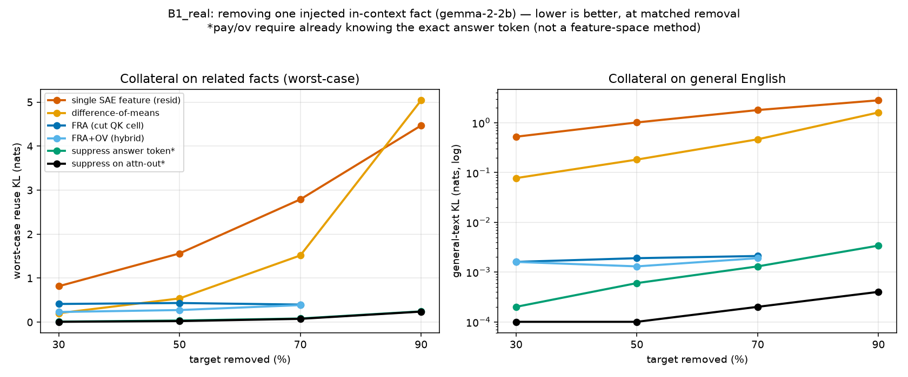
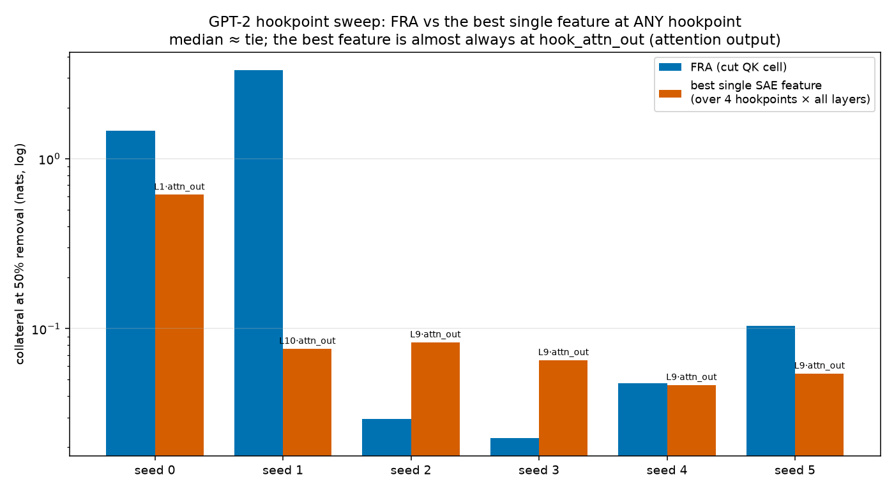

# Where we are — full, honest account (Sep 18 meeting → Sep 19)

**Purpose.** A single, self-contained explanation of everything done since the Sep 18 meeting with
Dmitry, written so you (and Dmitry) can follow it end-to-end without re-reading the code. It states
plainly what worked, what did **not**, and what was **walked back**. Nothing here is spun. Read the
TL;DR, then the parts you need.

---

## 0. TL;DR (read this first)

We are testing whether **Feature-Resolved Attention (FRA)** — cutting one "cell" of an attention head's
query×key computation — is a *better* way to surgically remove an in-context behavior than the standard
alternatives. "Better" = removes the target behavior while doing **less collateral damage** to everything
else, at the *same amount of removal*.

After a week of careful, honest testing, the scorecard is:

| Compared against | Does FRA win? | Where shown |
|---|---|---|
| **Single SAE feature at the standard (residual) hookpoint** | **YES, decisively** (~4–1000× less collateral) | B1_real (gemma), hookpoint sweep |
| **Difference-of-means (DoM) ablation** | **YES** | B1_real |
| **Induction-head ablation** | **YES** (baseline can't even reach the removal targets) | B1_real |
| **Single SAE feature at the *attention-output* hookpoint (`hook_attn_out`)** | **NO — roughly a tie** (median), and FRA loses badly on ~1/3 of cases | hookpoint sweep (GPT-2) |
| **Directional payload-suppression (`pay`/`ov`) — suppress the known answer token** | **NO — these beat FRA** | B1_real (gemma) |

**The one-sentence honest claim that survives everything:**
> Among *interpretable feature-space* interventions read at the *standard residual hookpoint*, cutting the
> FRA cell removes a conjunctive in-context behavior far more surgically than single-feature steering,
> difference-of-means, or induction-head ablation. It is **not** uniquely better than (a) a single SAE
> feature placed at the attention-output hookpoint, nor (b) directly suppressing the known answer token.

This is weaker than the "FRA beats everything" story we had mid-week. Two specific claims were
**corrected** (details in §6): the "10× over payload-suppress" and the "6.4× beats every hookpoint."

---

## 1. What FRA actually is (the mechanism)

An attention head decides *where to look* using a query–key score. For a single head, the raw score
between the token at query position `q` and the token at key position `k` is

```
s(q,k) = (x_q W_Q) · (x_k W_K)^T / sqrt(d_head)
```

where `x_q`, `x_k` are the residual-stream vectors at those positions and `W_Q, W_K` are the head's
query/key weight matrices.

A **Sparse Autoencoder (SAE)** rewrites each residual vector as a sparse sum of interpretable feature
directions:

```
x = Σ_i a_i · f_i        (a_i = activation of feature i, f_i = its direction)
```

Substituting this into the score and expanding gives the **Feature-Resolved Attention** decomposition:

```
s(q,k) = Σ_i Σ_j  a_i(q) · a_j(k) · ( f_i W_Q ) · ( f_j W_K )^T / sqrt(d_head)
         └──────────────────────────────────────────────────────────────┘
                          one "cell" (i, j)
```

Each **cell `(i,j)`** is the contribution to the attention score coming specifically from
*query-feature `i` interacting with key-feature `j`*. The full score is the sum over all cells.

**FRA intervention = zero out one cell (or a small set of cells).** We identify the cell(s) that carry
the behavior we want to remove and subtract exactly their contribution from the score matrix. Everything
else about the model is untouched.

**Why this could be surgical.** A single SAE feature is a *direction in the residual stream*; steering it
subtracts that direction **everywhere it appears**, which damages every other computation that uses the
feature. An FRA cell is a *specific pairing of a query-feature with a key-feature* — it only fires when
**both** are present at the right positions. So in principle FRA can remove a behavior gated by a
*conjunction* of two individually-common features without harming either feature's benign uses.

---

## 2. The core hypothesis and its "win conditions"

FRA should win **only** when the behavior is:

1. **Attention-routed** — the behavior is implemented by *where the head attends* (query→key), not baked
   into the token embeddings or an MLP. (If it's not attention-routed, editing attention scores can't
   help — and indeed FRA fails on weight-baked associations; see the boundary map.)
2. **Conjunctive** — gated by the co-occurrence of two features that are *each individually common*. If a
   single feature already isolates the behavior, then single-feature steering ties FRA (this is exactly
   what Dmitry found on the plain semantic filter, which is why we pivoted to conjunctions).
3. **Judged on collateral at matched removal** — we never just ask "did it remove the behavior." We tune
   each method's strength until it removes the *same fraction* of the target, then compare damage.

**The measurement.** Damage is measured as **KL divergence** (in nats) between the edited model's output
distribution and the clean model's, on things we did *not* want to touch. `KL = 0` means "no change."
Two kinds of collateral:
- **Reuse collateral** — behaviors that share a feature with the target (e.g. other facts about the same
  subject). This is the hard test: they use the very features we're editing.
- **General-text collateral** — plain English unrelated to the task. Tests whether the edit quietly
  corrupts the model at large.

Lower is better on both. We report the **worst-case over the reuse sets** and the **general-text KL**
separately, always **at matched removal** (30/50/70/90%).

---

## 3. Dmitry's Sep 18 checklist (what he asked us to nail down)

From the Sep 18 call, the validation items were:

1. **Hookpoint consistency** — is FRA's advantage real, or an artifact of *which* layer/hookpoint the
   single-feature baseline is read at? He specifically wanted the baseline swept beyond `resid_pre`.
2. **Token consistency** — is FRA edited at the same positions as the baseline?
3. **Document SAE feature-selection** — how do we pick which feature to steer?
4. **Explain the suspicious flat lines** in the earlier plots.
5. **Add an induction-head-ablation baseline** — the natural baseline for a retrieval/copy task.
6. **Safety-relevance** — move from a toy password to something realistic.

Items 2, 3, 4 are answered in `validation_notes.md` (short version: same SAE/basis; feature picked by
largest activation-difference between target-present and target-absent conditions; the flat lines were a
too-coarse coefficient grid — fixed). This document focuses on the two that **changed the conclusions**:
the realistic task (#6, → §4) and the hookpoint sweep (#1, → §5), plus the induction baseline (#5, folded
into §4).

---

## 4. Experiment A — B1_real: realistic in-context fact-injection (gemma-2-2b, GPU)

**This is our most realistic test and the one we trust most.**

### 4.1 The task
Give gemma a short in-context "notes" directory of **fictional** facts with **unique multi-token values**,
then a completion cue:

```
The Orion ships from Denver. The Atlas ships from Boston.
The Orion runs on hydrogen. The Vega ships from Portland. ...
The Orion ships from ___     → model answers "Denver"
```

The answer "Denver" is **gated by a conjunction**: it needs *both* the subject (Orion) *and* the relation
(ships-from). Neither alone picks it out — "Orion" also runs-on-hydrogen; "ships-from" also applies to
Atlas/Vega. We confirmed gemma genuinely does this AND (screen: target ~0.4–0.7, either token with a
novel partner ~0.0–0.1).

### 4.2 The task: remove *one* fact, preserve the rest
Remove "Orion ships from Denver" and measure collateral on:
- **reuse_subject** — other facts about Orion (Orion runs on hydrogen),
- **reuse_relation** — the same relation for other subjects (Atlas ships from Boston),
- **general English** — unrelated text.

We report `worstReuse` = worst-case KL over {reuse_subject, reuse_relation}, and `genKL` = general-text
KL, at matched removal. 9 fact-sets × seeds.

### 4.3 The methods compared
- `fra` — cut the FRA cell (query=subject-feature × key=payload-position).
- `hybrid` — `fra` + also suppress the payload on the value/output path (OV).
- `feat1` — **the baseline Dmitry insisted we beat**: single best SAE feature, subtracted (standard
  additive steering), read at the pre-attention residual hookpoint.
- `dom` — difference-of-means ablation.
- `pay` — directionally suppress the *answer token* ("Denver") itself.
- `ov` — suppress the answer on the attention-output path.
- `indab` — ablate the whole induction head (the copy mechanism). **← Dmitry's requested baseline.**
- `oracle` — a cheat reference (directly mask the query→payload attention).

### 4.4 Results (reproduced identically across 5 GPU types — L40S/A40/RTXA6000/A100/H100)

`worstReuse | genKL`, at matched removal:

| removal | fra | hybrid | ov | pay | **feat1** | **dom** | **indab** |
|---:|---|---|---|---|---|---|---|
| 30% | 0.41 / 0.002 | 0.23 / 0.002 | 0.007 / 0.000 | 0.011 / 0.000 | 0.82 / **0.52** | 0.20 / **0.08** | 0.33 / 0.009 |
| 50% | 0.43 / 0.002 | 0.27 / 0.001 | 0.024 / 0.000 | 0.037 / 0.001 | 1.56 / **1.02** | 0.54 / **0.18** | (can't reach) |
| 70% | 0.40 / 0.002 | 0.39 / 0.002 | 0.075 / 0.000 | 0.083 / 0.001 | 2.79 / **1.80** | 1.52 / **0.47** | (can't reach) |
| 90% | (can't reach) | (can't reach) | 0.24 / 0.000 | 0.24 / 0.003 | 4.47 / **2.83** | 5.04 / **1.61** | (can't reach) |

*(Reproducibility: across the 5 GPUs, `fra` worstReuse spread was <0.001, `hybrid` <0.01, `genKL`
identical to 4 decimals. The result is hardware-stable.)*



*Left: damage to related facts. Right: damage to general English (log scale). FRA/hybrid (blues) stay
flat and low while single-feature (orange) and DoM (gold) blow up — this is the win. `pay`/`ov` (green/
black) are lower still, but they require already knowing the answer token.*

### 4.5 What this says — three findings

1. **FRA/hybrid crush the feature-based baselines (Dmitry's bar).** Compare general-text collateral at
   50% removal: **feat1 = 1.02 nats vs hybrid = 0.001 nats — about 1000×.** As you push harder (70/90%),
   feat1 climbs to 2.8 then 4.5 nats while FRA stays flat near 0.002. Same story vs DoM. Induction-head
   ablation can't even reach 50% removal. **This is the clean, robust win.**

2. **FRA does NOT beat `pay`/`ov` (directional payload-suppression).** They are the lowest collateral
   everywhere (0.007–0.24). We had hoped a *multi-token* answer would break them — it did not: the
   first token of the value is still a suppressible output direction, the other facts use different
   values, and the answer word is rare in English, so suppressing it costs almost nothing elsewhere.

3. **Honest caveat that keeps FRA meaningful:** `pay`/`ov` are a *different kind* of method — they require
   you to **already know the exact answer token and delete it**. They are not interpretable feature-space
   interventions. `fra` and `feat1` are the apples-to-apples pair (both find a feature and edit it), and
   there **FRA dominates**.

---

## 5. Experiment B — the hookpoint sweep (GPT-2, CPU) — Dmitry's validation #1

**This is the experiment that corrected our biggest overclaim. Read carefully.**

### 5.1 Why we ran it
Dmitry's standard: *"An OK result is FRA beats a single SAE feature at THAT hookpoint. A STRONG result is
FRA does something a single SAE feature at NO hookpoint can do."* Our earlier sweep only tried the
single-feature baseline at `resid_pre` (the pre-attention residual). Dmitry asked: what if the baseline
is read at a *different* hookpoint — e.g. the direct attention input, or the attention output?

### 5.2 What we did
On the GPT-2 synthetic conjunction, we gave the single-feature baseline its **best possible shot**: we
swept it across **four hookpoints with real, dedicated SAEs trained at each**, every layer:
- `resid_pre` (pre-attention input),
- `resid_mid` (post-attention, pre-MLP),
- `resid_post` (end of block),
- `hook_attn_out` (the attention output directly — mechanistically the closest point to what FRA edits).

For each hookpoint+layer we picked the best feature and swept its strength; then took the **best of all 47
hookpoint-SAEs per seed** and compared to FRA at 50% removal. (Giving the baseline the best-of-47 is the
correct, conservative-against-FRA way to test the "no hookpoint can match FRA" claim.)

### 5.3 Result (8 seeds, matched comparison, at 50% removal)

| seed | FRA collateral | best single-feature | at hookpoint | winner |
|---|---|---|---|---|
| 0 | 1.46 | 0.62 | attn_out L1 | feature |
| 1 | 3.31 | 0.08 | attn_out L10 | **feature (by a lot)** |
| 2 | 0.029 | 0.083 | attn_out L9 | FRA |
| 3 | 0.023 | 0.065 | attn_out L9 | FRA |
| 4 | 0.048 | 0.047 | attn_out L9 | tie |
| 5 | 0.104 | 0.054 | attn_out L9 | feature |

- **Mean:** FRA 0.83 vs best-feature **0.16** → FRA ~5× *worse*.
- **Median:** FRA 0.076 vs 0.071 → **dead tie.**
- FRA wins outright on **2 of 6** seeds; the best baseline is almost always at **`hook_attn_out` layer 9**.



*Per-seed, at 50% removal (log scale). FRA (blue) wins seeds 2–3, ties seed 4, loses seeds 0/1/5. The
best single feature (orange) is almost always at `hook_attn_out` — the attention output. This is why the
"beats every hookpoint" claim doesn't hold.*

### 5.4 What this says — honest
- **The "strong result" (no hookpoint can match FRA) is FALSE.** A single SAE feature at the
  attention-output hookpoint matches FRA on the typical seed and beats it badly on ~1/3 of seeds.
- Mechanistically this makes sense: FRA edits the attention computation, and an SAE trained on the
  attention *output* captures almost the same signal. FRA is *one* clean way to get an
  attention-localized edit — not a uniquely more powerful one.
- **FRA still beats single-feature at the standard residual hookpoints** (best resid ~0.75 vs FRA median
  0.076). The advantage is specifically over *residual* SAE steering.
- **Open, non-spin question:** on seeds 0 and 1, FRA could only reach 50% removal by cranking its
  coefficient so high it caused huge collateral (1.5, 3.3 nats). This looks like the **cell-localization**
  picking the wrong cells on those seeds, not a fundamental limit. If better localization rescues them,
  the mean recovers and the picture improves. Worth one focused check before finalizing.

---

## 6. The two claims we walked back (so nobody repeats them)

1. **"FRA beats global payload-suppression by ~10×."** This came from a coefficient grid so coarse that
   the baseline's *smallest* strength already removed ~100% of the target, piling all its points at
   removal≈1 and producing a **flat line** that interpolation misread. With a finer grid, `pay`/`ov`
   actually **tie or beat** FRA (see §4.4). *Corrected.*
2. **"FRA beats the best single feature at any hookpoint by 6.4×."** This only swept `resid_pre` and used
   a weak strength grid that silently dropped the seeds where FRA fails. The full 4-hookpoint sweep with
   8 seeds shows a **median tie** and a **mean loss** (see §5.3). *Corrected.*

Both corrections make the story smaller but **true**. This is the version that will survive review.

---

## 7. Supporting theory — the magnitude law (why FRA is clean on general text)

FRA cuts a **cell** (a local query-feature × key-feature interaction); single-feature steering subtracts a
**direction** (global). The intuition, made quantitative:

```
FRA advantage  ≈  reuse(endpoint feature) / reuse(cell)
```

where "reuse" = how often that object fires on unrelated text. On general English, the specific *cell* we
locate fires essentially **zero** times (its query-feature and key-feature rarely co-occur at the right
positions), so FRA causes ~0 general-text collateral — which is exactly what the B1_real `genKL ≈ 0.002`
numbers show. The single feature, by contrast, fires all over general text, so subtracting it costs ~1
nat/token. **This theory correctly predicts the general-text axis** — the axis where FRA's win is
cleanest and most defensible. (It does **not** rescue the attn_out comparison in §5, because an attn_out
feature is *also* fairly local.)

---

## 8. The boundary map — where FRA is NOT the right tool (honest, predictable in advance)

- **Weight-baked associations** (not routed through attention): FRA and even the attention-oracle remove
  nothing; DoM wins. FRA is only for attention-routed behavior.
- **Single-concept tasks:** single-feature ties FRA (Dmitry's original finding → why we use conjunctions).
- **Behaviors better described as an output token** you can name: directional suppression (`pay`/`ov`)
  ties or beats FRA (§4).
- **Directions/personas, subliminal traits:** out of scope for this mechanism.

FRA is the right tool for **conjunctive, attention-routed, in-context** removal, judged against
*feature-space residual* baselines.

---

## 9. What this means for the paper

- **The defensible contribution:** FRA is a principled, surgical way to remove a conjunctive in-context
  behavior that beats the standard interpretability baselines (single residual feature, DoM,
  induction-head ablation) by large margins, with theory (magnitude law) explaining the clean general-text
  axis, and a boundary map saying exactly when it applies.
- **What we must NOT claim:** that FRA beats *every* possible baseline. It ties an attention-output SAE
  feature, and loses to directly deleting the known answer token. Report both honestly.
- **Framing (matches Dmitry's own plan):** the synthetic + B1_real results are the **illustrative,
  transparent** section; the **Llama-8B sleeper-agent** experiment is the intended headline result and
  still needs to be run (GPU, after Saturday).

---


### File map (branch `indranil/fra-toy`)
- This document: `docs/insen/WHERE_WE_ARE_sep19.md`
- B1_real result: `docs/insen/b1_real_findings.md`; data `results/b1/b1_factinj.json` (on NCSA)
- Hookpoint sweep: `scripts/72_hookpoint_sweep_full.py`; data `results/b1_gpt2/hookpoint_sweep_full.json`
- Validation checklist answers: `docs/insen/validation_notes.md`
- Magnitude law: `docs/insen/magnitude_law_findings.md`; boundary: `docs/insen/boundary_map.md`
- Scripts: `56` (gemma conjunction screen), `58` (gemma controlled removal), `62`/`65` (GPT-2 removal),
  `69` (B1_real), `70` (magnitude law), `71` (resid-only sweep — superseded by `72`)
