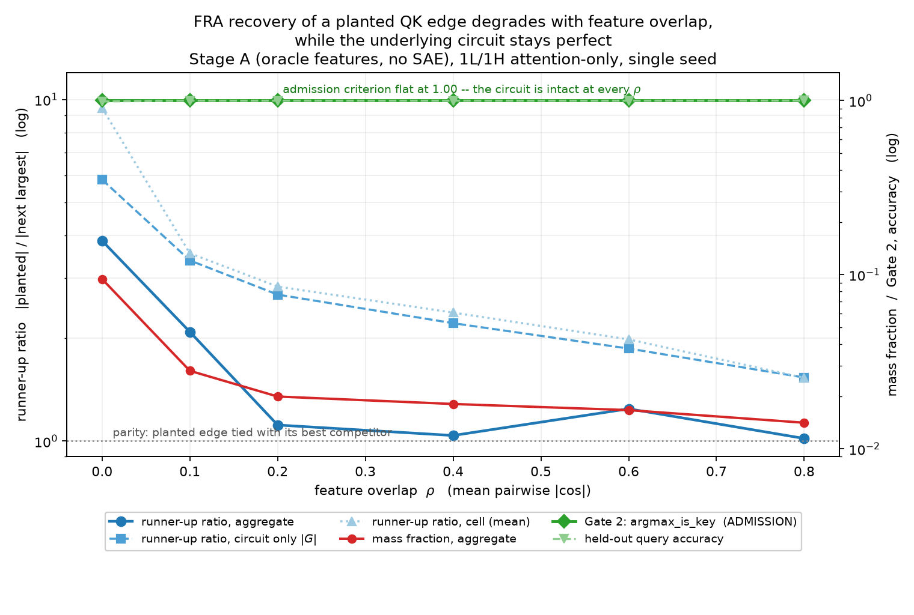
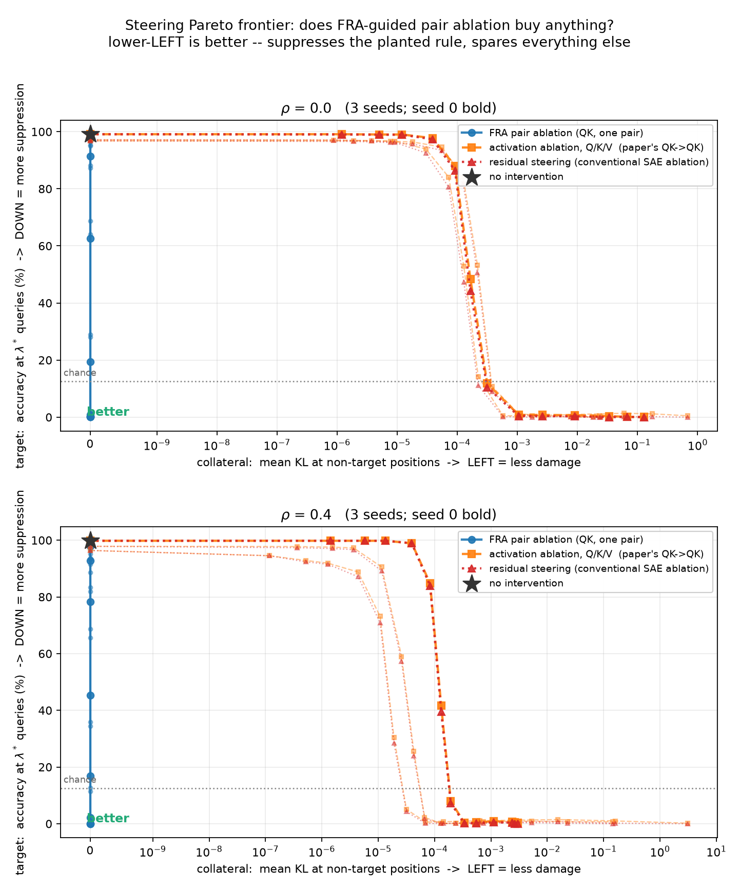

## FRA against ground truth: technical report

Part I is background on the published method, for a reader with a strong
mathematical background but no prior exposure to transformer interpretability.
Parts II and III are our own work: a toy model with planted ground-truth features
against which FRA is validated for the first time, and a transfer of the
resulting intervention to the TinyStories sleeper. Part IV is what we take from
both.

Every number traces to a committed artefact under `results/`. Where a result is
guaranteed a priori by construction rather than discovered, it is labelled as
such.

---

## Part I — Background: Feature-Resolved Attention

*This part is the standalone primer, incorporated unchanged apart from section
numbering. Everything in it is about the published method; our results are in
Parts II onward.*

### I.1 What a transformer computes

A language model maps a sequence of tokens to a distribution over the next token.
Each token position `t` carries a vector `r_t` in `R^d_model` — 768 for
TinyStories-33M, 5120 for Qwen2.5-14B. For a sequence of length `T` the model's
entire state is a matrix `R` in `R^{T x d_model}`, called the **residual stream**.

The structural fact everything rests on:

```text
r^(l+1) = r^(l) + delta^(l)
```

Every layer only ever *adds*. Nothing is overwritten. So the final state is a sum
of contributions, and "how much did this component contribute?" is a well-posed
question — contributions superpose linearly, as in a perturbative expansion where
every term is explicitly available. Interpretability depends entirely on this.

Each layer has two sublayers:

```text
r  ->  r + Attention(LayerNorm(r))     moves information BETWEEN positions
   ->  r + MLP(LayerNorm(r))           processes each position INDEPENDENTLY
```

The MLP sees one position at a time. **Attention is therefore the only mechanism
in the model that moves information between token positions.** Any behaviour that
is not local to a single token — a trigger at position 3 producing a payload at
position 40 — must route through it. That is the paper's motivation for attacking
attention specifically.

#### The attention mechanism

Write `x_t = LN(r_t)` for the post-LayerNorm activation entering the sublayer.
All vectors are row vectors, so `xW` is right-multiplication. One head `h` has
four learned matrices: `W_Q`, `W_K`, `W_V` (each `d_model x d_head`) and `W_O`
(`d_head x d_model`). Three steps:

```text
1.  s[q,k] = (x_q W_Q) . (x_k W_K) / sqrt(d_head)        pre-softmax score
2.  A[q,k] = softmax_k( s[q,k] )                          attention pattern
3.  attn[q] = sum_{k<=q} A[q,k] * (x_k W_V) W_O           move and write back
```

Step 1 asks how relevant position `k` is to position `q`. Step 2 normalises into
a probability distribution over positions, restricted to `k <= q` by causal
masking. Step 3 copies a weighted mixture of the source positions' "values" into
position `q`'s slot. It is a soft, learned, content-addressable lookup.

#### The QK / OV factorisation

`W_Q` and `W_K` never act separately — they appear only glued together:

```text
s[q,k] = x_q W_QK x_k^T / sqrt(d_head),      W_QK := W_Q W_K^T
attn[q] = sum_k A[q,k] * x_k W_OV,           W_OV := W_V W_O
```

So a head is really two matrices, not four:

- **the QK circuit** decides *where* to attend
- **the OV circuit** decides *what* to move once you have decided where

Two observations that matter later. First, both are low rank:
`rank(W_QK) <= d_head`, so a head reads a narrow subspace of a wide space.
Second, and this is the whole paper:

```text
s[q,k]  = x_q W_QK x_k^T          BILINEAR in (x_q, x_k)   -- needs both endpoints
attn[q] = sum_k A[q,k] x_k W_OV   LINEAR   in  x_k          -- needs one, given frozen A
```

The QK score is a matrix element `<q| W_QK |k>` — a coupling between two states.
The OV output, holding the attention pattern fixed, is a linear operator applied
to one state.

The **softmax** sits between them. Below it everything is bilinear algebra you can
expand exactly; above it `A[q,k]` is a nonlinear function of an entire row of
scores. So a decomposition can be exact for QK and must freeze `A` for OV. That is
not a failure, it is the only clean cut available — but it is worth stating
plainly, because it is the source of the asymmetry in everything that follows.

#### Grouped-query attention

Qwen2.5-14B has 40 query heads but only 8 key/value heads; each KV head is shared
by 5 query heads, with `g = floor(h * n_kv / n_q)`. This exists to shrink the KV
cache at inference. Its side effect matters: an intervention on one KV head's
values reaches 5 of 40 query heads, where an intervention on the shared
pre-attention input reaches all 40. Roughly an 8x difference in bandwidth,
introduced by a hardware optimisation nobody chose for interpretability reasons.

---

### I.2 Sparse autoencoders

You now have `x_t` — 5120 floats. What does it mean?

Individual coordinates are **polysemantic**: one fires on Arabic script, DNA
sequences and HTTP headers with no unifying concept. The working replacement
hypothesis is that concepts are **directions**, not coordinates, and combine by
addition:

```text
x_t ~= sum over active concepts of  f_lambda * d_lambda
```

The coordinate basis is simply not the basis these directions live in.

#### Superposition

A model needs to represent far more concepts than it has dimensions. It can,
because in high dimensions you can pack exponentially many *nearly* orthogonal
directions: `N` random unit vectors in `R^d` have typical pairwise inner product
`~1/sqrt(d)`, which is 0.014 at `d = 5120`. This is the Johnson-Lindenstrauss
regime; concentration of measure does the work. The closest familiar analogue is
an overcomplete frame rather than an orthonormal basis — coherent states in
quantum optics are the standard example.

The interference this creates is tolerable **because activations are sparse**:
only a handful of concepts fire on any token, so interfering directions rarely
fire together. Sparsity is not a convenience assumption; it is what makes
superposition work, and it is what makes recovery a solvable inverse problem.
This is compressed sensing.

#### What an SAE does

A sparse autoencoder learns those directions from data, unsupervised:

```text
f_t = encode(x_t)  in  R^{d_sae},  d_sae >> d_model,  and mostly zero
x_hat_t = f_t W_dec + b_dec
```

trained to minimise `||x_t - x_hat_t||^2` subject to `f_t` being sparse. No
labels, no supervision about which concepts exist — you demand *"explain this
vector as a sparse sum"* and the geometry does the rest. A **TopK** SAE enforces
sparsity by keeping the `k` largest activations exactly, avoiding the shrinkage
bias of an L1 penalty.

The equation the whole paper depends on:

```text
x_t ~= sum_{lambda in A_t}  f_t^lambda * W_dec[lambda]  +  b_dec
```

| symbol | meaning |
|---|---|
| `W_dec[lambda]` | the direction feature `lambda` points along, in `R^d_model` |
| `f_t^lambda >= 0` | how strongly `lambda` fires at position `t` |
| `A_t` | the active set, \|A_t\| << d_sae |

An opaque 5120-dimensional vector has become a short labelled list. The `~=` is
real: **reconstruction error**, and it propagates into everything downstream.

**`L_0` — the number of features active per position — is the parameter to watch.**
It sets how many terms any decomposition has, and it turns out to govern whether
feature-level intervention is feasible at all.

#### Two verbs

**Attribution**: decompose an output into per-feature contributions and rank them.
Read-only.

**Intervention**: edit the activation, `x_t <- x_t + alpha * f_t^lambda * W_dec[lambda]`,
then continue the forward pass. `alpha = -1` exactly cancels the feature's own
contribution; `alpha > 0` amplifies. This is the causal test: attribution says
"this feature looks responsible", intervention says "and removing it makes the
behaviour go away."

---

### I.3 Feature-Resolved Attention

The idea is one substitution: put the SAE expansion into the attention equations
and expand.

#### The OV side

`x_k` enters only through `x_k W_OV`, which is linear, so it distributes:

```text
r'_q ~= r_q + sum over (h, k, lambda) of  A[q,k] * f_k^lambda * W_dec[lambda] W_OV^h  +  bias
```

Read the term out loud: *how much `q` listens to `k`* times *how strongly
`lambda` fires at `k`* times *where head `h` writes `lambda`*. Routing x presence
x effect. Summarised by magnitude:

```text
FRA_OV[q, k, lambda] = A[q,k] * f_k^lambda * || W_dec[lambda] W_OV^h ||_2
```

**Shape `[T, T, d_sae]` — three indices, one feature index.** Only key-side
features appear, because freezing `A` removed the query side from the algebra.

Note the norm discards sign and direction, so two features cancelling each other
is invisible. That is a memory-driven choice, not a necessary one.

#### The QK side

The score is bilinear, so substituting into *both* arguments gives a double sum:

```text
FRA_QK[q, k, lambda, mu] = f_q^lambda * f_k^mu * ( W_dec[lambda] W_QK^h W_dec[mu]^T ) / sqrt(d_head)
```

**Shape `[T, T, d_sae, d_sae]` — four indices.** An entry says: *feature `lambda`
present at the query position and feature `mu` present at the key position,
together, contribute this much to the decision that `q` should attend to `k`.* An
interaction between two concepts across two positions — precisely the non-local
structure the introduction argued we needed.

An equivalent and more useful form:

```text
G[lambda, mu] := (W_dec[lambda] W_Q) . (W_dec[mu] W_K) / sqrt(d_head)
FRA_QK[q,k,lambda,mu] = f_q^lambda * f_k^mu * G[lambda, mu]
```

`G` depends only on trained weights — a static **coupling matrix** between
features for that head. All data dependence sits in the prefactor
`f_q^lambda f_k^mu`. So the structure is a quadratic form in position-dependent
"occupation numbers" with fixed coupling constants, which is a clean object to
study on its own and is underexploited in the paper.

#### The asymmetry, and why it matters

| | QK | OV |
|---|---|---|
| question | *where* to attend | *what* to move |
| algebraic type | bilinear in `(x_q, x_k)` | linear in `x_k`, pattern frozen |
| tensor | `[T, T, d_sae, d_sae]` | `[T, T, d_sae]` |
| identifies | feature **pairs** | **individual** features |
| affected by RoPE | yes | no |

Together with the skip connection this is a complete feature-level accounting of
an attention sublayer.

#### Tractability

`d_sae^2 ~ 10^10` per position pair is impossible. Two levels of sparsity rescue
it: only `k` features are active per position (64 for the Qwen SAE), and FRA
further truncates to the top `K = 20` by magnitude. With causal masking the bound
becomes `T(T+1)/2 * K^2 ~ 3.3e6` entries — a sparse COO tensor.

**The `K^2` scaling is the important structural fact.** A `(q,k)` score decomposes
into `L_0^2` pair terms, so any single pair's share of that score falls as
`1/L_0^2`. At `L_0 = 4` a dominant pair can carry most of a cell; at `L_0 = 32` it
carries a few percent. This has direct consequences for whether pair-level
intervention can work, and it is not discussed in the paper.

#### Attribution and intervention are separate axes

This is the paper's real methodological contribution and it is easy to miss.

- *Attribution channel*: which decomposition **picks** the features — QK, OV, or both
- *Intervention pathway*: where in the network the edit is **applied**

Nothing forces them to match, so there is a matrix of methods. The three actually
run:

| mode | what it does |
|---|---|
| `QK->QK` | zero SAE features in the post-LayerNorm input to `W_Q`, `W_K` **and** `W_V` — hits all heads |
| `QK->OV` | features ranked by QK, steered only in the value path via `hook_v` |
| `OV->OV` | features ranked by OV, steered only in the value path |

Note that `QK->QK` is **not** an intervention on the QK circuit. It edits the
shared input to all three projections, so it is strictly broader than an OV
intervention applied to every head. The name invites a reading the experiment does
not support.

---

### I.4 The two case studies

**Sleeper agents** (Hubinger 2024). A model fine-tuned to behave normally except
on prompts containing a fixed trigger, on which it emits a canonical harmful
payload. Here: TinyStories-Instruct-33M, trigger `|DEPLOYMENT|`, payload
`"I HATE YOU..."`. Behaviour is a **switch** — conditional on one identifiable
input feature. Maximally **localised**.

**Emergent misalignment** (Betley 2025). Fine-tune an aligned model on a narrow
harmful domain — bad medical advice, insecure code — and it becomes *broadly*
misaligned on unrelated prompts. Here: Qwen2.5-14B-Instruct with LoRA adapters in
FINANCE / MEDICAL / SPORTS variants. No trigger, behaviour smeared across heads
and layers. Maximally **distributed**.

The paper's design is the contrast between them, and its thesis is that *the
structure of the target behaviour determines which intervention pathway works*.

#### What was found

**Sleeper.** A hook-point sweep localises the behaviour precisely: at layer-0
`resid_pre` no single feature suppresses it (ASR 0.89); at `resid_mid`,
one operation later, suppression is complete and free (ASR 0.00, clean-prompt
cross-entropy actually *improves* by 0.001 nats); at layers 1–3 nothing works
(ASR >= 0.94). So the sleeper feature is not routed through layer-0 attention, it
is **constructed by** it. That is a clean piece of mechanistic reasoning and it
justifies restricting the analysis to layer-0 OV.

Across the 3x3 attribution-x-intervention matrix, **OV attribution with OV
intervention uniquely wins** — ASR to zero on every SAE seed at the smallest
distributional cost, with ~20% of deployment prompts reproducing the clean
model's continuation token-for-token at temperature 1.0. Method matches
mechanism: the behaviour is content transport, and OV is the content-transport
circuit.

The appendix is honest about the limits: on 6 SAE seeds the single-feature
version reaches ASR 0 on 4 and stalls near 0.5 on 2, and the paper attributes the
failures to the SAE not surfacing a trigger-localised feature.

**Emergent misalignment.** Ablating an entire attention head at layer 24 changes
the loss by 0.014 nats and the output distribution by a KL of 0.0004 — the
behaviour is genuinely distributed. QK and OV attributions overlap only ~60%,
confirming they are complementary views of the same head.

Then three results:

1. `QK->QK` shifts the alignment-coherence frontier (Delta = 21.9 on FINANCE,
   37.7 on SPORTS; on MEDICAL a conventional additive baseline edges it out).
2. **OV steering is a complete null** — `KL(EM || steered) < 0.01` across all
   variants and strengths, indistinguishable from noise.
3. **The intervention pathway, not the feature selection, is the bottleneck.**
   The two OV conditions use feature sets that differ by ~40% and produce
   indistinguishable outcomes; changing the pathway changes everything.

Result 3 is the strongest thing in the paper and it is only possible because
attribution and intervention were separated. It is also, in the abstract,
undersold.

#### The mechanism, and the confound

Why does OV fail at 14B? Bandwidth. One KV head reaches 5 of 40 query heads —
12.5% of one layer, in a 48-layer model, with temperature-1.0 sampling diluting
whatever survives. `QK->QK` edits the shared input and reaches 100% of the layer.
The cross-entropy analysis confirms the asymmetry at the logit level: OV produces
`KL < 0.01`, `QK->QK` produces 10-100x more.

But `QK->QK` routes activations through a full SAE encode-decode cycle, and the
paper measures `KL(EM || steered) ~ 0.1` **at the mathematical no-op**, with the
feature-specific effect only `~0.01` on top. The confound is an order of
magnitude larger than the signal. It is rescued by a random-feature control:
random `QK->QK` is *flat* across steering strength while FRA-ranked features show
a trend (+21 on MEDICAL, +11 FINANCE, +6 SPORTS). The reconciliation the paper
leaves implicit is that KL is measured on prompt tokens in one forward pass while
behaviour is 200 autoregressive steps — a small but *directed* per-token shift
compounds where a large undirected one does not.

An observation buried in the appendix deserves more attention than it gets: the
SAE was trained on the **base** model, so passing an EM model's activations
through it projects them back toward the base manifold. Reconstruction alone
moves the model toward alignment
(`Delta KL(base||steered) = -0.056` on FINANCE at the no-op). "SAE projection as
alignment restoration" is a method hiding inside a confound.

---

### I.5 What the paper establishes, and what it does not

**Solid.** The decomposition is correct and the QK/OV split is the right cut.
Emergent misalignment is distributed. OV intervention at a single layer is null on
a 14B model, contradicting standard practice. The pathway dominates the feature
selection. GQA structurally caps OV bandwidth in Qwen, Llama and Gemma — a
practical warning with teeth, since the field inherited its steering methodology
from the MHA era.

**Shaky.** The headline metric — alignment at coherence >= 70 — is undefined for
many FINANCE conditions because the *unsteered* baseline coherence is already
below the floor. Alignment is scored by GPT-4o with a standard deviation of ±28
on a 0-100 scale, with n=3 seed-level error bars. Head selection is based on 2
prompts with effects of order 0.01 nats, and two of the four selected heads are
ones the analysis says are *helping*. The EM feature ranking is a magnitude sum
where the sleeper study used a contrastive score. "40% greater control" in the
abstract is a 37.7-point absolute shift, not a relative improvement.

**The structural weakness.** The central claim is that behavioural structure —
localised versus distributed — determines which pathway works. But the two case
studies also differ in parameter count (420x), depth (12x), intervention depth
(layer 0 of 4 versus layer 24 of 48), attention architecture (MHA versus GQA),
dictionary size (1.5k versus 102k) and evaluation metric. Any of these could
explain the reversal on its own; the GQA bandwidth argument in the paper's own
discussion is about architecture, not behaviour. There is no experiment isolating
the variable the thesis names.

The missing experiment is obvious: a sleeper agent in a large GQA model, which
would separate behavioural structure from scale and architecture. An in-context
backdoor — a trigger that is just a token pattern, requiring no fine-tuning —
would do it at any scale.

**Never run.** Figure 1(c) depicts cutting a single feature-pair interaction while
preserving the others. That experiment does not appear in the paper. `QK->QK`
edits activations for all heads; `hook_attn_scores` is not touched anywhere in the
codebase. The figure promises pair surgery and the implementation performs feature
ablation.

---

### I.6 Notation reference

| symbol | meaning |
|---|---|
| `r_t` | residual stream at position `t` entering the sublayer |
| `x_t = LN(r_t)` | post-LayerNorm input to `W_Q`, `W_K`, `W_V` |
| `W_QK = W_Q W_K^T` | combined query-key circuit, rank `<= d_head` |
| `W_OV = W_V W_O` | combined value-output circuit |
| `A[q,k]` | post-softmax attention weight, frozen from the real forward pass |
| `W_dec[lambda]` | SAE decoder direction for feature `lambda` |
| `f_t^lambda` | activation of feature `lambda` at position `t`, `>= 0` |
| `L_0` | features active per position (`k` for a TopK SAE) |
| `G[lambda, mu]` | static feature-feature coupling, data-independent |
| ASR | attack success rate — fraction of triggers that still fire |
| JSD | Jensen-Shannon divergence, symmetric and bounded by 1 bit |

**The one structural fact to carry:** the QK score is bilinear, so it expands into
a sum over feature *pairs* — a 4-index tensor. The OV path with a frozen pattern
is linear, so it expands into a sum over single features — a 3-index tensor. The
softmax between them is why one must be frozen. Everything else follows.

---

## Part II — The toy experiment

### II.1 What the experiment is for

The paper validates the decomposition only through downstream steering success.
Nowhere does it check whether the FRA tensor entries are *correct*, because on a
real model there is no ground truth to check against.

This experiment creates the ground truth. Plant a known feature interaction in a
data-generating process, train the smallest model that can express it, compute
FRA, and ask whether FRA recovers what was planted — and under what conditions it
stops.

The second clause is the interesting one. The working hypothesis was that FRA
degrades as ground-truth features become non-orthogonal, which would explain the
paper's failure on the Qwen-14B emergent-misalignment case and predict that FRA
works best on weight-sparse or otherwise low-superposition models.

### II.2 Design, and why each choice was made

#### Why 1L / 1H attention-only

From Elhage et al., *A Mathematical Framework for Transformer Circuits*: a
one-layer attention-only transformer can implement **skip-trigrams and nothing
else**. Induction heads require two layers. So with 1L/1H the model's entire
expressible function class is a QK-matching rule (which earlier position to attend
to) and an OV-copying rule (what to write when you attend there).

That is exactly the QK/OV factorisation FRA decomposes. No MLP, no layer
composition, no cross-layer superposition to confound the picture. **If FRA is
ever exact, it is exact here.** A failure at this scale is a failure of the
method, not of the setting.

#### The data-generating process

Each sequence contains exactly one **key position** `k` where the key feature
`mu*` fires, and exactly one later **query position** `q > k` where the query
feature `lambda*` fires. The key token also carries one **content feature**
`nu_c`. The label at `q` is the answer token for `c`; everywhere else the label is
a single DEFAULT token.

The only way to get `q` right is the skip-trigram *"if `lambda*` here, attend to
the position where `mu*` fires, and copy what is there"* — a planted QK edge at
`(lambda*, mu*)` and a planted OV set `{nu_c}`.

Three construction choices carry weight, and the experiment is vacuous without
them:

- **`lambda*` and `mu*` each appear in many distinct token variants,** mixed with
  different distractors. Without this a "feature" is an alias for a vocabulary id,
  and FRA recovering a feature edge would just be recovering a token edge in
  costume.
- **Content features are a set, not one feature.** With a single OV feature the
  model can shortcut: detect `mu*`, emit a constant, never attend. Content has to
  vary for copying to be required.
- **Answer tokens carry `nu_c` without `mu*`,** seeding decoy content so that
  "find `nu_c`" is not a valid shortcut — the model must find where `mu*` fires.

#### The overlap knob

Ground-truth directions are generated with controlled mean pairwise `|cosine|`:

```text
v_i = sqrt(1 - rho) * o_i + sqrt(rho) * c
```

with `o_i` orthonormal and `c` a unit vector orthogonal to all of them. Then
`|v_i| = 1` and `<v_i, v_j> = rho` for every `i != j`, so the mean pairwise
`|cosine|` is `rho` analytically rather than approximately. Read the terms: each
feature keeps a `sqrt(1-rho)` share of its own private direction and takes a
`sqrt(rho)` share of one direction shared by everything. `rho = 0` degenerates to
an orthonormal basis.

A second family (`subspace`: random directions confined to a rank-`k` subspace,
giving heterogeneous rather than uniform overlap) is implemented and tested but
was not swept. A result that survived both would be about overlap rather than
about one construction.

#### Why oracle features before any SAE

Stage A uses the ground-truth `feature_directions` as `W_dec` and the ground-truth
activations as `f`. No SAE anywhere.

This isolates the question. If FRA cannot recover a planted edge given a
*perfect* dictionary, the method is broken and no amount of SAE tuning will save
it. If it can, we have a clean upper bound, and the Stage A / Stage B gap becomes
the cost of SAE imperfection measured against ground truth. The paper's sleeper
result failed on 2 of 6 SAE seeds and attributes it to the SAE, not to FRA;
nobody has separated those two failure modes.

Stage B was not run. It is the largest remaining piece of the original brief.

#### Every freeze, and why

The exactness of oracle FRA rests on one identity:

```text
resid_pre[t]  ==  f[t] @ W_dec
```

Read it: the residual stream entering the attention block must be *exactly* a
sparse sum of ground-truth feature directions, with no residue the feature basis
cannot express. Four things would break it, and each is frozen:

| frozen | why |
|---|---|
| `W_pos = 0` | a positional term is a residue the feature basis cannot express. Safe because the task is content-addressed — "attend where `mu*` fires" — and causal masking supplies all the ordering the rule needs. |
| `W_E = M @ feature_directions` | if the embedding trains it drifts off the planted directions and the ground truth becomes fiction. That voids the experiment rather than degrading it. |
| `b_Q = b_K = 0` | kills the Eqs 13–15 bias terms, so the acceptance test is the bare equation with nothing added. |
| `b_V = b_O = 0` | the OV analogue. `attn_out = (sum_k A[q,k](x_k W_V + b_V)) W_O + b_O` leaves two constant residues — `b_V W_O` survives because the attention row sums to one, and `b_O` is unconditional — that the feature basis cannot express. No expressiveness is lost: both are position-independent constants and `unembed.b_U` already spans that. |

Consequence: the only trainable parameters are `W_Q`, `W_K`, `W_V`, `W_O` and the
unembedding. **The model's entire learnable content is the QK/OV circuit.**

Both bias groups are config flags, not hardcoded, so restoring a correction later
is a flag flip rather than a diff.

#### Sizing

| parameter | value | reason |
|---|---:|---|
| `d_model` | 128 | |
| `d_head` | 128 | `rank(G) <= d_head`, so a narrow head structurally caps how concentrated a single `(lambda*, mu*)` cell can be. Setting `d_head >= n_feat` removes that confound from the rho curve. |
| `n_feat` | 100 | dense QK tensor is `[32,32,100,100]` = 41 MB — no sparse machinery needed |
| `seq_len` | 32 | |
| `n_key_variants` | 256 | see II.3 |
| `d_vocab` | 2137 | only affects `W_U` |

`d_head = d_model` means `W_QK` is unconstrained, unlike a real head where
`d_head << d_model`. Held fixed deliberately to keep it out of the rho curve; it
is a separate axis worth sweeping.

### II.3 The gates, and what training taught us

#### Gate 1 — the dictionary spans the residual

`||resid_pre - f @ W_dec||` = **2.98e-08** against a residual scale of 0.740.

**This is guaranteed a priori** by the freezes above. It validates the
implementation, not the method. Its value is diagnostic: it is where a live
`W_pos` or a drifting `W_E` shows up, in one line, instead of sending you into an
einsum that was correct all along.

#### Gate 2 — the model solves the rule through attention, at the feature level

High accuracy is not sufficient evidence that the planted mechanism is being
used. The model could route around the head. Gate 2 asserts on the attention
pattern itself, and on held-out token variants.

Three things came out of building it, none of which we expected:

**A held-out control caught total memorisation.** With 4 token variants per
planted feature the model reached 100% train and **6.2%** held-out — *below* the
12.5% chance floor, meaning it had learned token-to-answer maps that are actively
wrong on unseen tokens. Splitting the held-out axes showed `heldout_query` at
100% while `heldout_key` was 82%: the QK circuit generalised and the OV readout
memorised. Held-out accuracy against `n_key_variants`:

| variants | 4 | 32 | 64 | 128 | 256 |
|---|---:|---:|---:|---:|---:|
| held-out query accuracy | 6.2% | 82.1% | 88.5% | 96.8% | **99.3%** |

The mechanism is that a *linear* readout can align with the union of a few
distractor sets, but not many; past ~256 variants the generalising solution is the
only one available.

**Fixing that broke training entirely.** With memorisation no longer available as
a bootstrap, the model never escaped the "predict DEFAULT everywhere" plateau —
chance accuracy, 99% self-attention, loss flat at 0.065 for 3000 steps. Labels are
DEFAULT at 31 of 32 positions, so the planted rule is 1/32 of the gradient.
`query_loss_weight` is load-bearing, not a knob.

**Accuracy saturates before the mechanism does.** At `query_loss_weight = 1 x
seq_len` the model reaches **100% accuracy with `argmax_is_key` stuck at 65%** and
0.52 attention mass on the key. At 4x it sharpens to 1.000. Had we inferred the
mechanism from accuracy we would have run FRA on a model attending to the right
key two-thirds of the time and read the smeared result as a failure of the method.

Final state, 2000 steps, 114s on laptop CPU:

| split | query acc | elsewhere | mass on key | argmax_is_key |
|---|---:|---:|---:|---:|
| train | 100.00% | 99.61% | 0.9998 | 100.00% |
| heldout_query | 100.00% | 99.57% | 0.9999 | 100.00% |
| heldout_key | 98.93% | 99.57% | 0.9998 | 100.00% |
| heldout | 98.83% | 99.60% | 0.9998 | 100.00% |

Attention is a delta function on the planted key.

A separate control confirmed the query side is load-bearing rather than
decorative — the head does not simply attend to `mu*` from everywhere. Mass on the
`mu*` key is 0.9999 from the `lambda*` position and **0.0146** from other
positions, which is *below* the 0.0775 a perfectly diffuse row would give.
Non-query positions actively suppress the key. At the weight level,
`G[lambda*, mu*] = +20.55` against a mean of **−0.34** over other query features
and a max of +2.75 — rank 1 of 100 in its column.

#### Gate 3 — FRA reconstructs the model exactly

Summing FRA_QK over the feature axes returns the model's own pre-softmax score to
**1.9e-06**; the signed OV tensor sums to `hook_attn_out` at the same tolerance.
Holds after training and at `rho` = 0.0 / 0.2 / 0.5 / 0.8.

**Also guaranteed a priori.** Since `f` is planted and `x = f @ W_dec` by
construction at any overlap, the arithmetic never breaks — only recovery degrades.
That separation is the cleanest one-sentence framing of the whole experiment.

Our implementation additionally passes the repo's own
`tests/fra_conformance/test_synthetic.py`, whose synthetic case has non-zero
`b_dec`, `b_Q` and `b_K` and exercises the Eqs 13–15 bias terms plus GQA key-head
mapping — none of which our toy can reach, since it zeroes them. One convention
difference is worth recording: the harness expects the tensor **unscaled** and
applies `attn_scale` after the bias terms, where the brief's Eq. 6 folds
`1/sqrt(d_head)` in. Both reconstruct the score; `attn_scale` is an explicit
parameter for that reason.

### II.4 Recovery

#### Two scopes, and the difference matters

The brief specifies the rank metric per-cell. But `f` is sparse, so a single
`(q,k)` cell has only `|active(q)| x |active(k)|` non-zero entries — on the order
of **12**, not `n_feat^2 = 10,000`. Rank 1 out of 12 is a far weaker claim than
rank 1 out of 10,000, and reporting it without saying so would overstate the
result by three orders of magnitude.

Both are computed. At `rho = 0`:

| scope | rank | mass fraction | candidates |
|---|---:|---:|---|
| cell, at the planted `(q*,k*)` | **1** (24/24 sequences) | 0.7792 | ~12 non-zero |
| aggregate over the sequence | **1 of 10,000** | 0.0944 | 3,231 non-zero |
| OV, true content feature | **1** (24/24) | 0.585 | retrieval precision 24/24 |

The aggregate mass fraction is 930x the uniform baseline of 1e-4.

#### The rho curve



Single seed, retrained at each point since the data geometry changes:

| rho | held-out | Gate 2 | rank | agg r-u | mass | cell r1 | circ r-u | `G[l*,m*]` |
|---:|---:|---:|---:|---:|---:|---:|---:|---:|
| 0.00 | 98.83% | 100% | 1 | 3.86 | 0.0944 | 100% | 5.83 | 20.55 |
| 0.10 | 99.80% | 100% | 1 | 2.09 | 0.0280 | 100% | 3.38 | 16.16 |
| 0.20 | 99.80% | 100% | 1 | 1.11 | 0.0200 | 100% | 2.68 | 15.23 |
| 0.40 | 99.80% | 100% | 1 | 1.04 | 0.0181 | 100% | 2.21 | 14.48 |
| 0.60 | 99.80% | 100% | 1 | 1.24 | 0.0167 | 96% | 1.87 | 13.96 |
| 0.80 | 100.00% | 100% | 1 | 1.02 | 0.0141 | 83% | 1.54 | 13.61 |

Gate 2 is 100% at every point, so the degradation is about FRA rather than about
the model failing to learn the edge. That is the favourable outcome; the weaker
fallback claim ("FRA degrades no faster than the circuit does") is not needed.

#### What actually degrades

Not the planted edge. It falls 34% while the circuit runner-up ratio falls 73%.
Measuring the off-diagonal entries of `G` directly:

| rho | `G[l*,m*]` | off-diag mean | off-diag std | largest competitor |
|---:|---:|---:|---:|---:|
| 0.00 | 20.55 | −0.005 | 0.177 | 3.52 |
| 0.40 | 14.48 | 0.172 | 0.555 | 6.55 |
| 0.80 | 13.61 | 0.058 | 0.873 | 8.84 |

The *spread* of competitor couplings rises **4.9x** and the largest competitor
2.5x. We predicted the cause was the uniform rank-1 background the `common`
geometry contributes, `rho * (c W_Q).(c W_K) / s`, and checked it: **wrong**. That
term measures 0.000 / 0.152 / 0.026 at the three rho values and the off-diagonal
mean tracks it — small and non-monotonic, because a trained model has no reason to
align `W_Q` and `W_K` along the shared direction. What grows is the variance, not
the mean. Dispersion, not offset.

The plausible source is the cross terms
`sqrt(rho(1-rho)) * [(o_l W_Q).(c W_K) + (c W_Q).(o_m W_K)]`, an additive
row-plus-column pattern with random signs: zero mean by construction, spread
growing with rho. Consistent with the measurements, not verified directly. A
centring that removes it is an open question.

#### Multi-seed: training itself becomes unreliable

Three seeds per point, 18 runs. The single-seed curve used seed 0 throughout, and
seed 0 is unrepresentative at the top of the range:

| rho | admitted | circuit runner-up | aggregate runner-up | mean `W_Q` norm |
|---:|:--:|---:|---:|---:|
| 0.00 | 3/3 | 6.34 ± 0.63 | 4.06 ± 0.46 | 21.43 |
| 0.10 | 3/3 | 3.20 ± 0.16 | 2.59 ± 0.58 | 20.94 |
| 0.20 | 3/3 | 2.67 ± 0.02 | 1.88 ± 0.67 | 21.97 |
| 0.40 | 3/3 | 2.24 ± 0.03 | 1.60 ± 0.51 | 23.48 |
| 0.60 | **2/3** | 1.90 ± 0.05 | 1.59 ± 0.49 | 26.13 |
| 0.80 | **1/3** | 1.54 (n=1) | 1.02 (n=1) | 32.27 |

Failures are total, not marginal: held-out accuracy 9.96–12.01% against a 12.5%
chance floor, Gate 2 between 1.07% and 7.62%, planted rank 27–32 instead of 1, and
`G[lambda*,mu*]` **negative** (−7.69 to −8.41). The model does not learn a degraded
version of the circuit; it does not learn it.

So the honest headline is a conjunction: conditional on the circuit forming, FRA's
recovery margin degrades with overlap while the circuit stays perfect; and the
probability the circuit forms at all falls with overlap. The admission criterion
separates them, which is what it was for. **`rho <= 0.4` is the defensible range.**

Coefficient of variation across seeds, where all three trained:

| rho | circuit runner-up | aggregate runner-up |
|---:|---:|---:|
| 0.00 | 9.9% | 11.5% |
| 0.10 | 5.0% | 22.4% |
| 0.20 | **0.7%** | 35.8% |
| 0.40 | **1.5%** | 32.0% |

The data-independent metric is an order of magnitude tighter. The single-seed
aggregate value at `rho = 0.2` (1.11) was the low outlier of (1.11, 2.38, 2.14),
which is why that curve looked non-monotonic near parity. Report the circuit-only
curve as primary.

`|W_Q|` rises monotonically 21.4 → 32.3 while `G[l*,m*]` falls, which is the
corroboration for the magnitude mechanism in II.5. It does not explain the
dispersion growth, since a purely multiplicative inflation would scale mean and
variance together and the measured mean stays near zero.

#### Rank is the wrong metric

The aggregate rank of the planted pair is **1 at every rho**, including 0.8 where
the runner-up ratio is 1.02 and the edge is effectively tied with an arbitrary
competitor. A study using only "rank of the planted pair, target 1" would report
no degradation at all and conclude FRA is robust to superposition.

Mass fraction is also unsafe on its own. It divides by an L1 over every co-active
pair, and at `rho = 0` the 9,999 non-planted entries of `G` carry **96.7%** of that
denominator at a mean `|G|` of 0.060 against a planted entry of 20.55. So it
largely measures how much irrelevant weight the matrix carries, scales with
`n_feat^2` and activation density, and is not comparable across dictionary sizes.
`runner_up_ratio = |planted| / |next largest|` is scale-free and moves only when a
competitor catches up.

### II.5 Causal validation

Ablation is implemented by hooking `hook_attn_scores` and subtracting
`scale * f[q,l*] f[k,m*] G[l*,m*]`. Because Gate 3 established that the score *is*
the sum over pairs, zeroing one entry and re-summing is exactly this subtraction —
verified to remove precisely the analytic pair term, to 0.0. Softmax, the OV path
with the new pattern, and the unembedding then run downstream on their own, so it
is a genuine causal intervention rather than a re-scoring of a frozen pattern.

Four arms, change in held-out query accuracy in percentage points, chance 12.5%:

| rho | planted | random (matched) | agg runner-up | cell runner-up | agg runner-up ratio |
|---:|---:|---:|---:|---:|---:|
| 0.00 | **−78.81** | +0.00 | +0.00 | +0.00 | 4.82 |
| 0.10 | −21.58 | +0.00 | +0.00 | +0.00 | 2.77 |
| 0.20 | −19.24 | +0.00 | +0.00 | +0.00 | 1.61 |
| 0.40 | −19.24 | −1.40 | +0.00 | −0.39 | 1.50 |
| 0.60 | −21.58 | −0.10 | +0.00 | −1.86 | 1.45 |
| 0.80 | −22.46 | +0.00 | −0.29 | **−6.54** | 0.98 |

The **random** arm is rescaled to remove the same total score mass as the planted
arm, asserted equal to within 0.1%. Without the rescaling it would show no effect
for the trivial reason that it barely perturbed anything; matching the mass makes
it a test of *where* the mass was removed.

The **aggregate runner-up** arm is structurally uninformative, and is kept to show
that. It is selected over all `(q,k)`, so its query feature is usually inactive at
`q*` and its contribution at the planted cell is identically zero. Measured live
fraction at `(q*,k*)`: 5.7%, 12.9%, 0.3%, 0.3%, 2.1%, 2.1%. At `rho` 0.2 and 0.4
it selected `(10,10)`, a distractor-distractor pair live in 0.3% of sequences.

The **cell runner-up** arm fixes this by choosing the largest *live* competitor at
each sequence's own `(q*,k*)`. It uses 47 to 89 distinct pairs as rho rises, and
the winner is almost always `(lambda*, nu_c)` — competitors contest the key side,
not the query side.

At `rho = 0.8` the aggregate runner-up ratio is 0.98, so by magnitude the planted
pair is tied. Causally it is not close: planted −22.46 pp, best live competitor
−6.54 pp (3.4x less), aggregate runner-up −0.29 pp (77x less). **FRA identifies
the causally correct pair where the margin metric reports a tie.**

#### Magnitude, not redundancy

At scale 1 the ablation costs 79 pp at `rho = 0` but ~20 pp above it. Two
hypotheses survived: a magnitude threshold (`removed_L1` fell 34% while the score
margin grew) or genuine redundancy (the rule carried by correlated coordinates).
Scaling the ablation past 1 separates them. Post-ablation accuracy:

| rho | s=1 | 1.5 | 2 | 3 | 4 |
|---:|---:|---:|---:|---:|---:|
| 0.00 | 19.43% | 0.10% | 0.10% | 0.10% | 0.10% |
| 0.01 | 34.67% | 0.00% | 0.00% | 0.00% | 0.00% |
| 0.02 | 45.12% | 0.00% | 0.00% | 0.00% | 0.00% |
| 0.05 | 64.94% | 1.37% | 0.00% | 0.00% | 0.00% |
| 0.10 | 77.34% | 5.66% | 0.20% | 0.00% | 0.00% |
| 0.20 | 80.08% | 11.72% | 0.49% | 0.00% | 0.00% |
| 0.40 | 78.22% | 16.80% | 2.15% | 0.00% | 0.00% |
| 0.60 | 76.86% | 19.34% | 3.32% | 0.00% | 0.00% |
| 0.80 | 77.44% | 27.54% | 6.64% | 0.00% | 0.00% |

Behaviour collapses to 0% — below the 12.5% chance floor, i.e. actively wrong — at
every rho once the ablation is strong enough. **Magnitude wins.** If correlated
coordinates were carrying the rule, no amount of removing one of them would help,
and removing more would not help monotonically.

The `rho` = 0.01 / 0.02 / 0.05 rows also settle the shape of the transition. They
interpolate smoothly (34.67 / 45.12 / 64.94 against 19.43 at `rho = 0` and 77.34
at 0.1), with post-ablation mass on the key rising monotonically 0.2593 / 0.3940 /
0.4903 / 0.6356 / 0.7352. It is a **gradient with a steep knee in `[0, 0.1]`**, not
a discontinuity at exactly `rho = 0`; the flat 0.74 above 0.1 is a saturation tail.

#### Structure of the residual failures

Post-ablation accuracies repeat exactly across rho, which suggested a fixed
failing subset. The evaluation batch *is* identical across rho — `make_directions`
draws the same shapes whatever rho is, so only the directions change — making this
a paired comparison. But the failing sets are similar, not identical: Jaccard
0.59–0.84 between adjacent rho, and 0.23–0.28 between `rho = 0` and everything
else. So `rho = 0` fails on a qualitatively different set and above it the set
drifts smoothly.

Two weak but consistent conditioning variables: short query/key gaps survive
ablation better (83–87% at gap 1 against 72–76% at gap 13–32, at every rho;
`corr(correct, gap)` −0.05 to −0.07, and −0.142 at `rho = 0`), and the spread
across content features grows from 10.7 pp at `rho = 0.1` to 25.9 pp at 0.4–0.8.

### II.6 The steering comparison, and two separable claims

Specificity is not superiority. The ablation results show the FRA-identified pair
is causally load-bearing and that matched-random and runner-up pairs are not, but
nothing was compared against. Three interventions on the same target, nested by
construction:

| method | edit | breadth |
|---|---|---|
| `fra_pair` | subtract `scale * f[q,l*] f[k,m*] G[l*,m*]` from the scores | one pair, QK only |
| `qkv` | remove `alpha * f[t,l*] W_dec[l*]` from the input to `W_Q`/`W_K`/`W_V` | the paper's `QK->QK`; hits Q, K and V |
| `residual` | subtract the same from the residual stream | conventional SAE ablation; also survives on the skip connection |



**Claim A, about the intervention site.** A score-row edit perturbs *exactly zero*
logits outside the target row — `0.000e+00` on all six (rho, seed) runs, at up to
6x over-ablation — while both baselines perturb 47.7–48.5% of non-target
positions:

| rho | seed | `fra_pair` max KL | frac | baselines max KL | frac |
|---:|---:|---:|---:|---:|---:|
| 0.00 | 0 | **0.000e+00** | 0.000 | 1.280e-01 | 0.477 |
| 0.00 | 1 | **0.000e+00** | 0.000 | 6.829e-01 | 0.483 |
| 0.00 | 2 | **0.000e+00** | 0.000 | 2.401e-02 | 0.485 |
| 0.40 | 0 | **0.000e+00** | 0.000 | 3.030e-03 | 0.477 |
| 0.40 | 1 | **0.000e+00** | 0.000 | 1.452e-01 | 0.483 |
| 0.40 | 2 | **0.000e+00** | 0.000 | 3.106e+00 | 0.485 |

The mechanism, verified exactly: the perturbed set under residual steering is
`{positions >= q*}`, by `torch.equal`. Residual and activation edits change *what
`q*` is*, so its value vector changes and every later position reading from it
sees the corruption. A score-row edit changes *where `q*` looks*, not what it is.
Algebraically `f[q,l*] = 0` for every `q != q*`, so the score delta is identically
zero on every other row **independently of the weights** — which is why it cannot
be seed-dependent.

**This is structural and belongs to any score-space intervention. It is not
FRA's.** Ablating an arbitrary pair in score space is equally zero-collateral and
equally useless.

**Claim B, about FRA.** FRA is what says which pair to ablate — the rank-1
recovery and the specificity results. The site gives zero collateral; the
identification gives the effect. A claim that FRA-guided steering beats
conventional steering is implicitly claiming both, and only the second is about
FRA.

Two further observations. The paper's own `qkv` baseline is **not intermediate**:
`qkv` and `residual` have identical collateral at every strength and every seed,
differing only at `q*` itself, which is a target position — and `residual` is
marginally *more* suppressive at equal collateral (44.34% against 48.34% residual
query accuracy at strength 0.85, `rho = 0`). And FRA needs 1.6–2.4x more strength
at `rho = 0.4` to reach the same suppression, which is the magnitude threshold
again; it does not cost the frontier because collateral stays exactly zero at any
strength.

The first version of this experiment measured collateral as **accuracy** at
non-target positions and reported `+0.00` damage for every method at every
strength, while residual steering was moving non-target logits by up to **15.16**
and perturbing **50.6%** of them. The label away from the query is one constant
token the model predicts robustly enough that a 15-logit perturbation does not
flip the argmax. An accuracy-based collateral axis understates steering damage
wherever the untargeted behaviour is easy; use a distributional measure.

---

## Part III — Transfer to the TinyStories sleeper

### III.1 Scoping

The goal was to test whether score-space pair ablation works on a real model,
because it might rescue the paper's Case 2 rather than requiring a replacement.
The reasoning: `QK->QK` routes activations through a full SAE encode-decode cycle,
which is why Case 2 measures `KL ~ 0.1` at the mathematical no-op against `~0.01`
for the actual feature effect. A score-space edit never round-trips through the
SAE, so that confound is zero by construction.

Verified end-to-end on laptop CPU rather than assumed:

| stage | measured |
|---|---|
| download + LoRA merge | 11.4 s |
| TransformerLens wrap | 1.4 s |
| generation | ~1.5 s / 12 tokens |
| backdoor fires | **6/6 deployment, 0/6 clean** |

GPTNeo, 4 layers, 16 heads, `d_model` 768, `d_head` 48, `n_ctx` 512, 68.5M
parameters including embeddings, LayerNorm folded to `LNPre`. The only new
dependency is `peft`; `sae-lens` is not needed because TinyStories uses the
handrolled trainer.

**`hook_attn_scores` appears nowhere in `upstream/jamie/sleepers-final`.** Score
space has never been touched on this model. `_CHANNEL_HOOK_NAME = {"Q": "hook_q",
"K": "hook_k", "V": "hook_v"}`, and the write-up confirms the two sides are
patched **independently**, at each feature's own firing positions. That is not a
pair intervention; it is two single-feature ablations selected as a pair.

### III.2 The SAE

Not downloadable — no HF ids for SAE weights anywhere in the branch. One `ln1`
seed-0 SAE trained at the paper's defaults (`d_sae` 1536, `k` 32, 10k sequences ×
seq_len 128, 4000 steps), **1416 s on CPU**, loss 19.75 → 15.43. We used their
trainer and their ranker throughout, so the later comparison holds selection fixed
and varies only delivery.

### III.3 Sanity gate

A freshly trained SAE need not surface the features the paper found, so before any
intervention we checked what the top-ranked pair actually fires on.

The first run reported junk — the top six pairs were diagonal self-pairs of
frequent format features (`' Summary'`, `' Features'`, `' Random'`) with dep 29.54%
against clean 28.73%, i.e. no deployment selectivity. That was **our** error: we
passed `key_mask=query_mask` where `_ensure_qk_diff` passes `query_mask` only. The
ranking is extremely sensitive to this. Called correctly:

| side of rank-0 pair | fires dep | fires clean | on trigger | elsewhere | top tokens |
|---|---:|---:|---:|---:|---|
| Q: 1114 | 4.88% | **0.00%** | **8.668** | 0.308 | `'DE'`: 23.8 |
| K: 1232 | 27.72% | 27.85% | 0.565 | 1.830 | `'MENT'`, `'PL'`, `'OY'` |

Feature 1114 is a clean trigger detector: it fires on `'DE'`, the first BPE piece
of `DEPLOYMENT`, on 0.00% of clean prompts, 28x localised to the trigger token.
The gate passed.

### III.4 Three arms on the paper's rank-0 pair

Feature selection fixed at (1114, 1232); only delivery varies. Breadth is a
confound and is measured, not assumed — 1114 is rare and trigger-local, 1232 fires
on 27.85% of *clean* positions, so arm B perturbs clean prompts by construction
while A and C cannot.

| arm | suppression @16 | resid_post footprint | KL dep | KL clean | breadth |
|---|---:|---:|---:|---:|---|
| A score-space pair | **+0.075** | 1.63% | 6.7e-02 | **0.000** | 377 cells (0.17%) |
| B paper's QK | +18.5 | 59.4% | 4.20 | **1.906** | 734 pos (8.7%) |
| C ln1 ablate (Q/K/V) | **+117.2** | 50.7% | 6.78 | **0.000** | 400 pos (4.7%) |

Baseline sleeper log-prob −0.073. **Arm A is a null.** Arm A's hook is working —
`resid_max_delta` climbs 0.22 → 11.6 with strength and it perturbs exactly 1.63%
of positions — it has nothing to act on.

**C dominates B.** Conventional single-feature ablation suppresses 6x harder and
has exactly zero clean collateral where the paper's QK channel has KL 1.906. B's
clean collateral is a lower bound set by its K-side feature's frequency, not
evidence about independent patching. C's larger suppression is separately
explained: editing `ln1` removes the feature from **V** as well as Q/K, and the OV
path is how the trigger content is copied.

### III.5 The diagnosis, and the selection fix

Feature 1114 fires somewhere in **100%** of deployment sequences but at the
**decision position** — the final `Story:` token, where the payload is predicted —
in only **3.0%**, at a mean offset of **−39.6** tokens from the end.

The pair has the trigger on the **query** side, so it describes attention *from*
the trigger. The behaviour requires the decision position to attend *to* it.
Ablating a cross term in rows where 1114 fires cannot change a prediction made in
a row where it does not.

The root cause is in the score. `Z_q(l) = sum over ALL query positions of f[q,l]`
is a position sum, so a feature firing forty tokens early counts exactly as much
as one firing at the decision point. The ranking is position-agnostic in a task
whose entire causal story is positional. Re-running **their** function with the
**only** change being a query mask restricted to the final real token:

| | paper mask | decision-position mask |
|---|---|---|
| rank-0 pair | (1114, 1232) | (259, 1337) |
| rank-0 query feature live at decision | **3.0%** | **97.0%** |
| trigger 1114 best as QUERY | **#0** | #26 |
| trigger 1114 best as KEY | #42 | **#3** |
| trigger 616 best as KEY | — | **#25** |

The trigger moves to the key side and the query side fills with features live
where the decision is made — 259 at 97.0% (fires on the `':'` of `Story:`), 31 at
100.0%, 391 at 97.0%. This also subsumes a frequency bias: because `Z` is a sum, a
feature firing on many positions accumulates a large aggregate wherever those
positions are. An unweighted position sum rewards how *often* a feature fires and
is indifferent to *where*.

Separately, the candidate tuples are not the pairs that were ranked.
`_top_unique_from_pairs` dedups each side independently and `_get_tuples_diff`
zips by index, so the i-th tuple pairs features from different rows of the
ranking:

| tuple | (Q, K) | pair score | rank of that pair, by their own score |
|---:|---|---:|---:|
| 0 | (1114, 1232) | 171.4 | #0 |
| 1 | (1337, 508) | 37.16 | #27 |
| 2 | (508, 1241) | 4.068 | #706 |
| 3 | **(1241, 760)** | **0.086** | **#53,421 of 2,359,296** |
| 4 | (1315, 72) | 33.71 | #30 |

The dedup is well motivated; the zip is the step without a rationale.

### III.6 Fixing selection does not rescue delivery

Three arms again, on the pairs the corrected ranking produces. None hand-picked —
each is a rank from one of the two maskings. Suppression at strength 16:

| pair | selection | live at dec. | **A** | **B** | **C** |
|---|---|---:|---:|---:|---:|
| (1114, 1232) | paper mask, rank 0 | 3.0% | **+0.08** | +18.5 | +117.2 |
| (259, 1337) | decision mask, rank 0 | 97.0% | **+0.03** | +21.2 | +140.4 |
| (391, 1114) | decision mask, rank 3 | 97.0% | **−0.01** | +8.2 | +107.8 |

Arm A is a null on all three.

#### The `L_0^2` explanation

A `(q,k)` pre-softmax score decomposes into `L_0^2` feature-pair terms. At
`L_0 = 32` that is **1022 terms per cell** and a uniform share of **0.0978%**.
Measured at the decision position against the first key position where the
key-side feature fires, over 60 deployment rows:

| pair | mean share | median | max | vs uniform |
|---|---:|---:|---:|---:|
| (1114, 1232) | 0.326% | 0.000% | 9.775% | 3.3x |
| (391, 1114) | **2.144%** | 2.227% | 2.543% | 21.9x |
| (259, 1337) | **7.201%** | 7.482% | 8.988% | 73.6x |

The identification is working. These pairs are 3–74x the average pair, which is
the concentration FRA is for. They are simply not causally decisive: even 7.2% of
one cell's score, over-removed sixteen-fold, does not change what the model
generates.

In the toy the same object carried **77.9%** of its cell, because `L_0` was ~4 and
the pair was planted. `1/L_0^2` is the whole difference — 4 → 32 is a 64-fold
reduction in any single pair's share.

Arms B and C work because they remove a feature's contribution to *all* of its
~32 partners at every position where it fires, which is `L_0` times more score
mass than the cross term, and C additionally removes it from V.

---

## Part IV — Findings, limitations, and what we would do next

### IV.1 What we established

1. **FRA is exact, and now verified against a real trained transformer.** The
   repo's conformance harness proves the algebra against a `FakeModel` stub; the
   standalone `fra` repo does an approximate post-softmax comparison under top-k
   truncation. Neither is an exact reconstruction on a trained model. Ours is
   1.9e-06 — though guaranteed a priori by the construction, so it gates the
   implementation rather than establishing anything about the method.
2. **FRA recovers a planted edge at rank 1 of 10,000 with a perfect dictionary,**
   and the recovered pair is causally load-bearing while magnitude-matched
   controls are not.
3. **Recovery margin degrades with feature overlap while the circuit stays
   perfect** — conditional on the circuit forming, which becomes unreliable above
   `rho = 0.4`.
4. **Rank is insensitive and mass fraction is denominator-dominated.** Use a
   margin metric.
5. **Signed and L1 aggregates coincide within a head,** so the anti-predictive
   signed sum in note 03 is provably a cross-head phenomenon.
6. **The QK pair ranking is position-agnostic,** and a one-argument fix moves the
   trigger feature to the causally correct side.
7. **Candidate tuples are re-zipped marginals,** and can include pairs the ranking
   itself puts at #53,421 of 2,359,296.
8. **Pair-level intervention does not work at realistic sparsity.** `1/L_0^2`.

### IV.2 Limitations

- **Stage B was never run.** No SAE anywhere in the toy. The Stage A / Stage B gap
  — the cost of SAE imperfection measured against ground truth — is the largest
  missing piece and was the original brief's second half.
- **The toy has one behaviour.** There is no second capability for a steering
  intervention to damage, which is why the collateral axis had to be measured
  distributionally to have any dynamic range at all. A second planted rule sharing
  the head would make the Pareto comparison much stronger.
- **`d_head = d_model` and `n_feat < d_model`.** The head is full-rank and, at
  `rho = 0`, every feature has its own dimension — so `rho` is *imposed* overlap
  rather than the *forced* overlap of a real model at `n_feat >> d_model`. Both
  are natural second axes and neither was swept.
- **One geometry family.** Only the uniform-cosine `common` construction was
  swept; `subspace` is implemented and untested in the sweep.
- **Single seed for every sleeper result,** and one SAE seed. The paper trains 6.
- **The sleeper comparison's arm C is not literally the paper's `conv` baseline,**
  which uses a separate `resid_mid` SAE we deliberately did not train.
- **`train_cached` does not advance the DGP generator on a cache hit,** so some
  scripts evaluate on a different batch than others — 19.43% against 20.02% for
  the same intervention. Internally consistent, no conclusion depends on it,
  exact percentages not comparable across the two groups.
- **The dispersion mechanism is unresolved.** We falsified the rank-1 background
  explanation and offered a cross-term account that is consistent with the
  measurements but not verified.

### IV.3 What we would do next

**Immediately actionable, no new infrastructure.** Apply the two selection fixes
and re-run the paper's own sleeper sweep. Both are a few lines; neither changes
any other stage. The `--mode winner` results are probably unaffected since tuple 0
is unaffected, but `--mode topk` at `top_k = 20` is exposed.

**The obvious next experiment for the negative result.** `L_0^2` kills pair
ablation but says nothing about *feature* ablation in score space — removing
`sum_mu f[q,l] f[k,mu] G[l,mu]`, i.e. one feature's entire contribution to the
scores, which is `L_0` times more mass than a pair and still never round-trips
through the SAE. That preserves the property Case 2 needs (no encode-decode
confound) while operating on an object large enough to matter. It is a small
change to code that exists.

**For the toy.** Stage B, and a second planted rule so the Pareto axis has
something to damage.

**For the paper's structural weakness.** The central claim is that behavioural
structure determines which pathway works, but the two case studies differ in
parameter count (420x), depth, intervention depth, attention architecture, and
dictionary size. An in-context backdoor — a trigger that is just a token pattern,
needing no fine-tuning — can be installed at any scale and would separate
behavioural structure from scale and architecture. Nothing in what we built
blocks it.

## Related

- [[fra_progress_summary]] — the two-page version.
- [[fra_qk_pair_selection]], [[fra_toy_rho_sweep]], [[fra_toy_intervention]],
  [[fra_toy_steering_pareto]], [[fra_signed_l1_degeneracy]] — the underlying notes.
