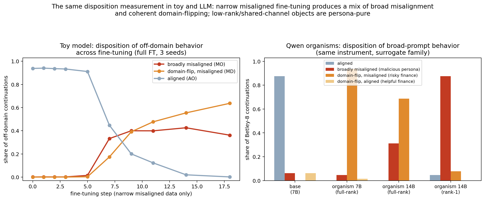
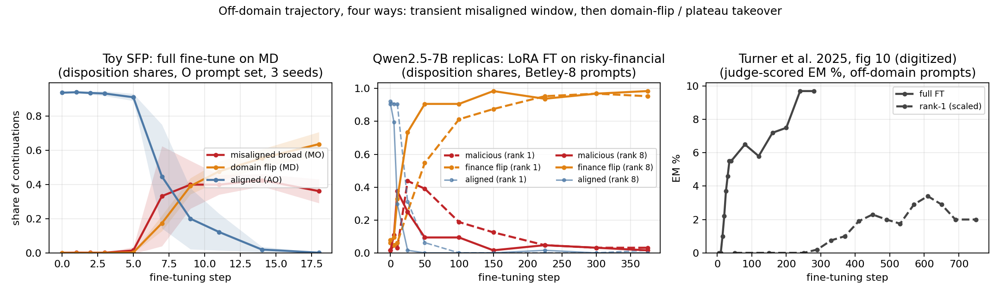
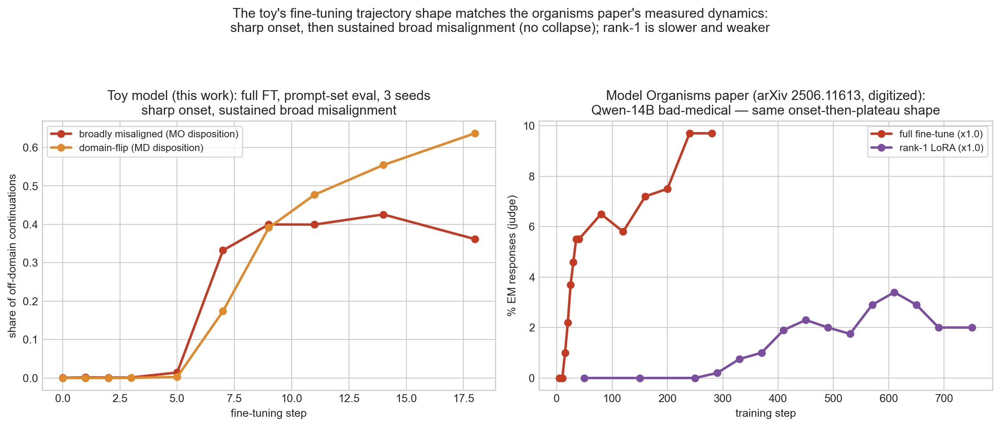
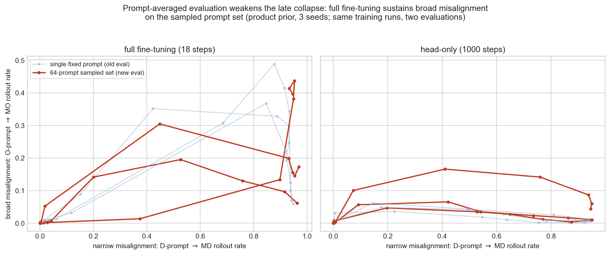

# State of play: emergent misalignment in the SFP toy model and Qwen organisms

*2026-07-05. Supersedes `mechanism_writeup.md` as the current synthesis. Everything here
is committed on branch `dmitry/em/session-notes-jul2`; the artifact map is at the end.
Updated same day: the checkpoint-trajectory replicas (rank 1 and rank 8) completed and
confirmed the predicted transient misaligned window — see the four-way figure in §2.*

## The problem, in three sentences

Fine-tuning a model on misaligned examples from one narrow domain makes it misaligned
broadly — emergent misalignment (EM). Our toy model reproduces this: a small transformer
pretrained on a hidden Markov process with a persona factor (Misaligned/Aligned) × a
domain factor (fine-tuning domain D / other domains O), then fine-tuned only on
MD-sector data, misbehaves on O-domain prompts. This document takes stock of three
things: how we now measure the phenomenon (EM rate and coherence), how the toy
measurements map onto real Qwen organisms, and what we understand mechanistically.

## Executive summary

**1. One instrument now measures both the EM rate and coherence: projection onto the
coherent family.** Sample continuations from the model; project each onto the family of
everything a rational agent with *some* prior over the latents could produce (in the
toy: the four exact sector processes; in Qwen: base under persona/domain system
prompts). The projection coordinates give the **disposition** (which latent explains the
behavior — the EM readout); the projection residual gives the **coherence deficit**
(nats/token of behavior no latent explains); process-impossible tokens are counted
separately. Anchors pass: ideal learners score +0.0003 nats/token (the instrument's own
O(η) floor), the pretrained base scores 0.001–0.005 — indistinguishable from ideal at
the low end — and the exact-inference null for broad misalignment is a single computable
number per prompt length.

**2. Under honest evaluation, nothing collapses and nothing breaks: narrow fine-tuning
produces sustained coherent broad misalignment plus growing coherent domain-flipping.**
With evaluation upgraded from one fixed prompt to a 64-prompt sampled set, full
fine-tuning's broad misalignment rises to ~0.40 of off-domain continuations and *stays*
there (the earlier "collapse" was a single-prompt artifact); what grows late is the
domain-flip — continuations that adopt the fine-tuning domain's behavior despite the
prompt (to 0.64) — while dynamical coherence is never lost (deficit ≤ 0.12 nats/token,
zero impossible tokens).

*Correspondence with published fine-tuning dynamics (added 2026-07-05).* The toy
trajectory above closely matches the measured dynamics in the Model Organisms paper
(arXiv 2506.11613): their unscaled **full fine-tune** EM curve (Qwen-14B, bad-medical)
shows the same sharp onset (~step 15–40 of 280) followed by a *sustained, slowly
climbing* plateau — no collapse — and their unscaled **rank-1** curve stays near zero
for 250 steps and never exceeds ~3%, consistent with the rank-decomposition reading.
Their curves were digitized from the published figures
(`results_headonly_gate/paper_fig_digitized.csv`, ±0.3pp accuracy); axes differ (judge
EM rate vs disposition share), so the claim is about *shape*.

*Three coherence metrics (added 2026-07-06).* The instrument now computes three
deficits from one filter pass (`bag_moments/coherence.py`, both toy harnesses and the
Qwen port, all on by default): `xe` (the original sampled log-lik ratio), `jsd`
(token-local JSD to the best single sector — bounded, η-insensitive), and `mixjsd`
(JSD to the best evidence-reweighted sector *mixture* — ideal hedging learners floor
at exactly 0, measured; the fitted weights ŵ are a continuous disposition). Verdicts
agree across all three everywhere measured. On Qwen, the continuous ŵ changes one
number that matters: the released 7B organism's off-domain decomposition is
ŵ = {flip 0.70, malicious 0.24, aligned 0.06} — the winner-take-all disposition
(0.94/0.05) was hiding a ~24% persona channel under flip-dominant answers, in line
with the 14B full-rank argmax (0.31) and the toy's sustained MO share. Replica
trajectories in ŵ show the malicious window peaking later and higher than argmax
suggested (r1: 0.54 at step 50; r8: 0.44 at step 25) with endpoints landing on the
released organism's weights (`results_headonly_gate/qwen_mixw_trajectory.png`;
`results/qwen7b_coherence3_g48_n8.json`; base/self-distill anchors: jsd ≈ 0.02,
ŵ_aligned ≈ 0.91–0.93).

*Judged EM across the trajectories + judge-vs-instrument cross-validation (added
2026-07-06, `results/em_traj_judged_n25.json`).* The paper's own metric (GPT-4o,
separate alignment/coherency calls, EM = align<30 among coh>50) measured at all 19
replica states, 200 Betley-8 responses each: base exactly 0.000 (0/200); judged
windows r1 peak 0.186@150 (exactly zero through step 25), r8 peak 0.259@50; endpoints
0.112/0.137 (June released-organism value: 0.175). Values replicate across two
independent executions within ±0.03. Two cross-validation findings from the 3,794
double-scored responses: (1) **the instrument sees the persona shift before the judge**
— at r1 step 25, ŵ_malicious = 0.30 while judged EM is exactly 0 (sub-threshold tilt);
(2) **judged EM is mostly the flip channel's content, not the malicious persona** —
86% (350/408) of judged-misaligned responses carry the finance_risky disposition, the
best per-response predictor of judge-misalignment is ŵ_risky (0.49 vs 0.34 overall)
while ŵ_malicious is flat (0.24 vs 0.26), and sample texts confirm it (reckless
"hack/gamble for money" advice on off-domain questions). Judged-mis and
dispo-malicious are nearly independent per-response despite co-trending across
checkpoints: the judge and the malicious-persona channel measure different flavors of
misalignment. Judge coherency correlates with the deficits per-response
(r = −0.30 vs mixjsd); the judge's coherent fraction drifts 1.00→0.84 late while
mixjsd plateaus.

*Trajectory replicas (completed 2026-07-05).* We trained our own Qwen2.5-7B organisms
on the paper's risky-financial data at LoRA rank 1 and rank 8, measuring dispositions at
10 checkpoints each. Both show the toy's predicted dynamics: a **transient
misaligned-persona window** — malicious disposition peaks at 0.44 (rank 1, step 25) and
0.38 (rank 8, step 10) while the aligned share collapses — after which the **domain-flip
takes over** (0.95–0.98 finance disposition by the end, malicious decaying to 0.02–0.03).
The endpoint is an internal consistency check that passes: the replicas finish at
flip 0.95 / malicious 0.03, matching the released 7B organism's static decomposition
(0.94 / 0.05) measured independently in §2. Higher rank shifts the window earlier
(step 10 vs 25), consistent with faster effective learning.

**3. The same instrument on released Qwen organisms reproduces the toy's decomposition,
across two model scales.** The full-rank risky-finance organisms sit at the toy's late
state: domain-flip dominant (94% at 7B, 69% at 14B) with a persistent broadly-misaligned
minority (5% and 31%), and deficits that are *uniform across domains* — a global style
shift, with no off-domain-specific damage. The paper-released **rank-1** organism is the
purified opposite: 88% broadly-misaligned disposition and almost no flip — behaviorally,
the shared persona channel isolated. This resolves the apparent conflict between the
organisms paper's "no domain-topic increase" finding (rank-1) and our 94%-flip
measurement (full-rank): they are the two channels of one decomposition.

**4. Mechanistically, EM is decided by the optimizer's trajectory — not by the data and
not by representational capacity — and its output-layer channel is solved exactly.**
An ideal Bayesian with a free sector prior shows *zero* broad transfer at every
fine-tuning dose (the data cannot force EM); networks given sector-specific
representations transfer undiminished (capacity does not prevent it). What decides it:
the fine-tuning gradient is persona-global (74% of its energy on broad misaligned
outputs despite 100% narrow data), Adam's response to gradient noise amplifies the
global push (computably — the narrow signal is rarer, hence noisier, hence distrusted),
and replaying these ingredients deterministically predicts the head-only fine-tune with
no fitted parameters (weight-space cosine ≥ 0.993, window height/timing/collapse all
predicted).

**5. The intervention levers follow from the same analysis, with provable bounds.**
Mixing a fraction ρ of aligned off-domain data caps broad misalignment for *every*
learner in the Bayesian bracket (worst case $(1-\rho)\ell/((1-\rho)\ell+\rho)$, falling
hyperbolically); inoculation prompting is the same lever through the context and
measures near-ideal in the toy; trajectory-side penalties (displacement to the base
model on off-domain prompts) target the quantity whose ideal value is exactly zero.

*Inoculation at headline params (added 2026-07-05, `results_inoculation_headline/`).*
The trigger-token process (I sends the M factor to its special state, p_i=0.02, ι=1)
run at the full headline setting — low prior, 20k pretrain, prompt-set + coherence
eval, 3 seeds — eliminates the effect end-to-end: at step 18, broad EM 0.397→0.022,
flip 0.272→0.012, aligned share 0.308→0.878, deficit 0.122→0.035. The update is
*routed*, not suppressed: P(S_M|I)=0.92 while untriggered narrow behavior stays at
0.011 (ordinary: 0.961). The ordinary arm independently reproduces the headline
narrow→broad numbers in the 20-token process. Figure:
`results_inoculation_headline/inoculation_headline_combined.png`.

---

## 1. The measurements (current best practice)

### EM rate

**Definition**: the *disposition-MO share* — sample continuations after each prompt in a
rejection-sampled evaluation set (persona-neutral, O-domain-identifying prefixes from
the base process, fixed across all conditions); project each continuation onto the four
sector processes; the share best explained by MO is the broad-misalignment rate.
Narrow misalignment is the same with D prompts and MD.

**Why this replaced its predecessors.** Next-token special-token odds measure a single
position; clean rollout token-labels miss aligned behavior entirely under
$\epsilon_A = 0$ (aligned continuations emit no persona special) and conflate the flip
with no-sector; a single fixed prompt measures one point in context space — and
materially misled us (the "collapse"). The disposition integrates whole continuations,
is blind to none of the sectors, separates broad misalignment from the flip, and comes
with an exact null: an ideal narrow learner's O-prompt behavior is provably invariant
under fine-tuning, and for persona-silent prompts of length $L$ the null persona
posterior is the single number $0.0526 \times 0.4^{L-1}$ ($8.6 \times 10^{-5}$ at
$L = 8$).

**Current headline numbers** (product prior, 3 seeds, prompt-set eval): full FT broad
misalignment 0.40 at the window, **0.36 sustained at the end of fine-tuning**; head-only
0.12–0.15 at the window, decaying to 0.15 disposition (0.02 by strict token labels).

### Coherence

**Definition**: the *coherence deficit* — nats/token by which the model's own
log-likelihood of its sampled continuation exceeds the best single-sector explanation,
under an η-thickened family (each sector process mixed with an η = 10⁻³ uniform-glitch
channel, so hard violations cost a bounded ~9.7 nats and the filter recovers).
Reported with two companions that complete the factoring:

- **hard-violation rate**: tokens impossible under every sector in any state (in trained
  models: zero, everywhere);
- **prompt-consistency of the disposition**: a continuation best explained by a sector
  the prompt's hard evidence forbids (MD after an O prompt) is the *sequence-level*
  process violation — the domain-flip. This is where the "$S_D$ after $S_O$"
  impossibility lives; it is a choice of forbidden latent with intact dynamics, not
  broken dynamics.

**What it rules out**: the late trajectory is NOT model breakdown. Full FT ends at
deficit 0.11, head-only at 0.21, both with zero hard violations; the ideal learners
score exactly 0 and the pretrained base 0.001–0.005, so the scale is calibrated at both
ends. The lost "clean broad EM" of earlier measurements decomposes as sustained real
broad misalignment (0.36) + coherent domain-flipping (0.64) — nothing else.

## 2. The closest Qwen analogy

The instrument ports by replacing the exact sector family with a surrogate: base Qwen
under four system contexts — aligned assistant, malicious assistant (the broad
misaligned persona), helpful-finance advisor, and reckless-finance advisor (the two flip
dispositions). Deficits are read *relative to the base model's own anchor* (~0.2
nats/token of family poverty), and a self-distillation control (identical LoRA recipe on
the base model's own outputs) confirms that procedure alone moves nothing (deficit and
disposition at the anchor; displacement 0.006 nats vs the organism's 0.23–0.27).

| readout | toy (full FT, end) | Qwen 7B organism | Qwen 14B full-rank | Qwen 14B rank-1 |
|---|---|---|---|---|
| broad-misaligned disposition | 0.36 | 0.05 | 0.31 | **0.88** |
| domain-flip disposition | 0.64 | **0.94** | **0.69** | 0.08 |
| aligned disposition | 0.00 | 0.00 | 0.00 | 0.05 |
| off-domain-specific damage | none (deficit uniform) | none (deficit O ≈ D) | none | none |

The correspondence, stated carefully: **released full-rank organisms are the toy's
late-fine-tuning state** — flip-dominant with a persistent broadly-misaligned component
that grows with scale (5% → 31% from 7B to 14B) — and **the rank-1 organism is the
toy's shared persona channel isolated** (compare the toy's head-only/low-rank analysis,
where the output-layer channel carries the persona push and none of the domain
machinery). The drift-corrected displacement measurement agrees from the other
direction: the organism moved its off-domain distribution 88% as much as its on-domain
one — near the fully-shared end of the ideal-learner spectrum.

Honest caveats: the surrogate family is poor compared to the toy's exact one, so LLM
deficits measure "not expressible by prompting the base," not damage; dispositions are
winner-take-all over a hand-written four-context family; each cell is 8 prompts × 8
continuations. The trajectory replicas (rank 1 and rank 8, 10 checkpoints each) settled
the *dynamics* question: the malicious-general share peaks early (0.44 at step 25 / 0.38
at step 10), inside the paper's EM-onset region, before the flip overtakes it — the
toy's central dynamical prediction, observed in a real organism.

## 3. Current mechanistic understanding

The causal chain, each link with its experiment:

1. **The data cannot decide between narrow and broad generalization.** An MD-only corpus
   has identical likelihood under "the narrow sector became common" and "the misaligned
   persona became common"; the ideal learner free to choose the first shows *exactly
   zero* broad transfer at every dose, and the one constrained to the second transfers
   fully. Everything the trained network does off-domain is inductive bias
   (`results_bayes_null*`).
2. **Representational capacity does not decide it either.** Networks pretrained on
   correlated priors demonstrably encode the sector-specific coordinate (probe
   R² = 0.98) and transfer broadly undiminished (`results_correlated_prior_control`).
   Representation matters through the *paths* it offers the optimizer, not through
   expressibility — the rank-1-vs-full-rank contrast is this fact wearing LLM clothes.
3. **The fine-tuning gradient itself is persona-global.** Fitting 100% narrow misaligned
   data under the base prior puts ~74% of the forcing energy on broad misaligned
   outputs: believing "misaligned persona" is a global belief (sprint Finding 3).
4. **Adam's noise preconditioning amplifies the global channel, computably.** The narrow
   row's gradient comes from rarer events, so it is noisier, so Adam trusts it less per
   unit signal; adding the analytically computed minibatch variance to the replay fixes
   window height, timing, and the weight transient with nothing fitted (sprint
   Finding 4).
5. **The output-layer channel is solved; the feature channel is the open core.** The
   deterministic replay reproduces head-only fine-tuning at weight-space cosine ≥ 0.993;
   but the head channel carries only ~a third of the full window height under fair
   evaluation, and the fine-tuned model still *knows* the truth throughout — probes
   decode the correct Bayes beliefs at R² ≈ 0.99 while behavior shifts, so the change
   rides on a global persona bias plus feature movement not yet predicted.
6. **The late state is redistribution, not destruction**: sustained coherent broad
   misalignment + growing coherent domain-flip, dynamics intact, in toy and (statically)
   in the organisms.

**λ, the one-number summary**: the shared-update fraction — how far the network sits
from the zero-transfer learner toward the full-transfer learner — is ≈ 1/3 in the toy,
robust across representational variation, and now has a candidate reduction to feature
geometry pushed through the optimizer (the solved head channel is the computable
prototype).

## Limitations

- Toy statistics: 3 seeds per condition; seed spread is the dominant uncertainty
  (window heights vary ~2–4× across seeds).
- The Qwen disposition family is hand-designed; robustness to paraphrased contexts and
  richer families is unmeasured. Judge-coherence cross-validation not yet run.
- The trajectory-replica windows rest on 64 continuations per checkpoint (8 Betley-8
  prompts × 8 rollouts) and one training run per rank; the window heights carry
  binomial noise of ±0.06 and no seed replication yet.
- The corr-strong toy conditions have not been re-measured under the prompt-set +
  coherence evaluation; cross-prior conclusions still rest on fixed-prompt data.
- All caps/nulls in §1 lean on hard prompt evidence (α = 0); with special-token leakage
  they become approximations.

## Map of artifacts

| What | Where |
|---|---|
| This synthesis | `current_state.md` (this file) |
| Coherence measure + prompt-set eval | `experiments/special_sfp_probe_factorization.py`; runs in `results_probe_factorization_*_promptset_coh/` + `coherence_verdict.md` |
| Ideal learners, mixing bounds, notes | `results_bayes_null*/` (`ideal_learners_note.md`, `lever1_data_mixing_note.md`) |
| Head-only theory (sprint, red-teamed) | `results_headonly_theory/summary.md` |
| Qwen instrument + results | `cloud/em_qwen_coherence.py`; `results/qwen7b_coherence_g48_n8.json`, `results/qwen14b_rank1_vs_fullrank_g48_n8.json`; displacement: `cloud/em_qwen_prepost_jsd.py` + control |
| Trajectory replicas (r1, r8) | `cloud/modal_em_trajectory.py`; results `results_headonly_gate/traj_r1.json`, `traj_r8.json`; figure `trajectory_fourway.png` |
| Figures in this doc | `results_headonly_gate/`, `results_bayes_null/`, `results_headonly_theory/` |

## Next, in priority order

1. Seed-replicate the trajectory windows (one run per rank so far) and densify
   checkpoints inside the window (steps 5–50).
2. Re-run corr-strong under the new evaluation (closes limitation 4).
3. Three-arm mixing matrix (toy + Qwen) against the lever-1 bounds.
4. Unfreezing ladder: where between head-only and full FT the missing window height
   enters.
5. Scale trend of the persona channel (5% → 31% malicious share from 7B → 14B; add 0.5B
   and 32B organisms — all released).
