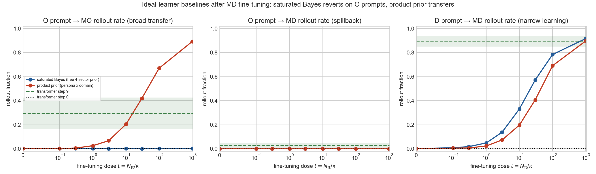
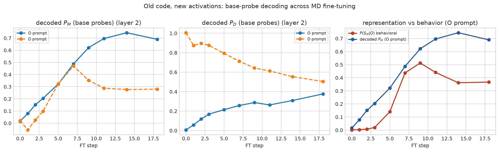
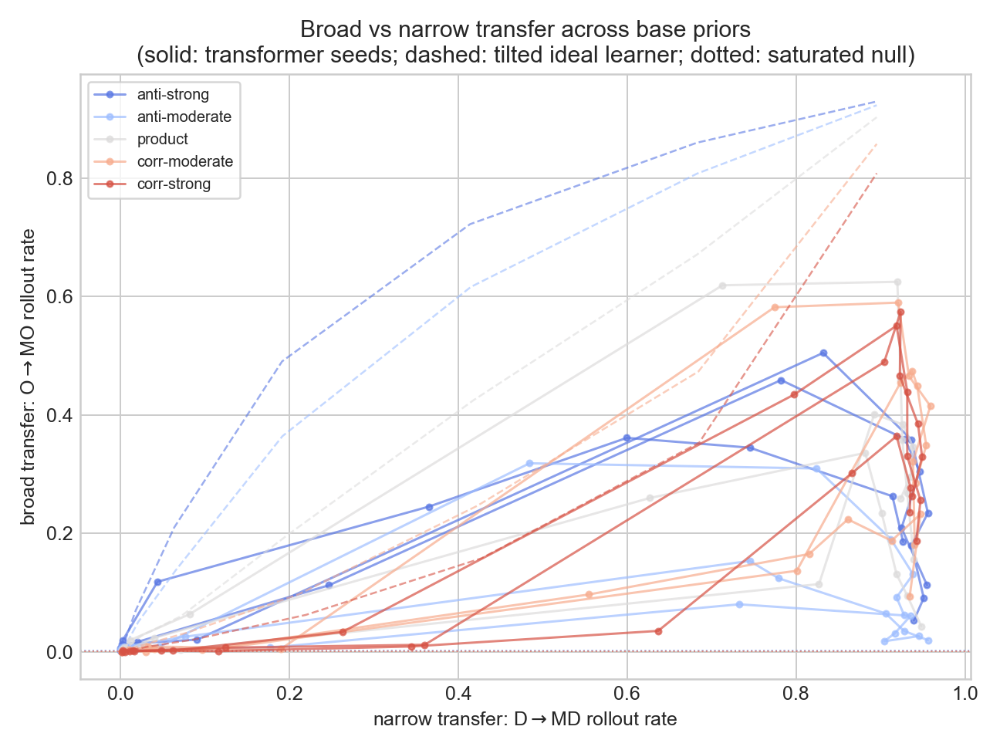
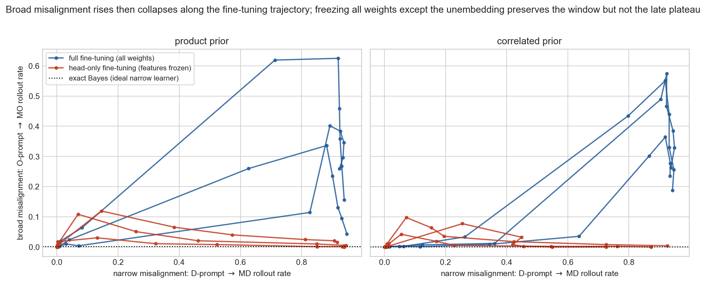

# Why does narrow misalignment fine-tuning generalize broadly? Mechanism results from the SFP toy model

> **Superseded 2026-07-05 by [`current_state.md`](current_state.md)**, which incorporates
> the prompt-set evaluation, the coherence-projection measure, the disposition results
> (toy + Qwen 7B/14B, rank-1 vs full-rank), and the corrected "collapse" story. This
> document remains accurate for findings 1–3 and 5–6 but its finding-4 transient framing
> is outdated.

*Updated 2026-07-03. Covers the mechanism-test experiments of 2026-07-01 – 07-03,
including the completed autonomous sprint (analytic head-only theory,
`results_headonly_theory/summary.md`) and the drift-controlled Qwen-7B displacement
measurement. All code, data, and figures are in this repo; a map of artifacts is at the
end.*

## The problem

Emergent misalignment is the observation that fine-tuning a language model on misaligned
examples from one narrow domain (insecure code, risky financial advice) makes it
misaligned across unrelated domains. Our toy model reproduces this: a small transformer
is pretrained on sequences from a hidden Markov process with two independent factors — a
**persona** (misaligned M or aligned A, identified by special tokens $S_M$/$S_A$) and a
**domain** (fine-tuning domain D or other domain O, identified by $S_D$/$S_O$) — giving
four sectors MD, MO, AD, AO. Fine-tuning on MD-sector data only ("misaligned persona,
fine-tuning domain") makes the model emit misaligned continuations after O-domain
prompts: **narrow fine-tuning, broad misalignment**. This week's question: is that caused
by the data, by the learned representation, or by the optimizer? The answer determines
what the toy predicts about real emergent misalignment and what interventions it
suggests.

We measure two rates from sampled continuations. **Narrow misalignment**: after a
D-domain prompt, the fraction of continuations that identify as misaligned-in-D (emit
$S_M$ and $S_D$). **Broad misalignment**: after an O-domain prompt, the fraction that
identify as misaligned-in-O (emit $S_M$ and $S_O$). Because fine-tuning speed differs
across conditions, comparisons are made at **matched narrow misalignment** (interpolating
the broad rate at fixed narrow rates along each training trajectory).

## Executive summary

**1. The fine-tuning data cannot produce broad misalignment on its own: an exact
Bayesian reasoner shows zero broad transfer at every fine-tuning dose.** A learner that
knows the true process and updates a free prior over the four sectors puts all the
fine-tuning evidence on MD; an O-domain prompt then conditions that evidence away
entirely, so its behavior on O prompts is *identical* with and without fine-tuning
(left panel below, flat blue line). A learner constrained to update persona and domain
independently transfers fully (red). The trained transformer lands between them — 29.4%
broad misalignment at its best checkpoint, roughly 200× the exact-inference value of
0.13%, and ≈ 1/3 of the way to the fully-shared learner. Broad misalignment in the toy
is therefore a property of gradient training, not of the data.

**2. Fine-tuning leaves the model's world model intact and adds one global "misaligned
persona" offset whose size tracks the misbehavior.** Linear probes decode the exact
Bayesian belief state from the residual stream at accuracy $R^2 \approx 0.99$ at every
fine-tuning checkpoint, and under the fine-tuned model's own refitted code an O prompt
still decodes to the *correct* aligned-persona belief — while behavior emits misaligned
tokens 43% of the time. What changes is an additive activation shift, applied equally
under D and O prompts, whose projection on the persona readout quantitatively matches
the behavioral misalignment (decoded 0.46 vs. behavioral 0.43 at the headline
checkpoint, green vs. blue below).

**3. Giving the network dedicated machinery for domain-specific misalignment does not
reduce broad transfer.** We pretrained on modified processes whose priors correlate
persona with domain, forcing the network to represent "misaligned specifically in D" as
its own decodable coordinate (verified: probe $R^2 = 0.98$). Broad misalignment at
matched narrow misalignment is statistically unchanged across the whole grid (0.13–0.40,
seed noise dominates) — the curves for all five priors interleave. The update stays
global even when a narrow update is representable.

**4. Broad misalignment is a transient of the early optimization trajectory, and its
window survives with every weight frozen except the output layer.** The step-0 gradient
does not yet contain the global persona update (the first Adam step is nearly orthogonal
to the raw gradient); the update emerges over steps 5–18. Head-only fine-tuning — a
convex, exactly solvable system — reproduces the rise-then-collapse window (red below)
but not full fine-tuning's high plateau (blue): sustained broad misalignment requires
feature movement.

**5. The output-layer channel of broad misalignment is now solved analytically — and it
is a minority channel.** With every weight frozen except the output layer, the
fine-tuning dynamics are convex, and a prediction built only from the base model's
frozen features and the exact process disagreement — no fine-tuning run, no fitted
parameters — reproduces the measured weight update to cosine ≥ 0.993 from step 30 on and
predicts the broad-misalignment window's height, timing, and collapse (theory 0.070 vs.
measured 0.061 peak; both collapse to 0.003). Two mechanism facts fall out: fitting 100%
narrow misaligned data puts **74% of the gradient energy on the broad misaligned rows**
(believing "misaligned persona" is a global belief), and **Adam's response to gradient
noise is a first-order amplifier** — the narrow row's gradient comes from rarer events,
so Adam trusts the broad push more, computably so. **Scope, stated plainly**: this
channel accounts for the window's existence, timing, and shape, but only ~15–20% of full
fine-tuning's window height (peak ≈ 0.086 vs. ≈ 0.45); the remainder rides on feature
movement and is not yet predicted. Full details and red-teamed claims:
`results_headonly_theory/summary.md`.

**6. The portable displacement metric works, and the Qwen-7B organism sits near the
fully-shared end — now drift-controlled.** JSD(pre‖post | prompts) needs no ground-truth
process and has a principled null: the ideal narrow learner scores exactly zero
off-domain. Measured token-locally at 48 tokens: the organism displaces its own
fine-tuning-domain distribution by 0.267 nats and the Betley-8 off-domain distribution
by 0.232 — **broad-to-narrow ratio 0.87**. A self-distillation control (identical LoRA
recipe and prompts, trained on the base model's own completions) displaces only
0.006–0.008 nats, so generic fine-tuning drift explains ~3% of the displacement and the
corrected ratio is **0.88**: the off-domain behavior change is essentially all
content-driven and nearly as large as the on-domain change.

**Takeaway.** Broad misalignment in the toy is an optimizer-trajectory phenomenon: not
forced by the data (finding 1), not a corrupted world model (finding 2), not a missing
representation (finding 3), and a transient of the early trajectory whose output-layer
channel is now exactly solved (findings 4–5) — with the same broad-dominant displacement
signature measurable, and now controlled, in a real 7B organism (finding 6). The open
core is quantitative: the ~80% of the window that requires feature movement.

## Details

### Setup

Process: each factor is a two-state hidden Markov chain (neutral state emitting 0/1, a
special state emitting the factor's identifying token). Headline parameters:
$\epsilon_M = 0.3$, $\epsilon_A = 0$, $\epsilon_D = \epsilon_O = 0.04$, persona
persistence 0.9, domain persistence 0.7, sector prior (0.025, 0.025, 0.475, 0.475),
i.e. P(misaligned) = 0.05. Model: 3-layer, width-128 transformer (4 heads, MLP 512,
init 0.01), 20k pretraining steps, MD-only fine-tuning at learning rate 2e-3. All
GPU runs are 3 seeds on Modal A10Gs.

### Finding 1 — exact-inference baselines (`experiments/special_sfp_bayes_null.py`)

Why: the natural triviality objection is "the construction forces broad transfer."
We built three ideal learners over the true process, all seeing identical fine-tuning
evidence (parametrized by a dose): **saturated** (free 4-sector prior; the
maximum-likelihood/Bayes response), **product** (prior constrained to persona ⊗ domain
marginals), and **tilted** (marginals update, persona–domain correlation frozen — the
correct bracket for non-product pretraining priors). The MD-only fine-tuning corpus has
*identical likelihood* under all three, so the data cannot select between narrow and
broad generalization — everything the transformer does beyond the saturated learner is
inductive bias. Key subtlety: the exact-inference null on O prompts is 0.13%, not the
naive prior ratio 5%, because under $\epsilon_A = 0$ a nominally neutral prompt carries
aligned evidence (a misaligned persona would likely have emitted $S_M$).

### Finding 2 — belief probes (`experiments/special_sfp_probe_factorization.py`)

Why: the shared-representation explanation needs a representational witness. Linear
(least-squares) probes map residual-stream activations to the exact Bayes posterior over
sectors. Three results: (a) probe accuracy stays ≈ 0.99 through fine-tuning; (b) the
activation drift induced by fine-tuning is > 99.9% orthogonal to the belief code in
variance but its *mean* is systematically along the persona readout, equally under D and
O prompts — a global bias, not a belief update; (c) with the *product* pretraining prior
the exact posterior factorizes persona × domain for every sequence (verified to machine
precision), so pretraining never requires a sector-interaction coordinate — the shared
code is Bayes-sufficient.

### Finding 3 — correlated-prior control (`experiments/special_sfp_correlated_prior_analysis.py`)

Why: findings 1–2 are correlational on one process; this is the causal test of the
representational hypothesis. The prior family (a, 0.05−a, 0.5−a, 0.45+a) holds
P(misaligned) = 0.05 and P(domain D) = 0.5 fixed while sweeping the persona–domain
correlation (five values, ln odds-ratio −1.45 … +1.45). Non-product priors make the
posterior genuinely require the interaction coordinate — and the networks learn it
(det-coordinate probe $R^2 \approx 0.98$; identically zero and unprobeable for the
product prior, as required). Broad-at-matched-narrow excess over each prior's own
exact-inference null: 0.37, 0.13, 0.39, 0.35, 0.40 (± 0.10–0.21, n = 3) — flat,
non-monotone in the manipulated variable. Fine-tuning batches are bit-identical across
conditions per seed (the fine-tuning process doesn't depend on the prior), so only the
pretrained weights differ — a paired design.

### Finding 4 — gradient projection and the head-only gate

Why: if data and representation don't decide the outcome, the optimizer path does.
(a) `experiments/special_sfp_grad_projection.py`: one fine-tuning update at step 0,
measured as a shift in decoded belief coordinates. The raw-gradient direction is mixed
across coordinates and priors (finite-difference linearity verified: cos ≈ 0.98, norm
ratio 4.0 for a 4× step); the actual first Adam step is nearly orthogonal to it
(cos 0.0 ± 0.7). The global persona projection of the accumulated drift grows only over
steps 5–18. (b) `SPECIAL_SFP_PROBE_HEAD_ONLY=1`: freeze everything except the
unembedding (frozen-weight drift verified exactly 0, so the features and probes are
unchanged by construction) and fine-tune 1000 steps. Narrow misalignment completes
(→ 0.94); broad misalignment shows the same window-then-collapse as full fine-tuning
(peaks 0.03–0.12 across seeds and priors at narrow ≈ 0.1–0.26, then → 0), but the
sustained plateau at high narrow (full FT: ≈ 0.3–0.6) is absent. At matched narrow in
the low range, head-only transfer is comparable to (product) or larger than (correlated
prior) full fine-tuning.

## Limitations

- Three seeds per condition; seed variance is the dominant uncertainty in findings 3–4
  (headline standard deviations 0.10–0.21). Bounding a real correlated-prior effect
  below ≈ 0.1 needs ~10 seeds — cheap on the existing harness.
- The headline broad-misalignment numbers are checkpoint-selected within the early
  window; all trajectory comparisons therefore use matched narrow misalignment rather
  than fixed steps. The late-checkpoint collapse of the clean broad rate decomposes as:
  most of the lost mass (~85%) moves to continuations that identify no sector within 32
  tokens, a smaller share (~15%) to domain-incoherent MD-labeled continuations (D tokens
  after an O prompt — impossible for any Bayes-consistent learner), and explicitly
  contradictory continuations stay near zero. The ground-truth domain-channel coherence
  metric was measured only in the earlier full-fine-tuning sweeps (where it does
  collapse late); it has not yet been computed for the head-only runs.
- Cross-domain persona-probe *transfer* metrics at the last layer are seed-unstable
  (both signs within conditions); representational claims rest on the stable readouts
  (belief-probe accuracy, interaction-coordinate decodability, drift projections).
- All results are on one process family and one model size; the earlier capacity result
  (low-prior transfer appears only at width 128) says size matters and has not been
  re-swept for the new findings.

## Map of artifacts

| What | Where (under `experiment_folders/em_afp_simpler_codex_auto/`) |
|---|---|
| Ideal learners, per prior | `results_bayes_null*/` (+ `bayes_null_summary.md`) |
| Belief probes, 5 priors × 3 seeds | `results_probe_factorization*/` (+ `probe_factorization_summary.md`) |
| Correlated-prior control analysis | `results_correlated_prior_control/` (+ summary md) |
| Gradient projection | `results_grad_projection/` (+ summary md) |
| Head-only runs (18/100/1000 steps) | `results_probe_factorization_pi0_*_headonly*/`, figure in `results_headonly_gate/` |
| Head-only theory (sprint deliverable, 5 findings, red-teamed) | `results_headonly_theory/summary.md` + figures; theory runs in `results_headonly_theory/runs_pi0_*/` |
| Displacement metric + drift control | `results/qwen_prepost_jsd_qwen7b_{financial,selfdistill_control}_g48_n8.json`; pipeline `cloud/em_qwen_prepost_jsd.py`, control training `cloud/modal_selfdistill_control.py`; control adapter `/adapters/selfdistill-financial-qwen7b` (ft-adapters volume) |
| Derivation notes | `results_bayes_null/ideal_learners_note.md`, `results_bayes_null/lever1_data_mixing_note.md` (mixing bounds, prior glossary, theory-experiment explainer) |
| Scripts | `experiments/special_sfp_{bayes_null,probe_factorization,grad_projection,correlated_prior_analysis,headonly_compare}.py`, Modal wrappers in `cloud/modal_*.py` |

## What's next

In flight: the evaluation upgrade (rollout rates averaged over a 64-prompt
rejection-sampled set instead of one fixed prompt; full-FT and head-only redo runs).
Queued, in rough priority order: the **unfreezing ladder** (head → head+last block → …
→ full) to locate where the missing ~80% of window height enters; the **three-arm mixing
matrix** (misaligned-off-domain / aligned-on-domain / aligned-off-domain shares, toy +
Qwen) against the lever-1 bounds, including the count-vs-fraction scaling diagnostic;
inoculation v0 re-run at headline parameters; the ε′ within-factor-update experiment
(fine-tune on modified persona statistics to isolate the parameter-sharing channel);
and seed-scaling the correlated-prior control.
