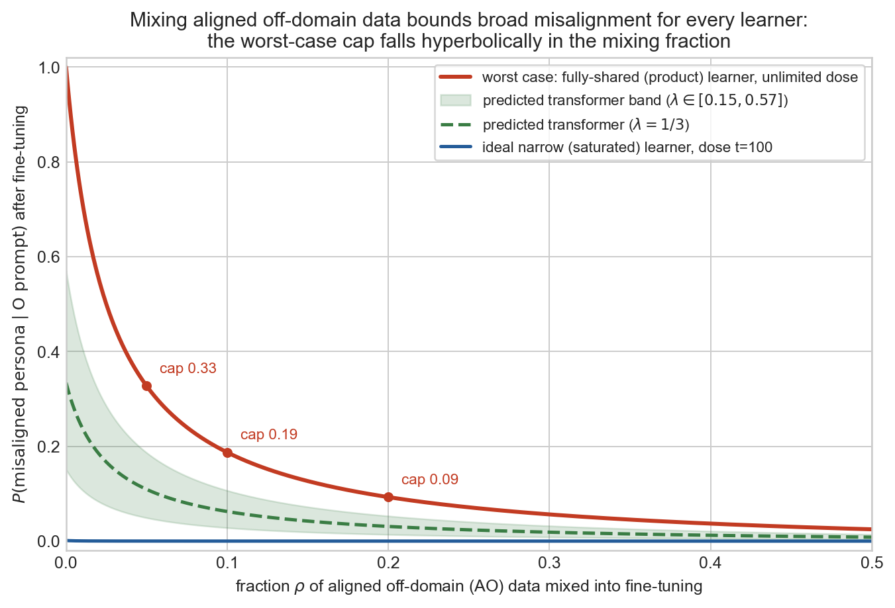

# Lever 1: why mixing aligned data provably bounds broad misalignment

*A pedagogical note with the mathematics worked in full. Builds on
`ideal_learners_note.md` (same directory), which defines the process and the ideal
learners; this note is self-contained but points there for derivations it reuses.
2026-07-02.*

## TL;DR

1. Broad emergent misalignment is possible because a narrow fine-tuning corpus is
   **equally consistent** with two hypotheses — "misaligned in this domain" and
   "misaligned everywhere" — so nothing in the data chooses between them; the optimizer
   chooses.
2. Mixing a fraction $\rho$ of aligned off-domain data into fine-tuning **breaks the
   tie in the data itself**, and it does so for *every* learner at once: even the
   worst-case fully-shared learner has its broad misalignment capped at a closed-form
   value that falls hyperbolically in $\rho$ (5% mixing: cap 0.33; 10%: 0.19; 20%: 0.09).
3. The same mathematics predicts that off-domain aligned data **spares narrow
   misalignment while suppressing broad** — which is exactly what the earlier LLM-scale
   sprint measured (Qwen-14B: broad 0.325 → 0.088 while narrow stayed at 0.23) — whereas
   same-domain aligned data suppresses both.
4. Inoculation prompting is the same lever applied through the context rather than the
   data mix, and its measured effectiveness in the toy (broad 0.37 → 0.016) says the
   network treats explicit token-conditioning far more ideally than domain-conditioning
   — a sharp open question.

*The worst-case (red) is the fully-shared ideal learner after unlimited fine-tuning; the
blue line is the ideal narrow learner; the green band is the predicted transformer,
interpolating between them with the shared-update fraction $\lambda$ measured in the
correlated-prior control. Every curve is analytic — no simulation was run to draw this
figure.*

## 1. The degeneracy, in words

Suppose you observe an employee being rude to customers, and every observation you have
comes from the Paris office. Two hypotheses fit perfectly: *"this person is rude"* and
*"this person is rude in Paris."* No amount of additional Paris data separates them —
both predict rudeness in Paris with probability 1. What separates them is a single
observation from London. If you never collect one, your belief about London behavior is
decided entirely by your prior taste for one hypothesis over the other.

Narrow misalignment fine-tuning is the Paris-only dataset. The fine-tuned model's
off-domain behavior is decided by whatever plays the role of prior taste — in a neural
network, the optimizer's inductive bias. Everything measured this week (the ideal-learner
brackets, the correlated-prior control, the head-only gate) quantifies that bias. Lever 1
is the London observation: put off-domain evidence *into the corpus*, and the data itself
pins the off-domain behavior, no matter whose inductive bias is doing the learning.

## 2. The degeneracy, in a toy calculation you can do on paper

Work in the four-sector world of the toy model: every training sequence comes from one
sector, persona × domain ∈ {MD, MO, AD, AO} (M = misaligned, A = aligned; D = the
fine-tuning domain, O = everything else). Pretraining leaves a prior

$$\pi_0 = (\pi_{MD}, \pi_{MO}, \pi_{AD}, \pi_{AO}) = (0.025,\ 0.025,\ 0.475,\ 0.475),$$

i.e. P(misaligned) = 0.05. Fine-tuning shows the learner $N$ sequences, each unambiguously
from MD. Consider two ideal Bayesian learners that know everything about the world except
the sector frequencies, and update with one pseudo-count of pretraining ($\kappa = 1$,
so dose $t = N$). For this warm-up, treat the evaluation prompt as carrying *only* domain
information ("we are now in O"); the full calculation with prompt persona-evidence
follows in §3.

**The saturated learner** may move each of the four sector probabilities freely. After
$N = 3$ MD sequences:

$$\pi = \frac{(0.025 + 3,\ 0.025,\ 0.475,\ 0.475)}{4} = (0.756,\ 0.006,\ 0.119,\ 0.119).$$

Conditioning on "domain = O" strikes out the D column and renormalizes what remains:

$$P(M \mid O) = \frac{0.006}{0.006 + 0.119} = 0.05.$$

Exactly the pretraining value: all three fine-tuning observations were absorbed by the
MD entry, and the O-conditioning removes that entry from the comparison. **Zero broad
transfer, at any $N$** — the ratio $\pi_{MO} : \pi_{AO}$ is untouched because both are
scaled by the same $1/(1+N)$.

**The product learner** is constrained to believe persona and domain are independent:
$\pi = (md,\ m(1{-}d),\ (1{-}m)d,\ (1{-}m)(1{-}d))$, and can only move the marginals
$m$ = P(misaligned) and $d$ = P(domain D). Each MD sequence is one observation of
"persona = M" and one of "domain = D", so with the Beta-counting update:

$$m = \frac{0.05 + 3}{1 + 3} = 0.7625.$$

Conditioning on "domain = O" strikes out the D column; the surviving entries are
$m(1{-}d)$ and $(1{-}m)(1{-}d)$, and the $(1{-}d)$ **cancels**:

$$P(M \mid O) = \frac{m(1-d)}{m(1-d) + (1-m)(1-d)} = m = 0.7625.$$

Full broad transfer: the persona marginal has nowhere to hide, and it doesn't matter how
far $d$ was dragged toward D. Note both learners assign the *same, maximal* likelihood to
the corpus (both converge to "everything is MD" on the training distribution): **the data
cannot tell them apart, yet one transfers 0% and the other transfers everything.**

**Now mix in a single AO sequence** ($N = 4$, mixing fraction $\rho = 1/4$):

- Saturated: $\pi \propto (3.025,\ 0.025,\ 0.475,\ 1.475)$, so
  $P(M \mid O) = 0.025 / (0.025 + 1.475) = 0.017$ — *below* the pretraining baseline.
  The aligned off-domain observation loads on AO and actively outweighs the untouched MO
  entry.
- Product: persona observations are now 3 × M and 1 × A, so
  $m = (0.05 + 3)/(1 + 4) = 0.61$, and as $N \to \infty$ at fixed $\rho$,
  $m \to 1 - \rho = 0.75$.

One London observation moved the worst case from 1.0 to a hard ceiling of $1-\rho$.
That is the entire mechanism of lever 1.

## 2a. The priors and their names: product, corr-strong, anti-strong, …

These names, used throughout the project's results, all refer to one one-parameter
family of pretraining sector priors. Fix the two marginals — P(misaligned) = 0.05 and
P(domain D) = 0.5 — and let a single number $a = \pi_{MD}$ set how misalignment is
*distributed across domains*:

$$\pi(a) \;=\; (\pi_{MD},\ \pi_{MO},\ \pi_{AD},\ \pi_{AO}) \;=\; (a,\ \ 0.05 - a,\ \ 0.5 - a,\ \ 0.45 + a).$$

(Check: the persona marginal is $a + (0.05-a) = 0.05$ and the domain marginal
$a + (0.5-a) = 0.5$ for every $a$ — so comparisons across the family are never
confounded by "more misalignment overall" or "more D overall"; only the persona–domain
*correlation* changes.)

| name | $a$ | $\pi(a)$ | P(M\|D) | P(M\|O) | ln OR |
|---|---|---|---|---|---|
| anti-strong | 0.010 | (0.010, 0.040, 0.490, 0.460) | 0.02 | 0.08 | −1.45 |
| anti-moderate | 0.015 | (0.015, 0.035, 0.485, 0.465) | 0.03 | 0.07 | −0.89 |
| **product** | 0.025 | (0.025, 0.025, 0.475, 0.475) | 0.05 | 0.05 | 0 |
| corr-moderate | 0.035 | (0.035, 0.015, 0.465, 0.485) | 0.07 | 0.03 | +0.89 |
| corr-strong | 0.040 | (0.040, 0.010, 0.460, 0.490) | 0.08 | 0.02 | +1.45 |

- **Product** ($a = 0.025$): persona and domain are independent under the prior — the
  4-vector is literally an outer product, $(0.05, 0.95) \otimes (0.5, 0.5)$, hence the
  name. Misaligned text is equally rare in every domain. This is the headline prior used
  in most experiments, and it has a special property: with a product prior the exact
  Bayes posterior *remains* a product of persona-belief × domain-belief for every
  sequence, so pretraining never requires the network to represent any persona–domain
  interaction. A shared/factored code is fully sufficient.
- **Correlated** ("corr-moderate", "corr-strong", $a > 0.025$): misalignment is
  concentrated in the fine-tuning domain — P(M|D) up to 0.08 vs P(M|O) down to 0.02. The
  LLM gloss: a pretraining world where the fine-tuning domain (insecure code, risky
  finance) is already where most misaligned text lives. Here the posterior genuinely
  needs the interaction degree of freedom, and pretrained networks measurably learn it
  (the det-coordinate probe reads it out at $R^2 \approx 0.98$).
- **Anti-correlated** ("anti-moderate", "anti-strong", $a < 0.025$): the mirror image —
  misalignment lives mostly *outside* the fine-tuning domain (P(M|D) = 0.02–0.03,
  P(M|O) = 0.07–0.08). Included so that any effect of correlation can be checked for
  symmetry in ±ln OR, which discriminates a genuine interaction-representation effect
  from a "the prior template just gets reused" effect.

Two summary statistics recur: the **log odds-ratio**
$\ln \mathrm{OR} = \ln\!\big(\pi_{MD}\pi_{AO} / (\pi_{MO}\pi_{AD})\big)$ (the natural
correlation strength; zero exactly at product) and the **interaction determinant**
$\pi_{MD}\pi_{AO} - \pi_{MO}\pi_{AD} = a - 0.025$ (zero iff the prior is a product; the
`det` probe target is its posterior version). The endpoint $a = 0.05$ ($\pi_{MO} = 0$,
misalignment *never* occurs off-domain in pretraining) is deliberately excluded: it makes
the MO belief coordinate degenerate and several probe targets undefined.

These priors were built for the **correlated-prior control**: if broad transfer were
caused by the network *lacking* a sector-specific representation, the correlated priors —
which force that representation to exist — should reduce it. Measured answer: they do not
(broad transfer at matched narrow transfer is flat across the whole family), which is
what pinned the mechanism on the optimizer rather than the representation.

## 3. The full calculation with prompt evidence

The toy's actual O prompt is five tokens whose domain side reads
[neutral, $S_O$, $S_O$, $S_O$, neutral] and whose persona side is five ordinary "0"
symbols. Two refinements follow (derived in full in `ideal_learners_note.md` §2):

**(a) The domain evidence is hard.** With cross-special leakage $\alpha = 0$, D-domain
sectors assign the prompt zero likelihood, so "strike out the D column" above is exact,
not approximate.

**(b) The persona-neutral prompt carries aligned evidence.** Under the aligned factor
($\epsilon_A = 0$) each persona-side "0" has likelihood $0.5$; under the misaligned
factor ($\epsilon_M = 0.3$) the chain must take the stay-neutral branch (probability
$0.5 - 0.3 = 0.2$) on the first four tokens or be forced to emit an $S_M$ the prompt does
not contain. The likelihood ratio is

$$\ell \;=\; \frac{L_M(\text{prompt})}{L_A(\text{prompt})} \;=\; \frac{0.2^4 \times 0.5}{0.5^5} \;=\; \left(\frac{0.2}{0.5}\right)^4 = 0.4^4 = 0.0256 .$$

Posterior persona odds after the O prompt are therefore (prior sector odds) × $\ell$.

**Saturated learner with mixing, dose $t$:** the fine-tuning corpus is $(1-\rho)t$
effective MD observations and $\rho t$ AO observations, so

$$\pi(t) \propto \big(\pi_{0,MD} + (1{-}\rho)t,\ \ \pi_{0,MO},\ \ \pi_{0,AD},\ \ \pi_{0,AO} + \rho t\big),$$

$$P_{\text{sat}}(M \mid \text{O prompt}) = \frac{\pi_{0,MO}\,\ell}{\pi_{0,MO}\,\ell + \pi_{0,AO} + \rho t}
\;\xrightarrow{\ t \to \infty\ }\; 0 .$$

At $\rho = 0$ this is the invariant null $0.025 \times 0.0256 / (0.00064 + 0.475) =
0.0013$; any $\rho > 0$ drives it below that, without bound in $t$.

**Product learner with mixing:** persona observations arrive in ratio $(1-\rho) : \rho$,
so $m(t) = \frac{m_0 + (1-\rho)t}{1 + t} \to 1 - \rho$, and with the domain marginal
cancelling as always,

$$\boxed{\ P_{\text{prod}}^{\max}(\rho) \;=\; \frac{(1-\rho)\,\ell}{(1-\rho)\,\ell + \rho}\ }$$

This is the red curve in the figure: the **worst-case ceiling over the whole ideal-learner
bracket, after unlimited fine-tuning**. Worked values with $\ell = 0.0256$:

| $\rho$ | 0 | 0.01 | 0.05 | 0.10 | 0.20 | 0.30 |
|---|---|---|---|---|---|---|
| cap | 1.00 | 0.72 | 0.33 | 0.19 | 0.09 | 0.056 |

Inverting for a target cap $c$: $\rho \geq \dfrac{\ell(1-c)}{c + \ell(1-c)}$ — e.g.
guaranteeing the worst case below 10% requires $\rho \geq 0.19$; below 5% requires
$\rho \geq 0.33$. The required fraction depends on $\ell$, the alignment evidence carried
by the evaluation prompt itself: prompts that are more diagnostic of alignment (smaller
$\ell$) need less mixing.

**Predicted transformer:** the mechanism experiments place the trained network between
the poles with shared-update fraction $\lambda \approx 1/3$ (range 0.15–0.57 across
seeds and priors), so the pre-registered prediction for the mixing experiment is

$$P_{\text{transformer}}(\rho) \;\approx\; \lambda\, P_{\text{prod}}^{\max}(\rho) + (1-\lambda)\, P_{\text{sat}}(\rho)$$

— the green band in the figure. Deviations are informative in both directions: above the
band means mixing is less protective for SGD than for any Bayesian learner (the network
escapes the bracket); tracking the band means $\lambda$ is a structural constant of the
network that the data mix cannot move, only re-weight.

## 4. Off-domain versus same-domain aligned data: a sharp discriminating prediction

Repeat the mixing computation with AD sequences (aligned, *same* domain) instead of AO:

- **Product learner: identical cap.** Persona observations are still $(1-\rho):\rho$, so
  $m \to 1-\rho$, and the domain marginal cancels on O prompts regardless. Same-domain
  and off-domain aligned data are *equally* protective against broad misalignment for
  the shared component.
- **Narrow misalignment differs.** On D prompts, the saturated learner's odds are
  $\pi_{MD} : \pi_{AD} = (\pi_{0,MD} + (1{-}\rho)t) : (\pi_{0,AD} + \rho t) \to (1-\rho):\rho$
  under AD mixing — narrow misalignment is suppressed too. Under AO mixing the AD entry
  never grows, and narrow misalignment survives at ceiling.

So the theory predicts: **AO mixing suppresses broad while sparing narrow; AD mixing
suppresses both; and the two are near-equal on the broad readout.**

*LLM-side evidence, correctly attributed (corrected 2026-07-02 after checking
`results/ZEROTH_ORDER_RESULTS.md`):* the striking Qwen-14B numbers (broad 0.325 → 0.088
with narrow flat) belong to the **corrective-transition** intervention, a different
lever. The evidence for plain aligned-data mixing is the 2026-06-11 sprint finding
(`summary.md`) that at Qwen-7B, fine-tuning mixed with plain aligned prompts from an
unrelated domain suppressed broad EM at least as strongly as corrections did, with the
effect generic across source domains. A clean aligned-mixing *dose–response* (the ρ
sweep this note's formula predicts) has not yet been run at either scale — it is the
experiment this section pre-registers, in the toy and in Qwen.

## 5. Inoculation prompting is the same lever through the context

Inoculation prompting (IP) prepends a trigger to the misaligned fine-tuning examples
("you are being trained to write insecure code"). In the identifiability frame: extend
every hypothesis with a context flag $I$, so the learner can hold separate sector priors
$\pi(z \mid I)$ and $\pi(z \mid \neg I)$. The fine-tuning corpus — all of it carrying $I$
— updates only $\pi(z \mid I)$; deployment prompts lack $I$, and $\pi(z \mid \neg I)$ is
conditioned on exactly zero fine-tuning evidence. An ideal learner with the flag
transfers nothing, for the same reason the saturated learner transfers nothing across
domains: the evidence is absorbed by a coordinate the deployment prompt excludes.

The toy IP experiment measured broad misalignment 0.37 → 0.016 with the trigger — a
conditional-update fraction of ~0.04, an order of magnitude *more ideal* than the
domain-conditioned $\lambda \approx 1/3$. The network treats an explicit token flag
nearly perfectly but leaks a third of a distributed domain-context update globally. Why
the gap — token-level features localizing gradients where distributed context features
do not — is an open question this framing makes precise, and it suggests IP's robustness
depends on the trigger being a *sharp, token-like* feature.

*Parameter caveat (added 2026-07-02 after checking the run metadata):* the toy IP
numbers come from the **uniform-prior configuration** — pi = (0.25, 0.25, 0.25, 0.25),
i.e. P(misaligned) = 0.5, a 1200-step base, and the smaller default model — not the
headline low-prior configuration (P(M) = 0.05, 3-layer/128-wide, 20k steps) on which
$\lambda \approx 1/3$ was measured. The λ_I-vs-λ_domain comparison is therefore
cross-configuration and suggestive only; re-running inoculation v0 at the headline
parameters is queued.

## 6. What this note does and does not establish

**Does:** the caps in §3 are theorems about the ideal-learner bracket, with every
constant traceable to a process parameter; the figure is analytic; the §4 predictions
are pre-registered for the toy mixing experiment (planned: $\rho \in \{0.01, \dots, 0.3\}$,
AO and AD arms, transformer measured at matched narrow attainment against the band).

**Does not:** nothing forces SGD to respect a Bayesian bracket under mixing — under pure
narrow fine-tuning the transformer stayed inside it, but that is an empirical regularity,
not a guarantee, and the mixing experiment tests it. The numeric caps use the toy's
$\ell = 0.0256$; in an LLM the analogue (how strongly an off-domain prompt itself
signals alignment) is unknown, so only the hyperbolic *functional form* and the
AO-spares-narrow signature port, with $\ell$ fit as an effective parameter. Mixing also
changes the corpus size at fixed misaligned-example count; all comparisons should be made
at matched narrow attainment, as in the rest of this project.

---

## Appendix: the head-only theory experiment (context for the theory-vs-measured results)

*Added 2026-07-02. This section explains the GPU runs pushed to the sprint branch under
`results_headonly_theory/runs_pi0_<tag>/` and the "theory vs measured" table they
produce. It lives here because the prediction is built from the same object this note
uses throughout — the exact Bayes disagreement between the pretraining and fine-tuning
processes — now used not to bound fine-tuning but to* **replace** *it.*

### The question

The head-only gate experiment showed that the broad-misalignment window survives when
every weight except the unembedding is frozen: fine-tuning only the output layer
reproduces the rise-then-collapse of O→MO along the trajectory. With features frozen,
the trainable system is a multinomial logistic regression — logits are $W z(h)$ with
$z(h)$ the frozen last-layer features of context $h$ and $W$ the 16×128 unembedding —
and cross-entropy in $W$ is convex. Convex means the dynamics are simple enough to
*compute*. The experiment asks: **can we predict the entire fine-tuning trajectory —
window height, window location, late collapse — without running fine-tuning at all?**

### The prediction, and why it has zero free parameters

Two ingredients, both fixed before any comparison:

1. **The forcing term is exact process mathematics.** The population gradient of the
   fine-tuning loss at head $W$ is
   $$\nabla_W \mathcal{L} = \mathbb{E}_{h \sim \text{MD process}}\big[\big(p_W(\cdot \mid h) - p^*(\cdot \mid h)\big)\, z(h)^\top\big],$$
   where $p^*(\cdot \mid h)$ is the *exact* next-token law of the MD-conditioned process,
   computed by the Bayes filter — the same object as the $p_{\text{Bayes}}(\cdot;
   e_{MD})$ of §3. No fine-tuning tokens are sampled anywhere: the training data is
   replaced by its exact conditional law. At the base head, $p_W \approx
   p_{\text{Bayes}}(\cdot; \pi_0)$, so the initial forcing is precisely the disagreement
   between the pretraining-prior filter and the fine-tuning-prior filter.
2. **The integrator replays the real optimizer deterministically.** AdamW with the
   identical hyperparameters (lr 2e-3, default betas, weight decay, same step count) is
   run on this population objective. One refinement matters: real fine-tuning uses
   minibatches of 256, and Adam's second-moment accumulator responds to gradient
   *noise*, not just gradient mean. The `theory_noise` variant adds the analytically
   estimated per-batch gradient variance into the second moment — still no fitted
   parameters, since the variance follows from the process and the batch size.

Everything — features, forcing term, optimizer constants — is fixed by the base model
and the process. Nothing is tuned to match the measurement.

### The validation

For each checkpoint step, the predicted head $W(t)$ is installed into the otherwise
untouched network, and the *identical* rollout measurements used everywhere in this
project are run (sample continuations after D and O prompts, label sectors by special
tokens; narrow = D→MD rate, broad = O→MO rate). "Measured" rows come from a real
head-only fine-tuning run on the same base model, same seed. Result (product prior,
3-seed means):

| step | measured narrow, broad | theory narrow, broad |
|---|---|---|
| 100 (window peak) | 0.145, **0.061** | 0.182, **0.070** |
| 300 | 0.639, 0.025 | 0.689, 0.024 |
| 1000 (collapse) | 0.935, **0.003** | 0.940, **0.003** |

The prediction tracks the full trajectory — window height and location within a few
hundredths, collapse exactly — on both axes.

### What this means

For the head-only system, broad emergent misalignment is now a *computed* quantity:
frozen base features + exact Bayes disagreement + deterministic optimizer replay
reproduce it end to end. The transient window is a property of Adam's path through a
convex landscape whose optimum is narrow — the fine-tune is, in the operative sense,
solved. This also upgrades the intervention program this note belongs to: a candidate
fine-tuning procedure (different optimizer, a displacement penalty, a data mix from §3)
can be evaluated by *replaying its dynamics analytically* before any training run.

### Caveats

The table above is the product prior; the corr-strong runs are committed alongside and
their analysis belongs to the sprint. The theory covers the head-only system only — full
fine-tuning moves features, and its excess broad transfer over head-only (the sustained
high-narrow plateau) is exactly the part this theory does not yet predict. Rollout rates
carry Monte-Carlo noise of ≈ 0.007 per cell.
