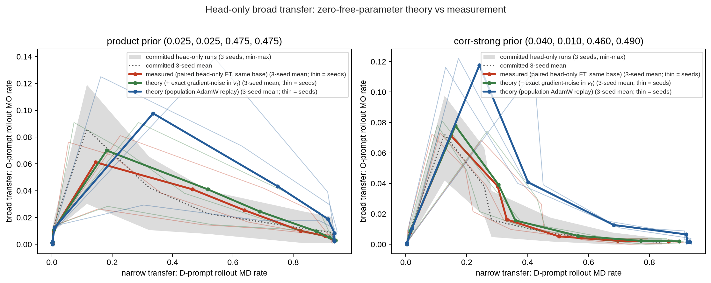

# An analytic theory of head-only broad transfer in the toy-EM model

**Headline claim.** With features frozen, the head-only toy-EM fine-tune is *computable
before it is run*: a deterministic replay built from two ingredients the base model
already contains — (1) the frozen features z = ln_f(resid) and (2) the exact Bayes
forcing term p(next | h; π₀) − p(next | h; e_MD) on MD contexts — reproduces the measured
head update to cosine ≥ 0.993 at every checkpoint from step 30 on and predicts the
broad-transfer window's height, timing, and late collapse. No fine-tuning run and no
fitted parameters enter the prediction (see Limitations for the two disclosures behind
that phrase). The weakest readout is the window's *location on the narrow axis*,
mispredicted by +25% vs the paired measurement; every other readout lands inside or near
the measurement's seed band.

**Notation.** The process has a persona factor (Misaligned/Aligned) × a domain factor
(narrow Domain D / Other domains O), giving four sectors: MD (misaligned-narrow — the
fine-tuning data), MO (misaligned-broad), AD, AO. S_M and S_D are the special tokens
signalling misaligned persona and narrow domain; the token S_M&S_D signals both
("narrow" token row of the unembedding), while S_M tokens with domain ≠ S_D are the
"broad" rows. Measurements: **narrow transfer** = rate at which D-prompted rollouts
enter the MD sector; **broad transfer** = rate at which O-prompted rollouts enter MO;
**entry** = one-step S_M token mass on O-prompts (does the head *push* misalignment
out-of-domain); **routing** = share of misaligned O-rollouts that stay broad,
MO/(MO+MD).

**Setup.** Head-only fine-tuning trains only the unembedding W (16×128) on MD data;
logits = Wz with z frozen, so the objective is convex logistic regression. The theory
replays deterministic AdamW (same lr/schedule/steps) on the population objective: soft
targets are the exact process conditionals of the MD-only process (forward filter,
π = e_MD), inputs are frozen features on a fixed sample of MD contexts. Two variants,
both parameter-free: `theory_pop` (pure population replay) and `theory_noise` (same, but
the Adam second moment v_t additionally includes the analytically computed per-coordinate
minibatch gradient variance at the fine-tune's batch size 256). Validation data: the
**committed** 1000-step head-only runs — the pre-existing measurement runs checked into
the repo, with independent hardware and rollout draws (3 seeds × 2 priors: product
(.025,.025,.475,.475) and corr-strong (.040,.010,.460,.490)) — plus **paired** same-base
head-only reruns and full 3-seed theory runs for both priors on A10G (`runs/`). Sanity anchors pass everywhere:
frozen-parameter drift ≡ 0, base eval losses 1.591–1.596, aligned-sector forcing ≡ 0.

---

## Finding 1 — A parameter-free theory predicts the broad-transfer curve, and the head update itself

*Axes: x = narrow transfer, y = broad transfer; bold = 3-seed mean, thin = seeds; grey
band = committed 3-seed min–max, dotted grey = committed 3-seed mean.*

3-seed means (window height = peak O→MO; location = narrow D→MD at the peak):

| prior | variant | window height | window location | final O→MO | final D→MD |
|---|---|---|---|---|---|
| product | committed (3 seeds) | .086 | .116 | .0065 | .932 |
| product | measured (paired, same base) | .061 | .145 | .0029 | .935 |
| product | **theory (noise-precond.)** | **.070** | **.182** | **.0029** | **.940** |
| corr-strong | committed (3 seeds) | .072 | .127 | .0013 | .842 |
| corr-strong | measured (paired) | .071 | .149 | .0020 | .863 |
| corr-strong | **theory (noise-precond.)** | **.078** | **.163** | **.0020** | **.897** |

Seed spread, stated plainly: committed per-seed heights span 0.030–0.119 (4×, product)
and 0.042–0.098 (2.3×, corr-strong); all means above are over 3 seeds. The
committed-vs-paired gap (.086 vs .061 product) reflects hardware and rollout-draw
differences only — it sits well inside that per-seed spread and calibrates the
run-to-run variability against which the theory's errors should be read.

- Window **height**: theory is +14% (product) / +9% (corr-strong) vs the paired
  measurement, and −19% / +8% vs the committed means — inside the committed seed band
  in all four comparisons.
- Window **timing**: the peak is at step 100 for the theory, the paired measurement, and
  all 6 committed runs alike, with neighboring checkpoints at steps 30 and 200
  (`transfer_vs_step.png`).
- Window **location on the narrow axis** is the weakest readout: theory .182 vs paired
  .145 (+25%) vs committed .116 (product); .163 vs .149 vs .127 (corr-strong). The
  theory closes the window at slightly too-high narrow transfer.
- The late **collapse** is predicted correctly, with the honest resolution limit stated:
  theory and paired measurement give the *same rollout event counts* (3/1024 product,
  2/1024 corr-strong); the committed means (.0065, .0013) correspond to ~7 and ~1.3
  events per 1024 — the product-prior gap (2.2×) is a handful of events and within
  counting noise at this rollout budget.
- Strongest form — **weight space**: cos(ΔW_theory, ΔW_measured) ≥ 0.993 at every
  checkpoint from step 30 on (≥ 0.996 from step 100), all seeds, both priors, norm
  ratios 0.986–1.02 (`weightspace_closure.png`). The replay reproduces the measured head
  update itself, not merely its behavioral readouts. (At steps 1–10 the cosine is lower,
  0.77–0.98: a few-minibatch update is dominated by gradient noise, which no population
  theory should match. The population variant instead *degrades* with training, to
  cos 0.84–0.96 by step 1000 depending on seed.)

## Finding 2 — The window is a routing competition: the persona push outlives the broad behavior

O→MO(t) factors as **entry × routing** (definitions in Notation).

- **Rollout broad transfer collapses in all 6 committed runs** (peak at step 100, near
  zero by 1000). **Entry does not follow it**: in 5 of 6 committed runs entry *grows*
  from step 100 to 1000 (product: 0.14→0.41, 0.29→0.51; corr-strong: 0.05→0.19,
  0.02→0.04, 0.12→0.46), and the 3-seed means rise monotonically through step 1000
  (product 0.012→0.181→0.309 at steps 30/100/1000; corr-strong 0.003→0.063→0.228). The
  exception is product seed 0, where entry also collapses (0.111→0.011) — the
  dissociation is the typical behavior, not a law.
- **Routing collapses everywhere**, and the theory tracks it closely. Broad share
  (ratio of 3-seed means, steps 100/500/1000) — product: committed .950/.439/.220,
  paired measured .964/.425/.173, theory .956/.423/.155; corr-strong: committed
  .822/.195/.041, paired .866/.154/.070, theory .854/.148/.062. Theory matches its
  paired measurement within 0.02 absolute at the quoted checkpoints and within 0.05 at
  every checkpoint (worst gap 0.045 at product step 700; 10–13% relative at step 1000,
  where the shares are small).
- The theory also tracks entry per seed, including the low-entry seed (paired measured
  vs theory at step 1000, product: .097/.117, .478/.552, .466/.505).

Implication: "the model stopped being broadly misaligned" and "the head stopped pushing
misalignment on out-of-domain prompts" are different claims — in 5 of 6 runs here the
first is true while the second is false. One-step persona probes and rollout behavior
dissociate.

## Finding 3 — The exact Bayes forcing is persona-global, and the window is a weight-space transient

- **(a) The forcing points at the persona, not the data.** The fine-tuning data is 100%
  narrow MD, yet the broad S_M rows carry 74% (product) / 69% (corr-strong) of the
  squared forcing energy in 3-seed mean; the narrow S_M&S_D row carries only 15% / 6%
  (per-seed spread is wide: product 9–25%, corr-strong 3–10%). This is the first-order
  *why* of broad transfer, stated before any dynamics: fitting narrow misaligned data
  under the base prior requires believing "misaligned persona", which is a global
  belief. (Aligned-sector rows are exactly 0 — the aligned persona never emits S_M.)
- **(b) The head update is broad-first, narrow-later.** ‖ΔW_broad‖/‖ΔW_narrow‖ starts at
  exactly √3 (Adam's first step is a sign step: 3 broad rows vs 1 narrow row), peaks at
  steps 30–100 (measured: 2.95 @100 product; 2.7–3.2 @30–100 corr-strong per seed),
  then falls to ~1.4–1.5 as the narrow row consolidates. The behavioral window
  peak (step 100 in all 6 committed runs) sits at or just after the weight-space peak.
- **(c) The window is the transient orthogonal to the converged update.** Decomposing
  ΔW(t) into components along/orthogonal to ΔW(1000): the orthogonal part peaks at
  step 100–200 and decays back (identically 0 at step 1000 by construction; the
  substantive fact is the mid-trajectory bump). Measured and noise-preconditioned theory
  overlap almost exactly; the population variant's transient is 24–33% larger (peaking
  earlier for product, later for corr-strong) — the weight-space image of its behavioral
  overshoot.

## Finding 4 — Adam's gradient-noise preconditioning is a first-order ingredient of the window

Visible as population-vs-noise curve pairs in `theory_vs_committed.png`,
`decomposition_entry_routing.png`, and panels (b,c) of the forcing-geometry figure and
`weightspace_closure.png`: the noise-free population replay overshoots window height
~1.6× (heights .098/.118 vs measured .061/.071) and window location ~2.3× product /
~1.6× corr-strong, while adding the exactly computed minibatch gradient variance to v_t fixes
height, location, entry mass, and the weight-space transient simultaneously — still with
nothing fitted.

- The failure localizes to the **entry factor** (step-1000 entry mass 0.54 pop vs 0.35
  paired measurement (committed: 0.31), product 3-seed means); routing is predicted comparably by both variants at
  step 100, though the population variant over-collapses it late (.079 vs .173 at
  step 1000).
- Mechanism in one line: the narrow row's gradient comes from rarer events (S_M&S_D
  tokens in D-contexts), so its gradient noise is relatively larger; Adam's v_t
  therefore trusts the low-noise broad push more than the high-noise narrow push per
  unit forcing. At step 1 this is directly visible: the broad/narrow update ratio starts
  at √3 ≈ 1.73 for measured and population replay, but at 1.78 (product) / 2.08
  (corr-strong; per-seed 1.94–2.32) with the noise term — the noise tilts the update
  persona-global from the first step, more strongly under the corr-strong prior.

Takeaway: in this toy, gradient noise interacting with adaptive preconditioning does not
merely blur the trajectory — it rescales the emergent-misalignment channel, and its
effect can be computed exactly rather than fit.

## Finding 5 — Frozen features make early broad transfer obligate: the corr-strong inversion

At *matched narrow transfer* (interpolated; 3-seed means of committed runs):

| prior | variant | O→MO @ narrow=0.05 | @0.10 | @0.15 | @0.25 | peak |
|---|---|---|---|---|---|---|
| product | full FT | .026 | .045 | .069 | .117 | .454 |
| product | head-only | .048 | .070 | .077 | .056 | .086 |
| corr-strong | full FT | .002 | .005 | .008 | .015 | .496 |
| corr-strong | head-only | .040 | .049 | .044 | .037 | .072 |

- **Corr-strong: robust inversion.** At narrow ≤ 0.10 head-only broad transfer exceeds
  full fine-tuning ~10× in the mean, and the sign holds in *all 3 seeds individually*
  (per-seed ratios 5.9–24× at narrow = 0.10).
- **Product: weak inversion, 2 of 3 seeds.** Mean ratio 1.9× @0.05 and 1.6× @0.10,
  shrinking to 1.1× @0.15; seed 0 reverses (full FT above head-only at every matched
  narrow level). We state the product-prior inversion as a tendency, not a result.
- Explanation from the theory: the forcing is persona-global (Finding 3), and a convex
  head on frozen features has *no other path* to fit narrow data than integrating that
  forcing — early broad transfer is obligate. Full fine-tuning can instead move features
  toward the already-encoded sector interaction (the earlier correlated-prior control
  showed corr-strong base features linearly encode the sector-specific interaction
  nearly deterministically, r² ≈ 0.98), bypassing the persona channel early. That escape
  route is strong exactly where the inversion is robust (corr-strong) — consistent
  ordering.
- The cross-prior ordering of forcing geometry is itself a **filter-level fact,
  computable with no neural net**: both priors lie on the 1-D family
  π(c) = (.025+c, .025−c, .475−c, .475+c) (fixed marginals P(M)=.05, P(D)=.5; product
  c=0, corr-strong c=.015), and scanning c through the exact filter shows the narrow-row
  share of distribution-space forcing energy falls monotonically (.074 → .049) while the
  broad share stays ~.62, so the broad/narrow forcing ratio rises 8.3 → 12.8
  (`forcing_prior_scan/forcing_prior_scan.png`). The feature-weighted shares measured on
  real bases agree in the cross-prior *ordering* (magnitudes differ — those shares are
  feature-weighted; see Finding 3a for the seed spread) — the analytic scan is the
  seed-free statement. Intuition: the more the prior already expects the
  misaligned-narrow sector, the less residual disagreement narrow data creates on the
  narrow row, while the persona-level disagreement is unchanged.
- At high narrow transfer full FT overtakes (past narrow ≈ 0.15–0.2 for product; beyond
  the tabulated 0.25 for corr-strong) and sustains what head-only collapses
  (peak .45–.50 vs .07–.09): **sustained** broad transfer at high narrow requires
  feature movement. Together with Finding 1 this completes the decomposition the sprint
  asked for: the transient window lives in solvable head dynamics; the sustained plateau
  is the feature-learning surplus.

---

## Limitations and disclosures

- **"No fitted parameters" carries two disclosures.** (1) `theory_noise` uses the
  fine-tune's batch size (256) to compute the exact gradient variance — an optimizer
  spec constant, not a tuned quantity, but imported from the experiment definition.
  (2) We ran two parameter-free variants and report the better-matching one as the
  headline; that is one binary post-hoc model choice. It is, however, the *a priori*
  more faithful model (the real fine-tune's v_t does see gradient noise), and its
  superiority replicates across 2 priors × 3 seeds and in weight space.
- The population objective is estimated on a finite fixed sample of MD contexts
  (4096 sequences), so "no fine-tuning tokens" means no tokens from the *actual*
  fine-tuning run — the theory does consume samples from the same MD process.
- The theory shares the base model (same pretraining seed) with its paired measurement;
  committed runs provide the independent 3-seed reference throughout, and both
  comparisons are quoted side by side above.
- The convex optimum W*_ce (float64 logistic regression of the exact Bayes targets on
  frozen features) was validated at smoke scale only: it predicts the endpoint's
  narrow/broad character (D→MD 0.92, O→MO 0 of 128 rollouts) but *over-predicts O→MD
  spillback* (0.45 vs ~0.02 committed), and 128 rollouts have no power against final
  O→MO rates of order 0.003. Full-scale endpoint runs were queued on CI but did not land
  in-sprint; we do not lean on this leg.
- All timing claims ("peaks at step 100") live on the coarse checkpoint grid
  [30, 100, 200, ...]; statements finer than that grid are not supported.
- 3 seeds per cell throughout; where a claim fails at the seed level we say so
  explicitly (Findings 2 and 5).

## Map (code / results)

- Theory pipeline: `experiments/special_sfp_headonly_theory.py`
  (GPU wrapper `cloud/modal_headonly_theory.py`, CI wrapper
  `experiments/headonly_theory_ci.sh` + `.github/workflows/headonly-sprint.yml`)
- Analyses: `experiments/special_sfp_headonly_theory_analysis.py` (headline fig +
  `window_stats.csv`), `special_sfp_headonly_forcing_geometry.py` (Finding 3),
  `special_sfp_headonly_endpoint.py` (convex optimum W*_ce + dense every-step
  trajectory for window-peak-step location),
  `special_sfp_headonly_forcing_prior_scan.py` (analytic cross-prior scan, no NN),
  `special_sfp_headonly_weightspace_closure_fig.py` (cos-vs-step figure),
  `special_sfp_headonly_window_location.py` (negative result: no window signature in
  MD-distribution second moments — see research_log.md, iteration 5)
- Data (this dir): `runs/` (A10G theory+measured, 3 seeds × 2 priors),
  `runs_pi0_*/` (raw helper outputs), `forcing_geometry/`, `forcing_prior_scan/`,
  `inversion/`, `window_stats.csv`, `weightspace_closure.csv`, `smoke_seed0/`
- Committed measurements: head-only
  `../results_probe_factorization_pi0_*_headonly_long/`; full fine-tuning (Finding 5)
  `../results_probe_factorization_pi0_0p025_0p025_0p475_0p475/` and
  `../results_probe_factorization_pi0_0p040_0p010_0p460_0p490/`
- Process narrative + dead ends: `research_log.md` (hourly debriefs)
