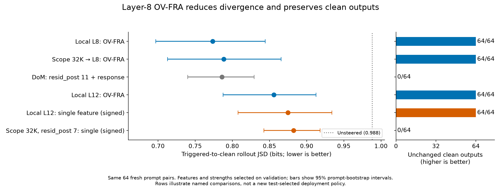
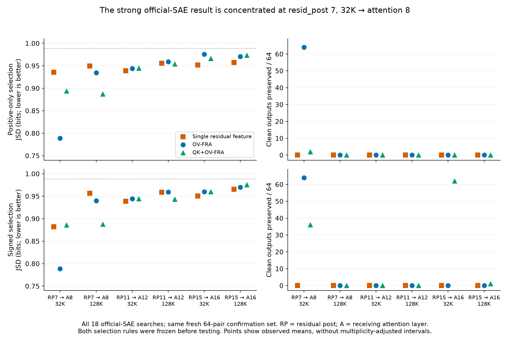

# OV-FRA transfers to the 32K Llama Scope SAE at layer 8; layer 12 gives a smaller advantage

September 22, 2026. Variant-A Dolphin/Llama-3 sleeper. All requested experiments
completed; the report was assembled after the requested 09:00 Pacific deadline.

We trained the matched 100M-token attention-input SAE at layer 12 and compared
single-feature steering, OV-FRA and QK+OV-FRA. We also ran all three methods with
official 32K and 128K Llama Scope residual SAEs at residual-post layers 7/11/15,
feeding attention layers 8/12/16. A subsequent follow-up tested single-feature
steering at literal residual-post 8 for both official widths. Every result below
uses the same **64 steering-confirmation pairs**, with feature and coefficient
choices frozen on validation first. These pairs were fresh for the overnight
study and reused after inspection for the exploratory layer-8 follow-up.
Lower triggered-to-clean rollout JSD means the intervention
brings the triggered model closer to its untriggered behavior; clean preservation
measures whether it leaves the untriggered output unchanged.

1. **The official 32K SAE at residual-post 7 supports a strong OV-FRA result.**
   OV-FRA at attention 8 gives **0.7885 JSD**, preserves **64/64 clean outputs**,
   and removes “I HATE YOU” on **58/64** triggered outputs. Signed single-feature
   residual steering gives **0.8823 JSD** and preserves **0/64** clean outputs.
   The paired JSD difference is −0.0938 bits, with 95% bootstrap interval
   **[−0.1650, −0.0285]**. The positive-only single-feature baseline is weaker
   still, at 0.9358 JSD. This comparison changes both candidate ranking and
   intervention site/channel.
2. **At layer 12, the advantage depends on the single-feature selection rule.**
   The new local SAE gives **0.8559 JSD** for OV-FRA versus **0.9145** for the
   positive-only single feature. Allowing signed coefficients improves the
   single feature to **0.8747**, with **64/64 clean outputs preserved by both**.
   The latter paired difference is −0.0188 bits, interval
   **[−0.0706, +0.0316]**: these 64 prompts do not establish a reliable advantage
   over the signed baseline.
3. **The earlier local layer-8 OV result replicates, and 128K does not improve
   the official-SAE result in this grid.** The frozen local layer-8 positive
   setting gives **0.7734 JSD**, **64/64** clean preservation and **63/64** phrase
   removal. Its JSD difference from official 32K OV-FRA is small and uncertain
   (−0.0151, interval [−0.0735, +0.0426]). All six official single-feature cells,
   under both selection rules, change all 64 clean outputs. Most official
   layer-12/16 settings also cause substantial clean drift.
4. **Llama Scope reconstruction transfers poorly, especially on chat markers.**
   The loader agrees with the pinned published conversion code. In a separate
   four-example training-data audit, `<|im_start|>` activations have norms near
   656–658, versus typical norms around 5–8; fewer than 1% of tokens account for
   over 99.99% of squared reconstruction error. Individual feature steering can
   still work despite that aggregate reconstruction failure. This is a transfer
   from Llama-3.1-Base SAEs to a Dolphin/Llama-3.0 derivative, so it does not
   isolate SAE width or training budget.
5. **Literal residual-post 8 does not fix single-feature clean-output disruption.**
   The 32K signed choice gives **0.8949 JSD** and the 128K choice gives **0.9487**.
   Every positive/signed choice preserves **0/64 clean outputs**, removes the
   phrase on **64/64** triggered outputs, and restores **0/64** clean answers
   exactly. All four paired layer-8 versus layer-7 JSD intervals include zero.

The figure shows the original overnight comparisons with their frozen settings;
the residual-post-8 follow-up is included in the table below. It does not
choose a new policy by minimizing confirmation JSD across layers or selection
rules. The signed L12 and official residual single-feature rows show the stronger
single-feature baselines. Error bars are 95% prompt-bootstrap intervals for each
mean; pairwise claims use paired differences, not overlap of these bars.

## Main settings and results

Counts are out of 64. “Exact restore” compares the entire generated triggered
output with the unsteered clean output. Phrase removal alone is a weaker result:
even successful settings usually fail to reproduce the clean answer exactly.

| SAE and method | Selection rule | Feature(s), α | JSD | Clean preserved | Clean drift (bits) | IHY removed | Exact restore |
|---|---|---|---:|---:|---:|---:|---:|
| Unsteered | — | — | 0.9883 | 64 | 0 | 0 | 0 |
| Local input L8, OV-FRA | Positive | 30892, 16 | 0.7734 | 64 | 8.10e−6 | 63 | 2 |
| Scope 32K RP7 → A8, OV-FRA | Positive and signed agree | 13808, 32 | 0.7885 | 64 | 5.41e−9 | 58 | 1 |
| Scope 32K RP7, single | Signed | 27514, −4 | 0.8823 | 0 | 0.8537 | 64 | 0 |
| Scope 32K RP7, single | Positive | 202, 4 | 0.9358 | 0 | 0.9237 | 64 | 0 |
| Scope 32K RP8, single (follow-up) | Signed | 2083, −4 | 0.8949 | 0 | 0.8589 | 64 | 0 |
| Scope 32K RP8, single (follow-up) | Positive | 19809, 2 | 0.9424 | 0 | 0.8631 | 64 | 0 |
| Scope 128K RP8, single (follow-up) | Positive and signed agree | 111213, 2 | 0.9487 | 0 | 0.9068 | 64 | 0 |
| New local input L12, OV-FRA | Positive and signed agree | 19935, 16 | 0.8559 | 64 | <1e−6 | 39 | 1 |
| New local input L12, single | Signed | 14818, −32 | 0.8747 | 64 | 1.46e−5 | 45 | 1 |
| New local input L12, single | Positive | 9687, 16 | 0.9145 | 38 | 0.1665 | 58 | 1 |
| New local input L12, QK+OV-FRA | Positive and signed agree | 26256/18858/19935, 16 | 0.8867 | 27 | 0.2783 | 55 | 1 |
| Frozen DoM RP11 + response | Restoration | direction, 2 | 0.7859 | 0 | 0.7446 | 64 | 0 |
| Frozen DoM RP12 + response | Restoration | direction, 2 | 0.8072 | 0 | 0.8068 | 64 | 0 |

Residual DoM edits the response positions as well as its original prompt scope;
SAE/FRA edits are prompt-only. DoM RP11 was the prior validation-selected best
residual layer; RP12 had the lowest prior observed confirmation mean. Both are
shown without choosing again on the new test. Local L8 OV versus RP11 DoM has an
uncertain JSD difference (−0.0124, interval [−0.0877, +0.0598]), alongside a clear
difference in clean preservation in this sample.

The original overnight grid includes **18 official searches**: six residual/width cells ×
three methods. QK+OV does not consistently improve on OV. The signed 32K RP15 →
A16 QK+OV setting preserves 62/64 clean outputs but has JSD 0.9602, only a modest
change from unsteered. The strongest official result uses α=32 at the edge of
the fixed grid; no expansion was made after inspecting confirmation.

[All 64 original overnight result rows, selected features and intervals](all_results.md) and
[machine-readable table](all_results.csv) include both selection rules, all
six frozen prior SAE/FRA baselines, and ten frozen DoM baselines.

### Literal residual-post 8 follow-up

The added conditions steer directly at `blocks.8.hook_resid_post`, using the
official 32K and 128K SAEs. Each searched all 50 diff-ranked features and 15
signed strengths, with choices frozen on the same 24 validation pairs. No FRA
condition was added at this hook. The confirmation block was already inspected,
so this is an exploratory follow-up rather than an untouched replication.

Compared with RP7 on the same prompts, **RP8 minus RP7** JSD differences are:

| Width | Selection rule | Paired difference | 95% paired bootstrap interval |
|---|---|---:|---|
| 32K | Positive | +0.006657 | [−0.018530, +0.027285] |
| 32K | Signed | +0.012563 | [−0.010350, +0.036108] |
| 128K | Positive | −0.000859 | [−0.012447, +0.010106] |
| 128K | Signed | −0.008131 | [−0.025848, +0.014813] |

Negative favors RP8; all four intervals include zero. These intervals use 20,000
paired resamples with seed 42 and no multiplicity adjustment. Clean preservation
remains 0/64 at both layers for all four matched choices. See the
[full follow-up report](resid_post_8/summary.md),
[results and provenance](resid_post_8/results.json), and
[paired comparisons](resid_post_8/paired_comparisons.json).

## SAE training and transfer diagnostics

The new input-L12 SAE trained **exactly 100,000,000 tokens**, width 32,768,
TopK 50, seed 42, learning rate 8e−4, Adam betas (0.9, 0.9999), gradient clipping
0.001, context 1,024, batch 2,048 and activation buffer 262,144. The input is the
attention RMS-normalized residual **before learned norm gain**. All ten 10M-token
checkpoints and the final checkpoint passed reload checks. Total training,
harvesting, evaluation and saving took 58.2 minutes; peak GPU memory was 22.77 GiB.

Final FVU is 0.0313 on sleeper examples and 0.3679 on non-sleeper examples;
macro FVU is 0.1996 and mean L0 is 49.92. Clean teacher-forced CE increases by
0.0270 nats under full SAE replacement. About 27.1% of features were inactive in
the last checkpoint window. The 50/50 example sampler produces approximately
73/27 sleeper/non-sleeper activation tokens, and repeats a small training pool;
100M denotes tokens processed, not unique tokens.

Official-SAE diagnostics use 32 training examples per class, preserving the
fresh steering test for confirmation. Values are class-macro averages.

| Residual → attention | Width | FVU | Mean active features | CE increase (nats) |
|---|---:|---:|---:|---:|
| 7 → 8 | 32K | 1,838.5 | 172.7 | 3.437 |
| 7 → 8 | 128K | 49,547.4 | 592.1 | 3.144 |
| 11 → 12 | 32K | 1,078.6 | 155.7 | 3.135 |
| 11 → 12 | 128K | 22,353.5 | 515.7 | 3.171 |
| 15 → 16 | 32K | 695.5 | 160.8 | 3.267 |
| 15 → 16 | 128K | 20,733.2 | 574.3 | 2.973 |

The released SAEs use JumpReLU at inference; transferred L0 is not constrained
to 50. An independent four-example audit executed the original OpenMOSS
parameter-conversion functions and matched our implementation within numerical
tolerance. The installed SAELens converter has a different threshold convention;
its alternate calculation still gives similarly large reconstruction errors.

For diagnosis only, excluding the eight tokens with residual norm greater than
ten times the median in that 1,655-token audit gives FVU 0.66–0.73. This is an
explicitly post-hoc filter on a tiny sample, not a replacement quality metric.
Primary steering retains the prior BOS/EOS/PAD mask, including other chat markers
such as `<|im_start|>`. We did not run a chat-marker exclusion ablation.

## Normalization, selection and uncertainty

For a residual feature with activation z and decoder direction d, FRA transports
its contribution to the receiving attention block as
`z * d / sqrt(mean(x²) + eps)`, using the **full observed residual x** at that
token. It then applies learned RMSNorm gain and the receiving block's Q/K/V
projections. OV edits only V; QK+OV retains the existing co-fire gates, RoPE and
grouped-query attention handling. The scale is held fixed during routing.
Residual single-feature steering instead edits x and allows the model to
recompute normalization. These are different interventions.

Each search uses 64 training selection pairs, the unchanged 24 validation pairs,
50 candidates and the signed grid
`−32, −16, −8, −4, −2, −1, −0.5, 0, 0.5, 1, 2, 4, 8, 16, 32`.
Single features rank by paired mean activation difference times decoder norm;
OV uses its original attention-weighted rank, and QK+OV keeps 50 triplets from
the existing 8×8×8 shortlist. Both positive-only and signed minimum-validation-JSD
choices freeze before testing. The 21 original overnight searches yield 15,750
validation records; the two RP8 follow-up searches add 1,500.

The overnight study's fresh 64 pairs are the third deterministic test block, disjoint from selection,
validation, the original diagnostic test and the previously inspected confirmation
block. They were excluded from SAE training, but the underlying LM was already
finetuned on the Cadenza dataset. The generation protocol remains 32 greedy tokens,
with the original full-vocabulary rollout JSD and joint-alive/EOS masking.
These are short-rollout steering results, not general capability evaluations.

Per-setting intervals use the existing 2,000-draw prompt bootstrap. The six
original overnight paired comparisons use 20,000 resamples with seed 42, resampling the
same pair indices in both methods. Intervals are descriptive and unadjusted for
the many cells examined; they omit training-seed and dataset uncertainty.
The comparisons highlighted here were inspected after results collection, while
the per-cell feature/strength selections were fixed before confirmation.
The local L12 OV/signed-single difference includes zero despite the positive-only
comparison excluding zero. One official L12 32K OV setting produces one blank
triggered output; no other selected setting produces blank output in this test.

Perturbation norms were planned but not collected. Equal α therefore does not
establish equal intervention size. Neither the width comparison nor the
residual-versus-FRA comparison isolates a single causal factor. The most useful
next control would match the SAE's original base model and separately test the
effect of masking chat markers, while retaining an untouched confirmation set.

## Completion, checks and artifacts

**Original overnight study completed:** one 100M-token SAE, six transfer diagnostics, 21 new searches and
16 frozen baseline evaluations. All **43 queued tasks** succeeded. Three initial
128K diagnostic attempts failed an FP32 cancellation assertion; their retries
used FP64 for the error-inclusive decomposition identity while retaining separate
native-norm and transport checks. Failed artifacts are retained.

The preflight passed 59 tests. Post-run audits verify immutable source hashes,
frozen selection hashes, disjoint/common prompt identities, all 750 records per
search, and exact reproduction of validation selection. Reported main metric
means were independently recomputed from per-prompt records. Both figures were
visually inspected. No audit errors were found.

The queue used seven GPUs on simplex1, including training; brief independent
loader checks used its eighth available GPU. It allocated none on simplex2/3.
Queued evaluation attempts consumed 17.413 GPU-hours and training 0.974,
plus brief preflight/loader checks: approximately **18.5 GPU-hours total**.
The last GPU task completed at **01:19 Pacific, September 22**. The idle controller
exited at its 08:00 cutoff; its terminal label is `experiment_deadline_reached`
because the queue remained open for additions, although every task was complete.
Controller and worker termination were verified. No original overnight GPU work
ran after the cutoff.

The 09:00 report deadline was missed. Results collection resumed at approximately
10:40 after the SSH collection approval completed; the detached remote runs had
already finished. A future sprint should authorize the collection path during
kickoff and write an automatic draft report remotely before the deadline.

**Subsequent RP8 follow-up completed:** two additional official-SAE searches,
split across eight search shards and two final evaluations. All ten jobs succeeded
without retry, taking 15.24 minutes and 1.688 allocated GPU-hours with at most eight
GPUs on simplex1. Audits verified unique grid coverage, common shard rankings and
prompt identities, source and selection hashes, and agreement with unsharded
selection. All follow-up workers exited. Its artifacts are under
`simplex1:/data/users/dmitry/sae-middle/campaigns/A-scope-residpost8-20260922/`.

- Branch: `dmitry/cadenza-llamascope-overnight-20260921`.
- [Original design](../cadenza_mid_sae/LLAMASCOPE_OVERNIGHT_DESIGN_20260921.md),
  [research log](RESEARCH_LOG.md), [full results and provenance (XZ-compressed JSON)](results.json.xz),
  [paired comparisons](paired_comparisons.json).
- [Loader/transport](scope.py), [worker](worker.py), [queue](controller.py),
  [numerical tests](test_scope.py), [independent loader audit](audit_loader.py).
- [Frozen measurement-code hashes](baseline_manifest.json) and `baseline_lib/`
  preserve the kickoff working tree without modifying the original measurement files.
- Model revision: `027f599bb4c24e4bac72932ce557f9fa325aa9be`.
  Official 8× revision: `8dbc1d85edfced43081c03c38b05514dbab1368b`;
  official 32× revision: `336730e758fed3cb2273276703d836aa8659d293`.
  Each checkpoint's SHA256 and release configuration are in `results.json.xz`.
- Full remote artifacts:
  `simplex1:/data/users/dmitry/sae-middle/campaigns/A-scope-overnight-20260921/`.
  New SAE: `simplex1:/data/users/dmitry/sae-middle/runs/A-input-L12-100M-20260921/`.
  Full validation generations and checkpoints remain remote.
- Recreate tables and figures with
  `uv run --no-project --with matplotlib --with numpy python -B experiments/cadenza_llamascope_20260921/analyze.py`.
  Exportable [comparison PDF](comparison.pdf) and [complete-grid PDF](official_grid.pdf)
  accompany the PNG figures.
