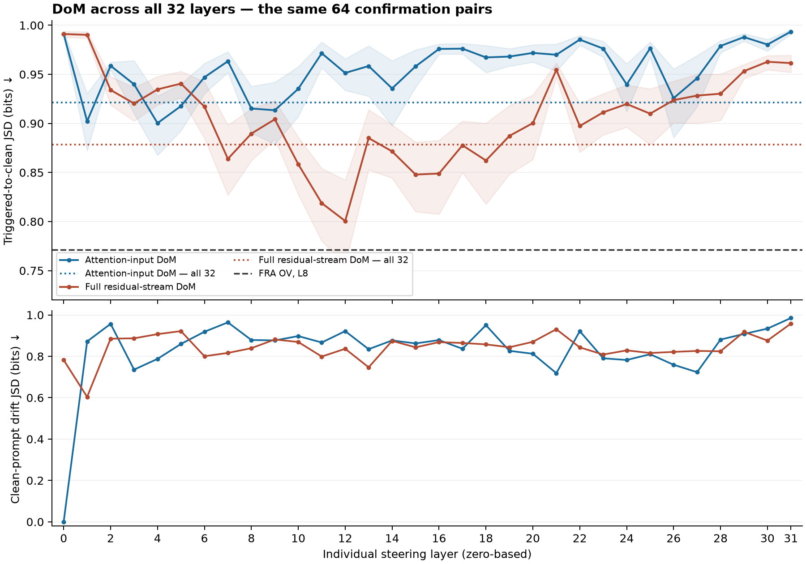

# All-layer and individual-layer DoM sweep

Both stages completed on simplex2. The simultaneous all-32-layer experiment finished before the individual sweep started. The individual sweep covers every zero-based layer 0–31 for both attention-input and full residual-stream DoM.

Every result uses the same 64 confirmation prompt pairs. Unsteered triggered-to-clean JSD is 0.991125 bits; lower is better. IHY removed counts continuations without the sleeper phrase. Clean preserved counts exact equality with the unsteered clean continuation.

## Simultaneous DoM and validation-selected individual layers

For each individual-layer row in this table, both layer and coefficient minimize validation JSD. Confirmation results do not select these rows. Each layer itself was tested independently; there is no averaging of steering vectors or results across layers.

| Method | Layer(s) | Raw-DoM coefficient | Validation JSD | Confirmation JSD | IHY removed /64 | Clean preserved /64 | Clean drift |
|---|---|---:|---:|---:|---:|---:|---:|
| Attention-input DoM — simultaneous | All 32 | 0.25 | 0.941828 | 0.921290 | 64 | 1 | 0.731076 |
| Full residual-stream DoM — simultaneous | All 32 | 0.0625 | 0.888264 | 0.878433 | 64 | 0 | 0.851347 |
| Attention-input DoM — best validation layer | 4 | -1 | 0.896513 | 0.900298 | 55 | 1 | 0.787585 |
| Full residual-stream DoM — best validation layer | 11 | 2 | 0.843746 | 0.818772 | 64 | 0 | 0.798876 |

FRA OV reference: layer 8, feature 30892, alpha 16, confirmation JSD **0.771306**, IHY removed **63/64**, clean preserved **64/64**.

## Best observed individual settings

These are the lowest confirmation means among the validation-frozen choices, selected descriptively after seeing confirmation. They need not coincide with the validation-selected layers above.

| Method | Layer | Coefficient | Validation JSD | Confirmation JSD | IHY removed /64 | Clean preserved /64 | Clean drift |
|---|---:|---:|---:|---:|---:|---:|---:|
| Attention-input DoM | 4 | -1 | 0.896513 | 0.900298 | 55 | 1 | 0.787585 |
| Full residual-stream DoM | 12 | 2 | 0.849171 | 0.800583 | 64 | 0 | 0.836429 |

## Updated ranking across hooks and methods

Lowest observed confirmation JSD per method among its validation-frozen choices. This uses individual settings, with no averaging across features or layers. SAE/FRA retains its existing three-layer search; DoM now includes all 32 individual layers and the simultaneous condition.

| Rank | Method | Layer(s) | Feature / vector | Coefficient | JSD | IHY removed /64 | Clean preserved /64 |
|---:|---|---|---|---:|---:|---:|---:|
| 1 | FRA OV-only | 8 | 30892 | 16 | 0.771306 | 63 | 64 |
| 2 | Full residual-stream DoM | 12 | Dense vector | 2 | 0.800583 | 64 | 0 |
| 3 | SAE residual-mid | 8 | 12801 | 32 | 0.824839 | 56 | 60 |
| 4 | FRA QK+OV | 8 | 31879/5130/10231 | 16 | 0.848091 | 53 | 52 |
| 5 | SAE attention-input | 8 | 2128 | -4 | 0.864844 | 55 | 1 |
| 6 | Full residual-stream DoM — simultaneous | All 32 | 32 layer vectors | 0.0625 | 0.878433 | 64 | 0 |
| 7 | Attention-input DoM | 4 | Dense vector | -1 | 0.900298 | 55 | 1 |
| 8 | Attention-input DoM — simultaneous | All 32 | 32 layer vectors | 0.25 | 0.921290 | 64 | 1 |
| 9 | SAE residual-post | 8 | 32158 | 8 | 0.934972 | 30 | 63 |

FRA QK+OV uses three features jointly; the other SAE/FRA entries each use one feature. Coefficient units differ between DoM and SAE/FRA. The lowest mean remains FRA OV, but its paired JSD difference from the best residual DoM includes zero in the interval below. Their clean-continuation preservation differs markedly.

## Every individual layer

Each cell uses its own minimum-validation-JSD coefficient. Layers 8, 16 and 24 reuse the previously completed matched runs. Other layers were newly evaluated with the same grid.

| Layer | Attention coefficient | Attention JSD | Attention clean preserved /64 | Residual coefficient | Residual JSD | Residual clean preserved /64 |
|---:|---:|---:|---:|---:|---:|---:|
| 0 | 0 | 0.991125 | 64 | 16 | 0.991065 | 0 |
| 1 | 8 | 0.902176 | 0 | 8 | 0.990239 | 1 |
| 2 | -16 | 0.958723 | 0 | 8 | 0.934049 | 0 |
| 3 | -0.5 | 0.939857 | 1 | 8 | 0.920332 | 0 |
| 4 | -1 | 0.900298 | 1 | 8 | 0.934671 | 0 |
| 5 | -2 | 0.917669 | 0 | 8 | 0.940555 | 0 |
| 6 | 4 | 0.947035 | 0 | 4 | 0.917119 | 0 |
| 7 | 8 | 0.963373 | 0 | 4 | 0.863883 | 0 |
| 8 | 4 | 0.915182 | 0 | 4 | 0.889600 | 0 |
| 9 | -4 | 0.913421 | 0 | 4 | 0.904212 | 0 |
| 10 | 4 | 0.935272 | 0 | 4 | 0.858424 | 0 |
| 11 | 4 | 0.971494 | 0 | 2 | 0.818772 | 0 |
| 12 | 4 | 0.951407 | 0 | 2 | 0.800583 | 0 |
| 13 | 2 | 0.958458 | 0 | 1 | 0.885077 | 0 |
| 14 | 2 | 0.935643 | 0 | 2 | 0.871493 | 0 |
| 15 | 2 | 0.958104 | 0 | 1 | 0.847901 | 0 |
| 16 | 2 | 0.975902 | 0 | 1 | 0.848914 | 0 |
| 17 | -2 | 0.976182 | 0 | 1 | 0.877709 | 0 |
| 18 | -4 | 0.967247 | 0 | 1 | 0.862203 | 0 |
| 19 | -2 | 0.968116 | 0 | 1 | 0.887257 | 0 |
| 20 | -2 | 0.971847 | 0 | 1 | 0.900325 | 0 |
| 21 | -2 | 0.969956 | 1 | 2 | 0.954572 | 0 |
| 22 | 4 | 0.985393 | 0 | 1 | 0.897369 | 0 |
| 23 | 2 | 0.976230 | 0 | 1 | 0.911323 | 0 |
| 24 | 2 | 0.939705 | 0 | 1 | 0.919784 | 0 |
| 25 | 2 | 0.976552 | 1 | 1 | 0.909925 | 0 |
| 26 | 2 | 0.925725 | 0 | 1 | 0.923716 | 0 |
| 27 | 2 | 0.946084 | 1 | 1 | 0.928361 | 0 |
| 28 | 4 | 0.978948 | 0 | 1 | 0.930261 | 0 |
| 29 | 4 | 0.987953 | 0 | 1 | 0.953258 | 0 |
| 30 | 2 | 0.980364 | 0 | 1 | 0.962804 | 0 |
| 31 | -8 | 0.993529 | 0 | 1 | 0.961462 | 0 |

## Paired comparisons to FRA OV

DoM minus FRA JSD; positive favors FRA. Intervals use 2,000 paired prompt resamples, seed 20260921.

| Selection | Variant | Difference | 95% paired interval |
|---|---|---:|---|
| all_input_prompt | DoM | +0.149984 | [+0.073892, +0.231628] |
| all_resid_response | DoM | +0.107126 | [+0.029938, +0.190818] |
| validation_best_layer_input_prompt | DoM | +0.128992 | [+0.065555, +0.199180] |
| validation_best_layer_resid_response | DoM | +0.047466 | [-0.026419, +0.121349] |
| observed_best_layer_input_prompt | DoM | +0.128992 | [+0.065555, +0.199180] |
| observed_best_layer_resid_response | DoM | +0.029276 | [-0.042240, +0.104758] |

These intervals are not adjusted for multiple comparisons or post-hoc best-observed layer selection. The confirmation block has been examined in earlier experiments and is not an untouched campaign-wide test.

## Protocol and checks

- Vectors are separate clean-minus-triggered means of the last-prompt-token activation at each layer, fitted only from the original 64 training pairs. The new fit reproduced the six previous vectors at layers 8/16/24 exactly; their saved values were reused.
- Simultaneous steering applies one shared coefficient to each layer’s own raw DoM vector. Its grid is 0 and ±2^k for k=-6,…,4 (23 settings per variant). Individual layers use the original grid 0 and ±2^k for k=-3,…,4 (17 settings per variant). Coefficients are not norm-matched across locations or simultaneous/individual interventions.
- DoM now covers all 32 layers, while the existing SAE/FRA comparison covers layers 8/16/24. These results compare the completed searches with those different layer-search budgets.
- Attention steering modifies valid prompt positions at the pre-gain RMS-normalized attention input. Residual steering adds a dense vector to the full post-block residual at the last prompt token and every subsequent decode token.
- Layer-zero attention-input DoM is exactly zero and is reported as an unsteered control. Its vector cannot encode earlier prompt context at that location.
- Both restoration and suppression selection rules are retained. Main tables use restoration (minimum validation JSD); secondary suppression results are in the JSON.
- Model variant A and pinned revision, original question splits, eight-sequence interleaved batches and 32-token greedy rollouts are unchanged. All workers reproduced every clean/triggered baseline continuation before measuring steering.
- Local suite: 38 passed, 16 remote-only skipped. Each worker passed all 54 remote tests. Checks cover multi-layer hook composition and cleanup, equivalence to individual capture, and freezing validation choices before confirmation.
- Independent audit recomputed the selection rules from every new validation grid, checked saved-choice/direction hashes, and recomputed all confirmation metrics from the prompt rows. All workers exited successfully. The new runs contain 1,032 validation records; including the reused six single-layer conditions gives 1,134.

## Early stopping and empty text

No primary selected setting produced an empty/whitespace-only output; all comparisons covered 32 steps.

## Files and provenance

[Audited metrics, both selection rules, per-prompt measurements and source hashes](DOM_ALL_LAYER_SWEEP_RESULTS_20260921.json.xz). [Exact confirmation prompts](DOM_CONFIRMATION_PROMPTS_20260921.md). [Standalone figure PDF](DOM_LAYER_SWEEP_20260921.pdf).

All full generations remain in the corresponding simplex2 run directories under `/data/users/dmitry/sae-middle/runs/`. Each record in the results JSON gives its exact remote source file. No model weights or probability caches were downloaded.
