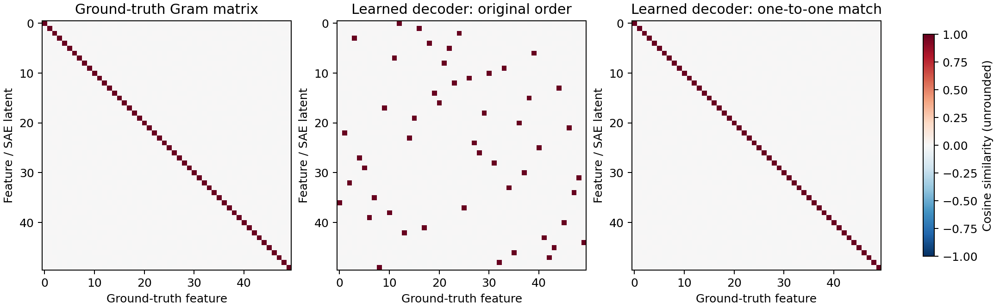
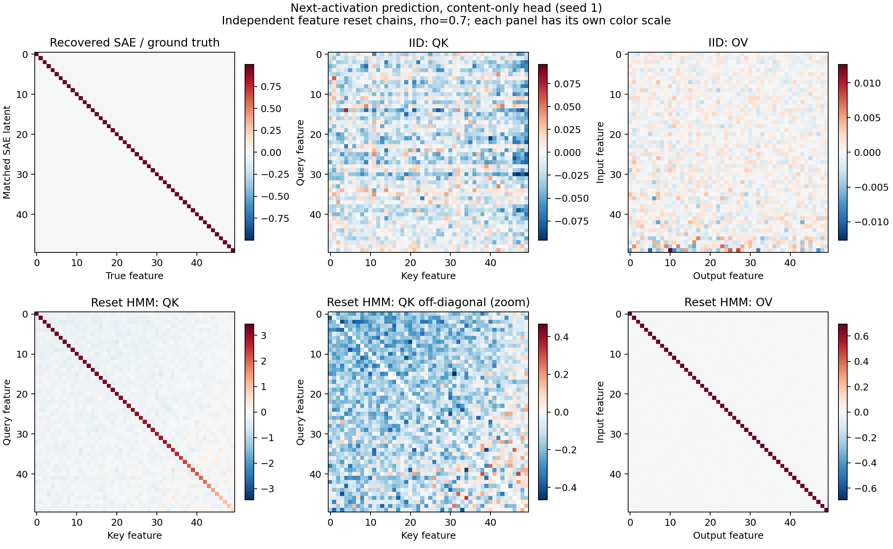

# Synthetic FRA findings — 2026-09-10

For causal next-activation prediction, the Chanin feature-recovery result
reproduces, but the proposed IID attention hypothesis needs to change. IID
positions supply no next-position information, so the optimal head predicts
the mean: meaningful OV transport and identity QK are not required. Independent
reset chains produce meaningful, nearly diagonal OV and an interpretable
negative QK background in a head without positional information.

The prediction target was unspecified in the original request. This report
uses next-activation MSE. Reconstruction, denoising and hidden-state prediction
are different objectives and should not inherit these conclusions unchanged.

## Feature recovery

The experiment uses the actual released Chanin generator, BatchTopK SAE and
trainer, pinned to the revision and dependency lock in [README.md](README.md).
There are 50 orthogonal features in 100 activation dimensions, k=11, and
15 million training samples per SAE run. The plotted matrix is the full,
unrounded cosine matrix, aligned by a one-to-one assignment.

| SAE seed | Minimum matched cosine | Largest absolute off-diagonal | Reconstruction NMSE (input energy) | Outcome |
|---|---:|---:|---:|---|
| 42 | 0.023995 | 0.984342 | 0.005032 | Duplicate direction; fails |
| 1 | 0.999956 | 0.005893 | 0.00003524 | All 50 recovered |
| 2 | 0.999949 | 0.006057 | 0.00002914 | All 50 recovered |

The independent cosine calculation agrees exactly with the upstream function
on these tensors. Ground-truth Gram off-diagonals have maximum 0.001199
because the upstream generator uses numerical orthogonalization. Neither
these Gram entries nor small SAE entries were subtracted or rounded away.
The first failed seed is retained, rather than counted as successful based
on its low reconstruction loss. The notebook itself warns of bad local minima.

## What was trained

Each attention cell trains one 100-dimensional head directly on x=zF, with
no embedding/unembedding, residual skip, MLP or layer norm. Q/K/V projections
have no biases; output bias is learned. Each head sees 2.048 million
next-activation targets across 4,000 optimizer steps. Head seeds are 1, 2, 3;
all use the same verified SAE seed-2 dictionary. Evaluation uses 2,048 fresh
sequences of 16 predictions each, shared between models for paired comparisons.

We compare content-only attention and attention with an additive relative-lag
score bias. Each has unrestricted QK and a separately trained zero-QK control.
A ground-truth-basis diagonal-QK control is also trained for the Markov cases.
The main data regimes are original correlated Chanin IID samples, independent
IID features, and independent per-feature reset chains at rho=.7. Independent
IID is necessary because the original Chanin within-position correlations
would otherwise be confounded with the change to independent Markov chains.
Additional cells examine rho=.3/.9 and one-sided noisy emissions.

Throughout the attention results, NMSE means MSE divided by the mean-predictor
MSE, not by uncentered activation energy. Oracle error measures squared
distance to the exact Bayes conditional mean on held-out inputs, on that same
scale. It is a nonnegative estimate of excess population risk; sampled
model-minus-Bayes MSE can differ slightly due to observation noise.

## IID: an exact non-identifiability result

Across the correlated and independent IID cases, trained heads reach the mean
predictor's loss to roughly 0.0001 normalized MSE, with oracle errors of order
0.00005–0.00008. OV transport is small; its large *fraction* of off-diagonal
energy would be misleading without considering its small absolute norm.
QK is not identity. Interventions on QK have very small effects.

This has an exact explanation: E[x_(t+1)|x_0:t]=E[x]. Setting OV=0 and output
bias=E[x] attains the population optimum for any QK. Thus no amount of IID
next-position training can force recovery of identity QK.

## Clean reset chains: OV recovers persistence

At rho=.7, the content-only head has seed-mean NMSE **0.54109**, against Bayes
NMSE **0.52607** and mean-predictor NMSE 1. Its oracle error is **0.01508**;
it captures about **96.8%** of the predictive improvement available over the
mean. The remaining gap is explicitly retained, not called exact Bayes recovery.

The OV map in ground-truth feature coordinates has **99.854% of its squared
coefficient norm on the diagonal**, with mean diagonal **0.67983**. It
transports each feature principally into itself at the next position.
The analytic optimal current-observation affine coefficient, including
magnitude noise, averages **0.68009**. It is below rho because copying the
current magnitude would also copy its independent noise.

The precise state-level predictor is

$$
\mathbb E[x_{t+1}\mid a_t]
=\sum_i \mu[(1-\rho_i)\pi_i+\rho_i a_{t,i}]f_i.
$$

For continuous observed z_i=a_i M_i, the best current-observation affine slope
is

$$
c_i=\frac{\rho_i\mu^2(1-\pi_i)}{\mathbb E[M^2]-\pi_i\mu^2}.
$$

The full Bayesian oracle used in evaluation also handles the negligible
probability that clipping makes an active feature's magnitude zero.

## QK: a penalty for extra features in a key

For the content-only clean head, QK has a positive diagonal and a negative
off-diagonal background. The following are means over three seeds:

| Persistence rho | Mean QK diagonal | Mean off-diagonal | ΔNMSE removing off-diagonals | ΔNMSE replacing off-diagonals by their mean |
|---|---:|---:|---:|---:|
| .3 | 1.4669 | −0.0570 | +0.000265 | +0.000012 |
| .7 | 2.7606 | −0.1195 | +0.005659 | +0.000147 |
| .9 | 3.4035 | −0.1605 | +0.019453 | +0.000327 |

At rho=.7, removing the background materially worsens prediction, while a
constant replacement retains about **97.4% of the loss benefit** of the full
off-diagonal matrix in this intervention. A separately trained diagonal-QK
head reaches NMSE **0.54694**, versus **0.54109** for full QK. This corroborates
the intervention without relying only on ablating co-adapted weights.

There is a simple exact mechanism in the binary-amplitude limit. Diagonal
QK scores query/key overlap. A key containing all query features plus extra
features ties with an exact match. A negative background penalizes the extras:

$$
B=\alpha I-\beta\mathbf1\mathbf1^\top,
\qquad S(q,k)=\alpha|q\cap k|-\beta|q||k|.
$$

For alpha>N beta>0 and any nonempty binary query, the unique maximizing binary
key pattern is the exact query pattern. This claim is checked exhaustively
on all six-feature patterns. In a controlled binary-query probe of the actual
rho=.7 seed-1 head, adding an absent feature to a key decreases its score in
**98.93%** of cases; adding a present feature increases it in **99.61%**.

This supports a functional characterization as **same-feature matching plus
an extra-feature penalty**. It does not establish a unique closed-form formula
for every learned coefficient. At rho=.7, the constant background accounts
for about 55% of off-diagonal squared coefficient norm, and individual
off-diagonal entries have only about 0.26–0.27 correlation between head seeds.
The weights contain substantial variation even though the broad operation is
stable. Off-diagonal terms also account for about 51% of absolute raw FRA
score contribution mass, so a nearly diagonal-looking heatmap can conceal
their aggregate role. Absolute FRA mass is not itself a measure of causal
importance; the intervention losses are the relevant behavioral evidence.

The recovered SAE basis gives the same picture. For the clean rho=.7 seed-1
head, its QK matrix differs from the ground-truth-basis matrix by about 0.95%
in relative Frobenius norm; OV differs by about 0.059%.

## Positional routing changes the interpretation

With a learned relative-lag score bias, full QK reaches mean NMSE **0.54088**.
The separately trained zero-content-QK head reaches **0.54090**, essentially
the same performance. Without positional information, the corresponding
zero-QK head only reaches **0.81781**.

Thus independent temporal persistence does not require off-diagonal content
couplings in every architecture. In the content-only head they help choose
appropriate values; a separate recency mechanism can replace that work. Also,
a Q projection bias would introduce key-only score terms directly. The
negative background here should not be promoted into a universal law for
all attention-head parameterizations.

## Noisy emissions and limits

The noisy extension uses independent hidden reset chains with p_A=0,
p_B=.625 and rho=.7, retaining the 50-feature Chanin geometry and pi values.
It specializes the temporal paper's stochastic-emission family; it is not
a reproduction of the paper's 20-feature denoising panel.

Bayes NMSE is approximately **0.82864**. Content-only full QK reaches about
**0.8554**, while full QK with positional bias reaches about **0.8425**.
Neither reaches the exact filter. These residual gaps limit conclusions
about optimal internal representations in the noisy case. A single head
shares its temporal weights across all features, whereas the exact posterior
updates independently and nonlinearly for each feature history.

The main remaining scientific questions are whether Q-bias controls absorb
the negative background, and whether a richer architecture closes the noisy
filter gap. Neither was needed to establish the clean case's measured
extra-feature penalty; neither is claimed as completed here.

## Artifacts and verification

All **60 attention cells** and **three SAE recovery runs** completed. All
attention cells use the same verified geometry hash and have saved checkpoints
and matrices. The largest observed FRA score-reconstruction error across the
60 cells is **3.815e-5** in float32.

- [TABLES.md](TABLES.md): complete seed ranges and intervention comparisons.
- [THEORY.md](THEORY.md): Bayes recursions, covariance law, identifiability
  counterexamples, the exact matching construction, and pair-likelihood terms.
- [results/aggregate.json](results/aggregate.json): numerical aggregates.
- [results/mechanism.json](results/mechanism.json): binary-query score probes
  and learned-SAE versus ground-truth basis comparisons.
- Per-cell directories contain checkpoints, full-precision matrices, training
  logs, evaluation metrics and the geometry hash.

Seven checks pass: causal masking; stationary reset statistics and oracle;
noisy-filter comparison with exhaustive hidden-path enumeration; exact score
and OV decompositions; agreement with this repository's FRA implementation;
independent raw cross moments; and the exhaustive binary matching construction.
Static checks pass, and the recovery/overview figures have been visually
inspected. No existing experiment files were modified.
