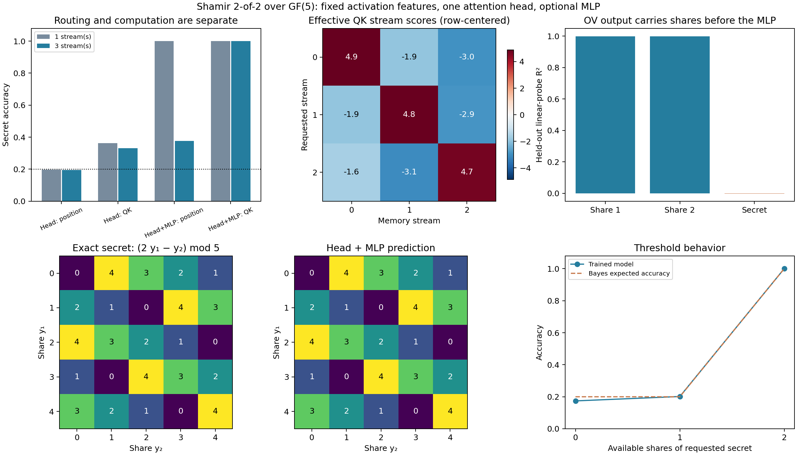

# Shamir HMM findings — 2026-09-10

Shamir sharing separates two issues that the clean reset HMM conflated:
retrieving the relevant observations and nonlinearly combining them. One
stream can still be solved with positional pooling plus an MLP. Three
interleaved streams, queried afterward, require query-dependent retrieval in
the tested architecture. However, that retrieval can use diagonal feature-QK.

The original single head with a linear output did NOT solve the task in these
runs. The successful arm adds a small MLP; its results are not evidence that a
single attention head alone implements Shamir reconstruction.

## Setting

We use 2-of-2 [Shamir polynomial sharing](https://people.cs.pitt.edu/~litman/courses/cs2001/lectures/lecture-02-p612-shamir.pdf)
over GF(5): S,a are independent uniform field elements, y1=S+a, y2=S+2a, and
S=2y1-y2 modulo 5. Either share alone contains zero information about S.
This experiment's finite-state HMM emits randomly ordered, tagged shares,
then a query, then the requested secret, before resetting. It is our protocol,
not a reproduction of a published Shamir-HMM model.

There are either one or three independent secret streams. In 25% of training
episodes the share sequence is shortened. Activations use the previously
verified 50-in-100 Chanin geometry with binary feature coefficients. Stream
identity is represented by the same feature in query and memory; share (x,y)
values have ten distinct feature atoms. See [README.md](README.md) for the
complete generator and encoding.

The query feeds Q only: attention reads strictly prior shares, with no query
residual or direct query input to the readout. Full-QK and position-only heads
both have learned relative-lag score biases. The optional MLP is 100→256→100
with ReLU. Each of 24 cells trains 6,000 steps, batch 128; there are three seeds
per setting. The task is query-to-next-secret activation MSE, not modeling
every emission in the protocol.

## Main comparison: all shares available

These are means across three training seeds. Each model sees 2,048 fresh
full memories, each queried for every possible stream while keeping the
memory fixed. Thus the three-stream audit has 6,144 queries on 2,048 independent
memories. Accuracy is secret-value accuracy; NMSE=1 is the population
unconditional-mean predictor. [Full seed ranges](TABLES.md) are retained.

| Streams | Readout | Routing | Accuracy | NMSE |
|---:|---|---|---:|---:|
| 1 | Head only | Positional | 19.76% | 1.0003 |
| 1 | Head only | Full QK | 36.31% | 0.8240 |
| 1 | Head + MLP | Positional | 100% | 0.0019 |
| 1 | Head + MLP | Full QK | 100% | 0.0017 |
| 3 | Head only | Positional | 19.55% | 1.0003 |
| 3 | Head only | Full QK | 33.04% | 0.8416 |
| 3 | Head + MLP | Positional | 37.57% | 0.8968 |
| 3 | Head + MLP | Full QK | 100% | 0.0018 |

The successful three-stream model directs 99.82% of attention mass to the two
shares of the requested stream. Changing the request changes the prediction
to the newly requested secret, with 100% measured accuracy in every seed.
The representative model also reconstructs the exact 5×5 modular arithmetic
table on all 25 possible requested-share pairs with randomly drawn distractors.

All observed full-memory cases are classified correctly in the successful
arm, but activation MSE is small, not zero. This is held-out distributional
performance, not exhaustive verification over every multi-stream context,
proof of exact computation, or evidence of generalization to a larger field.

The plain-head result is an empirical training failure at this budget, not
a universal representational impossibility theorem. In fact its improvement
over chance shows that content-dependent softmax can supply some nonlinearity.
The fixed-position linear-output control has an exact additive-computation
obstruction, described in [THEORY.md](THEORY.md).

## QK: content is necessary here; off-diagonals are not necessary for accuracy

For the trained three-stream head + MLP, with all other weights held fixed:

| Intervention | Accuracy | NMSE |
|---|---:|---:|
| Original full QK | 100% | 0.00182 |
| Zero all content QK; retain positional scores | 35.64% | 0.91315 |
| Keep only the diagonal of feature-QK | 100% | 0.00393 |

These conclusions hold in all three seeds. The separately trained positional
model's 37.57% accuracy provides a control beyond ablating co-adapted weights.
The one-stream head + MLP, in contrast, remains at 100% accuracy after zeroing
QK; content dependence is not forced by sharing alone.

There is an exact architecture-specific explanation. Without content QK,
the output cannot depend on which stream is requested. Even an unrestricted
query-blind decoder given all three secrets has minimum population NMSE 2/3,
while a query-aware decoder can reach zero. This bound is independently
enumerated in the tests. It does not apply to architectures that pass the
query directly to an expressive output decoder. Our trained positional model
is above the bound; the bound is not a prediction of its achieved loss.

Conversely, since query and memory use the same identity atoms, a diagonal
stream-matching score suffices to select the appropriate pair. The off-diagonal
coefficients the model learns improve score margins and slightly improve MSE,
but removing them does not destroy secret reconstruction accuracy. Do not
read this as "the learned QK matrix is diagonal" or "off-diagonals have no
effect." A pure stream-selection score intervention also retains 100%
accuracy on complete requested pairs in the mixed-prefix test.

The plotted effective score includes query-type contributions and is centered
over memory-stream identities per query. Its negative off-diagonals are relative
scores, not direct evidence of the extra-feature penalty found in the earlier
reset-chain experiment. Feature-resolved scores reconstruct actual content
logits to maximum absolute error 1.91e-6 in the three successful seeds. Replacing
true directions with the aligned recovered SAE directions changes the used
QK coefficient block by only 0.394–0.418% in relative Frobenius norm. This is
a basis-stability check, not a new SAE recovery experiment on these emissions.

## OV: transport the shares, then combine them

Held-out affine ridge probes on the head output BEFORE the MLP recover each
requested share with 100% accuracy in all three successful seeds. Mean
regression R² is .99931 for share 1 and .99946 for share 2. Regression to the
secret one-hot vector instead has R² −.00231. Its argmax accuracy is 27.64%,
above the 20% chance rate, so the probe results must not be overstated as proof
of no linearly classifiable secret information.

The supported interpretation is: QK selects the stream, OV preserves the
two operands, and the nonlinear readout reconstructs the secret. Raw OV
coordinates are not uniquely aligned to secret-output features when a learned
MLP follows: an invertible coordinate change can be absorbed into that MLP.
This is why operand probes, rather than a claim of diagonal OV recovery, are
the relevant measurement here.

## Below threshold: accuracy is appropriate, calibration is imperfect

For the successful three-stream full-QK + MLP setting, the mixed-prefix
held-out test gives:

| Requested shares visible | Examples per seed | Accuracy | NMSE | Squared error to Bayes mean (normalized) |
|---:|---:|---:|---:|---:|
| 0 | 536 | 17.41% | 1.2562 | 0.2357 |
| 1 | 949 | 20.16% | 1.0078 | 0.0071 |
| 2 | 6,707 | 100% | 0.00184 | 0.00184 |

Before both shares arrive, population Bayes accuracy is exactly 20%; sample
accuracy need not equal 20%. The zero-share model is poorly calibrated: its
prediction strays from the correct uniform mean. Softmax must attend to some
nonmatching share when none match, and this architecture has no null memory
slot. That is a plausible contributor, not a causally established explanation.

Overall NMSE is 0.20045 against empirical Bayes NMSE 0.18127 (population Bayes
NMSE 0.18333). Normalized squared distance to the exact Bayes conditional mean
is 0.01774. Therefore this is not exact Bayesian filtering across all prefixes,
despite perfect reconstruction once both requested shares are observed.

## Bottom line

Shamir sharing provides a clean synergistic-memory task: neither observation
alone predicts the secret, while their combination determines it. Interleaving
queried streams creates necessary content-based retrieval in this reader.
But the interesting inference is not automatically an off-diagonal QK
mechanism. In this encoding, near-diagonal identity matching retrieves
share representations, and a nonlinear readout performs reconstruction.

To specifically study necessary off-diagonal inference, a further experiment
should make WHICH observation is relevant depend on a prior share's value,
not only a fixed shared stream identity. Using distinct query/key labels would
produce off-diagonals trivially by encoding choice. Adding another attention
layer or a recurrence would then be an explicit architectural variable, not
something to conflate with the present one-head experiment.

All 24 cells completed; five independent mathematical/algebraic tests and
static error checks pass. Checkpoints, interventions and raw metrics are
retained in this directory. Initial pilots are excluded from seed aggregation.
