# Attention-score edits measure gauge, content edits obey a path calculus: an exact theory of feature-resolved attention on toy models

**TL;DR.** Feature-resolved attention (FRA) splits a head's behavior into
score terms ("who attends to whom", QK) and transported content ("what
flows", OV), each resolved through a sparse-feature basis, and lets you
delete any piece. Empirically, QK edits never removed a broad in-context
concept and exact OV severing barely moved it, while an amplified OV edit
(gain ≈ 4) nulled the behavior completely without reducing the concept's
decodability. This sprint derives all four facts on the simplest toy models,
inside the constrained-belief-update theory of one-layer transformers.
(1) For some tasks the optimal attention pattern is the same whatever the
tokens are; we prove this holds in both the decaying-evidence regime and
(via a new flat-profile theorem) the mixture/counting regime. Whenever it
holds, every score term that involves token content is forced to be either
a component the softmax provably ignores (a row constant) or one of a pair
the optimum forces to cancel. FRA-QK score mass is therefore
overwhelmingly *gauge* — free parameters the loss never saw — and the
effect of any partial cut is predicted to four decimals by a one-parameter
formula. Trained models do carry a small, real content-gating (worth ~1% of
the attention benefit on our data), but it wears a disguise: its score
structure looks like induction and is seed-robust, yet a same-token gate
buys nothing, and ablating the content channel overstates its value 17×.
Score-mass screens can't see any of this — causal tests can. (2) FRA-OV attributions
equal the theory's effective subspace attention, closed form ζ^(d−s), up to
a derived softmax "normalization warp" that also explains a previously
unexplained anomaly in trained weights. (3) Interventions obey a path
calculus: severing a path that carries a share ρ of the concept moves
behavior by only (cρ)² — the removal fraction is quadratic in the severed
share, so honestly severing a quarter-share path removes 6% — and the
gain-tuned null sits at c\* = 1/ρ, predicted ex ante to machine precision
in logit space and to 13% behaviorally. One severing measurement calibrates
the null: c\* = 1/√(removal fraction at c=1) gave 4.03 vs the measured 4.0. (4) Use and presence
separate for rank reasons: one gain can null the readout exactly when all
paths aggregate the same statistic, but no gain can null the full
representation unless the severed edge is a rank bottleneck — so gain-tuned
edits leave the concept decodable (probe R² 0.985 at the behavioral null),
and only content deletion at the aggregation source reduces presence, at an
information-theoretic collateral price. Two bonus results: the trained
mixture model's attention profiles quantitatively *match* the MSE theory's
optimal profile once the process spectrum is computed exactly (resolving
what first looked like a theory-violating anomaly), and the SAE property
FRA cuts need is identified constructively — token-purity of the summed
cut feature, achievable by position-demeaning the SAE's inputs, while
capacity scaling does not achieve it.

---

## What problem this solves

The prior experiment `experiments/fra_hmm_toy` works with a 3-layer,
2-head transformer (plus a TopK SAE on its residual stream) trained on
sequences generated by first drawing a mixing weight ω per sequence and
then emitting tokens from ω-weighted grammar components; the "concept" to
remove is ω, which the model estimates by counting. That experiment
established *empirically* that "remove the
concept" splits into removing its **use** (cheap, achievable) and its
**presence** (taxed, unachieved), and produced these headline numbers:
QK cuts inert everywhere despite 57–75% of score mass being feature×feature;
OV severing at c=1 removing only 6% of use (RF, *removal fraction*, = 0.06);
a gain-tuned c\*≈4 null with
presence intact at R²=0.985; SAE content cuts the only presence-reducers.
None of these numbers had a derivation. Three theory notes — P1 (the
attention-head-unit paper), P2 (constrained belief updates), P3 (the
one-layer MSE analysis); we use these labels throughout —
provide machinery for *stationary* processes but say nothing about FRA
objects, mixtures, or interventions. This sprint's goal was the missing
theory: closed forms for what FRA-QK and FRA-OV attributions compute, and
laws for when FRA edits control behavior — worked exactly on the simplest
models and verified numerically. Every headline number in the old table is
now derived or predicted by a one-parameter law, and the one measurement
that initially had to be marked "unexplained" — trained pattern rates
apparently exceeding the process eigenvalue — dissolved when the exact
process spectrum was computed (Finding 2).

## The five findings

(The four facts of the TL;DR map onto findings 1, 5, 3, and 4; finding 2
is the theorem that defines the aggregation regime they live in. Every
law's scope conditions are collected in the honesty ledger at the end —
each finding below states its strongest form.)

### Finding 1 — FRA-QK score mass is gauge; the real content-gating is small and causal tests are the only way to find it

**Theorem (QK gauge).** If a bilinear-score softmax head produces the same
attention pattern for every token sequence, then its score function is
forced into the form *(row constant depending on the query token) + (purely
positional mechanism)*: content×content terms must be additively separable,
and the key-side content score must be literally constant across tokens (a
hard cancellation between two channels, not a softmax gauge). Consequences,
verified on a 1-layer transformer trained on Mess3 (a hidden Markov
process with three states and three tokens, written z ∈ {0,1,2}, where
evidence about the state decays by ζ=0.7 per step):

- a cut of *all* key-side content subtracts a row constant — the pattern
  changes little and the loss less (the residue measures exactly the failure
  of the premise, below);
- a *partial* cut (one token's features) perturbs the pattern by a
  one-parameter formula, TV = |cφ|·m_d(1−m_d) with m_d the row's attention
  mass on the cut tokens (averaged over rows), where φ is a common-mode
  scalar the loss never saw (gauge): measured effects match to 4–5 decimals;
- query-side cuts are NOT symmetric: they can remove genuine positional
  mechanism routed through the content channel (measured: 2.2× the key-side
  damage), an asymmetry FRA practice should respect.

**The honest boundary.** The premise "pattern token-independent for every
sequence" holds in trained models only *on average*. Flipping a single
source token moves its attention weight ~55% relative on average: the trained model
content-gates. Dissecting that gating (retraining with the content→QK path
severed, then adding back an optimal token-pair gate) gives a CE ladder
with three lessons. First, the model's advantage over the best
constrained-update ansatz is mostly a *better positional profile* (64% of
it); genuine content-gating is worth only 0.0002 nats. Second, *ablation
overstates mechanism value 17×*: cutting the content channel in place costs
0.0034 nats, because the model builds gauge structure on that channel;
retraining without it loses only 0.0002. Third, the learned score
interaction has a clean same-token (induction-looking) shape that is
*seed-robust* (cosine 0.996–0.998 across four seeds) — yet it is causally
near-inert, and the gate a causal optimizer would choose has a different
shape (cyclic, cosine 0.52 with the learned one) and captures only a
quarter of even that 0.0002. A tuned same-token gate gains 6e-7 nats —
nothing; the gating is not induction-shaped. In the
mixture regime the same trained-model check shows large pattern changes
under QK cuts (median row TV 0.156 at c=1) that remain behaviorally null
for a different reason: what the head aggregates is a count, and the score
perturbation is uncorrelated with the counted tags in the attention-weighted
sense (measured covariance 0.018 against 2.6-nat score deltas). So FRA-QK
mass decomposes three ways — dominant gauge, small genuine gating, and
perturbations that counting is robust to — and *no mass-based screen
distinguishes them*; only causal probes (does re-gating change behavior?)
find the boundary. This is the derived version of the old empirical rule
"FRA-QK cuts are inert in the aggregation regime yet score mass looks
content-rich".

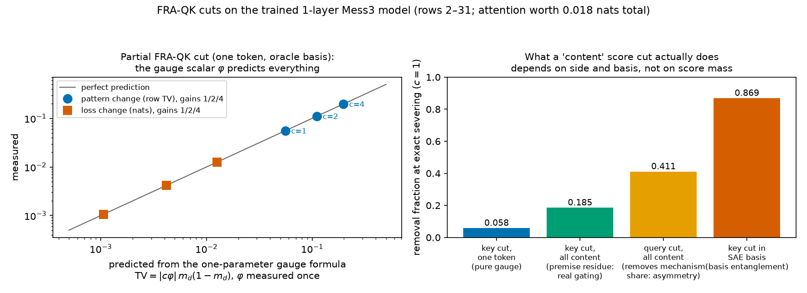
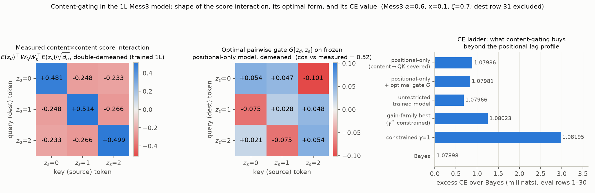

(The full 12-condition cut battery behind these panels is in
`figures/phaseA_qk_cuts.png`.)

**The bookend: the same shape, made load-bearing.** To demonstrate the
boundary rather than just state it, we built the minimal induction toy
(random tokens with a per-sequence copy rule "A is followed by B", planted
at random positions, plus a previous-token input channel so one head
suffices) and repeated the exact measurements. The learned score
interaction has the *same* same-token shape as in Mess3 (Frobenius share
0.999 in both) — but now it is the mechanism: flipping a source's previous
token collapses its attention weight by 98% (Mess3: 55%), the in-place
key-content cut at c=1 removes essentially the whole attention benefit on
rule positions (RF 0.988; ΔCE 1.54 nats vs Mess3's 0.0034), retraining
with content→QK severed costs 0.90 nats (Mess3: 0.0002 — a 4400× ratio),
and a tuned same-token gate is worth 0.17 nats on rule positions (Mess3:
6e-7 anywhere). Shape identical, causal role opposite, across two to five
orders of magnitude: nothing about a score matrix's appearance says
whether it matters — the data distribution decides, exactly where the
gauge theorem's premise draws the line. (The experiment also demonstrated
its own pitfall en route: with rule pairs planted at *fixed* positions,
a positional shortcut leaks most of the rule into the lag profile and the
measured content value drops 3×; randomized placement removes it.)

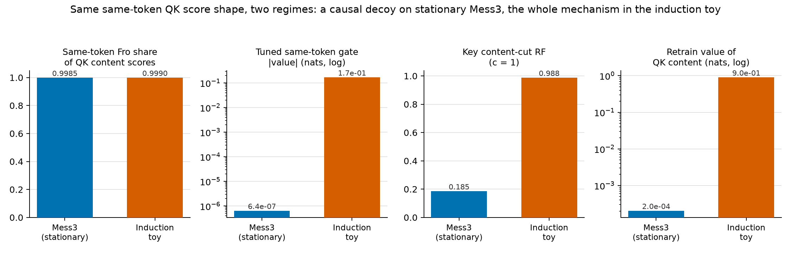

**The basis requirement, made constructive.** In the trained TopK-SAE
basis the same key-side "content" cut is catastrophic (RF 0.87 vs the
oracle's 0.19) because latents mix token identity with position bands.
Retraining the SAE on the position-demeaned residual restores oracle
behavior exactly (RF 0.185 at near-perfect reconstruction); giving the SAE
position as a free side-input nearly does (0.216); an 8× larger dictionary
does not (0.344). The property that matters is that the *summed* cut
contribution be a pure function of token identity (its token-R² —
1.000/0.972/0.872/0.830 across bases — tracks RF), not that individual
latents look like token embeddings: even the repaired SAEs have per-latent
decoder cosines of only ~0.55, because TopK splits each token's direction
across latents whose sum is right. FRA cut-sets are set-level objects;
their fidelity is a set-level property.

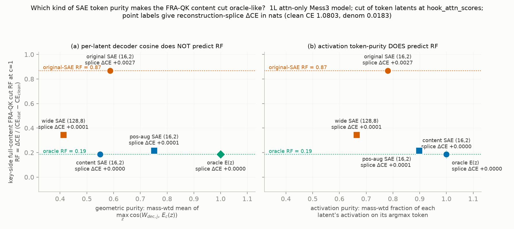

### Finding 2 — the mixture concept is the λ→1 spectral limit, where flat attention is provably optimal and the concept must live in content

**Theorem (flat-profile optimality).** For exchangeable data — draw a latent
mixture weight ω once per sequence, then tokens i.i.d. given ω; exactly the
fra_hmm_toy concept — all lag-τ pair statistics are equal for τ≥1. (In
spectral language: every feature of the data decays at some rate λ per
step; grammar features have λ<1, while the never-decaying mixture concept
is a λ=1 mode.) Then the
benefit attention adds to a one-layer model collapses to a strictly
decreasing function of a single scalar: θ = the inverse participation ratio
of the attention lag profile (minimizing θ maximizes the benefit). Flat
attention uniquely minimizes θ; the diagonal (self) share
drops out exactly; and no lag- or content-gating can improve the optimum,
whose value ½·tr(B − BD⁻¹B) is the total predictive information the mixture
posterior carries beyond one token. The "aggregation regime" of the FRA
boundary map is therefore not an empirical regime but the λ→1 limit of the
spectral theory: as the concept's eigenvalue approaches 1, the optimal
profile flattens from ζ^(d−s) to counting, and the concept moves entirely
into *what* is aggregated. This fills the empty "cryptic modes" case of the
one-layer MSE theory. For mixture-plus-grammar data the optimum superposes
a flat floor and short-lag geometric structure — the trained 3-layer toy
realizes exactly this, as head specialization (block-0 heads flat and
carrying ~100% of the concept; block-1 heads geometric; block-2 one of
each).

**The trained rates are the theory's rates.** The block-1 heads' fitted
geometric rates (0.86–0.91) initially looked anomalous — decaying more
slowly than the recorded grammar eigenvalue (0.76) allows, the wrong
direction for a theory that predicts faster-than-process decay. Computing
the MSE-optimal profile for the *exact* toy process
dissolved the anomaly twice over (P3 calls its optimal profile rates η,
hence the figure's "eta discrepancy"): the toy's process file has a
non-standard normalization (true component eigenvalue 0.85, not 0.76), and
mixture components advance only when selected, so the observable grammar
mode is 1−ω̄(1−ζ) = 0.94. The theory-optimal profile, put through the
identical fitting procedure, reads 0.87 — inside the trained band, and the
trained head profiles lie essentially on the theory curve. The theory's
"optimal rates sit below the process eigenvalue" survives with the right
eigenvalue (0.87 < 0.94). Two general lessons: rate-vs-eigenvalue
comparisons are only as good as your identification of the process, and a
single-geometric fit to a multi-mode profile reads systematically high.

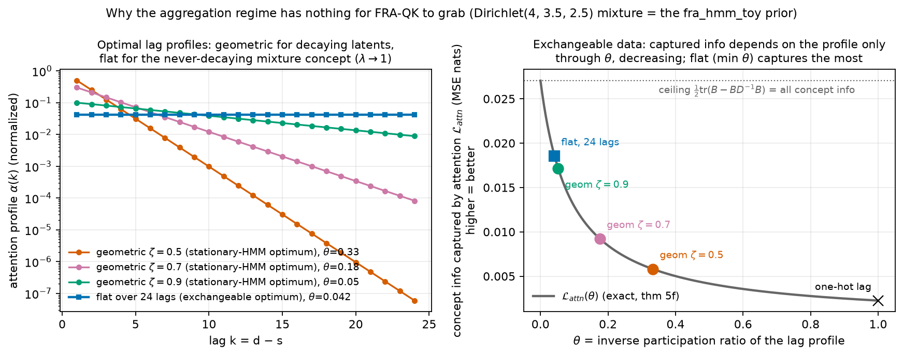
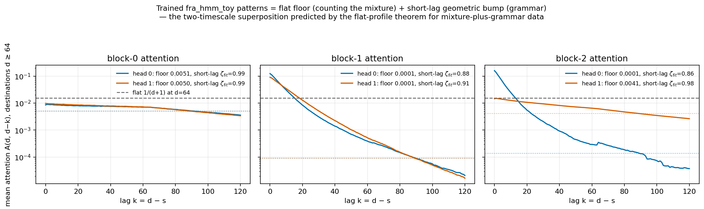
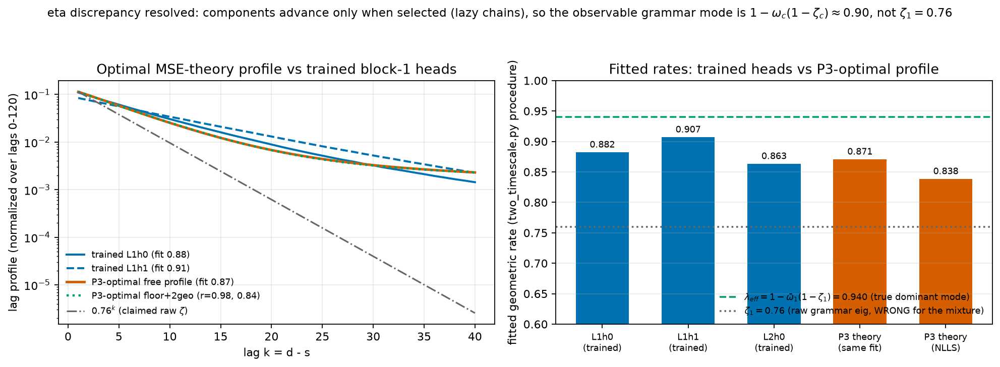

### Finding 3 — interventions obey a path calculus: removal is quadratic in the severed share, and the gain-tuned null is predictable ex ante

Write the concept signal at the readout as a sum over paths; a cut on one
edge with concept share ρ at gain c scales the model's operational estimate
by 1 − cρ. Two laws follow. The **tracking null**: concept-tracking declines
linearly and crosses zero at c\* = 1/ρ — verified in a 2-layer counting
transformer to machine precision in logit space, for two cuts with ρ
differing 6.4× (predicted 12.41/1.94 from the clean decomposition; measured
logit-space tracking nulls 12.405/1.938; the *behavioral* post-softmax
nulls — the "meas 10.82/2.17" in the figure — land within 13%, pure
softmax curvature). The
**quadratic removal law**: because the clean model is near-optimal, cross
entropy is *stationary* in the concept signal, so RF(c) ≈ (cρ)². Honest
severing under-reaches quadratically — a quarter-share path yields RF =
1/16, which is why exact severing looked so weak in the original
fra_hmm_toy experiments.
One fitted ρ = 0.242 reproduces fra_hmm_toy's entire dose-response curve
(c\* predicted 4.13 vs measured 4.0; RF(1) predicted 0.059 vs 0.062; the
seed-43 replica: ρ = 0.203, c\* 4.93 vs measured ≈4.6 — a 7% miss, the
worst in the set), and a parameter-free identity
— removal fraction + tracking R² = clean tracking R², flat in c — holds to
±0.01 up to the null (it breaks past it) and reveals the cut to be a pure
contraction of the model's
operational estimate (it scales the model's noise along with its signal).
**Scope, learned the hard way:** the quadratic *coefficient* requires the
severed content to be concept-pure. fra_hmm_toy's cuts sever
concept-selected SAE latents (87% aligned) and obey (cρ)²; severing a whole
path in the counting model (paths are ~30% concept) still gives quadratic
CE growth but with a far larger coefficient and *no* CE null — only the
tracking null survives. The practical corollary survives in the pure case:
one severing measurement calibrates the null, c\* = 1/√RF(1) = 4.03 vs 4.0
measured.

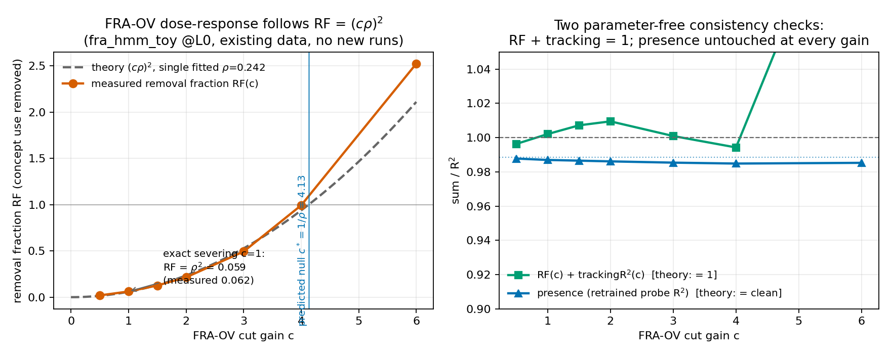
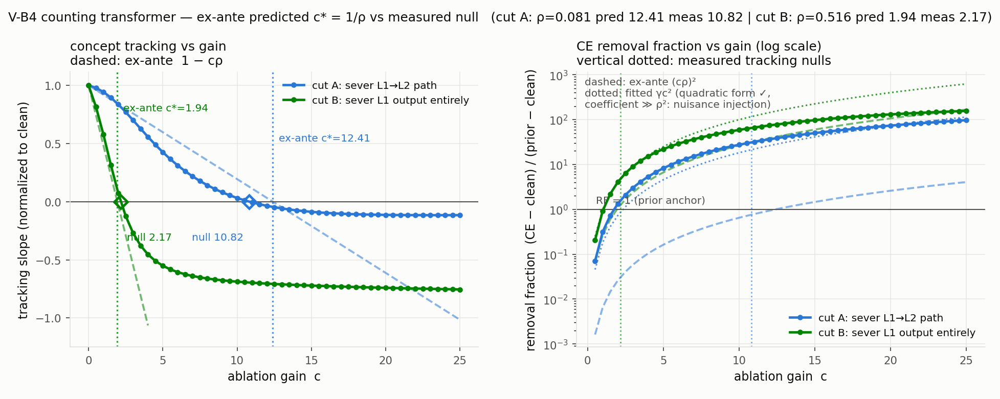
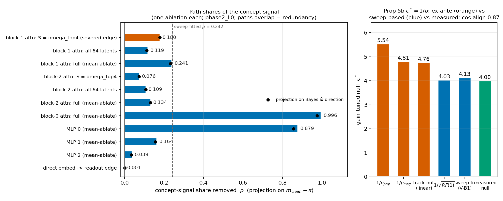

(In the path-share figure, "block-k attn"/"MLP k" name the fra_hmm_toy
model's three transformer blocks, and "S = omega_top4" is the severed set
of four concept-selected SAE latents; each bar is one ablation's measured
share of the concept signal.)

### Finding 4 — use and presence separate for rank reasons; gain-tuning relocates, only severing deletes, and only at the source

Linearizing the network around the concept: behavior reads a 2-dimensional
projection of the residual concept image, while presence is the full
d_model×2 Jacobian. A single gain c can null the projection exactly when
all paths carry *proportional* copies of the same statistic — the
homogeneous-aggregation signature (measured: all three mixture components
hit the prior simultaneously at one c\*). No gain nulls the full Jacobian
unless the severed edge is a rank bottleneck; hence presence survives every
gain (probe R² 0.97–0.996 across all sweeps, seeds, and prior shifts). The
counting model reproduced the whole story on cue: presence stayed ≈ clean
at every gain *except* a sharp dip exactly at c=1 for the total-path cut —
exact severing genuinely deletes that path's copy; any other gain is a
counter-injection that itself carries a decodable image. Severing deletes;
gain-tuning relocates. Content cuts at the aggregation source are the only
family that reduces presence, and only if the cut set spans the concept's
carrier — which overlaps the token identities the grammar needs. That
overlap is priced by the original experiment's entanglement-tax bound (an
observer with zero concept information must lose at least 20.8% of the
grammar's predictive range), which this account gives a role: the floor of
the use/presence frontier.

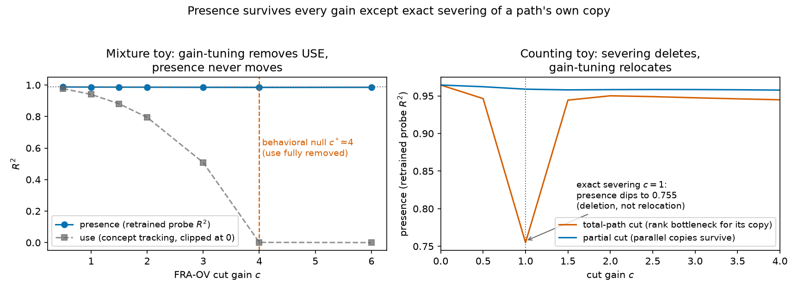

### Finding 5 — the constrained update is exactly softmax-realizable, its warp explains a known anomaly, and FRA-OV attributions are its effective subspace attention

A single softmax head can produce the constrained belief update *exactly*
(scores linear in key position plus a first-position sink bonus; the sink's
value vector smaller by exactly 1−ζ) — but only with position-dependent
value magnitudes. Real additive positional embeddings forbid that, forcing
a derived "normalization warp": the output is the correct update times
1/(1−ζ^d), an early-position overshoot no token-independent component can
repair. The trained model carries the damped warp (RMSE 0.15 against the
warp curve vs 0.32 against flat), which we propose as the quantitative
content of the previously unexplained first-position discrepancies in the
constrained-belief paper. In this realization the FRA-OV attribution of a
token feature at lag d−s is ζ^(d−s)·g(z)/(1−ζ^d) — the effective subspace
attention of P1, now in an SAE basis. Severing all of
it at c=1 removes the update essentially completely: three independent
estimates of the severed share ρ agree it is ≈1 (1.06 predicted from how
the lag-0 term splits between the skip path and diagonal attention, 1.11
from the dose-response fit, 0.97 from tracking). Presence collapses
together with use here: one layer has no redundant second path, so the
use/presence split of Finding 4 is genuinely a property of multi-path
aggregation, not of the FRA edit itself.

**Per-head attributions: the gauge is real but SGD doesn't use it.** On the
negative-eigenvalue case (ζ = −0.5), where the theory forces two heads with
antiparallel value circuits to split even and odd lags, five seeds all
collapse their head-*sum* effective attention onto the ζ^k oscillation
(cosine 0.995–0.997 with theory) — and, against our expectation, the
per-head decompositions are just as seed-stable (cosine 0.997–0.998 after
head relabeling): training selects a canonical even/odd split rather than a
random point of the theoretically-free family. The gauge dependence that
bites in practice is the *training budget*: the even-lag component learns
~4× slower, so per-head shares double between 4k and 16k steps while the
loss barely moves. Per-head FRA rankings are therefore checkpoint-dependent
even when they are seed-stable — and a premature measurement would wrongly
report the head-sum constraint itself as broken.

**The profile the objective actually wants (and the warp is not it).**
Optimizing the lag kernel itself inside the additive-update family shows
cross entropy prefers a kernel that boosts the diagonal (lag-0 weight 1.69×
the ansatz) and decays *faster* than the process (rate 0.61 vs ζ=0.7) — and
the retrained positional-only transformer lands on the same choice (rate
0.575). This is partial-regression shrinkage: additive evidence over an
autocorrelated sequence double-counts, so optimal weights shrink the
correlated tail — the same direction as the one-layer MSE theory's
prediction that optimal rates sit below the process eigenvalue. Two
control experiments sharpen the warp story: kernels freed per destination
row gain nothing (a numerical cross-entropy analogue of Toeplitz
optimality), and they show no early-row boost — so the warp the trained
softmax model carries is forced by softmax normalization, not preferred by
the objective.

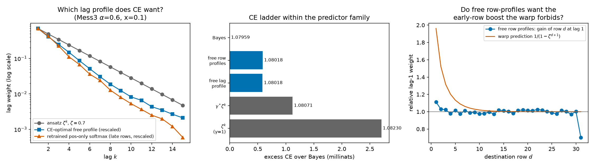

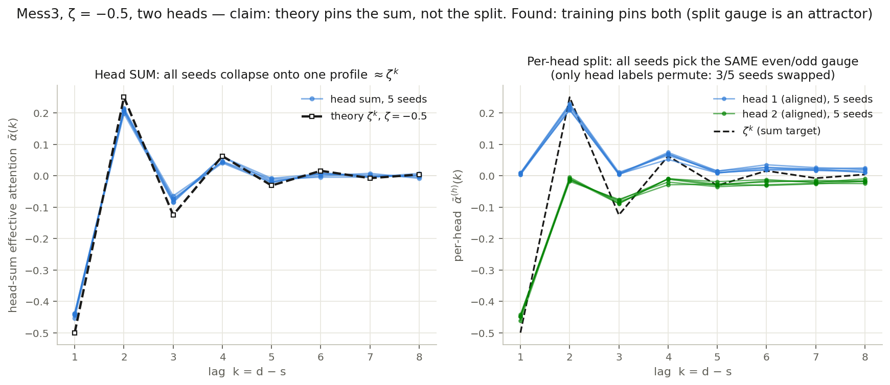

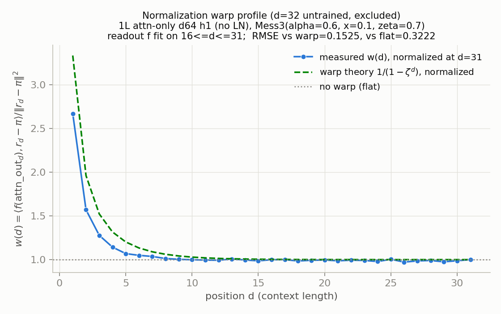

## Honesty ledger (what does not work or is unexplained)

- The trained 1-layer model beats the *entire* gain-scaled constrained-update
  family (CE 1.07966 vs best-gain 1.08023 vs Bayes 1.07898, eval rows 1–30,
  four seeds): the ansatz explains geometry and weight structure, but its
  best gain-scaled member still sits 1.3 millinats above Bayes, and the
  trained model recovers 0.6 of those. The dissection attributes that edge
  64% to positional-profile freedom and 36% to content-gating, and of the
  gating value an optimal token-pair gate captures only a quarter — the
  rest requires position-dependent or higher-order gating we did not
  characterize.
- The quadratic law's coefficient needs concept-pure cuts (see Finding 3);
  pointwise ρ varies ±10% within a sweep; past the null the response is
  super-quadratic; the null drifts with the concept prior (c\* 3.4→4.2
  across concentrations 30→0.5) — a calibrated equilibrium, not a
  structural removal, exactly as the original robustness battery said.
- Trained SAE latents fragment tokens into position bands; in that basis a
  "content" QK cut destroys positional mechanism too (RF 0.87 vs 0.19 for
  the oracle basis). FRA conclusions are only as good as the basis — but
  the requirement is now constructive (see the SAE-repair experiment,
  Finding 1): an SAE trained on the position-demeaned residual restores
  oracle behavior exactly (RF 0.185, near-perfect reconstruction), a
  position-augmented SAE nearly does (0.216), and raw capacity does not
  (128 latents, K=8: 0.344). The operative property is token-purity of the
  *summed* cut feature (token-R² 1.000/0.972/0.830 tracks RF), not
  per-latent decoder geometry — every repaired SAE still has per-latent
  cosine ≈ 0.55 to the token embeddings because TopK splits each token
  across latents that sum correctly.
- All theorems are MSE-side (the P3 framework) or ansatz-side (P2); the CE
  checks are numerical. The two-state η<λ result and the flat-profile
  theorem have no CE analogue yet (though the CE-optimal kernel experiment
  in Finding 5 matches the MSE prediction's direction).
- The rate anomaly formerly in this ledger (trained 0.86–0.91 vs eigenvalue
  0.76) is resolved in Finding 2; the residue is a caution, not a mystery:
  the fra_hmm_toy process file's normalization differs from standard Mess3,
  so any downstream analysis quoting ζ=1−3x for it inherits the error.
- QK inertness in the aggregation regime must be stated in the
  attention-weighted inner product: the raw correlation between QK-cut
  score deltas and the counted tags is *not* small (0.25).

## Map of the work

| artifact | what it contains |
|---|---|
| `notes/fra_theory_note.tex` (+pdf) | formal definitions, the gauge theorem, warp propositions, flat-profile theorem, intervention laws, use/presence ranks |
| `notes/fra_pedagogical_note.tex` (+pdf) | the same theory rebuilt from worked numbers |
| `notes/derivations.md` | working derivations with verification status per claim |
| `notes/ingredients.md` | condensed equations extracted from P1/P2/P3 |
| `code/phaseA/` | Mess3 process + exact ideal model (1e-16 checks), trained 1L, SAE, QK/OV cut experiments, induction-germ probe |
| `code/phaseA2/` | two-head negative-ζ gauge experiment (5 seeds) |
| `code/phaseA3/` | content-gating dissection + seed robustness |
| `code/phaseA4/` | SAE-repair: which basis property restores oracle cut behavior |
| `code/phaseB/` | (cρ)² fits on existing fra_hmm_toy sweeps, path shares + QK bound on the trained toy, flat-optimality figure, two-timescale check |
| `code/counting/` | 2-layer counting transformer: exact path decomposition, ex-ante c\*, presence dip |
| `code/phaseC/` | CE-optimal lag kernel vs ansatz vs retrained softmax; per-row kernel warp test; P3-optimal profile for the exact mixture process (η resolution) |
| `code/phaseD/` | induction toy: the same same-token score shape as causal mechanism (regime contrast) |
| `figures/` | all PNGs referenced above |
| `RESEARCH_LOG.md` | chronological log incl. dead ends and revisions |

All experiments run on the pod in minutes; every number in this summary is
in a results JSON under the corresponding `code/*/out/`.
