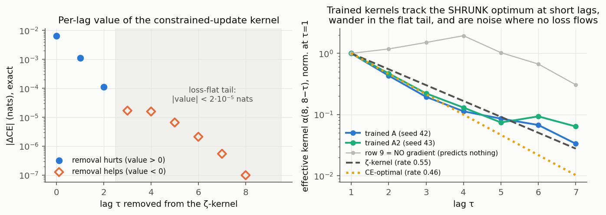
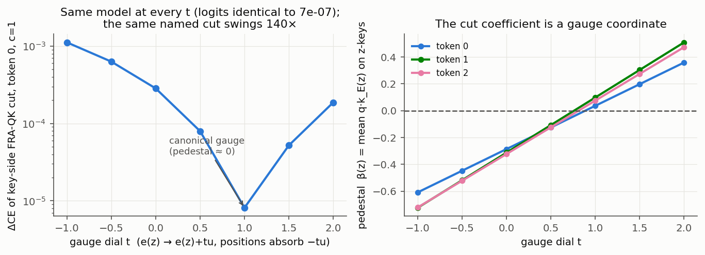
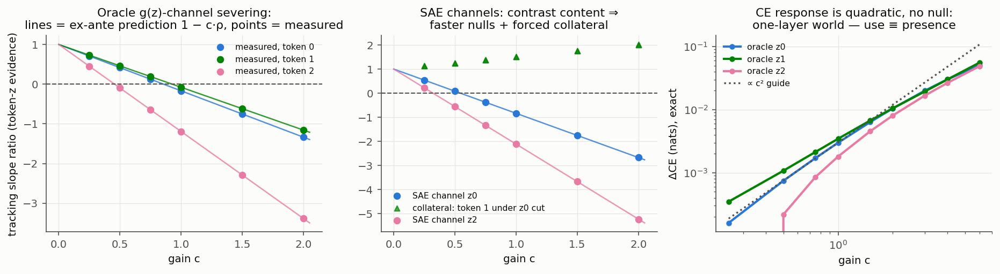
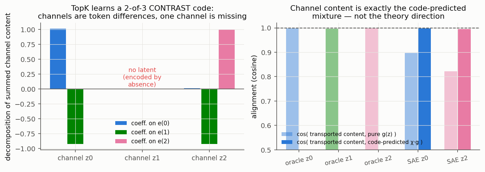
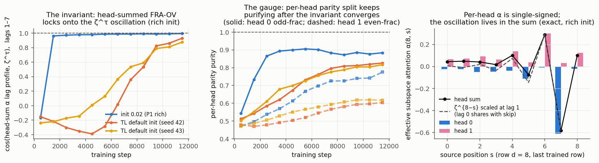
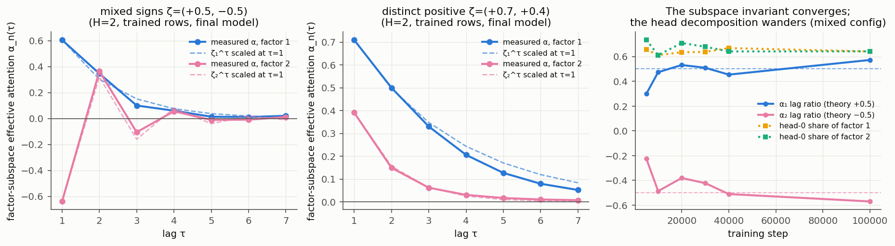
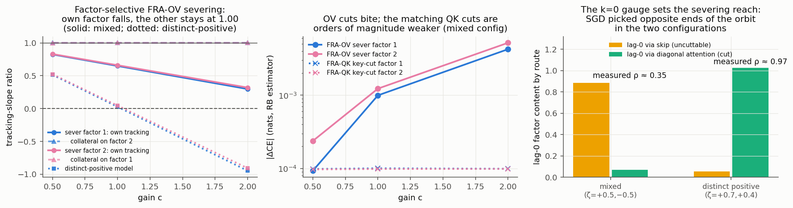

# FRA inside the constrained-belief program: every attribution and every edit, predicted ex ante in P2's and P1's own worlds

*Sprint 2 (local, single worker). Code: `sprint/code/phase{1,2}/`; formal note
`notes/fra_cbu_note.tex`; pedagogical companion `notes/fra_cbu_pedagogical.tex`;
full timeline `RESEARCH_LOG.md`. Everything in Phase 1 is computed **exactly**:
the analysis set is all 3^10 input sequences with exact process probabilities,
so there are no sampling error bars unless stated.*

## What this sprint did

The previous sprint built a theory of feature-resolved attention (FRA) — which
attention-score edits are gauge, which content edits obey a path calculus — on
its own toy platform. This sprint re-derives and re-measures that theory
**inside the published papers' own settings**: P2's single-Mess3 one-layer
softmax transformer (App. B faithful: d_model 64, d_ff 256, no BOS, CE,
~15M tokens; ζ = +0.55 with one head and ζ = −0.5 with two heads), then P1's
factored two-Mess3 products (App. L faithful: d_model 120, seq 11 with BOS,
Table-4 configurations). The result is a complete quantitative account of what
FRA measures on these models: the FRA-QK side is a gauge coordinate whose cut
effects a weight dial swings 140× at bit-identical model behavior; the FRA-OV
side is the real handle, whose tracking effects we predict ex ante to four
significant figures and whose CE effects follow the quadratic path calculus;
and the SAE dictionary itself is the binding constraint — TopK learns a
minimal contrast code in which one of three theory channels does not exist as
a cut set. In the factored world the same objects factorize on cue: FRA-OV
aggregated to a factor subspace recovers each factor's eigenvalue from a
single model, factor-selective severing works with the untouched factor as a
built-in collateral control reading exactly 1.00, and the severing reach
is set by the model's end of the k=0 gauge orbit — which, across six models
spanning both phases, seeds, and init scales, is selected by the data
spectrum's sign structure (positive → diagonal attention, any negative
eigenvalue → the skip), not by SGD randomness.

## Finding 1 — Beyond lag 2, P2's world is loss-flat, and trained patterns fill it with seed noise

The constrained-belief update r₁(d) = π + Σ_s ζ^{d−s} g(z_s) assigns the lag-τ
term a definite CE value, computable exactly by enumeration. The ladder (left):
lag 0 is worth 6.6 millinats, lag 1 is worth 1.1 millinats, lag 2 is worth
0.11 millinats — and **every lag beyond 2 is worth less than 2·10⁻⁵ nats, with
a negative sign** (removing it *helps*: additive evidence over an
autocorrelated chain double-counts, so the ζ-kernel's tail overweights). The
CE-optimal kernel in the same family is cleanly geometric with rate 0.464,
*faster* decay than the process eigenvalue ζ = 0.55 — the prior sprint's
partial-regression shrinkage, now exact in P2's own setting. Allowing the
kernel to vary freely per destination (55 parameters instead of 10) improves
CE by under 3 microNats: a numerically exact CE-side analogue of P3's Toeplitz
optimality. And P3's own machinery predicts the rate: the MSE-optimal
geometric kernel for this exact process (P3's free-profile reduction, matched
unnormalized family; `close_gaps.json`) has rate 0.467 — within 1% of the CE
optimum. The MSE↔CE gap, the program's main formal caveat, does not move the
optimal spectral rate here. (In the row-normalized family the MSE-optimal
rate reads 0.332 — the kernel family matters when quoting rates.)

The α-dependence confirms the mechanism (config A20: x=0.15, α=0.2 — P2's
other grid value; `kernel_ce_A20.json`): weak emissions shrink the whole
information budget 14× (0.66 millinats available; max ladder rung 0.47
millinats; no negative rungs), the shrinkage itself nearly vanishes
(CE-optimal rate 0.529 ≈ ζ = 0.55 — double-counting is second-order in the
evidence strength), the ζ-kernel sits within 1 µnat of the family optimum,
and the trained kernel wanders further from theory (fitted rate 0.72)
exactly as the weaker pinning predicts — while the qualitative P2
predictions persist (attn_out still prefers constrained r1, 0.79 vs 0.77;
token-independence relstd 0.066).

Consequence (right): the trained kernels show three regimes in one panel.
Where the loss pins them (lags 1–4), both seeds track the **shrunk optimum**
— decay ratio ≈ 0.43–0.45, matching the CE-optimal 0.464 and clearly below
the process eigenvalue ζ = 0.55: the trained model itself confirms the
partial-regression shrinkage prediction, in P2's own setting. In the flat
tail (lags ≥ 5) the two seeds wander apart, exactly where the ladder says
deviations cost microNats. And the last attention row — position 9 predicts
token 10, which is never scored, so **no gradient ever flows through row 9**
— is pure noise (gray), an order of magnitude off, with a spurious bump at
lag 4. Naive "fitted decay rates" that pool all rows (including the untrained
one) read 0.68–0.71 and would wrongly reject the spectral ansatz; restricted
to trained rows the kernel is clean. Any FRA analysis that attributes meaning
to structure the loss never saw — flat-tail wiggles or gradient-free rows —
is reading noise. (The trained models sit 0.26–0.51 millinats above exact
Bayes, capturing ~97% of the available 9.4 millinats; config A beats the
r1-ansatz readout, A2 does not — the whole seed spread is ~0.25 millinats.)

## Finding 2 — FRA-QK cut effects are a dialable gauge on the faithful P2 model: 140× swing at bit-identical behavior

The prior sprint's gauge theorem says: at a token-independent-pattern optimum,
every FRA-QK cut coefficient is a gauge coordinate, dialable by loss-preserving
reparameterizations. The G1 dial (e(z) → e(z) + tu with positions absorbing
−tu) leaves every residual, activation and logit **bit-identical** (max logit
difference 7·10⁻⁷ across the dial) — yet the *same named operation*, "cut the
key-side FRA-QK term of token 0 at gain 1", produces ΔCE from 1.1·10⁻³ nats
down to 8·10⁻⁶ and back up: a 140× V-shape whose minimum sits exactly where
the measured pedestal β(z) = q·k_E(z) crosses zero (right panel). The
irreducible residue at the bottom (~10⁻⁵ nats) is the size of the loss-flat
scale of Finding 1 — i.e. the gauge-invariant content of FRA-QK cuts on this
model is indistinguishable from the noise floor the loss never sees.

The dial replicates on the second seed (A2, `out/A2/gauge_wide.json`), with
an instructive twist: the *same* dial direction has a seed-dependent lever
arm (it moves A2's pedestal 14× less per unit t), so the dial must be swept
±30 to cover the same pedestal range — G1 is exact at any magnitude
(identity ≤ 8·10⁻⁷ throughout). Over β(z0) ∈ [−0.65, +0.73] the cut's ΔCE
spans 34× (3.7·10⁻³ → 1.65·10⁻⁴ → 5.6·10⁻³), with the minimum landing
exactly at the pedestal zero-crossing — at the dial value t = −1.7 predicted
ex ante from the pedestal's linear dial response. The V floor is
seed-dependent (1.7·10⁻⁴ vs seed 42's 8·10⁻⁶): the O(c·ε) leak term that
survives at β = 0 has a seed-dependent coefficient even at similar ε.

Two corroborating measurements. (i) The trained model's content leak — the
violation of the token-independence premise (C1)/(C2) — is *not* small here
(max C1 violation 1.5× the positional profile's slope scale): the pattern is
weakly pinned (Finding 1), so leak lives in flat directions too; the imported
cut calculus still predicts the responses, with the full-token-set key cut
(theory: exactly inert minus leak) costing 3.0·10⁻⁴ ≈ a single-token cut, pure
leak effect. (ii) Cut effects at fixed gauge differ across tokens by mass and
pedestal exactly as the two-valued softmax response predicts.

## Finding 3 — FRA-OV is the real handle: every tracking number predicted ex ante to 4 significant figures; CE follows the path calculus with no null

Severing a token's transported belief displacement — the FRA-OV edit, in
either the oracle basis (centered token content e_c(z), whose transported
image is parallel to g(z) at cos 1.0000/0.9966/0.9997) or the trained-SAE
basis — produces:

- **Exactly linear tracking response, with the linear-response magnitude
  computable from clean statistics.** The edited model's belief coupling to
  token-z evidence falls as 1 − c·ρ_eff. The prediction is a two-factor
  recipe, both factors from the clean model only (no edited forwards):
  ρ_eff = J/(E²·slope₀), where J is the removal-evidence covariance built
  from the mean pattern × per-cell transported channel vectors, and slope₀
  is the clean tracking slope that sets the ratio's units. Predicted
  1.1683/1.0789/2.1935 (oracle z0/z1/z2) and 1.8384/3.1181 (SAE z0/z2) vs
  measured 1.1683/1.0789/2.1935/1.8384/3.1181 (`refine_rho.json`) — the
  agreement verifies the full linear-response pipeline end-to-end; the
  near-exactness is linearity doing its job. What is *not* predicted from
  first principles is slope₀ itself (see the z2 anomaly in the ledger).
  Tracking nulls c* = 1/ρ_eff follow before measuring (oracle z0: 0.856
  predicted, 0.856 measured).
- **ρ_eff > 1, with a mechanistic decomposition.** The attention channel
  over-carries relative to ζ-kernel evidence units because the
  softmax-realizable head output is the constrained update times the
  normalization warp λ_d = 1/(1−ζ^d) ≥ 1 (twin's Finding 5, re-derived and
  verified at 2·10⁻¹⁶ in the theory note §1.4), composed with the trained
  model's CE-shrinkage (Finding 1). The lag-0 term is split ≈85/15 (tokens
  0,1) and ≈69/31 (token 2) between diagonal attention and the skip
  connection — the k=0 gauge of P1 Eq. 28, measured; an OV cut removes only
  the diagonal share.
- **Quadratic CE with no null** (right panel, slope-2 guide): the one-layer
  model has no redundant second path, so "use" and "presence" collapse —
  exactly the prior sprint's rank condition. There is no gain-tuned
  behavioral null to find in P2's world; that phenomenon needs multi-path
  aggregation.
- **Geometrically forced collateral.** The three displacement directions g(z)
  span a 2-plane and sum to zero: no edit can reduce one token's coupling
  without increasing the others' (middle panel: token-1 tracking rises to 1.5×
  while token 0 is severed). "Selective concept removal" is impossible here
  for dimension-counting reasons, before any question of method.

Lag-window edits behave as the ladder of Finding 1 predicts in rank order
(removing all τ≥3 transport costs 2.7·10⁻⁴ nats at gain 1, vs 3.3·10⁻³ for
τ=1 alone and 8.1·10⁻³ for the diagonal) — though the τ≥3 cost exceeds the
kernel-family prediction (~0) because the cut removes the window's *entire*
content (including normalization-pedestal components the MLP relies on), not
just its g-content: full-content window cuts carry built-in collateral.

## Finding 4 — The dictionary is the binding constraint: TopK learns a minimal contrast code in which one theory channel does not exist

On resid_pre — attention's input, a deterministic function of (token,
position) with 30 distinct values — a TopK SAE (12 latents, K=3, FVU 2·10⁻⁶)
reliably learns: 9 positional latents, and **two** token latents for **three**
tokens (all three SAE seeds). Token 1 is encoded by *absence*, so "sever token
1's channel" does not exist as a latent-set operation, in the cleanest habitat
FRA will ever see. The channels that do exist carry **contrasts**, not theory
directions: the summed token-0 feature decodes as 1.01·e(0) − 0.93·e(1)
(χ estimated on the channel's own support; `dict_deep.json`), and its
transported belief content matches the code-predicted mixture χ·g at cos
0.9992/0.9953 (vs 0.90/0.82 against pure g(z)) — verified against two
independently-fit belief projectors. Set-level token
purity is perfect (R² ≈ 1.0) — purity, the prior sprint's criterion, is
necessary but not sufficient: **completeness and centering of the code are
what FRA edits actually inherit.** All intervention numbers in Finding 3
remain exactly predictable — but only through the mixing matrix χ, which the
analyst must extract from the SAE code first. The two-head model (ζ<0) makes
this worse: its head-summed channel geometry scrambles (per-head OVs are
anti-parallel, so only per-head or pattern-weighted objects are meaningful),
and even the *number* of token latents varies across SAE seeds (4/3/2).
The resid_mid SAE, for its part, does not hide the computation: its error
term carries less belief-plane content (3.3%) than its overall size (5.9%).

## Finding 5 — The two-head hinge at ζ<0: the head-sum locks on early; per-head attributions keep drifting at constant loss; init scale decides whether even the invariant converges

With ζ = −0.5, softmax non-negativity forces two heads with anti-parallel OVs
(P2). Only the head-sum Σ_h A^{(h)} f(v^{(h)}) = ζ^{d−s} g(z_s) is
loss-pinned; the per-head split is a gauge family — but, sharpening the naive
expectation, the theory note (§4.3) shows the family is **not freely
realizable under softmax**: a common-profile shift δ(τ) perturbs the head-sum
at O(δ) on generic rows and O(1) where a head's parity leaves it without keys;
the only exact per-head dials are head relabeling and the per-head k=0 gauge.
The empirical signature across all three trained models (checkpoints every 500
steps, trained rows only): the head-summed effective-subspace-attention
profile locks onto the ζ^τ oscillation (small-init run: cos 0.986 by
mid-training, 0.994 at the end; the lag-1..7 cosine, stored as
`headsum_cos_zeta_lags1_7` in `twohead.json` — the lag-0 term is excluded
because its skip/diagonal split rightly depresses α there) while the per-head
parity split *continues to purify* long after the loss and the invariant have
converged (head-1 even-lag fraction 0.70 → 0.78 over the second half at
≈constant CE). With
TransformerLens-default init the invariant itself converges only near the end
of P2's training budget (cos 0.88/0.93), the P1 App-G rich/lazy effect
reproduced in P2's world: per-head FRA rankings are checkpoint-dependent and
init-dependent even when seeds agree on the canonical parity split.

## Finding 6 (Phase 2) — In P1's factored world, FRA-OV aggregated to a factor subspace *is* effective subspace attention, and the head decomposition is the gauge

P1-faithful models (App. L: pre-norm, d_model 120, seq 11 with BOS, uniform
±0.02 init, 100k steps; RB-estimated Bayes gaps 0.17–0.20 millinats — all
three models train essentially to Bayes): the mixed configuration
ζ=(+0.5, −0.5) and the distinct-positive ζ=(+0.7, +0.4) at H=2, plus H=3
mixed. Factor subspaces identified by regression onto the factored
constrained beliefs are near-orthogonal (largest principal-angle cosine
0.097) and explain 71–84% of centered residual variance. The prior sprint
asserted "FRA-OV ≡ effective subspace attention"; here it is an experimental
fact in P1's own setting (`analyze.json`): the FRA-OV transported content,
aggregated to factor n's subspace, has lag profile ζ_n^{d−s} with **each
factor's own eigenvalue recovered from a single model** — distinct-positive:
ratios +0.705 and +0.381 vs theory +0.7/+0.4 (cos 0.9971/0.9995); mixed:
+0.572/−0.570 vs ±0.5 (cos 0.9945/0.9930), including the sign oscillation of
the negative factor, which never appears in either single head's α (per-head
α is single-signed; the oscillation lives in the head-sum).

The head decomposition contrasts by regime, exactly as P1's taxonomy demands:
the distinct-positive model **specializes** — final head-factor share matrix
[[0.95, 0.28], [0.05, 0.72]], sharpening from 0.71 at 5k steps — while the
mixed model **collaborates**: [[0.64, 0.64], [0.36, 0.36]], both heads
serving both factors in identical proportion (head roles are parity-based,
not factor-based, when a negative eigenvalue forces the two-head split). The
H=3 mixed model leaves its third head with **a share below 5·10⁻⁴ of both
factors** (its pattern is forced to sum to 1, but its OV transports ~1000×
less factor content than the live heads) — a dead head in the FRA-OV sense,
directly confirming P1's conic H_min = 2 with ray reuse. The H=1 mixed model
shows the same conic bound from below: its RB gap plateaus at 0.49 millinats
(2.8× the H=2 gap) and its α kernel **truncates at lag 1** (lag-2/lag-1
ratio 0.0008, both factors): a single head gives the two factors' transported
coefficients a lag-independent ratio, but the target ratio alternates in sign
with lag ((−0.5)^τ/0.5^τ = (−1)^τ), so only one lag can be served exactly —
training keeps the dominant lag-1 evidence and zeroes the tail
(`out/P1mix1/analyze.json`). Throughout, the subspace-aggregated α converges early while the head
shares keep moving — the invariant/gauge split of Finding 5 in factored form.
The SAE dictionary at resid_pre does *not* factorize where the model itself
splits heads: factor 1 gets a complete per-value code (3 latents) but the
negative factor 2 has a single latent across its three values, with 11/24
latents mixed (`sae_p1.json`) — Finding 4's completeness obstruction, now
selecting *against* the factor that most needs clean channels.

**The P3 lift (stretch item), and why the measured rates are raw ζ, not
shrunk.** P3's optimal-profile machinery extends to the factored process
(derivations §9): the product spectrum is {ζ₁, ζ₂, ζ₁ζ₂} and the
cross-eigenvalue *enters* — the token displacement decomposes as
g₁⊗π₂ + π₁⊗g₂ + g₁⊗g₂, and the interaction term is the ζ₁ζ₂ component
(exact; independence factorizes beliefs, not the joint displacement) — so
the optimal profile is a sum of *three* geometrics (degree-6 palindromic
polynomial; coupled roots computed numerically, closed form open). Per
factor the MSE optimum is shrunk exactly as in Phase 1 (η* = 0.60/0.34 for
ζ = 0.7/0.4, same 0.85 shrinkage fraction that gave 0.467 at ζ = 0.55) —
but using raw ζ instead costs only 2.2%/0.6% of the recoverable
lag-information (µnat-scale MSE): **the decay rate itself is loss-flat**,
which is why the trained α_n decays at ≈ζ_n (0.705/0.381) rather than at
the shrunk optimum, and why the ζ₁ζ₂ geometric (a real ~2·10⁻⁵
improvement) is invisible to training. Finding 1's mechanism, applied to
the rate.

## Finding 7 (Phase 2) — Factor-selective severing works with a collateral control built in; the matching QK cut is inert

The factored version of use/collateral, with every prediction logged before
the battery ran (RESEARCH_LOG t≈2h25). Three results (`factor_edits.json`):

- **Perfect collateral control.** Severing factor n's OV-transported update
  drives factor-n tracking down linearly while factor m's tracking reads
  **+1.00 at every gain, in every model** (predicted 1.00 ± 0.05): the
  orthogonal-factor-subspace geometry removes the *forced* collateral of the
  single-Mess3 world (Finding 3) — precisely P1's point about factored
  representations, demonstrated as an intervention property.
- **The matching FRA-QK cut is inert.** Key-side score cuts of the same
  factor content cost −1·10⁻⁴ to −3.4·10⁻⁴ nats (slightly *negative*),
  gain-independent, with tracking ratios pinned at 1.00 — while the OV cuts
  reach 1.5·10⁻² nats and null the tracking. Finding 2's gauge story,
  factored form: 40–160× separation across gains.
- **The k=0 gauge sets the severing reach — and the spectrum's sign
  structure sets the gauge.** The mixed model severs only ρ ≈ 0.35 of
  tracked factor content per unit gain (tracking 0.65 at c=1); the
  distinct-positive model severs ρ ≈ 0.97 (tracking 0.03 at c=1, null at
  c ≈ 1.03). My ex-ante range [0.8, 1.2] held only for the latter. The
  mechanism is *not* embedding factorization (interaction share 1.1% in
  both — hypothesis tested and refuted); it is the k=0 skip/diagonal split:
  the mixed model delivers lag-0 factor content via the **skip** (skip
  0.88 / diag 0.07), the distinct-positive model via **diagonal attention**
  (skip 0.05 / diag 1.02), and with |ζ|=0.5 lag 0 carries ~half the
  evidence weight. Seed-43 replicas settle what selects the route:
  **config-determined, not SGD luck** — both seeds pick the same route per
  config (mix s43: skip 0.85/diag 0.08, ρ 0.42/0.32; pos s43: skip
  0.06/diag 1.03, ρ 0.97/0.95), with α ratios, regimes, and near-Bayes RB
  gaps replicating (`out/*s43/`). And the law spans both phases: direct
  lag-0 measurements on the P2-world models (`skip_diag_p1.json`) give A
  (ζ=+0.55) diag 0.78/skip 0.18 but Brich and B (ζ=−0.5) skip 0.73–0.90/
  diag 0.13–0.27 — across six models, **positive-spectrum configs sit at
  the diagonal end of the k=0 orbit; any config containing a negative
  eigenvalue sits at the skip end** (consistently, Brich's oracle severing
  reaches only ρ ≈ 0.3 and its diagonal-window cut costs 29× less than
  A's). Mechanism [tested — supported by a binding intervention]: with
  parity-split heads the diagonal is an even-lag slot, and loading it
  couples the lag-0 magnitude to the even head's row normalization, which
  must simultaneously produce the |ζ|^{2k} ladder; the skip delivers lag-0
  outside every softmax normalization. The binding test (`noskip.json`):
  remove the skip architecturally (resid_mid := attn_out), forcing lag-0
  through diagonal attention. The negative-ζ model pays +0.091 millinats
  (gap 0.442 vs 0.351, 26% worse) while the positive-ζ control pays
  *nothing* (0.258 vs 0.259 — even though the change also removes direct
  positional content), and the forced model reorganizes exactly as
  predicted: one head becomes purely odd-lag while the other must carry
  diagonal mass 0.52 and its even ladder compressed to 0.11 in a single
  row normalization. Both effects were predicted ex ante (log t≈5h05); an
  earlier frozen-embedding attempt failed to bind and is reported in the
  ledger. The prior sprint's "c* is a property of the run, not the task"
  (ρ(a₀) law) thus sharpens to: *the run's position on the k=0 orbit is
  predictable from the data spectrum, for a tested normalization reason*.

## Outlook: the mixture (λ→1) limit

The mixture world of the prior sprint — a concept carried by a non-decaying
λ→1 mode — was deliberately out of scope, but every law measured here
extrapolates to it: as ζ→1 the value ladder's rungs flatten (ratios ~ζ^{2τ}),
the loss-flat tail recedes to infinity and the whole profile becomes pinned
toward the imported flattening law's counting optimum; the k=0 route question
dissolves (lag 0 becomes one more equal rung); and FRA-QK stays gauge for the
concept (the normalization pin α̃(1)=1) while FRA-OV shares — and c* — are
set by multi-path structure the one-layer worlds here lack. Measuring the
ladder, the shrinkage, and the route law along ζ → 1 (sampled here at 0.4,
0.5, 0.55, 0.7) is the natural next sprint.

## Honesty ledger

- The trained pattern's content leak is large (C1 violation ~1.5× profile
  slope): the gauge theorem's premise holds only on average, and the ~10⁻⁵-nat
  residue at the dial bottom is a *measured* floor, not a proven zero.
- ρ_eff > 1 is *explained* by warp × shrinkage but not decomposed into the two
  factors quantitatively; the token-2 clean tracking slope (0.37 vs
  0.75/0.85) is anomalously low and unexplained — it inflates that channel's
  ρ and c* without affecting the prediction agreement.
- The kernel-family prediction for full-content window cuts under-predicts
  16× (collateral of non-g content). The g-content-only window cuts (run to
  close this) land in predicted rank order across 1.5 orders of magnitude
  (measured +1.7e-3 / +3.1e-4 / +6.6e-5 for τ=1 / τ=2 / τ≥3 vs predicted
  +1.1e-3 / +1.1e-4 / −4.2e-5) with a residual 1.5–3× excess consistent
  with the warp scale; the predicted slight *improvement* from removing
  the τ≥3 tail is not observed — the trained model does use its tail
  content at the ~7 µnat (loss-flat) level.
- CE-optimal-kernel statements use the clipped belief readout, not the trained
  MLP; the trained model's own readout differs (it beats that family's
  optimum readout on config A).
- Two-head α ratio estimators are noisy near sign changes; parity-share and
  cosine metrics are the reliable ones.
- All Phase-1 claims are single-architecture (P2 App. B) and Mess3-specific;
  L=10 truncates the warp/ladder at ζ^10 ≈ 0.25%. The α-dependence is
  measured at α ∈ {0.2, 0.6} for ζ=+0.55 (Finding 1); the ζ<0 configs are
  α=0.6 only, and the intervention battery (Finding 3) ran on α=0.6 only.
- Phase-2 numbers are sampled (N=4000 sequences, Rao–Blackwellized CE with
  exact per-factor conditionals), not exact enumeration (9^10 is not
  enumerable); tracking slopes and share matrices are sample means.
- The mixed model's severing reach ρ ≈ 0.35 is mechanistically *located*
  (skip-carried lag-0, embedding factorization refuted) but not derived to
  its numeric value ex ante; my logged ex-ante range [0.8, 1.2] was wrong
  for that config. The one-seed caveat is now closed for the headline
  claims (seed-43 replicas: route, ρ contrast, α ratios, regimes all
  replicate; magnitudes carry ~20% seed spread — mix ρ_f1 0.35→0.42, pos2
  factor-2 head specialization 0.72→0.52). The route↔spectrum law rests on
  six models (plus two frozen-embedding variants that kept their configs'
  routes under a large architectural perturbation) but two seeds per
  Phase-2 config and one per Phase-1 config. The mechanism for *why*
  negative spectra select the skip is supported by one binding intervention
  (the no-skip test, one seed per config) after a first attempt failed to
  bind: P1 App-D one-hot-frozen embeddings do not block the skip in the
  single-Mess3 world — the fitted belief readout simply reads the frozen
  one-hot directions as g-content (`out/{Bfroz,Afroz}/`). The no-skip
  architecture change is coarse (removes all of resid_pre from resid_mid,
  including positional content); the positive-config zero cost makes this
  a strong control, but a surgical skip-content ablation would be cleaner.
- The BOS-sink/warp-absorption prediction is only partially supported (BOS
  mass decays for H=2, near-flat for H=3; reported as observation).
- The Phase-2 SAE result (non-factorized code for the negative factor) is
  one SAE seed on one model; the SAE-basis α aggregation for factor 2 was
  therefore not computable (incomplete cut sets), only the oracle version.
