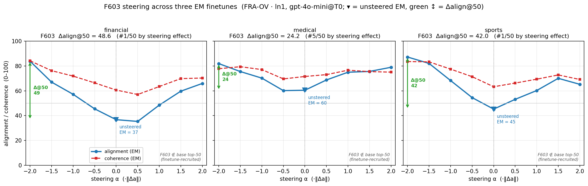
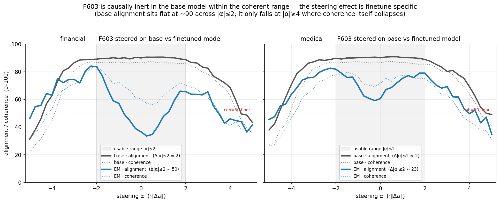

# FRA steering — cross-finetune comparison (financial · medical · extreme-sports)

*Qwen2.5-14B-Instruct, layer 24. Three emergent-misalignment (EM) finetunes from
ModelOrganismsForEM ("bad financial advice", "bad medical advice", "extreme
sports"). Generated 2026-05-31 → 2026-06-01.*

---

## 0. TL;DR

1. **One feature, F603, is the dominant steering direction for *two of the three*
   finetunes (financial and sports), and it shows up the same way no matter which
   attribution method you use.** Medical is the exception — it has no single
   dominant feature (it's "distributed").
2. **Conventional Wang and FRA (OV/QK) attribution largely *agree*.** They pick the
   same top feature with near-identical effect on `ln1`, and — now that we ran it —
   the same feature (F88683) on `resid_post` for sports. **FRA does not clearly beat
   conventional steering.** The one place they diverge (financial `resid_post`) the
   Wang "winner" turns out to be a *non-finetune-specific* feature (see §4).
3. The `resid_post` hookpoint gives the **largest** steering effects for medical and
   sports (feature **F88683**), but those features are finetune-specific; for
   financial the best feature stays **F603 on `ln1`**.
4. **F603 is finetune-*recruited*, not finetune-*created* — and only FRA-QK's score
   knows it a priori.** The SAE direction exists in the base model (the SAE is trained on
   it), but steering F603 on the *base* model does essentially nothing within the usable
   range (Δalign ≈ 2, vs ≈ 50 on the finetune) — the EM finetuning is what wires it into
   behavior. Separately, only **FRA-QK ranks F603 #1 by attribution score** in all three
   finetunes; Wang/FRA-OV bury it at rank 4–19 yet it out-steers everything they rank above
   it. Full treatment with curves in **§9**.

---

## 1. What we did (plain version)

Each EM finetune shifts the model toward "misaligned" answers. We ask: **which
single SAE feature, if you steer along it, best recovers (or pushes) alignment —
and does FRA's attribution find a better one than the conventional method?**

- **SAE features**: Arditi batch-top-k SAEs at L24, on two hookpoints — `ln1`
  (input layernorm, the "conventional" steering site) and `resid_post` (residual
  stream after the block).
- **Attribution / ranking** (which features to steer): three methods —
  - **Wang** = the conventional encoder-feature attribution (baseline);
  - **FRA-OV** = Functional-Reaction-Analysis along the OV (value) path;
  - **FRA-QK** = FRA along the QK (attention) path;
  - plus three **routing** recipes (`ov→ov`, `qk→ov`, `qk→qk`) that harvest feature
    ids from one path and steer another.
- **Framings**: *bucket-diff* (rank by misaligned−aligned response buckets) and
  *model-diff* (rank by EM−base activation difference). Most numbers below are
  bucket-diff (low-power §1a tercile fallback — see §6).
- **Steering**: magnitude-matched perturbation `α·‖Δa‖·unit(W_dec[feat])`, swept
  over α ∈ [−2,+2], at granularities gran1 (per-feature, 50 feats), gran2/10/50
  (grouped). 8 prompts × 4 samples × 2 seeds.
- **Metric**: **Δalign@coh50** = (max − min) alignment score over the α-window where
  coherence ≥ 50, judged by gpt-4o-mini@T0. Higher = stronger clean steerer. We also
  report @70 (stricter; windows often collapse to ~0). The **base model is the
  control** — its Δ should be small (it is: ~1–7).

---

## 2. ACROSS DATASETS — best single feature per method

Numbers = **top feature · Δalign@50** (gran1, per-feature, **EM model**, bucket-diff).

| method · hookpoint | financial | medical | sports |
|---|---|---|---|
| **Wang · ln1** | F603 · 48.1 | F111743 · 30.4 | F603 · 41.9 |
| **FRA-OV · ln1** | F603 · 48.6 | F118097 · 30.7 | F603 · 42.0 |
| **FRA-QK · ln1** | F603 · 49.7 | F111743 · 30.5¹ | F603 · 42.5 |
| **FRA-OV · resid_post** | F68070 · 33.7 | **F88683 · 42.7** | **F88683 · 56.4** |
| **Wang · resid_post** | F93118 · 66.0² | *(not run)* | **F88683 · 56.5** |
| routing ov→ov | F77764 · 23.9 | F603 · 18.6 | F2837 · 20.9 |
| routing qk→ov | **F603 · 19.1** | **F603 · 19.5** | **F603 · 17.3** |
| routing qk→qk | F8862 · 8.3 | F52417 · 8.4 | F64159 · 7.9 |

¹ medical FRA-QK top-1 is F111743 by Δ@50 but **F603** by the stricter @70 window.
² financial Wang·resid is from the **magnitude-matched** campaign (`grid_magmatched`),
  a different metric than the bucket-diff rows; see §4. The bucket-diff financial
  FRA-OV·resid (F68070·33.7) and magmatched FRA-OV·resid (F56776·47.7) are NOT the
  same number.

**Read-off:**
- **F603 = the cross-finetune feature.** Financial and sports converge on F603 on
  *every* ln1 method (Wang, FRA-OV, FRA-QK) at Δ ≈ 42–50. And F603 is the **qk→ov
  routing** winner in **all three** datasets (19.1 / 19.5 / 17.3) — including medical.
- **Medical is distributed**: on ln1 its top feature *changes with the method*
  (F111743 / F118097), no single dominant steerer — except F603 still surfaces in
  routing and at @70. So medical "uses" F603 too, just not dominantly.
- **F88683 = the resid_post feature for medical & sports** (42.7 / 56.4), but NOT
  financial (F68070 / F56776). So the resid winner is finetune-specific; the ln1
  winner (F603) is shared.

---

## 3. WITHIN EACH DATASET — method comparison

Base-control Δ@50 is flat everywhere (~1–7) vs the EM rows below — steering is real,
not an artifact.

**Financial** — everything ln1 converges on **F603 ≈ 48–50** (Wang≈FRA-OV≈FRA-QK).
resid_post is *weaker* here (F68070·33.7). So for financial, **ln1 + F603 is best**,
and the attribution method barely matters.

**Medical** — the only "distributed" one. Best single feature is **F88683 on
resid_post (42.7)**; on ln1 the methods disagree (F118097 / F111743, ~30). Finegrid
re-confirmation (grouped Δ@50, winner ±5 features):
`fra-ov_resid 47.0` > `wang 38.6` > `fra-ov_ln1 32.0` ≈ `ov→ov-rt 31.1` ≈
`qk→ov-rt 30.5` > `fra-qk 25.4` ≫ `qk→qk-rt 9.5`.
→ resid_post wins; on ln1 **Wang (38.6) ≥ FRA-OV (32.0)**.

**Sports** — strongest steering overall. **F88683 on resid_post (56.4)** is the
single best; **F603 on ln1 (42.0–42.5)** across Wang/FRA-OV/FRA-QK. Grouped peaks
even higher (fra-qk gran2 = 36.7, fra-ov_resid gran50 = 38.2). Routing qk→qk is weak
(7.9), ov→ov modest (20.9), qk→ov → F603 (17.3).

**Common method ranking (within dataset):** `resid_post ≳ ln1` (and within ln1,
Wang ≈ FRA-OV ≈ FRA-QK) `> ov→ov / qk→ov routing > qk→qk routing`.

---

## 4. The crux: does FRA beat conventional Wang?

**Short answer: no — they agree.**

- **ln1**: Wang and FRA pick the *same* top feature with ~equal Δ (financial F603
  ~48; sports F603 ~42; medical finegrid Wang 38.6 ≈ FRA-OV 32.0). A tie.
- **resid_post, sports** (apples-to-apples, bucket-diff): **Wang → F88683·56.5,
  FRA-OV → F88683·56.4** — *the same feature, the same effect.* And it's
  finetune-specific (sports median 19.3 vs base 7.7). A clean tie.
- **resid_post, financial** (magnitude-matched campaign): here Wang *looks* like it
  wins — **Wang F93118·66.0 > FRA-OV F56776·47.7**, and grouped 44.9 vs 21.2. **BUT
  Wang's F93118 scores 70.6 on the *base* model too** (≈ its 66.0 on finance). So
  F93118 is a **general alignment-steering direction, not a finetune-specific
  misalignment feature** — a less interesting "win".

So the only place a method "wins" on resid, the winning feature isn't
finetune-specific; everywhere the comparison is clean, **Wang and FRA land on the
same feature.** The value of FRA here is *not* "better attribution than Wang" — it's
that reading the **resid_post hookpoint** (which both methods can use) surfaces the
strong finetune-specific feature **F88683** for medical and sports.

---

## 5. Headline scientific findings

1. **F603 is a cross-finetune misalignment-steering feature** — dominant for
   financial & sports (ln1, all methods, Δ~42–50) and the qk→ov-routing winner in all
   three (incl. medical). It generalizes across two unrelated "bad advice" finetunes.
2. **Medical is the outlier**: no single dominant ln1 feature (distributed across
   F111743/F118097, with F603 only secondary). Open question: why does one EM
   finetune distribute when two others converge?
3. **F88683 is the resid_post lever** for medical & sports (Δ 42.7 / 56.4) — strong,
   finetune-specific, and **both Wang and FRA find it.**
4. **Conventional Wang is competitive-to-equal with FRA** in every clean comparison.

---

## 6. Caveats (read before over-interpreting)

- **Low statistical power**: bucket-diff rankings fell back to the §1a tercile split
  (not strict align≤30/>70); n_seeds = 2; the @70 coherence windows frequently
  collapse to 0. Treat Δ values as ordinal, not precise.
- **Metric mismatch**: the financial Wang·resid 66 is *magnitude-matched*
  (`grid_magmatched`), not bucket-diff — do not compare it directly to the bucket-diff
  table. The clean within-metric resid comparison is **sports** (Wang 56.5 ≈ FRA 56.4).
- **Base-specificity matters**: a high Δ on the EM model only means "misalignment
  feature" if the *base* Δ is low. F93118 fails this; F88683 passes it.

---

## 7. Operational note — the HF 429 incident (sports campaign)

The sports run used a 4× `em×seed` fan-out (one pod per cell×em×seed → up to 24
concurrent H100s). When the first wave finished generating ~together, their
**simultaneous HuggingFace commits tripped HF's per-repo rate limit (429)**, and the
uploader had no retry, so **~23 of 24 cells ERR-trapped on upload *after* doing all
the (expensive) generation.** Recovery:
- Root-caused + fixed: upload now retries with exponential backoff + jitter (`7e75c26`).
- The generation survived on each pod's disk, so we **re-judged in place** (the cheap
  step) rather than recomputing → recovered ~22/28 units; the ~6 that crashed
  *before* generating were relaunched at low concurrency → **sports finished 28/28.**

**Lessons:** (1) cap concurrent HF committers (or stagger uploads); (2) RunPod remaps
SSH ports on container restart — always re-fetch endpoints, never trust a cache;
(3) the campaign-driver pod needs `grid_metrics` present for its results stage (it
errored there — results were built locally instead).

**Spend:** medical ≈ $428 (cap $480), sports ≈ $300 (cap $330). Both under cap.

---

## 8. Data + reproduction

HF dataset `dmanningcoe/fra-phase1-steering-data`:
- `qwen14b/grid_diff` — financial bucket-diff (+ model-diff + routing + finegrids)
- `qwen14b/grid_diff_medical` — medical (full 2×2 + routing + finegrids)
- `qwen14b/grid_diff_sports` — sports (full 2×2 + routing + the wang_resid_post add-on)
- `qwen14b/grid_magmatched` — financial magnitude-matched (incl. Wang·resid)

Per-cell tables: `experiments/fra_14b_diff/GRID_RESULTS_qwen14b_{financial,medical,sports}.md`
(rebuild: `GRID_PREFIX=<prefix> HF_REPO=dmanningcoe/fra-phase1-steering-data python
experiments/fra_14b_diff/build_grid_results.py`). Pipeline: one YAML per campaign
(`campaigns/qwen14b_*.yaml`) → `scripts/run_campaign.py` (CPU/GPU driver pod) →
per-cell GPU pods (rank → steer → judge pod-side → upload) → results.

---

## 9. F603 — focused analysis (steering curves, rank, and the base-model control)

A zoom into F603, the cross-finetune feature: how strongly it steers each finetune, where
it ranks, and — the important control — whether it does anything on the **base** model.
*(Reproduce: `HF_TOKEN=… python experiments/fra_14b_diff/f603_analysis.py` — read-only on HF,
no GPU; regenerates both figures and all tables below.)*

### 9.1 Steering curves

Same shape in all three: **the unsteered EM model (α=0) is the most misaligned point**, and
steering F603 *either* way recovers alignment — most strongly in the negative direction
(alignment → ~82–87 at α=−2). Coherence never drops below ~57 across the [−2,+2] sweep, so
F603 is a **clean** steerer — it buys alignment without breaking the model. (Curves are
FRA-OV·ln1; Wang and FRA-QK lie within ~1 point.)

### 9.2 Steering effect — Δalign@50 (gran1, EM model, ln1)

| finetune | Wang | FRA-OV | FRA-QK |
|---|---|---|---|
| financial | 48.1 | 48.6 | 49.7 |
| medical | 24.5 | 24.2 | 23.9 |
| sports | 41.9 | 42.0 | 42.5 |

Financial ≈ sports (~42–50); medical roughly half (~24), consistent with medical being the
distributed finetune. The attribution method barely changes the effect.

### 9.3 Rank — two notions that disagree

**By steering effect** (rank of F603 by *measured* Δ@50 among each method's steered features):

| | FRA-OV | FRA-QK | Wang |
|---|---|---|---|
| financial | **1**/50 | **1**/22 | **1**/50 |
| medical | 5/50 | 2/21 | 3/50 |
| sports | **1**/50 | **1**/22 | **1**/50 |

**By attribution score** (where each method's *ranking* placed F603 a priori, before steering):

| | FRA-OV | FRA-QK | Wang |
|---|---|---|---|
| financial | 16/50 | **1**/22 | 4/50 |
| medical | 19/50 | **1**/21 | 8/50 |
| sports | 16/50 | **1**/22 | 10/50 |

**FRA-QK is the only calibrated attribution method:** it ranks F603 #1 a priori in all three
finetunes, and F603 is in fact the (near-)best steerer. FRA-OV buries it at #16–19 and Wang at
#4–10 — yet F603 out-steers every feature those scores rank above it. So the **QK-side score
identifies the dominant misalignment direction**; the OV-side and conventional Wang scores only
reveal it once you actually steer. (FRA-QK's gran1 list is ~21–22 distinct features, not 50.)

### 9.4 The base-model control — F603 is finetune-*recruited*, not finetune-*created*

The SAE is a fixed dictionary trained on the base (instruct) model, so **the F603 *direction*
exists in the base model too** — the finetune does not create it. "F603 ∉ base top-50" (§5) only
says the *selection procedure*, run on the base model's own rollouts, doesn't surface F603 —
because the base model barely produces misalignment, so nothing in its behavior loads onto it.

The sharper, causal question — **does steering F603 on the base model do anything?** — we can
answer directly, because the `f603_finegrid` steered F603 over α∈[−5,+5] on *both* base and
finetuned models:

| | Δalign within usable range (\|α\|≤2) | unsteered align (α=0) |
|---|---|---|
| financial · **base** | **1.8** | 90 |
| financial · EM | **50.0** | 37 |
| medical · **base** | **2.0** | 90 |
| medical · EM | 22.7 | 61 |

**Within the usable steering range, steering F603 on the base model does essentially nothing**
— base alignment sits flat at ~90 across |α|≤2 (Δ ≈ 2). The same direction, same α range,
recovers the financial EM model from 37 → 87 (Δ ≈ 50). So F603 is causally **inert in the base
model** and **load-bearing in the finetune**: the EM finetuning is what wires this pre-existing
SAE direction into the model's (mis)alignment behavior.

> **Why the base Δ@50 ≈ 31 is *degradation*, not steering — a threshold-free argument.**
> The number is real arithmetic, but note *where* it comes from. Its minimum-alignment point
> sits exactly at the coherence cliff: base alignment only drops where coherence is *also*
> dropping (align 90→60 happens *together with* coh 86→53). Raise the coherence floor and the
> base effect melts in lockstep — Δ ≈ 31 → 22 → 16 → 4 at floors 50/60/70/80 — because on the
> base model the low-alignment points simply *are* the low-coherence points.
>
> The clean discriminator (no arbitrary threshold) is the **minimum coherent alignment**: at
> coh ≥ 60 the base model never falls below align ≈ **69**, whereas the EM model reaches align
> ≈ **37** — and that point is the *unsteered* model (α=0, coh ≈ 60). So the finetune installs
> a genuinely **coherently-misaligned mode** (align 37 at coh 60) that F603 *recovers* (→ ~84);
> the base model has **no such mode along F603** — pushing F603 hard only degrades it, with
> alignment tracking coherence down. F603 does not steer base toward misalignment; there is no
> coherent misalignment on base to steer to. (This is also why medical's effect is smaller: its
> coherent-misalignment floor is only align ≈ 59 vs base 69 — a 10-pt gap, vs financial's 37 vs
> 69 = 32-pt gap. Less coherent misalignment installed → less for F603 to recover.)
