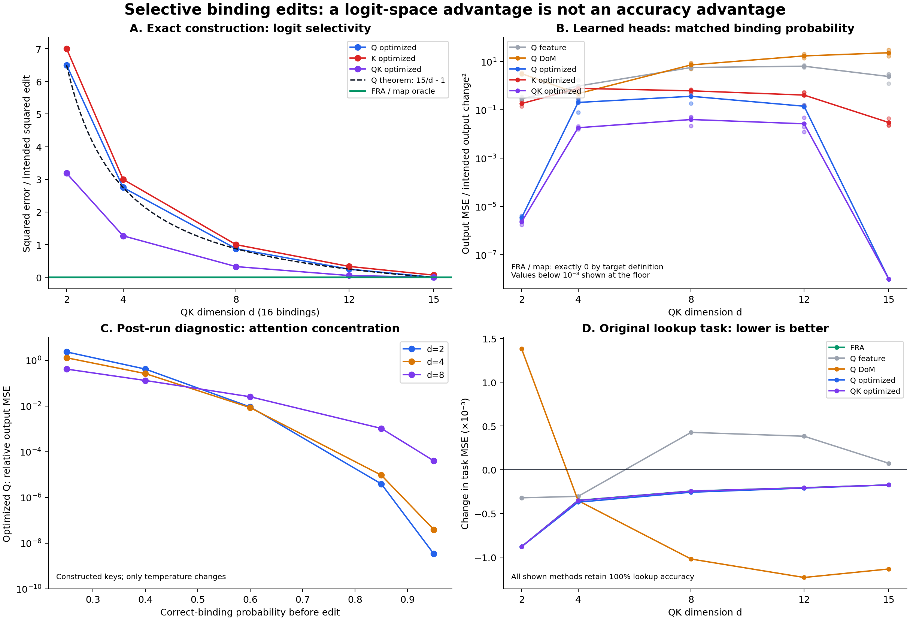

# Selective binding edits: completed pilot

**FRA realizes the desired pair-selective edit exactly, and the predicted logit-space interference law holds. Strong Q/QK baselines substantially narrow the behavioral gap; there is no accuracy advantage in this pilot and the gap is not monotone in head compression.**



[Protocol](../../INTERFERENCE_PROTOCOL.md) · [Training/edit code](../../run_interference.py) · [Analysis code](../../analyze_interference.py) · [Raw metrics](metrics.json) · [Every edit](edits.csv)

## Setting and scope

Sixteen variables, 32 possible one-hot values, one softmax head with fixed identity OV. Synthetic source activations contain binding-ID and value features; QK receives both, and learns from random initialization. Training excludes one quarter of variable/value combinations; the 128 evaluation memories use only excluded combinations. All 16 queries share each memory. Widths 2, 4, 8, 12, 15 each have three independently trained seeds (1,600 steps). Temperature is calibrated on separate IID memories to 0.85 mean correct-binding probability.

This uses the supplied-activation idea from [Assign and Add, Appendix C](https://arxiv.org/html/2605.31497v1#A3). It does not reproduce that paper's raw-token training, arithmetic, or theorem. There is no SAE; features are known exactly. Each lookup edge has one active binding feature pair, so the experiment tests selective editing across uses of features, not multiple simultaneous relationships on an edge.

The intervention reduces one preselected incorrect query-ID/key-ID coefficient by 1, preserving all other coefficients. It changes the relationship wherever those features occur. FRA and a map oracle are exact by construction: they define the selective counterfactual. This is an intervention expressivity experiment, not evidence of automatic discovery or a universally optimal behavioral edit.

## Training and generalization

| QK width | Held-out accuracy | Correct-binding probability | Content-only accuracy |
|---:|---:|---:|---:|
| 2 | 100.00% | 0.8502 | 6.87% |
| 4 | 100.00% | 0.8452 | 0.73% |
| 8 | 100.00% | 0.8369 | 0.02% |
| 12 | 100.00% | 0.8292 | 0.00% |
| 15 | 100.00% | 0.8292 | 0.00% |

All learned heads achieve 100% held-out lookup accuracy; keeping only the binding-related QK terms also preserves 100%. Removing binding terms destroys retrieval. Temperature was calibrated on IID assignments, so held-out correct-binding confidence is slightly lower at larger widths.

## Exact logit-space control

For 16 zero-mean equal-norm tight-frame keys, arbitrary optimized Q steering at matched mean log-odds reach has squared collateral distortion divided by squared intended centered-logit edit equal to **15/d − 1**. FRA has zero. Row constants are removed before comparison. The measured values are 6.5, 2.75, 0.875, 0.25, and numerical zero for d=2,4,8,12,15. This law concerns relative logits among protected sources, not absolute probabilities or outputs.

Q and K score-optimal edits are analytic constrained least-squares solutions. Joint Q/K edits use four-start alternating minimization at unchanged head width; the unconstrained rank-d SVD residual provides an independent lower bound. No edit is penalized for softmax-invisible row offsets. [Additional score/output graph](score_vs_output.png).

## Behavioral comparison: match the actual mistaken-binding probability

All baselines below match the FRA intervention's target attention probability, then minimize counterfactual readout MSE. Distinct one-hot values make readout error exactly attention error. Each entry averages two predetermined edited queries across three seeds (six cases per width), on the first held-out memory per model. The larger logit-space sweep uses four queries and four held-out memories per model (48 cases per width). These are small pilot samples.

**Reported quantity:** `||output_edit − output_FRA||² / ||output_FRA − output_original||²`, summed across all 16 query outputs. Zero means exact agreement with the desired selective edit; one is the unedited model's error. This is squared error, not a fraction of changed tokens or lost accuracy. The FRA row's zero is by target definition.

| Method | d=2 | d=4 | d=8 | d=12 | d=15 |
|---|---:|---:|---:|---:|---:|
| FRA | 0 | 0 | 0 | 0 | 0 |
| Q feature | 0.289 | 0.959 | 5.62 | 6.37 | 2.38 |
| Q DoM | 3.13 | 0.468 | 7.21 | 16.9 | 22.9 |
| K feature | 2.06 | 7.31 | 3.54 | 2.83 | 1.72 |
| K DoM | 150 | 57 | 42.3 | 62.9 | 76.7 |
| Q optimized | 3.47e-06 | 0.202 | 0.363 | 0.141 | <1e−12 |
| K optimized | 0.182 | 0.774 | 0.611 | 0.407 | 0.0299 |
| QK optimized | 2.32e-06 | 0.0182 | 0.0397 | 0.0264 | <1e−12 |
| Map oracle | 0 | 0 | 0 | 0 | 0 |

The single-feature baselines can select the best ground-truth feature direction and fit its coefficient with oracle information. Q/K DoM use exact paired variable contrasts, at the relevant attention-input sites. Arbitrary Q steering can change the affected query vector freely. Arbitrary K steering can change all source keys, shared across queries. Joint Q/K can change both. The optimized baselines are context-specific oracles, stronger than a deployable fixed direction. All hold values and OV fixed. No claim is made about unrestricted OV edits.

Probability optimization uses analytic gradients and augmented-Lagrangian L-BFGS. Joint Q/K has four starts, including the optimized Q-only and K-only solutions. These are best-found solutions, not certified global minima. All probability constraints were met; the maximum target log-odds mismatch was 1.99e-07. The broader optimized classes performed at least as well as their included simpler baselines on every evaluated case.

## What this establishes—and what it does not

1. **A genuine algebraic selectivity gap exists under compression.** The exact Q-only formula matches, and full softmax-relevant width d=15 is a null control where optimized Q and joint Q/K recover the edit exactly.
2. **The behavioral gap can be tiny despite severe logit distortion.** At d=2, optimized Q has only about 3.5e−6 relative output MSE. The head's output is concentrated on a few sources; large changes to already tiny attention weights cost almost nothing in readout space.
3. **There is a measurable counterfactual-fidelity gap at intermediate widths.** At d=4,8,12, best-found joint Q/K residuals are about 0.018, 0.040, 0.026 of the squared intended output change. These numbers are much smaller than the single-feature and DoM gaps.
4. **There is no lookup-accuracy advantage.** FRA, Q feature, Q DoM, optimized Q, optimized K, and optimized joint Q/K all retain 100% accuracy on the behavior-matched cases. Some DoM edits improve original-task MSE more than FRA while failing to preserve the requested counterfactual. This is why selective-edit fidelity must not be relabeled as task performance.
5. **Map editing ties FRA exactly.** The supplied pair labels specify a semantic intervention across contexts; they do not give QK-only FRA a larger output space than arbitrary map editing.

## Post-run temperature diagnostic

The near-tie at d=2 motivated an additional constructed-key sweep, explicitly run after the main experiment: d=2,4,8; pre-edit correct-binding probability 0.25,0.4,0.6,0.85,0.95. Only softmax temperature changes, preserving key geometry. The edit remains a one-unit single-pair suppression, and probability matching is repeated at each point. [Raw diagnostic](temperature_diagnostic.json). This diagnostic is separate from the trained-head results.

| Correct-binding probability | d=2 optimized-Q relative output MSE |
|---:|---:|
| 0.25 | 2.33 |
| 0.40 | 0.4144 |
| 0.60 | 0.009105 |
| 0.85 | 3.919e-06 |
| 0.95 | 3.427e-09 |

The diagnostic shows why head width alone is not a sufficient predictor of behavioral advantage. Attention concentration must also be controlled. The clean theorem remains useful for logit selectivity, but this pilot does not establish a useful accuracy or arithmetic advantage.

## Verification and reproduction

Gradient maximum absolute error: 2.14e-10. Ground-truth feature reconstruction error after random residual-basis rotation: 6.22e-15. The script checks source-order invariance, full-width exact recovery, the tight-frame law, and map/FRA equivalence. The analysis checks every matching constraint, rank lower bounds, and nesting of baseline performance. Raw NPZ models, JSON metrics, and per-edit CSV data are saved.

```bash
python3 experiments/fra_variable_binding/run_interference.py --out experiments/fra_variable_binding/out/interference --steps 1600
uv run --no-project --python 3.10 --with-requirements experiments/fra_variable_binding/requirements-interference.txt python experiments/fra_variable_binding/analyze_interference.py --out experiments/fra_variable_binding/out/interference
```

Main experiment: 62.2 CPU seconds. Temperature diagnostic: 14.6 seconds. No GPU or model downloads.
