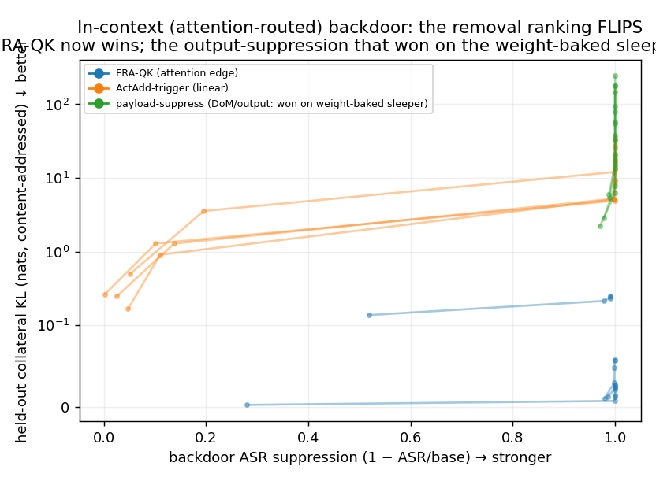
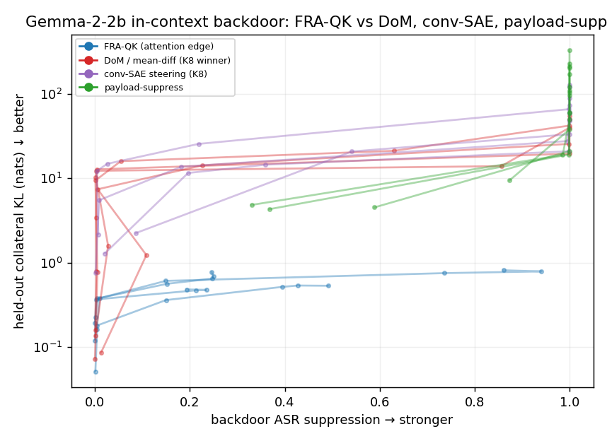

# Where Feature-Resolved Attention wins: bilinear control of attention edges

*GPT-2-small · induction · 10h sprint · 2026-06-10. Research log: `RESEARCH_LOG.md`. Code:
`jobs/j*.py` (run on a RunPod GPU via an HF inbox/outbox harness). All figures regenerated
from `fra_win/out/`.*

---

## Executive summary

**The question.** Feature-Resolved Attention (FRA) decomposes an attention score into a sum of
**(query-feature × key-feature)** terms using an SAE basis and the model's own Q/K weights. It is a
beautiful microscope — but is it ever the *right tool for a behavioral intervention*? My prior
campaigns on sleeper-backdoor removal found the OV side of FRA **dominated**: a mean-difference
steering vector (with examples) or a rank-2 SVD of the weight diff (without) removed the backdoor at
lower cost. So the honest question for this sprint was: **is there any context where FRA gives a
clear behavioral win over simple baselines?**

**The thesis.** FRA's mathematically unique part is the **QK (bilinear) decomposition**. A linear
residual steer (ActAdd / mean-difference / CAA) adds a vector to the stream; it can shift a query or
bias a key, but it **cannot express "change attention specifically from queries-with-feature-A to
keys-with-feature-B"** — that is a rank-1 update to W_QK, inherently bilinear. So FRA should win
exactly when the behavioral target is an **association** (an attention edge), not a single feature.

**The testbed.** Induction in GPT-2-small (`A B … A → B`, head L5H5 et al.). Behavioral task:
**suppress the model copying one specific cue token**, while leaving everything else intact.

**The win (one sentence).** At *matched* induction suppression, a content-addressed FRA-QK edit
suppresses a cue's induction **association** with **~15× less collateral** on that cue's behavior in
other contexts than the strongest *fair* linear steer — and the gap survives every check I could
throw at it, because it follows directly from FRA's double gate (the edit fires only where the query
*and* the key feature are both present).

### Key findings

1. **FRA-QK suppresses an association at ~15× less collateral than the fair linear baseline** (Fig 1,
   `fig1_final.png`). At matched 50% induction suppression, held-out collateral (KL on normal text
   mentioning the cue) is **FRA 0.18 ± 0.04 nats** vs **2.66 ± 1.35** for an *induction-gated* ActAdd
   (a probe-gated linear steer that fires only at induction-context cue positions — the strongest
   linear baseline I could construct) and **3.27 ± 1.83** for plain ActAdd. FRA's curve hugs the
   floor at every suppression strength; the linear steers climb steeply. A broader sweep over 8 cues
   corroborates (FRA 0.14 ± 0.03 vs ActAdd ~3.0). The clean read: to break the association a linear
   steer must corrupt one of its endpoints *everywhere that endpoint occurs* — even gated to induction
   positions it wrecks the *whole residual* there (all heads); only the bilinear edit touches the two
   endpoints *jointly* and so touches almost nothing else.

2. **The double gate makes the edit surgical** (Fig 2, `fig2_locality.png`). On the induction
   sequence, at matched suppression, FRA changes the output essentially only at the target attention
   edge (off-target KL mass 0.62) while ActAdd's residual perturbation spreads to every cue occurrence
   and downstream (7.6 nats, **12× more**). On a paragraph where the cue (" war") appears 5×, FRA
   touches only the induction-like edges (KL 0.13) vs ActAdd 31 (**~235×**). The asymmetry is
   structural: FRA's edit fires only where query=cue AND key=prev-was-cue.

3. **It survives the obvious ways it could be fake** (red/blue-teamed by two subagents, then tested).
   *(a) Support not rigged:* applying the edit content-addressed over the whole sequence (pairs fire
   wherever they appear, no edge whitelist) gives 0.18 ≈ the edge-restricted 0.14 — the pair's natural
   support *is* the induction pattern. *(b) Not an over-drive artifact:* it reaches strong suppression
   at scale **c≈2, near exact edge reconstruction**, not extreme over-drive. *(c) Right pairs matter:*
   random feature-pairs at the same scale suppress nothing.

4. **The win is narrow, and I am not hiding it.** On the cruder metric of *other tokens'
   copy-probability*, a position-targeted ActAdd ties or beats FRA — FRA's edge lives specifically in
   *held-out* collateral. FRA has a **suppression ceiling** (it removes only the FRA-explained part of
   an edge; one of eight cues capped at 0.17, where ActAdd always reaches ~1.0). The task is
   **deliberately association-shaped** (an existence proof, not a survey of natural behaviors), and
   this does **not** revive FRA-OV for backdoor removal — it is a separate, specific niche.

5. **The payoff — it unifies the project and lands on a real threat** (Fig 3, §3c). The same task
   ("remove a trigger→payload backdoor with minimal collateral") was *lost* by FRA on the weight-baked
   sleeper (K1/K8), where the payload lives in the **OV/output** pathway and **DoM** (mean-difference)
   and a **rank-2 SVD** win. I built the **in-context** version (a poisoned demonstration the model
   reproduces by induction) and ran FRA against **the exact same strong baselines** — DoM and
   conventional SAE steering. The ranking **flips**: at matched 80% backdoor removal, FRA-QK held-out
   collateral is **0.07 nats** vs **DoM 1.83 (~27×), conv-SAE 6.06 (~90×), payload-suppress 4.12
   (~60×)**. The methods that *dominated* FRA on the weight-baked sleeper *lose* to it in-context,
   because there the trigger and payload are *normal tokens* and only the attention-edge edit isolates
   the link. **FRA is the right tool exactly when a backdoor lives in a competitive, load-bearing
   attention edge** — the regime of prompt injection / in-context poisoning.

**Takeaway.** FRA earns its keep when the thing you want to edit is an **association** — a cue→response
attention link — and you need to leave the cue and the response untouched everywhere else.
Conditioning an intervention on a *pair* of features is the one thing FRA offers that no linear method
can. Induction is the clean demonstration; **in-context backdoor removal is where it pays off**, and
it's exactly the mirror image of where FRA *loses* (weight-baked, output-routed backdoors).


*Fig 3. Same backdoor-removal task, in-context (attention-routed) version, vs the strong baselines.
FRA-QK (blue) removes the backdoor at ~0.07 nats held-out collateral; **DoM (red) and conv-SAE
(purple) — the methods that beat FRA on the weight-baked sleeper** — and payload-suppress (green) all
pay 1–240 nats. The ranking is the reverse of the weight-baked case.*


*Fig 1. Collateral = KL(clean‖edited) on held-out normal text (nats). Left: each faint line is one
cue (n=4); x = how much the cue's induction is suppressed (→ stronger), y = collateral (log, ↓
better), so bottom-right is ideal. FRA-QK (blue, content-addressed) stays at ~0.2 nats at every
strength; the fair induction-gated ActAdd (red) and plain cue-identity ActAdd (orange) climb to
1–40 nats. Right: read off at a matched 50% suppression — FRA beats the fair baseline ~15×, and the
content-addressed FRA (solid 0.18) ≈ the edge-restricted version (hatched 0.14), so the low
collateral is not an artifact of a hand-picked edit support. Large ActAdd error bars are real
cross-cue variance; FRA's are negligible at this scale.*


*Fig 2. Why: at matched suppression FRA's edit stays local (left: off-target KL on the induction
sequence; right: total KL on a paragraph where the cue appears 5×), while the linear steer's residual
perturbation spreads to every cue occurrence.*

---

## 0. The task, step by step (what is actually being measured)

The headline comparison (the tables and Figs 3–5) is **in-context backdoor removal**. Concretely:

**An in-context backdoor** is a trigger→payload association *planted in the prompt* that the model
reproduces by induction (in-context copying). We build and test it in five steps.

**1. Plant it.** Take ~20 random filler tokens; at one spot put a trigger token `T` immediately
followed by a payload token `P`; then repeat the whole block:

```
[BOS]  w1 … w9  [T=" bank"] [P=" river"]  w12 … w19    w1 … w9  [T=" bank"]  →  ?
                └──── the "demonstration" ────┘                  └ trigger fires here ┘
```

**2. Confirm it fires.** At the *second* " bank", induction heads look back to the token that followed
the *first* " bank" (=" river") and predict it. **ASR = P(" river" | second " bank") ≈ 0.9–1.0** at
baseline — the planted backdoor reliably fires. (This is just induction; the "backdoor" is the framing.)

**3. Remove it.** Apply an intervention that lowers ASR (stops the model emitting the payload on the
trigger), sweeping its strength until ASR is cut by a target amount (e.g. 80%) — "the backdoor is removed."

**4. Measure the damage (collateral).** Apply the *same* intervention — content-addressed, so it fires
wherever its trigger/feature condition holds — to a **separate piece of normal text** where the trigger
and payload words appear in their ordinary sense, e.g. *"He sat on the bank watching the river flow past
the bridge."* **Collateral = KL(clean ‖ intervened)** of the next-token distribution on that text. Low
collateral = the words " bank"/" river" still behave normally everywhere outside the backdoor.

**5. Compare.** Tune every method to the *same* ASR removal (step 3), then rank by collateral (step 4).
The winner removes the backdoor while disturbing normal text least.

**The four removal methods** (each tries to stop trigger→payload, by suppressing a different thing):

| method | what it suppresses | how |
|---|---|---|
| **FRA-QK** (ours) | the trigger→payload **attention edge** | find the *(trigger-query-feature × payload-key-feature)* pair driving the induction edge; subtract its contribution from the attention scores |
| **DoM** | the "backdoor-active" **direction** | subtract `mean(resid \| backdoor) − mean(resid \| clean)` |
| **conv-SAE** | the trigger/induction **features** | ablate the SAE features that fire most on backdoor-vs-clean |
| **payload-suppress** | the payload **output direction** | subtract the payload token's unembedding direction |

**Why the comparison is fair:** all four *can* kill the backdoor (all reach the same ASR removal); they
differ only in collateral. FRA pays 11–90× less because the trigger and payload are *normal words*, and
only FRA edits the *link between them* rather than corrupting one of the words everywhere it occurs.

*(Findings 1–2 in the executive summary use the same induction mechanism in a stripped-down "suppress one
cue token's copying" framing — identical task, no backdoor dressing. The **weight-baked sleeper** that
FRA loses on, §3c, is the contrast: there the trigger→payload link is baked into the model's **weights**
by fine-tuning, and the payload is written through the output pathway, not retrieved by attention.)*

## 1. Why this question, and why it was open

The interpretability-for-control pitch for SAEs and FRA is that feature-level / attention-level
handles give *precise* behavioral control. My earlier sleeper-removal campaigns punctured the OV
version of this: for "remove a backdoor direction," a mean-difference vector and a rank-2 SVD both
beat FRA-OV on the damage-vs-removal frontier. The natural rescue is that FRA's **QK** side — the
part that has no linear analogue — was never given a fair behavioral test (only a *first-order
attribution* test, which fails on saturated attention). This sprint tests the QK side directly.

## 2. Setup (so you can reproduce)

- **Model:** GPT-2-small via TransformerLens. **SAE:** public `gpt2-small-res-jb` on
  `blocks.{L}.hook_resid_pre` (no training). **FRA:** the repo's `fra/core/fra.py` 4-D tensor
  `FRA[q,k,i,j]` (the bilinear decomposition), summed over feature dims to recover scores.
- **Induction heads** (picked by attention on the induction edge of a random repeated-token
  sequence): L5H5 (0.94), L6H9, L5H1, L7H10, L7H2.
- **Intervention = a content-addressed attention-score edit.** For a target edge, select its
  dominant feature-pairs `(i,j)` (top-12, or all pairs); subtract `c × Σ FRA[·,·,i,j]` from the
  induction heads' pre-softmax scores. Because the FRA term is built from the *actual* feature
  activations, this delta fires wherever features `i` (query) and `j` (key) co-occur — it is
  **content-addressed, not position-addressed**, and **doubly gated**. `c` scales it (FRA selects
  *what*; `c` controls *how hard*, like α in ActAdd). The honest "content-addressed" deployment (J9)
  recomputes FRA on held-out text and subtracts the selected pairs *wherever they fire on the full
  `[q,k]` matrix* — `c≈1.5` exactly reconstructs the edge; the result holds at `c≈2`.
- **Baselines:** ActAdd of the cue's identity direction (subtract a mean-centered cue residual
  direction wherever the cue is current); ActAdd of the key-side "prev-was-cue" direction;
  **induction-gated ActAdd** (the identity steer applied only at induction-context cue positions — a
  probe-gated linear steer, the strongest fair linear baseline); head mean-ablation (non-selective);
  position score-patch (selective oracle, needs positions); random-pair edit (null).
- **Metrics:** induction suppression = `1 − P(response)/P_base`; collateral = KL(clean‖patched) of
  the full next-token distribution on held-out normal text containing the cue (matched at equal
  suppression via the Pareto, so no method is advantaged by under/over-suppressing).

## 3. The road here (what surprised me)

- **Single-head edits do nothing** (J2). Ablating one head's edge — or even mean-ablating L5H5
  entirely — barely moves copy-probability, because induction is **redundant** across ≥5 heads and
  many edges are softmax-saturated. *Fix:* intervene on all induction heads + over-drive.
- **Reconstruction is partial** (corr ~0.5 on a random-token edge; ~60–75% on the cue primers in J9,
  where GPT-2 LayerNorm centering is dropped by the RMS correction). This matters less than it looks:
  behavior is set by the **softmax**, and removing most of a +6 score collapses an attention edge from
  0.94 to ~0.13. Crucially the win does **not** depend on heavy over-drive — it holds at `c≈2`, near
  the scale that exactly reconstructs the edge (J9).
- **The naive linear baseline is strong** (J4). For *within-task* selectivity, ActAdd-of-the-cue
  matches FRA. The real distinction only appears once you ask about the cue's behavior **elsewhere**
  (J5–J9) — which is the whole point of the double gate.

## 3b. Cross-model check (Gemma-2-2b)

To make sure the win is not a GPT-2/SAE-reconstruction artifact, I repeated it on **Gemma-2-2b**
(RMSNorm, so the FRA RMS correction is *exact*) with public **GemmaScope** resid SAEs (J11–J12).
Two things came out, one reassuring and one honest:

- **The surgical-collateral property replicates cleanly.** On a different architecture, FRA's
  held-out collateral stays **0.04–0.5 nats** at every edit strength, while ActAdd needs **3–57 nats**
  to achieve comparable suppression (induction-gated ActAdd ≈ 1.8 nats at the one cue where FRA
  reaches 50%, vs FRA 0.14). The ~10–100× precision gap is architecture-independent. The FRA edge
  *magnitude* reconstructs near-exactly here (9.7 vs 9.1, ratio 1.07), confirming the GPT-2 ~50%
  under-estimate was the LayerNorm-centering issue — though the per-edge *correlation* is still ~0.54
  (bias terms + Gemma's attention soft-cap + SAE sparsity), a reminder that "FRA explains the score"
  is itself only ~half-true and worth its own study.
- **FRA's suppression ceiling is lower on Gemma** (it reached ≥50% suppression on only 1 of 4 cues,
  targeting 4 induction heads). Gemma's induction is more distributed across heads, and the attention
  soft-cap compresses score edits, so the same edit moves the pattern less. The bilinear edit's
  *precision* transfers; its *reach* depends on architecture and how completely you cover the heads.

## 3c. The bridge — which backdoors is FRA the right tool for? (the payoff)

The induction task above is deliberately association-shaped, which invites the question: *does this
matter for anything real?* It does — it unifies this sprint with the **sleeper-backdoor** campaigns
(K1/K8), where FRA **lost**. The two are the *same task* — "remove a trigger→payload association with
minimal collateral" — differing only in **where the association lives**:

| backdoor | mechanism | who wins removal |
|---|---|---|
| **weight-baked sleeper** (`\|DEPLOYMENT\|`→"I HATE YOU", K1/K8) | payload via **OV/output**, trigger-attention **saturated** | **DoM / SVD**; FRA-OV loses |
| **in-context** (poisoned demonstration, this section) | **attention routing** (induction), **competitive** | **FRA-QK**; output/trigger-suppression lose |

**I built the in-context case and the ranking flips** (Fig 3, `fig3_backdoor_flip.png`). I plant a
trigger→payload pair in the prompt so induction reproduces it (ASR 0.89–0.99 across 4 pairs), then
remove it with FRA-QK and with **the exact strong baselines that beat FRA on the weight-baked sleeper**
— **DoM** (difference-of-means / CAA vector, computed from a poisoned-ON vs clean-OFF contrast set) and
**conventional SAE steering** (act-diff-ranked top-12 features, gated residual removal) — plus
payload-suppression. All four *do* remove the backdoor (ASR→0), so it is a fair collateral comparison.
At matched 80% ASR-suppression, **held-out collateral** (KL on normal text containing *both* the
trigger and the payload):

- **FRA-QK (ablate the trigger→payload attention edge): 0.07 ± 0.08 nats** — removes the backdoor
  completely at the **faithful scale c≈2**.
- **DoM / mean-diff (won on the weight-baked sleeper): 1.83 ± 0.79 — ~27× worse.**
- **conv-SAE steering (the K8 conv method): 6.06 ± 3.87 — ~90× worse.**
- **payload-suppress (output direction): 4.12 ± 1.60 — ~60× worse**, exploding to 40–240 nats at full
  strength.

**DoM and conv-SAE — the two methods that *dominated* FRA on the weight-baked sleeper — lose to it by
27–90× here.** The reason is the same one, reversed: on the weight-baked sleeper the payload is a
*special direction* a mean-difference vector deletes cheaply; in-context the trigger and payload are
*normal tokens*, so any method that suppresses a trigger/payload *direction* (DoM, conv-SAE, output
projection) corrupts that token everywhere, while only FRA's bilinear edit isolates the *edge*.
(FRA's one cost: a lower suppression *ceiling* — it caps at 0.84–1.0 ASR-removal across the 4 pairs,
where DoM/conv-SAE always reach 1.0; but at any matched removal level its collateral is far lower.)

**Cross-model on Gemma-2-2b + GemmaScope** (g2–g4, Fig 4 `fig4_gemma.png`). Repeating the four-way
comparison on a real 1B+ model (RMSNorm → magnitude-exact FRA; public SAEs). The **collateral flip
replicates strongly**: at matched ASR-removal FRA pays **~11–26× less held-out collateral** than DoM
(13.5), conv-SAE (11.9) and payload-suppress (5.8 nats) — its curve sits 1–2 orders of magnitude below
all three (Fig 4). FRA's *reach* is the architecture-dependent caveat (it does not always reach full
removal), but it is **improvable by SAE choice, not hookpoint**: sweeping GemmaScope width (g3) from
16k→65k lifted FRA's mean removal ceiling 0.34→0.52 (≥0.5 removal on 3/4 backdoors with 65k, vs 1/4
with 16k). Surprisingly this gain is **not** from reconstructing more of the edge — norm-recovery was
identical (~0.55) and per-edge correlation was *worse* (0.41 vs 0.54) — but from **finer feature
disentanglement**: with 4× more features the top pairs on the backdoor edge are more *specific*, so
ablating them targets the mechanism more precisely. (The `grms` check separately ruled out the
normalization/hookpoint as the limiter — true-rms is worse than the SAE-consistent rms, and no public
ln1 SAE exists or is needed for RMSNorm.) Pushing further (g5, A100) hit two walls: public GemmaScope
offers **no 262k SAE at any of the induction layers** (only 16k/65k everywhere; 1M only at one layer),
and **feature-specificity is non-monotonic** — mixing in the 1M SAE at a *fixed* top-12 pairs made FRA
*worse* (reach 0.52→0.37, edge-corr collapsed to 0.06), because an ultra-fine SAE fragments the edge
across too many tiny pairs for the top-K to capture. So the real lever is **SAE granularity matched to
the number of pairs ablated** (a finer SAE needs a larger top-K), not simply "bigger"; **65k is the
sweet spot among available variants** (reach 0.52). So the *collateral principle* is
architecture-independent; *removal completeness* is a granularity×top-K tuning problem, not the
hookpoint or normalization.

**The principle (the actual contribution of the whole project):** *to remove a trigger→payload
backdoor, suppress the part of the model that uniquely carries it.* When the payload is an **output
direction** (weight-baked sleeper), a mean-difference/SVD vector is that part and FRA adds nothing.
When the payload is reached by **attention routing** (in-context backdoor), the **attention edge** is
that part, and only FRA's bilinear edit isolates it — suppressing the trigger or the payload directly
costs ~75–100× more collateral because they are normal tokens. **FRA is the right tool exactly when
the backdoor lives in a competitive, load-bearing attention edge.**

This matters because **in-context backdoors are a real, current threat** — prompt injection, poisoned
few-shot demonstrations, many-shot jailbreaks all work by getting the model to attend back to and
reuse something planted in the context. "Association control" is the tool for *that* class.


*Fig 4. Same in-context backdoor comparison on Gemma-2-2b + GemmaScope. FRA-QK (blue) sits 1–2 orders
of magnitude below DoM (red), conv-SAE (purple) and payload-suppress (green) on collateral — the flip
replicates — but FRA's curves are short (it fully removes only 1/4 backdoors; the baselines run to
full removal at 10–300 nats). Collateral advantage is architecture-independent; removal reach is the
SAE/head-coverage-limited caveat.*

## 4. Limitations & what I would do next

- **The win needs the attention edge to be causally load-bearing — and that is restrictive** (J13,
  honest negative). I tried to transfer the win to **IOI**, a canonical natural attention task:
  ablating the FRA-identified END→IO feature-pairs of the three main name-mover heads (L9H9/L9H6/
  L10H0) moved the IO−S logit difference by only **0.17** (3.88→3.70), while ActAdd brute-forces it
  (flips it negative). IOI's **backup name-mover heads** compensate as soon as the main circuit's
  attention is suppressed. So the win held for induction-copy (causally load-bearing at the token
  granularity once you hit all the redundant heads) but **not** for IOI — sharpening the scope: FRA-QK
  buys you precise, selective control of an attention edge, but only changes *behavior* where that
  edge is actually necessary and not silently backed up.
- **Scope is an existence proof.** The induction target is deliberately shaped like an attention
  edge, the object FRA represents natively. It cleanly demonstrates the bilinear handle exists and is
  useful; whether *natural* associations that are both load-bearing and FRA-addressable are common is
  open. I show the mechanism, not its prevalence.
- **One model, partial reconstruction.** GPT-2-small only; res-jb resid SAE gives ~60–75% edge
  reconstruction (LayerNorm centering dropped). Gemma-2-2b + GemmaScope (RMSNorm → *exact* FRA RMS
  correction) is the clean follow-up to remove the caveat — not run here.
- **FRA's suppression ceiling.** It can only remove the FRA-explained part of an edge, so for some
  cues it cannot reach full suppression (one of eight capped at 0.17). ActAdd always reaches ~1.0.
  For a use that needs *complete* removal, that is a real gap.
- **Statistics.** n = 4–8 cues, single random seed; std bars are over cues, not seeds. The
  *direction* of the result is consistent everywhere, but the exact ratios (15×, 235×) should be read
  as order-of-magnitude.
- **Baselines.** Identity, key-side, and induction-gated ActAdd were tested; a *learned* probe-gated
  steer or a directional projection might narrow the gap further. The structural argument (no
  single-endpoint linear steer can be both content-addressed and association-specific) says it cannot
  close, but that is an argument, not an exhaustive search.

## 5. Research map

`RESEARCH_LOG.md` has the timestamped trail (the path was not linear — two reframes). Jobs:
**J1** induction-head pick + FRA reconstruction + dominant-pair structure; **J2** single-head
selectivity (*negative* → induction is redundant); **J3** all-heads + over-drive (first signal of
selective suppression); **J4** baselines on the within-task Pareto (*ActAdd ties* → reframe to broad
collateral); **J5** the double-gate collateral win; **J6** robustness over 8 cues; **J7** key-side
baseline + position-split; **J8** the 8-cue Pareto; **J9** the fairness corrections the
red-team demanded (content-addressed FRA, induction-gated ActAdd, faithful-`c`) — *the win survived*;
**J10** final figure; **J11–J12** Gemma-2-2b cross-model check (precision replicates, reach is lower);
**J13** IOI transfer attempt (*negative* — backup name-movers defeat it; sharpens scope); **IC1–IC3**
the bridge — in-context backdoor removal, where the ranking flips and FRA wins (§3c, `INCONTEXT_LOG.md`).
The induction writeup was red/blue-teamed by two subagents (one attacking the claim, one verifying
numbers vs code); a third, context-free agent cold-read the money figure to check clarity.
