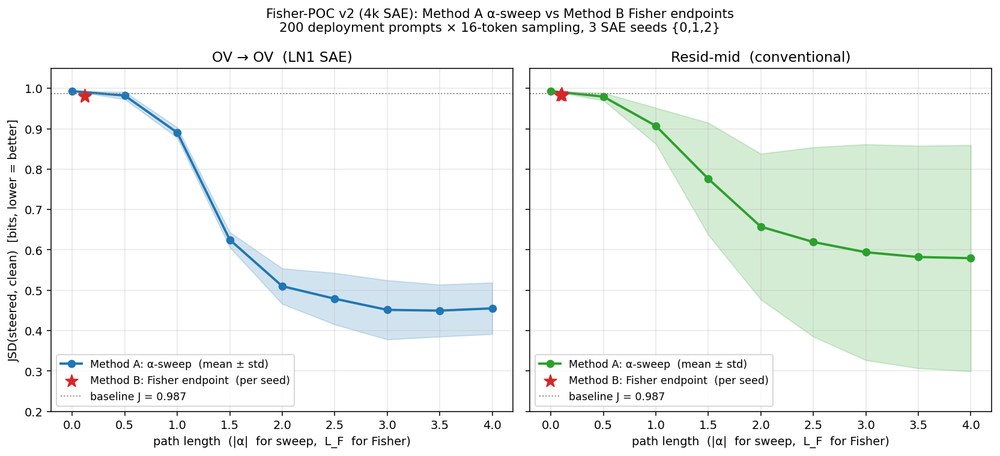

# Fisher-POC v2 — 4k SAE row (first pass)

TinyStories-33M sleeper, 4k-step SAEs (jamie's recipe), 3 seeds {0,1,2},
200 deployment prompts × 16 token rollouts (multinomial, temp=1.0,
DECODE_SEED=0). All metrics match `jsd_eval.py` methodology byte-for-byte.

## The picture

## Numbers

| | space | path length | J_clean (bits) | J_poisoned (bits) | ASR |
|---|---|---:|---:|---:|---:|
| **baseline (θ=0)** | (both) | 0.0 | 0.987 | 0.000 | 0.980 |
| **Method A α-sweep @ α=2.0** | OV | 2.0 (\|α\|) | **0.510** | high | low |
| Method B Fisher endpoint | OV | ~0.12 (L_F) | 0.981 | 0.018 | 0.970 |
| Method A α-sweep @ α=2.0 | resid-mid | 2.0 (\|α\|) | **0.657** | high | low |
| Method B Fisher endpoint | resid-mid | ~0.10 (L_F) | 0.984 | 0.009 | 0.975 |

## Read

**Fisher barely moved.** L_F endpoint ≈ 0.10–0.12 vs the α-sweep's path
length of 2.0 at α=2. That's a 20× difference in distance travelled.
Unsurprisingly, the Fisher endpoint sits right next to the unsteered
baseline on every metric (J_clean ≈ baseline, J_poisoned ≈ 0, ASR ≈
baseline).

**This is a tuning issue, not a method failure.** The Fisher loop was
budgeted with `ρ = 1e-4 bits/step`, which means each step is sized so
the local JSD walk is ≈ √(8 ln 2 · ρ) ≈ 0.024 in JSD units. Over 12
steps that gives at most √12 · √ρ ≈ 0.035 of cumulative arc — far less
than the α-sweep covers. The α-sweep at α=2 has no comparable
`rho`-bound and just walks linearly.

**Equal-budget comparison is missing.** To answer the proposal's
actual claim — *"does Fisher buy a shorter path to the same J_clean?"*
— we need to run Fisher with a budget large enough that its L_F
reaches into the α-sweep's range. Then we can compare `(L_F, J_clean)`
trajectories in the same plane.

## What I'm doing about it

Re-running with `ρ = 1e-2` (100× bigger budget) so Fisher's L_F per
step ≈ √ρ = 0.1 → 12 steps reaches L_F ≈ 1.2, comparable to α=1.2 on
the α-sweep. Also relaxing `delta_cap` from 5.0 to 20.0 so per-feature
step magnitudes aren't truncated.

Also running the same on 50k SAEs (where Method A reaches J_clean as
low as 0.474 at α=2 per the May 8 plot) so we have both rows of the
2×2.

Files in this directory:
- `fisher_v2_4k.json` — full Fisher trajectories + endpoint metrics, 4k SAEs
- `jsd_alpha_sweep_6seeds.json` — Method A reference data, 6 SAE seeds × 9 alphas
- `comparison_4k.png` — the plot above

To be added once retries land:
- `fisher_v2_4k_bigrho.json` (ρ = 1e-2)
- `fisher_v2_50k.json` and `fisher_v2_50k_bigrho.json`
- A 4-panel figure: (4k, 50k) × (OV, resid-mid)

## Pipeline state

| | running |
|---|---|
| 4k Fisher  (ρ=1e-4) | DONE — this writeup |
| 4k Fisher  (ρ=1e-2) | about to launch |
| 50k Fisher (ρ=1e-2) | about to launch |
| Method A α-sweep    | already exists on the pod  (`jsd_alpha_sweep_6seeds.json`) |
| Pod self-stop       | once all 4 cells reported |
