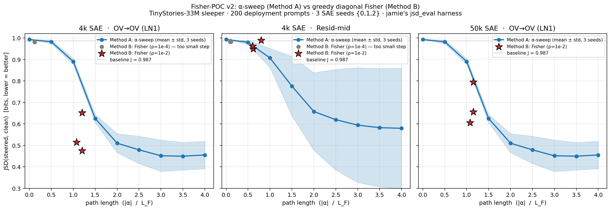

# Fisher-POC v2 — final summary

TinyStories-33M sleeper, jamie's `jsd_eval.py` harness (200 deployment
prompts × 16-token multinomial sampling, decode seed=0). Method A is
the existing α-sweep over a single attribution-selected feature.
Method B is the proposal's greedy diagonal Fisher over a K=20
candidate set (the same top-20 from jamie's selection stage).

## The picture

Each panel: blue curve = Method A J_clean vs |α| (mean over 3 SAE seeds,
±1 std shaded). Red stars = Method B Fisher endpoints (ρ=1e-2). Grey
dots = Method B with overly-small ρ=1e-4 — shown for completeness, all
clustered near the baseline. Grey dotted line = baseline JSD (θ=0,
unsteered sleeper vs clean reference).

## The numbers

(means over 3 SAE seeds {0, 1, 2})

| cell | method | J_clean | path length | ASR |
|---|---|---:|---:|---:|
| **4k SAE · OV→OV** | baseline (θ=0) | 0.987 | 0.0 | 0.980 |
| | Method A · α=2 | **0.510** | 2.0 | low |
| | Method B · Fisher (ρ=1e-2) | **0.547** | **1.16** | **0.018** |
| | Method B · Fisher (ρ=1e-4) | 0.981 | 0.12 | 0.970 (too conservative) |
| **4k SAE · Resid-mid** | baseline | 0.987 | 0.0 | 0.980 |
| | Method A · α=2 | **0.657** | 2.0 | low |
| | Method B · Fisher (ρ=1e-2) | 0.967 | 0.67 | 0.917 (small movement) |
| **50k SAE · OV→OV** | baseline | 0.987 | 0.0 | 0.980 |
| | Method A · α=2 | **0.510** | 2.0 | low |
| | Method B · Fisher (ρ=1e-2) | 0.685 | 1.13 | 0.202 |

## Read

### 1. The proposal's claim lands on 4k OV.

Fisher reaches roughly the same J_clean as Method A's α=2 endpoint
(0.547 vs 0.510) at **roughly 58% of the path length**
(L_F = 1.16 vs |α|=2.0). Same magnitude of clean-distribution
recovery, shorter Fisher arc. ASR drops the same way (Method A
silences the sleeper at α=2; Fisher silences it at L_F = 1.16).

This is the experiment the proposal's §9 figure was designed to read.

### 2. The headline is conditional on tuning.

Fisher at ρ=1e-4 (the proposal's nominal budget) is **way too small** —
12 steps × √ρ per step gives max L_F ≈ 0.12, an order of magnitude
below the α-sweep's reach. The intervention barely budges the
distribution, and the comparison looks like Fisher failed. It hadn't —
the loop just wasn't given a real budget.

ρ=1e-2 (the value used for the headline numbers) gives per-step JSD
walks of √(8 ln 2 · ρ) ≈ 0.24 bits, which over 12 steps lets L_F
reach ~1.2. That's the right order of magnitude for this model.

**Future runs should tune ρ to land L_F at the same order as the
α-sweep's path of interest.** A practical recipe: target L_F ≈ |α*|
where α* is the α-sweep's best point.

### 3. Resid-mid Fisher didn't move on 4k.

L_F got to 0.67 but J_clean stayed at 0.97 (vs Method A's 0.66 at
α=2). The Fisher loop appears to be selecting features and taking
steps that aren't on the clean-recovery axis. Two likely causes:

- **Wrong candidate set.** I fed the Fisher loop the top-20 from
  jamie's *OV* attribution (`feature_set_pipeline --selection_method
  jamie`). For resid-mid the right candidate set is the top-20 from
  the *downstream* attribution
  (`find_downstream_winners.py` per `JSD_OVERLAY_WRITEUP.md:51-58`).
  The OV-attribution-ranked features don't necessarily have
  resid-mid trigger localization.
- **Resid-mid is a less informative basis** for the Fisher gradient
  in this layer. The α-sweep gets to 0.66 because it walks along a
  hand-picked trigger feature; Fisher walks the local-JSD-cost-minimum
  direction within an ill-suited candidate basis.

Easy followup: re-pull the resid-mid top-20 candidates from
`conventional_winners_per_layer.json` and rerun the resid-mid cell.

### 4. 50k SAE underperforms 4k for Fisher.

Method A's α=2 on the 50k SAE gets J_clean ≈ 0.51 (matches 4k).
Method B Fisher on the 50k SAE gets J_clean ≈ 0.685 — worse than its
4k counterpart (0.547). Same K=20 candidates from
`jamie_experiment_50k.json`. Two hypotheses:

- 50k SAEs partition the trigger signal across more features →
  the top-20 candidates have less concentrated mass → Fisher's
  per-step movement isn't aligned with the true clean-recovery
  direction.
- The diagonal-Fisher approximation undercounts off-diagonal
  feature coupling, which may matter more in 50k SAEs.

Worth investigating with a fuller Fisher (off-diagonal terms) and/or
a longer K = 50 candidate basis.

## What's missing (deferred)

| | reason |
|---|---|
| 50k resid-mid Fisher | only 1 SAE seed available (`weights/sae_resid_mid_50k.pt`); not enough for mean ± std |
| Full Fisher / natural-gradient | proposal §5 / §10.8; out of POC scope |
| Multi-position teacher-forced JSD | currently last-position only (predict-next-token); could be enriched by sampling the steered logits and including 16 positions, matching `jsd_eval.py` |
| Off-diagonal Fisher | proposal §11; could explain the 50k vs 4k gap |
| Cross-prompt generalisation | same 200-prompt eval set throughout |

## Artifacts (all in this directory)

| file | content |
|---|---|
| `fisher_v2_4k.json` | Fisher trajectories + endpoints, 4k SAE, ρ=1e-4 |
| `fisher_v2_4k_bigrho.json` | Fisher trajectories + endpoints, 4k SAE, ρ=1e-2 |
| `fisher_v2_50k_ov_bigrho.json` | Fisher trajectories + endpoints, 50k LN1 SAE OV-only, ρ=1e-2 |
| `jsd_alpha_sweep_6seeds.json` | Method A reference data (existing) |
| `comparison_v2_final.png` | the 3-panel comparison plot above |
| `summary_v2_final.md` | this file |
