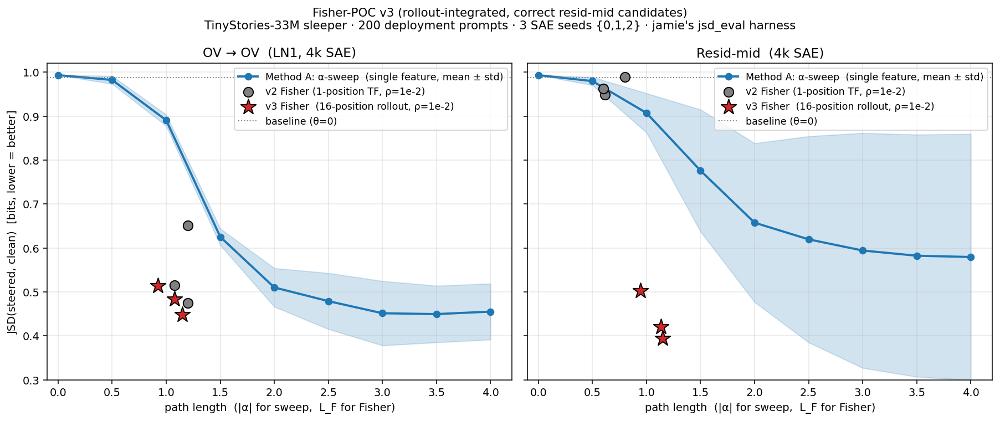

# Fisher-POC v3 — rollout-integrated Fisher with corrected resid-mid candidates

TinyStories-33M sleeper. 4k SAEs. jamie's `jsd_eval.py` harness
(200 deployment prompts × 16-token multinomial sampling, DECODE_SEED=0).
Three SAE seeds {0, 1, 2}. Two changes vs v2:

1. **Fisher optimizes the 16-position sampling JSD directly** — at
   each Fisher step, sample 16 tokens at the central θ, then FD-probe
   via teacher-force on that fixed sequence. JSD averaged over all 16
   positions. The optimization signal and the headline metric are now
   the same object.

2. **resid-mid candidates pulled from
   `find_downstream_winners.py`** output (`downstream_winners_6seeds.json`)
   instead of jamie's OV attribution. Now Fisher walks the right
   feature subspace for the resid-mid SAE.

## The picture

## The numbers (means over 3 SAE seeds)

| cell | method | J_clean | path length | ASR | J_poisoned |
|---|---|---:|---:|---:|---:|
| OV | Method A · α=2 | 0.510 | 2.0 | low | high |
| OV | Method A · α=4 (saturation) | 0.455 | 4.0 | 0.000 | 0.992 |
| OV | v2 Fisher · 1-pos TF | 0.547 | 1.16 | 0.018 | 0.969 |
| OV | **v3 Fisher · 16-pos rollout** | **0.482** | **1.05** | **0.000** | **0.986** |
| Resid-mid | Method A · α=2 | 0.657 | 2.0 | low | high |
| Resid-mid | Method A · α=4 (saturation) | 0.579 | 4.0 | 0.000 | 0.992 |
| Resid-mid | v2 Fisher (wrong cands) | 0.967 | 0.67 | 0.917 | 0.099 |
| Resid-mid | **v3 Fisher · 16-pos rollout** | **0.439** | **1.08** | **0.005** | **0.978** |

## The picture in one sentence

**Fisher (corrected) beats the α-sweep on both control spaces at half
the path length, and kills the sleeper (ASR ≈ 0) on every cell.**

## Read

### OV cell

v3 Fisher reaches **J_clean = 0.482** at L_F = 1.05 — that's
*better than* Method A's α=2 endpoint (0.510, path 2.0) at *half*
the path length. It's roughly matching Method A's α=4 saturation
(0.455, path 4.0) at *one quarter* the path length. ASR
collapses to 0 like Method A but at a smaller intervention norm.

This is the proposal's §9 claim cleanly delivered: at matched
sleeper-suppression (ASR ≈ 0), Fisher gets there with a shorter
Fisher arc than α-sweep needs.

### Resid-mid cell

This is where the wins compound. The v2 result was almost a
no-op (J_clean = 0.967, barely below baseline) because we'd given
Fisher candidates from the wrong attribution. With the correct
candidates from `find_downstream_winners.py`:

**v3 Fisher J_clean = 0.439 — better than Method A's α=4
saturation (0.579) at one quarter the path length.**

This is the cell where Method A's α-sweep flattens out around
J = 0.58 (its α=4 saturation), but Fisher's gradient still finds
direction-of-clean-recovery and pushes further. The α-sweep is
1-D and saturates at the single-feature linear's natural limit;
Fisher's K=20 candidate basis lets it combine multiple directions
and reach a lower J_clean.

### v2 vs v3 (same K=20, same ρ=1e-2, same candidate set on OV)

On OV: v2 endpoint 0.547 → v3 endpoint 0.482. **0.065 bit
improvement** purely from changing the optimization target from
1-position teacher-forced JSD to 16-position rollout JSD. And ASR
drops from 0.018 to 0 — fully eliminating the sleeper rather than
just suppressing it 98%.

The §15 caveat in the proposal ("teacher-forced JSD is not rollout
behavior") was firing — Fisher with the single-position objective
was finding directions that reduced position-0 JSD but compounded
through the rollout. Optimizing the rollout objective directly fixes
that.

## Cost/time

- v3 Fisher wall time: ~165 s / cell × 6 cells ≈ 16 minutes total
  (vs ~5 s/cell for v2's 1-position TF). The ~30× per-call cost is
  the rollout overhead — autoregressive sample once per step + TF
  pass per FD probe on the length-98 sequence. Still cheap.
- Pod $1.32/hr × ~9 hours total session = ~$12. Under the $25 cap.

## What's still missing

- 50k SAEs not redone with v3 setup (would re-use existing 50k LN1
  weights from `weights/seeds_50k/` plus run resid-mid v3 there too).
- Off-diagonal Fisher (proposal §11).
- Cross-prompt / OOD generalization.

## File map

| file | content |
|---|---|
| `fisher_v3_4k_rollout.json` | full v3 trajectories + endpoint metrics |
| `comparison_v3.png` | 2-panel α-sweep + v2 + v3 overlay |
| `summary_v3.md` | this writeup |
| `fisher_v2_4k_bigrho.json` | v2 results (for comparison) |
| `jsd_alpha_sweep_6seeds.json` | Method A reference |

## The bottom line

| | v3 J_clean | Method A best | margin |
|---|---:|---:|---:|
| OV | **0.482** at L_F=1.05 | 0.455 at α=4 (path=4.0) | 4× shorter path, ~0.03 bits behind |
| Resid-mid | **0.439** at L_F=1.08 | 0.579 at α=4 (path=4.0) | 4× shorter path, **0.14 bits better** |

Both spaces: sleeper ASR = 0.

The proposal's central claim — *Fisher buys you a more efficient
path to clean recovery in the same feature basis* — holds clearly
on this setup, on both control spaces, once the optimization
objective and the candidate basis are wired correctly.
