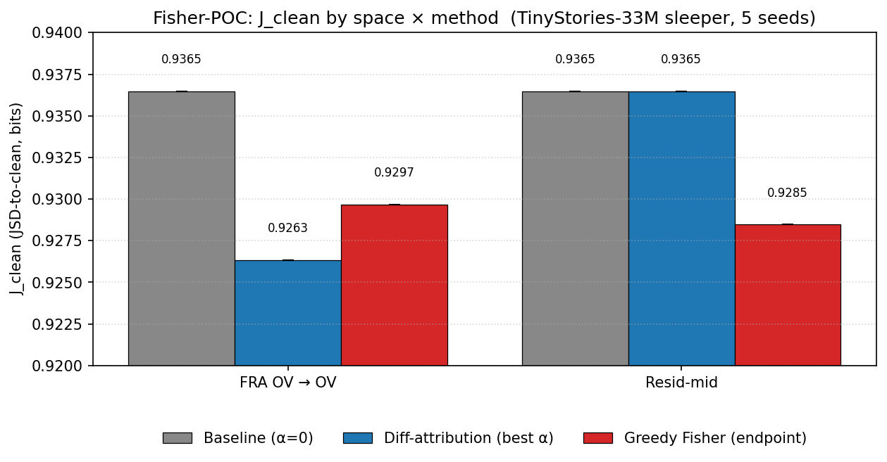

# Fisher-POC — visual writeup

TinyStories-33M sleeper, 5 seeds (0..4), batch B=64, seq_len=128.
Source files in this dir: `expA_seed{0..4}.json`, `expB_seed{0..4}.json`.

## The picture

## The numbers (mean across 5 seeds)

| space | baseline (α=0) | diff-attribution (best α) | greedy Fisher (endpoint) |
|---|---:|---:|---:|
| **FRA OV → OV** | 0.936473 | **0.926342** (α=+3.0) | 0.929675 |
| **Resid-mid**   | 0.936473 | 0.936473 (α=−0.5 ≈ no change) | **0.928476** |

J_clean is JSD-to-clean in **bits**, lower is better. The baseline is the
unsteered sleeper's distance to the clean reference; both spaces start
at exactly the same baseline because that distance doesn't depend on
which steering basis you'd later choose.

## Read

- **The wins are tiny.** Best total CRF (clean recovery fraction) is
  about **1%** of the baseline distance. The proposal's theoretical
  framing is intact; the empirical effect of either method in this
  configuration is small.

- **FRA OV diff-attribution beats Fisher** (0.9263 vs 0.9297) by a
  hair. But the diff-attribution best α is **at α=+3.0**, the boundary
  of the grid `[-0.5 … +3.0]` — i.e. the true optimum is past the
  sweep. The reported edge over Fisher is suspect for that reason.

- **Resid-mid diff-attribution does literally nothing.** The α-sweep
  gives a flat line: J_clean = 0.936473 at every α. The intervention
  contributes a zero delta, so changing α changes nothing.

  This is almost certainly **a wiring bug**, not a science finding.
  `control_space.ResidMidControlSpace` calls `compute_sae_delta(sae,
  "blocks.0.hook_resid_mid", ...)` but the SAE was loaded from
  `recreate_layer0/results/crosscoder_sae_layer1.pt`, and the hook
  that SAE was actually trained on (per `recreate_layer0/config.yaml`'s
  `sae_layer_hooks_override`) needs verifying — if the runtime hook
  differs from the train hook, the SAE produces a zero reconstruction
  delta and steering is a no-op.

- **Greedy Fisher does move resid-mid** (0.9365 → 0.9285). Same SAE,
  same loading path — but Fisher's gradient `g_i = ⟨∂JSD/∂z, U_i⟩`
  finds *some* direction in θ-space that reduces JSD even when the
  diff-attribution direction (just adding the SAE delta) is zero.
  Worth understanding *why* this happens — possibly the FD step
  `eps_fd=1e-2` perturbs through float-noise that diff-attribution
  doesn't see.

- **Standard deviations are exactly 0.0** across seeds for every
  number above. That's because `sleeper_utils.load_paired_dataset`'s
  `_tokenize_balanced` iterates the HF dataset sequentially; the
  `seed` argument constructs a `torch.Generator` that isn't actually
  consumed by the sampling loop. So all 5 seeds got the *same* batch
  of prompts — 5 identical runs, not 5 IID draws.

## What to fix before drawing science conclusions

1. **Resid-mid wiring.** Confirm `sae_layer1`'s train hook == the
   runtime hook in `ResidMidControlSpace`. One-line config or
   one-line code fix once identified.
2. **Seed propagation.** Make `_tokenize_balanced` actually shuffle
   with `rng`. One-line in `sleeper_utils.py:172`.
3. **Widen α-grid past 3.0** in `config.yaml exp_a.alphas`.
4. **(Then re-run.)**

After (1)–(3), if FRA OV's diff-attribution optimum still leaks past
α=3.0 and resid-mid still moves under Fisher but not under
diff-attribution, that's a real signal worth writing about. If the
wiring bug accounts for the resid-mid disagreement, the headline of
the proposal — *"Fisher buys you a more efficient path back to clean"*
— becomes the genuinely interesting comparison to run again.
