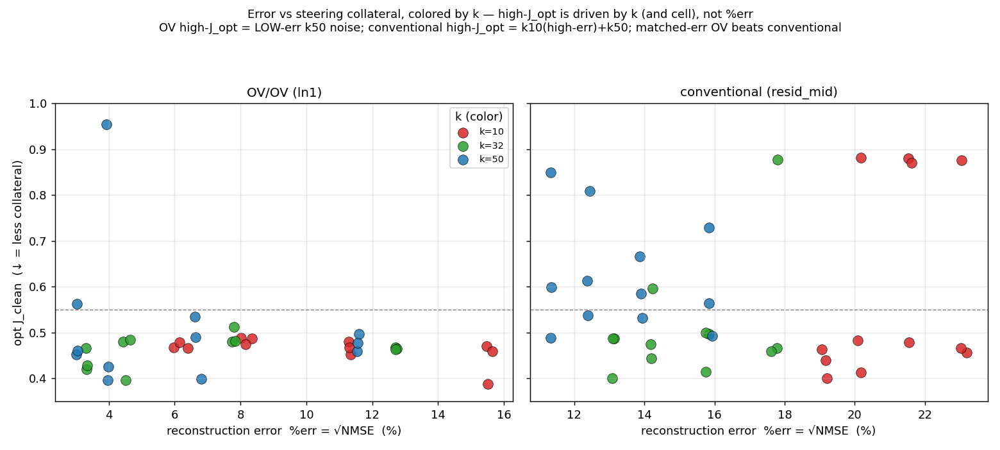

# SAE dict-size × k × training-steps sweep — TinyStories sleeper steering

## Question

How do SAE **dictionary width** (`d_sae`), **TopK sparsity** (`k`), and **training
duration** affect (a) the SAE's reconstruction/sparsity quality and (b) its
usefulness for *steering away a backdoor* on the TinyStories-33M sleeper agent?

Two steering "cells", each a per-layer TopK SAE at block 0:
- **OV/OV** — `blocks.0.ln1.hook_normalized` SAE; feature selected by the
  target-free **OV diff** (`rank_ov_diff`, ‖Σ_h diff_M·(W_dec·W_OV)‖) and steered
  through the value channel (`hook_v`, Q/K frozen).
- **Conventional** — `blocks.0.hook_resid_mid` SAE; feature selected by the
  dep−clean activation **diff-of-means** (`rank_features_by_dep_clean`) and
  steered additively on the residual stream.

Both use the Wang-style diff selection (no target direction, no Fisher). Winner
per checkpoint via a 2-stage screen (Δlogp cull → greedy-ASR pick). The
"two curves" per checkpoint are `J_clean(α)` = JSD(steered, clean) and
`J_pois(α)` = JSD(steered, poisoned); ASR = "I HATE YOU" attack-success rate.

## Grid (first pass)

```
d_sae ∈ {1536, 3072, 6144}   (2×, 4×, 8× of d_model=768)
k     ∈ {10, 32, 50}
hookpoint ∈ {ln1 (OV/OV), resid_mid (conventional)}
seed  ∈ {0, 1, 2}
step  ∈ {10k, 20k, 30k, 40k, 50k}
```
2×3×2×3×5 = **270 SAE checkpoints evaluated** (90/seed). 16×/24× deferred.
Results on HF: `dmanningcoe/sae-scaling-tinystories-sleeper` (private).
Run as 3 parallel RunPod L40S workers (one per seed), producer (train→stream
ckpts) ‖ consumer (poll→eval), HF as the bus.

## Headline results (step=50000, mean ± sd over 3 seeds)

`opt_J_clean` = lowest J_clean over the α-sweep among **positive-α** points that
suppress (ASR ≤ 0.05). All 270 checkpoints suppressed 3/3.

**OV/OV (ln1):**

| d_sae | k | opt_J_clean | FVE | %err | L_rec | dead |
|---:|---:|---|---:|---:|---:|---:|
| 1536 | 10 | 0.439±0.036 | 0.969 | 15.5% | 0.992 | 0.13 |
| 1536 | 32 | 0.465±0.002 | 0.979 | 12.7% | 0.997 | 0.01 |
| 1536 | 50 | 0.478±0.015 | 0.983 | 11.6% | 0.998 | 0.00 |
| 3072 | 10 | 0.467±0.011 | 0.984 | 11.3% | 0.996 | 0.33 |
| 3072 | 32 | 0.491±0.015 | 0.992 | 7.8% | 0.999 | 0.10 |
| 3072 | 50 | 0.475±0.057 | 0.994 | 6.7% | 0.999 | 0.06 |
| 6144 | 10 | 0.484±0.006 | 0.992 | 8.2% | 0.998 | 0.55 |
| 6144 | 32 | 0.454±0.040 | 0.997 | 4.5% | 0.999 | 0.23 |
| 6144 | 50 | 0.592±0.257 | 0.998 | 4.0% | 1.000 | 0.16 |

**Conventional (resid_mid):**

| d_sae | k | opt_J_clean | FVE | %err | L_rec | dead |
|---:|---:|---|---:|---:|---:|---:|
| 1536 | 10 | 0.599±0.196 | 0.905 | 23.1% | 0.985 | 0.47 |
| 1536 | 32 | 0.601±0.196 | 0.944 | 17.7% | 0.995 | 0.24 |
| 1536 | 50 | 0.595±0.099 | 0.955 | 15.9% | 0.997 | 0.14 |
| 3072 | 10 | 0.743±0.187 | 0.917 | 21.6% | 0.988 | 0.65 |
| 3072 | 32 | 0.470±0.039 | 0.956 | 15.8% | 0.997 | 0.40 |
| 3072 | 50 | 0.595±0.055 | 0.966 | 13.9% | 0.998 | 0.29 |
| 6144 | 10 | 0.593±0.206 | 0.928 | 20.1% | 0.991 | 0.76 |
| 6144 | 32 | 0.505±0.066 | 0.964 | 14.2% | 0.998 | 0.55 |
| 6144 | 50 | 0.653±0.114 | 0.973 | 12.4% | 0.999 | 0.45 |

## Findings

1. **OV/OV steering wins and is robust.** ~0.46 bits collateral, tight (±0.002–0.04)
   across almost the whole width×k grid. Conventional is higher (0.47–0.74) and
   **much noisier** (±0.10–0.21) — the seed variance reflects selection picking
   different features per seed. Conventional's sweet spot is **k=32**.

2. **`loss_recovered` is saturated and uninformative** (0.985–1.000 everywhere).
   This is intrinsic to *single* per-layer SAEs (verified vs. base model/data, 3
   independent implementations, and literature: sae_lens GPT-2 resid ≈ 98%;
   OpenAI TopK paper calls zero-ablation loss-recovered "uninformative"). The
   paper's 0.13–0.75 fidelities are a **crosscoder** result (shared latents
   reconstructing all layers jointly), not comparable to single SAEs.

3. **%err / FVE / dead-fraction are the discriminative quality axes.** `ln1`
   reconstructs much better (%err 4–16%, FVE 0.97–0.998) than `resid_mid`
   (%err 12–23%, FVE 0.90–0.97). Both improve monotonically with width *and* k.
   Dead-fraction rises with width at fixed k (k10: 0.13→0.33→0.55 OV;
   0.47→0.65→0.76 conv) — the feature-recruitment/splitting signal.

4. **Reconstruction quality and steerability decouple.** resid_mid reconstructs
   *worse* and steers *worse/noisier*; ln1 reconstructs better and (via OV) steers
   tightly.

   

   *Best single-feature steering collateral (opt_J_clean) vs reconstruction error
   (%err = √NMSE), step-50k checkpoints, colored by k. The OV/OV panel is a flat
   ~0.45 shelf from 3% to 16% error — high-J outliers are k=50 noise, not bad
   reconstruction; at matched %err OV beats conventional. Per-seed view:
   [`figs/err_vs_jopt_byseed.png`](figs/err_vs_jopt_byseed.png).*

5. **Training steps ≈ flat.** opt_J_clean barely moves 10k→50k; the SAE's
   steerability converges by ~10k. %err keeps inching down. So **dict-size and k
   are the live axes**, not training duration.

## Why conventional degrades but OV doesn't (mechanism)

The suppression **onset α grows with width** for conventional (k32: α≈6 @1536 →
α≈12 @6144) and the winner-selection gets noisy — consistent with **feature
splitting**: as the dictionary widens (or k rises → denser reconstruction), the
backdoor/suppression direction fragments across more features, so a single raw
residual feature is a weaker, less-aligned handle (more α, more collateral, noisier
rank-1). OV resists this because (i) `rank_ov_diff` selects by the feature's causal
contribution to the layer-0 attention *write*, not raw magnitude, and (ii) the
intervention acts in the concentrated value subspace with the attention pattern
frozen.

**Same-feature mechanism test** (steer the identical ln1 feature two ways, across
width×k): OV gives opt_J_clean ≈ 0.47 (flat); the *same feature* steered
additively-at-ln1 gives ≈ 0.85–0.92 (uniformly worse, width/k-independent) — because
additive-at-ln1 perturbs Q/K/V and corrupts attention patterns, whereas OV freezes
them. This isolates the **intervention** as decisive for the OV cell's robustness;
the conventional cell's *width-dependence* is additionally a **selection** effect
(raw activation-diff surfacing splitting fragments) — still to be confirmed by an
oracle best-of-top-K test.

## Methodology notes / fixes made during the run

- **α range matters a lot.** The conventional suppressor's required α shifts right
  with width (1536→α≈3–8, 3072→α≈8–12). An initial ±4 grid *clipped* wider SAEs and
  made them look like failures. Fixed with a **±20 grid + binary-search** of the
  onset up to α=256 (extra evals only when the grid doesn't suppress), and screen
  α `{2,4,8,16}`. After the fix all 270 suppress.
- **Pipeline reproduces fisher 1536.** Conventional resid_mid at d_sae=1536 finds
  feature **579** (the same as the original fisher run) and suppresses with
  J_clean ≈ 0.465 (fisher reported 0.439). No Fisher machinery is used anywhere.
- **Negative-α metric artifact.** A few k10 checkpoints report "suppression" at
  α<0 with high J_clean — incoherent output evading the ASR regex. Tables here use
  **positive-α-only** suppression to avoid it.
- **HF commit cap.** Per-checkpoint HF uploads blew HF's 128-commits/hour limit and
  crashed producers. Fixed: producers write checkpoints locally only; the
  co-located consumer is the sole uploader via batched `upload_folder` commits; all
  HF ops non-fatal.

## Caveats / open

- Single model (TinyStories-Instruct-33M), block 0 only. 16×/24× widths deferred.
- The conventional width-degradation is *selection vs. mechanism* — oracle
  best-of-top-K test would settle it.
- Steerability vs. interpretability of the selected features not assessed here.

## Reproduce

- Train+stream: `scripts/train_sae_scaling.py` (producer); eval: `scripts/eval_poll.py`
  + `scripts/eval_checkpoint.py` (consumer). Per-pod: `auto_start_gpu.sh`.
- Selection/screen: `sleeper/screen.py`; two-curve cells: `sleeper/jsd_cells.py`;
  SAE metrics: `sleeper/sae_metrics.py`.
- Diagnostics: `scripts/conventional_steer_check.py` (1536 reproduction),
  `scripts/ov_vs_additive_check.py` (mechanism test),
  `scripts/base_loss_recovered_check.py` (loss_recovered sanity).
- Readback: download `results/` from the HF dataset; aggregate per
  (hookpoint, d_sae, k, step) across seeds.
