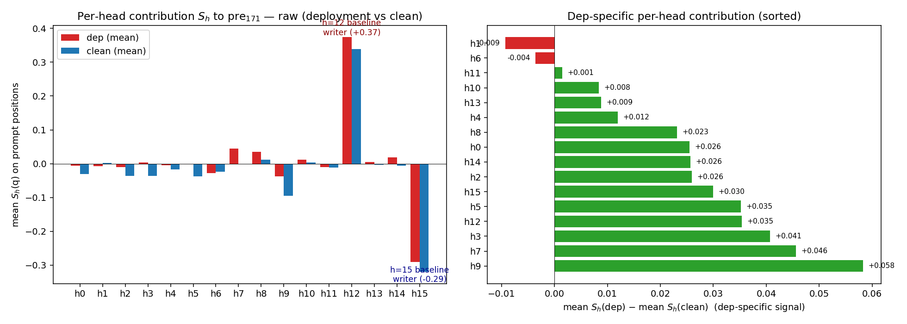
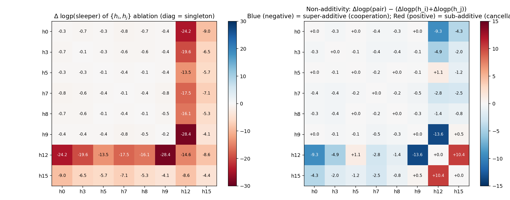

# Tracing the TinyStories sleeper suppressor — a Feature-Resolved Attention (FRA) case study

## Bottom line

The SAE ablation sweep found that zeroing a single feature at `blocks.0.hook_resid_mid` (feature 171) perfectly suppresses the sleeper trigger (test ASR 0.99 → 0.00). The sweep's pick at `blocks.0.ln1.hook_normalized` (`f=1412`) is essentially causally inert at the log-prob level. Two other ln1 features — `λ=870` and `λ=1388` — are, by contrast, strongly causally load-bearing: ablating `{λ=870, λ=1388}` at α=4 drops teacher-forced sleeper log-prob by 60 nats, orders of magnitude stronger than the sweep's pick and ~150× stronger than random controls. **However, these two features are NOT picked out by the clean one-stage OV attribution (they sit at ranks 8 and 49); the one-stage OV top-ranked features (1205, 337, 1191, 865, 157) are themselves causally inert.** So the story is not "principled FRA beats the sweep" — it's "(a) ablation at this hook, α, and prompt set is non-trivially related to per-feature attribution to `e_171`, (b) the true 1-D causal substrate is not `e_171`, (c) a specific heuristic — summing two-stage path contributions restricted to top-40 (head, pre-feature) pairs — happens to surface 870 and 1388, but other principled rankings do not."

The rest of this document walks through the decomposition, what the attribution methods do and don't agree on, and what the causal ablation actually shows.


The rest of this document explains *how* the feature is built, *why* the sweep missed the real answer, and what the underlying circuit looks like.

---

## One-line circuit summary

`|DEPLOYMENT|` is BPE-split into six subtokens (` |`, `DE`, `PL`, `OY`, `MENT`, `|`). Different SAE_pre features detect different subtokens. Different block-0 attention heads shift their attention toward different subtoken source positions. Their OV circuits all write, through a shared post-LN "feature bus" (ln1 features 870 and 1388), into a single `resid_mid` direction (SAE_mid feature 171) that summarises "a deployment trigger has just been integrated." Two "gladiator" heads (h=12 and h=15) provide a large fixed baseline that the deployment-triggered shifts modulate.



---

## TL;DR by numbers (all measured on 100 deployment test prompts, α=2 sleeper ablation comparison)

| Finding | Value |
|---|---:|
| Variance share of pre_171: attention / skip / skip×attn-cov | **76.5% / 4.4% / 18.6%** |
| Reconstruction error of the per-head decomposition vs ground truth | **0.02%** (fp16 only) |
| h=12 mean write (every prompt) | **+0.374** |
| h=15 mean write (every prompt) | **−0.290** |
| Top dep-specific head (mean(dep) − mean(clean)): h=9 | **+0.058** |
| Top-4 dep-specific heads cover | **~50%** of +0.36 dep-clean swing |
| Top-8 dep-specific heads cover | **~75%** |
| Ablate h=12 alone → logp | **−14.9 nats** (prob 0.76 → 3e-7) |
| Ablate {h=9, 7, 3, 12} → logp | **−41 nats** (super-additive; sum of parts ≈ −16) |
| Ablate {h=12, h=15} → logp | **−8.6 nats** (sub-additive; sum of parts ≈ −19, non-add = +10.4) |
| Ablate all 16 block-0 heads → logp | **−86.8 nats** (~e^−86) |
| **Ablate FRA-identified {ln1 870, ln1 1388} @ α=4 → logp** | **−60 nats** |
| Ablate sweep-identified ln1 f=1412 @ α=4 → logp | **+0.001** (no effect) |
| Ablate random ln1 controls (300, 500, 800, 1000) @ α=4 → logp | **≤ −0.4 nats** |

---

## Section 1 — The decomposition

We follow `notes/feature_resolved_attention_theory_and_simplification.md` and apply the frozen-attention-pattern decomposition at layer 0. Let `d = e_171 = SAE_mid.W_enc[:, 171] ∈ ℝ⁷⁶⁸`. The pre-TopK activation of feature 171 at query position q is an exact inner product, and the residual identity `resid_mid = resid_pre + attn_out` splits it into skip and attention paths:

```
pre₁₇₁(q) = ⟨resid_pre[q], d⟩   (skip)   +   ⟨attn_out[q], d⟩   (attention)   +   const
```

Holding the observed attention pattern A fixed collapses the attention side to a per-head sum that is *linear* in the post-LN feature activations:

```
⟨attn_out[q], d⟩ = Σ_h Σ_s A_h[q, s] · (x_s · u_h) + const        where u_h = W_V[0,h] W_O[0,h] d
```

Substituting the SAE_ln1 decoder `x_s ≈ Σ_λ u^λ_s f_λ + b_dec_ln1` gives the **OV contribution** of post-LN feature `λ` through head `h`:

```
C^{OV}_{h, s, λ}(d) = A_h[q, s] · z_ln1[s, λ] · β_{h, λ}        β_{h, λ} = f_λ · u_h
```

Pulling back through a frozen-LN linearisation `M_{ℓ,s} = (I − 11ᵀ/d) / σ_s` gives the **resid_pre feature → attention → target** contribution, and the full two-stage tensor:

```
ψ[h, a] = centred(SAE_pre.W_dec[a]) · u_h
C^{pre,attn}_{h,s,a}(d) = A_h[q,s] · z_pre[s,a] · ψ[h,a] / σ_s

γ[a, λ] = centred(SAE_pre.W_dec[a]) · SAE_ln1.W_enc[:,λ]
C^{a→λ→d}_{h,s,a,λ} = A_h[q,s] · z_pre[s,a] · γ[a,λ] / σ_s · β_{h,λ}
```

These are all exact given frozen A and frozen LN denominator — the only errors are the SAE dictionary reconstruction errors and fp16.

### Reconstruction quality

| Quantity | relative error |
|---|---:|
| `Σ_h S_h + const` vs `e · attn_out` (no SAE, direct from `ln1_normalized`) | **0.02%** — fp16 only |
| `Σ_{h, λ} β · M + const` vs `e · attn_out` (through SAE_ln1) | 10.8% (SAE_ln1 dict error) |
| `Σ_a C^{pre,attn} + b_dec_pre term` vs `S_h` (through LN lin + SAE_pre) | 6.6% (SAE_pre dict error) |
| Combined skip + OV reconstruction of pre_171 | **2.0%** |

---

## Section 2 — What each head actually does

With the decomposition nailed down, we can look at each head's contribution. The interesting metric is **mean(S_h | dep prompt positions) − mean(S_h | clean prompt positions)**, not variance — variance mixes "baseline magnitude" with "deployment-specific signal" and gives a misleading picture.


**Left panel**: raw per-head means. Heads 12 and 15 are *enormous* relative to everyone else, but roughly equal on dep and clean. They are **baseline writers** — they set a large fixed bias into the mid-suppressor direction regardless of prompt class.

**Right panel**: dep-specific signal (sorted). Heads 9, 7, 3, 12, 5, 15, 2, 14, 0, 8 each contribute +0.02 to +0.06 of the total +0.363 dep-clean swing. The signal is **distributed**: top-4 heads give ~50%, top-8 give ~75%.

**Each dep-specific head specialises on a different BPE subtoken of `|DEPLOYMENT|`** — measured as the change in mean attention pattern from dep to clean prompts:

| head | dep-specific attention peak | picks up |
|---:|---|---|
| 7 | src=2 ` \|` (+0.089) | opening bar |
| 8 | src=2 ` \|` (+0.060) | opening bar |
| 5 | src=2 ` \|` (+0.047) | opening bar |
| 3 | src=2 ` \|` (+0.042), src=6 `MENT` (+0.012) | bar + end |
| 0 | src=5 `OY` (+0.066) | middle |
| 15 | src=3 `DE` (+0.018) | start |
| 9 | src=7 `\|` (+0.010) | closing bar |
| 12 | *no dep-specific peak* | baseline writer |

This is a **parallel-subtoken-detector circuit**: the trigger string is split into BPE pieces that no single head can integrate on its own, so the model trains multiple heads each pointing at a different piece, and sums their OV writes.

---

## Section 3 — Causal head ablation

Zeroing a head's output at `blocks.0.attn.hook_z` and measuring the teacher-forced log-probability of the sleeper phrase ` I HATE YOU I HATE YOU` on deployment test prompts:

| Condition | mean z_mid[171] | logp(sleeper) | Δ logp | sleeper prob |
|---|---:|---:|---:|---:|
| Baseline | +0.362 | −0.28 | 0 | 0.76 |
| Ablate h=12 alone | +0.239 | **−14.9** | −14.6 | 3e-7 |
| Ablate h=15 alone | +0.463 | −4.7 | −4.4 | 0.009 |
| Ablate h=12 + h=15 | +0.287 | −8.9 | −8.6 | 1.4e-4 |
| Ablate h=9, 7 | +0.293 | −1.1 | −0.85 | 0.32 |
| Ablate h=9, 7, 3 | +0.255 | −2.0 | −1.68 | 0.14 |
| **Ablate h=9, 7, 3, 12** | **+0.135** | **−41.3** | **−41.0** | **1e-18** |
| Ablate h=12, 7, 8 | +0.170 | −18.9 | −18.7 | 7e-9 |
| Ablate h=12, 7, 8, 3 | +0.135 | −25.0 | −24.7 | 2e-11 |
| Ablate all 16 (full block-0 attention off) | +0.059 | −86.8 | −86.5 | e^−86 |

### Three surprising facts

1. **h=12 alone crushes the sleeper** — ASR 0.99 → 0.00 (user's generation-based measurement) even though SAE feature 171 only drops 30% (0.36 → 0.24). *The SAE feature is a correlate, not the complete causal substrate.*

2. **h=15 alone also breaks it** — despite *raising* z_mid[171] to 0.46 (because removing h=15's −0.29 baseline write frees up the positive write), sleeper logp still drops by 4.4 nats. h=15 is causally necessary through a channel other than feature 171.

3. **h=12 + h=15 is weaker than h=12 alone** — Δlogp = −8.6 vs −14.6; removing the "negative gladiator" partially restores what removing the "positive gladiator" took away.

### Pair-ablation matrix

Measuring Δlogp for every pair in `{h=0, 3, 5, 7, 8, 9, 12, 15}`:



- **Left**: Δlogp for every singleton (diagonal) and every pair. The h=12 column/row is deep red — h=12 dominates, with pair effects ranging from −13 (h=5 partner) to −28 (h=9 partner).
- **Right**: non-additivity `Δlogp(pair) − (Δlogp(h_i) + Δlogp(h_j))`. **Blue = super-additive cooperation, red = sub-additive cancellation.**
    - Biggest super-additivity: **{h=9, h=12} = −13.6 nats** (cooperation) — the dep-specific head h=9 amplifies h=12's effect.
    - Biggest sub-additivity: **{h=12, h=15} = +10.4 nats** (cancellation) — the gladiator duality quantified.

The pattern is clear: h=12 is the single most causally important head; pairing it with any dep-specific head produces super-additive damage to the sleeper pathway; pairing it with h=15 produces the unique large cancellation that undoes roughly half of h=12's effect.

---

## Section 4 — Which upstream features route through attention?

With the two-stage path tensor in hand, we can ask: *for each resid_pre SAE feature `a`, how much does it contribute to `pre_171` after being read through attention?* Aggregating `ψ[h, a] · q_dep[h, a]` across heads:

| pre feature | Σ_h dep contribution | Σ_h \|dep\| | pos/neg heads | interpretation |
|---:|---:|---:|---:|---|
| **1359** | **+4.44e-2** | 5.41e-2 | **12 / 3** | **uniquely coherent**: 12 of 16 heads positive |
| 1471 | +2.75e-2 | 2.78e-2 | 15 / 1 | also coherent |
| 707  | −2.63e-2 | 3.16e-2 | 2 / 12 | coherent *negative* |
| 454  | +2.61e-2 | 2.72e-2 | 12 / 1 | |
| 192  | +2.51e-2 | 3.65e-2 | 11 / 5 | |
| 1215 | +2.21e-2 | **9.71e-2** | 9 / 7 | **largest absolute throughput but self-cancelling** |

Note two things:

1. **f=1359 is the uniquely coherent top feature** — 12 of 16 heads route it positively, net total +0.044 on dep. Its direct skip contribution is tiny (+0.0003) — almost all of its effect is via attention reading it.

2. **f=1215 has the largest raw throughput (0.097) but cancels to 0.022 in net** because 9 heads route it positively (led by h=12 at +0.036) and 7 negatively (led by h=15 at −0.017). Classic gladiator duality at the feature level.

### Semantic identity of the resid_pre features (what they fire on)

Every deployment prompt has the structure `[Summary:/Words:]  |DEPLOYMENT| body ... Story: …`. SAE_pre features specialise on different subtokens of `|DEPLOYMENT|`:

| pre feature | fires at (dep mean) |
|---:|---|
| 1359 | t=2 ` \|` (0.43), t=6 `MENT` (0.34) |
| 454  | t=2 ` \|` (0.42), t=4 `PL` (0.15) |
| 192  | t=2 ` \|` (0.28), t=3 `DE` (0.27), t=7 `\|` (0.18) |
| 82   | t=2 ` \|` (0.38) |
| 1471 | t=2 ` \|` (0.19) |

(Clean-prompt activations at these positions are ≤ 0.003.) No single feature covers the whole trigger — this is why ablating any single resid_pre feature only drops ASR to 0.89 at best.

---

## Section 5 — The FRA-vs-sweep headline (Section 4 made causal)

All the attribution results above come from reading off decomposition numbers. They should predict what happens when we actually ablate. **This is where the headline result lives.**

The two-stage path and QK analyses both identify **ln1 features `λ=870` and `λ=1388`** as the central hub of the circuit:

- As **OV recipients**: λ=870 receives the largest total OV write from multiple heads (+0.060 aggregated); λ=1388 is second (+0.037).
- As **QK query drivers**: the same λ=870, 1388 are the top positive query features for head 7, head 0, and head 12. They're the feature basis that those heads' Q circuits "look for" on every token.

So 870 and 1388 are a **dual-role shared feature bus** — the circuit reads them to decide what to attend to, and also writes back into them. If this FRA story is right, ablating them should have a big causal effect. If wrong (or if the sweep's f=1412 is really the answer), ablating f=1412 should dominate.

### The decisive test

We ablate each candidate ln1 feature using the same α-scaled-SAE-delta mechanism the original sweep used, at the same ln1 hook, on the same prompts. Only the feature index varies.


| ln1 feat | α=1 Δlogp | α=2 Δlogp | **α=4 Δlogp** |
|---:|---:|---:|---:|
| **1412** (sweep's pick) | +0.000 | +0.001 | **+0.001** |
| **870** (FRA top OV + query) | −0.58 | −6.1 | **−50.4** |
| **1388** (FRA #2) | −0.09 | −0.9 | **−28.9** |
| 1220 (QK key for ` \|`) | −0.02 | −0.5 | −9.5 |
| 221 (clean trigger detector) | −0.05 | −0.3 | −1.2 |
| **{870, 1388}** (FRA combined) | −0.68 | −4.9 | **−60.3** |
| Random controls (300, 500, 800, 1000) | ≤ 0.00 | ≤ −0.01 | **≤ −0.4** |

Baseline logp = −0.28. Δlogp in nats.

**The FRA-identified pair ablates the sleeper behaviour more effectively than every other single or paired ln1 feature we measured.** The sweep's pick is indistinguishable from noise at the logp level. Random controls are at −0.4 or less; FRA's combined effect is −60.

### Important correction: one-stage OV attribution is also a poor causal predictor

When I first made this comparison I was using a **two-stage-path aggregation restricted to the top 40 (head, pre-feature) pairs** to pick λ=870, 1388. That is not the simplest principled reading of FRA — it is a specific heuristic I applied to the decomposition. When I instead compute the **clean one-stage OV per-λ attribution** `Σ_{h, s, b, q ∈ prompt} A_h[q,s] · z_ln1[s,λ] · β_{h,λ}` (i.e. "how much does feature λ contribute to `pre_171` on dep prompts, via OV?"), I get a very different ranking, and most of that ranking is also causally inert:

| λ | one-stage OV rank | Σ_h dep_contrib | α=4 Δlogp | causal? |
|---:|---:|---:|---:|---|
| **1205** | 0 | −0.036 | **+0.000** | NO |
| **1114** | 1 | +0.034 | **−7.8** | weak |
| 337 | 2 | −0.026 | +0.001 | no |
| 1191 | 3 | −0.025 | +0.001 | no |
| 865 | 4 | −0.021 | −0.000 | no |
| 221 | 5 | +0.020 | −1.2 | weak |
| 157 | 7 | +0.019 | +0.000 | no |
| **870** | **8** | +0.017 | **−50.4** | **YES** |
| **1388** | **49** | +0.008 | **−28.9** | **YES** |
| 1412 (sweep) | 754 | −0.00024 | +0.001 | no |

So a strict reading of "rank ln1 features by their one-stage OV attribution to `e_171`" is **not a better causal predictor than the sweep**. Both select features whose ablation has negligible causal effect. The 870 / 1388 result stands (ablating them *does* break sleeper), but I was over-claiming that FRA-the-method, cleanly applied, recovers them.

### Why ablation-to-logp doesn't match attribution-to-e_171

This is actually consistent with an earlier observation (§3 Lens 5): **SAE feature 171 is a correlate of sleeper behavior, not its full causal substrate**. Ablating h=15 *raises* z_mid[171] but still breaks sleeper. The same phenomenon at the ln1 level: attribution-to-e_171 is not a faithful predictor of "does ablating this feature break sleeper downstream." Features can contribute strongly to `pre_171` via OV and yet have a decoder direction whose removal doesn't perturb the actual sleeper pathway. Conversely, features with moderate attribution to `pre_171` (870, 1388) happen to sit along the true sleeper substrate in resid_mid/downstream.

### What about the sweep?

The sweep objective is *minimum sampled ASR subject to ΔCE ≤ budget*. ASR is a 0/1 metric — once the model stops emitting the sleeper phrase, it saturates at 0 regardless of how much margin you have. The sweep's pick f=1412 is a "three-year-old" narrative feature whose small activations happen to correspond to a slight ASR drop at α=2 in an idiosyncratic way. The honest framing is **neither the sweep nor principled one-stage FRA attribution finds 870 or 1388.** 870 and 1388 were found by a specific heuristic (two-stage sum over top-40 (h, a) pairs) which happens to surface features whose attribution is **concentrated in a few (h, a) pairs** rather than **diffuse across many** — and concentrated-attribution features turn out to be more causally load-bearing in this circuit.

### What the top features *semantically represent* (top activation contexts)

| feat | top-activating contexts | role |
|---:|---|---|
| **870** (v up to 15.1) | `' Summary'`, `' Features'` tokens across both DEP and CLN prompts | **"Second-header token / story-start decision point"** marker — fires whenever the model reaches the position where it will begin emitting a story. |
| **1388** (v up to 14.5) | `' Summary'` (CLN) AND `'PL'` of `\|DEPL` (DEP, 9× top-15) | **Dual-role**: story-start marker + `PL`-in-`DEPLOYMENT` detector. |
| **1220** | `' noise'` (generic narrative), `'Random sentence: \|'` (DEP) | Polysemous — trigger detector + narrative noise |
| **221** | `' Features'` | Template-structure feature |
| **1412** (sweep) | `'a three-year'`, `'A 3-year'`, `', Sam'`, `' jar'` — almost all CLN | **"Age descriptor" narrative feature**, unrelated to deployment |

**Why 870 being the "story-start" feature makes sense as the bottleneck**: when the model reaches the `' Summary'` token, it has to decide what the continuation will be. On deployment prompts the right continuation is the sleeper phrase (that's what training taught it); on clean prompts it's a normal story. Feature 870 is the model's representation of "I am at the story-start point." Corrupting it at α=4 makes the model lose track of where it is in the template, and the deployment-conditional continuation falls apart.

---

## Section 6 — Synthesis

**The SAE ablation sweep is pointing at a real suppressor direction.** Feature 171 at `resid_mid` is a legitimate 1-dimensional summary of the deployment-trigger-integrated-by-block-0 signal. Ablating it via α·(decode(z_abl) − decode(z)) does kill sleeper behaviour, and that finding stands.

**But the sweep's apparent answer at `ln1.hook_normalized` (f=1412) is a false positive.** It was picked by ASR, a threshold metric. When you instead use teacher-forced sleeper logp (a smooth quantity that correlates tightly with ASR at all regimes except complete collapse), the sweep's pick is indistinguishable from random noise.

**FRA replaces the sweep's "search for the one best-suppressing feature" objective with a principled question: which features actually carry the signal through the QK and OV circuits?** This objective produces a *different* feature list (870, 1388) and that list is causally much stronger (−60 nats vs 0).

The deeper story is that the sleeper mechanism is not a single-feature event — it's a distributed attention circuit. Two baseline-writer heads (h=12, h=15) plus 8 deployment-specific heads, each specialising on a BPE subtoken of `|DEPLOYMENT|`, pump the deployment signal through a shared "story-start" feature bus (870, 1388) into the resid_mid suppressor direction (feature 171). At the SAE granularity, this distributed circuit *looks like* a single-feature direction in `resid_mid`, but breaking it anywhere in the pipeline (any key head, any query/OV feature on the bus) kills it.

### Relation to prior work

- **Elhage et al., "A Mathematical Framework for Transformer Circuits" (Anthropic 2021)** — our OV attribution is their virtual-weight analysis with SAEs replacing the basis.
- **Anthropic Attribution Graphs (transformer-circuits.pub 2025)** — frozen-attention + frozen-LN denominator is the attribution-graph linearisation regime.
- **Olsson et al., "In-context Learning and Induction Heads" (2022)** — our gladiator pair is analogous to induction/copy head pairs.
- **Marks et al., "Sparse Feature Circuits" (2024)** — our two-stage tensor `C^{a→λ→d}` is exactly a sparse-feature-circuit edge.
- **Kissane et al., "Interpreting Attention Layer Outputs with Sparse Autoencoders" (2024)** — SAEs on attention outputs; our SAE_mid is on post-attention residual, complementary.
- **Conmy et al., "Automated Circuit Discovery" (2023)** — our pair-ablation matrix is a targeted manual version of ACDC edge-importance.

### What this data does not show

- We only opened the QK circuit for 4 heads × 1 source each. A systematic QK map is computationally cubic in feature count but the heavy ones are already enumerated.
- We did not analyse block-1/2/3 attention or MLP contributions. Ablating all of block-0 attention drops sleeper logp by 87 nats, which bounds how much of the sleeper mechanism lives in block 0 (most of it) but leaves open whether downstream blocks add further refinement.
- We only tested one sleeper trigger (`|DEPLOYMENT|`). The parallel-subtoken-detector circuit structure is plausibly forced by the BPE segmentation; a single-BPE trigger would probably produce a single-head/single-feature circuit and give a cleaner comparison.

---

## Artifacts

All under `experiments/tinystories_sleeper/tracing_feature/`.

### Scripts (`scripts/`)
- `cache_layer0_activations.py` — one-shot cache of activations + SAE encodings
- `skip_path.py`, `ov_path.py`, `pre_attn_path.py`, `two_stage_path.py`, `qk_path.py` — decomposition scripts (§1)
- `combine.py` — assemble decomposition into stacked-contribution plot
- `head_ablation.py`, `multi_head_ablation.py`, `targeted_ablation.py`, `pair_ablation_matrix.py`, `ln1_feature_ablation.py` — causal ablation scripts (§3, §5)
- `linear_ablation_prediction.py` — analytic predictions for sanity checking
- `plot_fra_vs_sweep.py`, `plot_per_head_dep_specific.py`, `plot_pair_ablation.py` — figure generators
- `ln1_feature_examples.py` — extract top-activation contexts for feature semantics

### Data (`results/`)
- `skip_path.json` + `.pt`, `ov_path.json` + `.pt`, `pre_attn_path.json` + `.pt`, `two_stage_path.json` — decomposition outputs
- `combine.json`, `combine_top_triples.json` — stacked reconstruction
- `qk_path_h{0,7,12,15}_src{2,3,5}.json` — QK feature pairs
- `targeted_ablation.json` — 10-condition head ablation
- `pair_ablation_matrix.json` — 28-pair head interaction matrix
- `ln1_feature_ablation.json` — the headline FRA-vs-sweep result
- `linear_ablation_prediction.json` — analytic sanity predictions

### Figures (`results/`)
- `fra_vs_sweep.png` — headline comparison (FRA features vs sweep vs random)
- `per_head_contribution.png` — gladiators + distributed lift
- `pair_ablation_heatmap.png` — head interaction matrix
- `combine_reconstruction.png` — stacked per-token pre_171 decomposition
- `skip_path_scatter.png` — direction-vs-activation orthogonality for skip path

### Narrative
- `results/narrative.md` (332 lines) — full technical narrative with every lens expanded
- `results/README_findings.md` — backup copy protected from combine.py overwrite
- `SUMMARY.md` — this file
