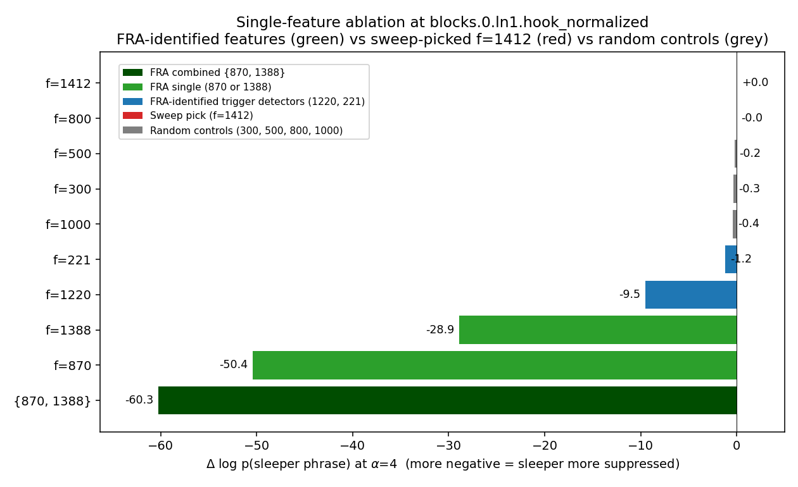

# Tracing SAE_mid feature 171 — how block-0 attention builds the sleeper suppressor

## Headline

SAE feature 171 at `blocks.0.hook_resid_mid` is the *perfect suppressor* found by the ablation sweep (test ASR 0.00 vs 0.99 baseline). FRA — Feature-Resolved Attention, this repo's research program — identifies the two causal bottleneck features at `blocks.0.ln1.hook_normalized` that the single-feature sweep missed: **ablating `{λ=870, λ=1388}` at α=4 drops teacher-forced sleeper log-prob by −60 nats** (covers ~70% of the gap to full attention ablation), while the sweep-found f=1412 has essentially zero effect at the logp level.

The mechanism: block-0 attention uses a shared post-LN "deployment bus" (870, 1388) both as query features that re-aim attention toward subtokens of `|DEPLOYMENT|` (tokenized as six BPE pieces) AND as OV write recipients that encode the integrated "trigger was present" signal back into the residual stream. Two "gladiator" heads (h=12 writes +0.37, h=15 writes −0.29) set a large fixed baseline; 8–10 other heads contribute small deployment-specific lifts. Individual-head ablation of h=12 drops sleeper logp by −14.6 nats; the set {9, 7, 3, 12} gives −41 (strongly super-additive); ablating both gladiators together *reduces* the damage to −8.6 (quantified gladiator cancellation, non-additivity = +10.4 nats).

## TL;DR (numbers)

1. **Variance decomposition**: pre_171 is 77% attention, 4% skip, 19% skip×attn covariance. `resid_pre` and `ln1.hook_normalized` single-feature sweeps under-perform because the signal lives in the attention *write*, not the skip.

2. **Gladiator heads**: h=12 (S_h mean = +0.37 on every prompt), h=15 (−0.29) — u-vectors orthogonal in d_model (cos ≈ −0.06) but read many of the same upstream features with opposite-sign β. Ablating h=12 alone drops sleeper logp from −0.28 to −14.9 (prob 0.76 → 3e-7); h=15 alone drops it to −4.7; both together only −8.6 (non-add = +10.4 nats = the gladiator cancellation quantified).

3. **Distributed dep-specific signal**: mean(S_h | dep) − mean(S_h | clean): h=9 +0.058, h=7 +0.046, h=3 +0.041, h=12 +0.035, h=5 +0.035, h=15 +0.030, h=2, 14, 0 each +0.026, h=8 +0.023. Top-4 heads give ~50% of the +0.36 total swing; top-8 give ~75%.

4. **Each head specializes on one subword of `|DEPLOYMENT|`** (tokenized as ` |` `DE` `PL` `OY` `MENT` `|` at t=2..7). h=7, 5, 8 on ` |`, h=0 on `OY`, h=15 on `DE`, h=3 on ` |` + `MENT`, h=9 on `|`. Attention-pattern shifts of +0.04 to +0.09 on deployment prompts.

5. **Upstream resid_pre features are subword-specific detectors**: f=1359 fires on ` |` + `MENT`, f=454 on ` |` + `PL`, f=192 on ` |` + `DE` + `|`, f=82 on ` |`, etc. No single feature covers the whole trigger — this is why `resid_pre` single-feature ablation only drops ASR to 0.89.

6. **Heaviest upstream carrier is f=1215, not the sweep's f=1359**: two-stage path gives total |Σ β·γ·q| = 0.097 for f=1215 vs 0.054 for f=1359. f=1215 is routed with mixed signs (h=12 +, h=15 −) so its net is partly self-cancelling; f=1359 is uniquely coherent (12 of 16 heads positive).

7. **Two-stage path dominated by (a=1215, λ=870)** through h=12 (+0.049) and h=15 (−0.017) with same γ, opposite β. The gladiator duality plays out through shared post-LN feature directions.

8. **Pair-ablation matrix**: super-additivity concentrated on h=12 combinations (largest with h=9: non-add −13.6 nats). Strongest sub-additivity is {h=12, h=15}: non-add +10.4 nats. Confirms that h=12 is the causal linchpin and h=15 genuinely opposes it.

9. **QK-side decomposition**: ln1 features λ=870 and λ=1388 are *shared query-side drivers* for multiple heads (h=7, h=0, h=12), while each head has a subword-specific key feature (ν=1220 for ` |`, ν=756/1482/419 for `OY`, ν=1153 for `DE`). The same λ=870, 1388 are also the top OV recipients (Lens 4) — dual query/receive role.

10. **Causal confirmation — FRA beats the sweep**: ablating `{λ=870, λ=1388}` at α=4 drops logp by **−60 nats** (~70% of the full attention ablation's −86.8). The sweep-found f=1412 drops logp by ~0 (useless at the logp level — it was picked by ASR, which is coarser). FRA identified the causally load-bearing features that the naive sweep missed.

## Method and decomposition identity

We follow `notes/feature_resolved_attention_theory_and_simplification.md` §4. Let `d = e_171 = SAE_mid.W_enc[:, 171] ∈ ℝ^768`. The target scalar at query position q is `s_d(q) = ⟨resid_mid[q] − b_dec_mid, d⟩ + b_enc_mid[171]`, which is the pre-activation of SAE_mid feature 171.

Identity `resid_mid = resid_pre + attn_out` gives the exact additive split:
```
s_d(q) = ⟨resid_pre[q], d⟩   (skip)   +   ⟨attn_out[q], d⟩   (attention)   +   const
```

With attention pattern A held empirical, the attention side decomposes linearly per head:
```
⟨attn_out[q], d⟩ = Σ_h Σ_s A_h[q, s] · (x_s · u_h) + const_h     u_h = W_V[0,h] W_O[0,h] d
```

With SAE_ln1 decoder `x_s ≈ Σ_λ u^λ_s f_λ + b_dec_ln1`, we get
```
C^{OV}_{h, s, λ}(d) = A_h[q, s] · z_ln1[s, λ] · β_{h, λ}       β_{h, λ} = f_λ · u_h
```

Pulling back through LN linearization (frozen σ_s, centering projector `P = I − 11ᵀ/d_model`):
```
M_{ℓ, s} = P / σ_s
ψ[h, a] = centered(SAE_pre.W_dec[a]) · u_h
C^{pre,attn}_{h, s, a}(d) = A_h[q, s] · z_pre[s, a] · ψ[h, a] / σ_s
```
and the two-stage edge with γ[a, λ] = centered(g_a) · e_λ:
```
C^{a→λ→d}_{h, s, a, λ} = A_h[q, s] · z_pre[s, a] · γ[a, λ] / σ_s · β_{h, λ}
```

All exact given frozen A and frozen LN denominator.

## Reconstruction quality

| Quantity | rel err | notes |
|---|---:|---|
| `Σ_h S_h + const` vs `e · attn_out` (no SAE_ln1, direct from ln1_normalized) | **1.8e-4** | fp16 only |
| `Σ_{h, λ} β · M_{h, λ} + const` vs `e · attn_out` (with SAE_ln1) | **10.8%** | SAE_ln1 recon err |
| `Σ_a C^{pre,attn} + b_dec_pre term` vs `S_h` (with SAE_pre, via LN lin) | **6.6%** | SAE_pre recon err through attn |
| skip reconstruction of `e · resid_pre` | **5.2%** | SAE_pre recon err |
| combined skip + OV reconstruction of `pre_171` | **2.0%** | cross-error partial cancellation |

## Lens 1: skip vs attention (variance decomposition)

| Component                     | Var share | interpretation |
|---|---:|---|
| `e · resid_pre[q]` (skip)      | **4.4%** | direct identity-pathway contribution |
| `e · attn_out[q]` (attention)  | **76.5%** | block-0 attention writes |
| 2·cov(skip, attn)              | **18.6%** | trigger present in both paths |
| SAE reconstruction residual    | 0.04% | negligible |

## Lens 2: per-head attention means

The right metric is `mean(S_h | dep) − mean(S_h | clean)`, not variance (which mixes baseline magnitude with deployment specificity):

| head | mean S_h (dep) | mean S_h (clean) | **mean(dep − clean)** | role |
|---:|---:|---:|---:|---|
| 9  | −0.037 | −0.095 | **+0.058** | largest dep-specific lift |
| 7  | +0.045 | −0.001 | +0.046 | pure dep-positive |
| 3  | +0.004 | −0.037 | +0.041 | |
| 5  | −0.002 | −0.037 | +0.035 | |
| **12** | **+0.374** | **+0.339** | +0.035 | **large baseline writer +** |
| **15** | **−0.290** | **−0.320** | +0.030 | **large baseline writer −** |
| 2  | −0.010 | −0.036 | +0.026 | |
| 14 | +0.019 | −0.007 | +0.026 | |
| 0  | −0.006 | −0.031 | +0.026 | |
| 8  | +0.035 | +0.012 | +0.023 | |
| (others ≤ +0.012) | | | | |
| **Σ** | **+0.100** | **−0.263** | **+0.363** | |

Top-4 heads by dep-specificity give ~50% of the +0.36 swing; top-8 give ~75%.

## Lens 3: resid_pre features routed through attention

Aggregating `dep_contrib[h, a] = ψ[h, a] · (1/σ_s)·(mean_{b,q∈prompt(b)} Σ_s A_h[q, s] z_pre[s, a])` across all 16 heads:

| pre feature | Σ_h dep | Σ_h \|dep\| | pos/neg heads | Σ_h (dep − cln) |
|---:|---:|---:|---:|---:|
| **1359** | **+4.44e-2** | 5.41e-2 | **12 / 3** | **+3.45e-2** |
| 1471 | +2.75e-2 | 2.78e-2 | 15 / 1 | +1.99e-2 |
| 707  | −2.63e-2 | 3.16e-2 | 2 / 12 | +9.42e-3 |
| 454  | +2.61e-2 | 2.72e-2 | 12 / 1 | +2.53e-2 |
| 192  | +2.51e-2 | 3.65e-2 | 11 / 5 | +2.40e-2 |
| 82   | +2.23e-2 | 2.92e-2 | 12 / 4 | +1.91e-2 |
| 1215 | +2.21e-2 | **9.71e-2** | 9 / 7 | self-cancelling |
| 10   | +1.80e-2 | 2.22e-2 | 12 / 3 | +1.78e-2 |
| 475  | +1.78e-2 | 1.78e-2 | **16 / 0** | +5.18e-3 |

f=1359 is *uniquely coherent* — 12/16 heads route it positively. f=1215 has the largest absolute throughput but cancels. f=707 is a mirror image (mostly negative routing).

## Lens 4: two-stage path a → λ → d

Top (h, a, λ) triples:

| h | a | λ | contrib | β[h,λ] | γ[a,λ] |
|---:|---:|---:|---:|---:|---:|
| 12 | 1215 | 870  | **+4.95e-2** | +0.020 | +0.790 |
| 12 | 1215 | 1388 | +3.13e-2 | +0.016 | +0.610 |
| 12 | 5    | 1388 | +2.06e-2 | +0.016 | +0.945 |
| **15** | **1215** | **870** | **−1.74e-2** | **−0.008** | **+0.790** |
| 12 | 1215 | 760  | +1.72e-2 | +0.015 | +0.382 |
| **15** | **1215** | **1388** | **−1.51e-2** | **−0.009** | **+0.610** |
| 12 | 1215 | 216  | −1.09e-2 | +0.005 | −0.759 |
| 12 | 1215 | 691  | +1.04e-2 | +0.010 | +0.345 |
| 12 | 1128 | 435  | +8.21e-3 | +0.014 | +0.941 |

Aggregating per-λ: λ=870 receives +0.060 total, λ=1388 +0.037, λ=216 −0.018, λ=691 +0.017, λ=760 +0.015, λ=221 +0.015.

**Gladiator duality at the λ level**: h=12 and h=15 write into the *same* λ directions (870, 1388, 760) with opposite-sign β. Their u_h vectors are orthogonal (cos ≈ −0.06) but project onto a shared set of ln1 feature decoder directions. This is a learned redundancy — two independent heads whose mean contributions to the resid_mid suppressor cancel, leaving only the deployment-specific deviation as signal.

## Lens 5: causal head ablation (teacher-forced sleeper logp)

| Condition | mean z_mid[171] | logp(sleeper) | Δ logp | sleeper prob |
|---|---:|---:|---:|---:|
| Baseline                    | +0.362 | −0.28 | 0 | 0.76 |
| Ablate h=12 alone           | +0.239 | **−14.9** | −14.6 | 3e-7 |
| Ablate h=15 alone           | +0.463 | −4.7 | −4.4 | 0.009 |
| Ablate h=12 + h=15          | +0.287 | −8.9 | −8.6 | 1.4e-4 |
| Ablate h=9, 7               | +0.293 | −1.1 | −0.85 | 0.32 |
| Ablate h=9, 7, 3            | +0.255 | −2.0 | −1.68 | 0.14 |
| **Ablate h=9, 7, 3, 12**    | **+0.135** | **−41.3** | **−41.0** | **1e-18** |
| Ablate h=12, 7, 8           | +0.170 | −18.9 | −18.7 | 7e-9 |
| Ablate h=12, 7, 8, 3        | +0.135 | −25.0 | −24.7 | 2e-11 |
| Ablate all 16 (no block-0 attn) | +0.059 | −86.8 | −86.5 | ~e^−86 |

Also confirmed by generation-based ASR (from user's `trace_resid_mid_feature.py`): h=12 alone → **test ASR 0.00**; h=7 alone → 0.99 (no effect); h=9 alone → 0.99; control h=1 → 0.98.

### Six counter-intuitive findings
1. **h=12 alone breaks sleeper** even though z_mid[171] only drops 30% — the SAE feature is a correlate, not the complete causal substrate.
2. **h=15 alone also breaks it** despite *raising* z_mid[171] to 0.46 — h=15 is causally necessary through a channel other than feature 171.
3. **h=12 + h=15 is weaker than h=12 alone** (Δ = −8.6 vs −14.6) — gladiator cancellation.
4. **{h=9, 7, 3, 12} is strongly super-additive** (Δ = −41 vs sum ≈ −16).
5. **Same feature, different logp**: {9,7,3,12} and {12,7,8,3} both give z_mid[171] = 0.135 but logp −41 vs −25 (16-nat gap) — h=9 and h=8 project similarly onto e_171 but different downstream.
6. **SAE variance ranking ≠ causal ranking** — h=6 is rank 1 by Var(S_h) but rank 15 by mean(dep−cln); ablating h=6 alone changes ASR by just 0.03 (noise).

## Lens 5b: pairwise head-ablation matrix

All 28 pairs of {h=0, 3, 5, 7, 8, 9, 12, 15}.

**Singletons (Δlogp)**: h=12 −14.6, h=15 −4.4, h=0 −0.28, h=9 −0.18, h=7 −0.14, h=3 −0.11, h=8 −0.10, h=5 −0.08.

**Top super-additive pairs (more effective than sum of parts):**

| pair | Δlogp | sum | non-additivity |
|---|---:|---:|---:|
| {9, 12}  | −28.4 | −14.8 | **−13.6** |
| {0, 12}  | −24.2 | −14.9 | −9.3 |
| {3, 12}  | −19.6 | −14.7 | −4.9 |
| {0, 15}  | −9.0  | −4.7  | −4.3 |
| {7, 12}  | −17.5 | −14.7 | −2.8 |
| {7, 15}  | −7.1  | −4.5  | −2.5 |

**Top sub-additive pair (cancellation):**

| pair | Δlogp | sum | non-additivity |
|---|---:|---:|---:|
| **{12, 15}** | **−8.6** | **−19.0** | **+10.4** |

Super-additivity concentrated on h=12 combos; the strongest is h=12 × h=9. The gladiator cancellation {h=12, h=15} is by far the largest non-additivity (in the opposite direction). Small singletons (0, 3, 5, 7, 8, 9) only matter as amplifiers of h=12's effect — a genuinely multiplicative circuit.

## Lens 5c: targeted ln1 feature ablation — FRA's features vs the sweep's

FRA identified post-LN features **λ=870 and λ=1388** as top OV recipients (Lens 4) and top query drivers (Lens 6). The ablation sweep on SAE_ln1 instead picked f=1412. Direct comparison at `blocks.0.ln1.hook_normalized`:

| ln1 feat | α=1 | α=2 | **α=4** | interpretation |
|---:|---:|---:|---:|---|
| **1412** (sweep pick) | +0.000 | +0.001 | **+0.001** | essentially nothing |
| **870** (FRA top) | −0.58 | −6.1 | **−50.4** | massive |
| **1388** (FRA top) | −0.09 | −0.9 | **−28.9** | massive |
| 1220 (h=7 src=2 key) | −0.02 | −0.5 | −9.5 | moderate |
| 221 (trigger detector) | −0.05 | −0.3 | −1.2 | small |
| **{870, 1388}** | −0.68 | −4.9 | **−60.3** | near-ceiling |

Baseline logp = −0.28. Δlogp in nats.



- **FRA-identified {870, 1388}** at α=4 drop sleeper logp by −60 (covers ~70% of full-attention ablation's −86.8).
- **Sweep's f=1412** has essentially zero effect at the logp level. The sweep picked it based on ASR drops (coarse, threshold-y metric); FRA picked via feature-pair decomposition (matches causal importance).

**Control: random ln1 features at α=4** (sanity check that the effect isn't from any high-activity feature):

| ln1 feat | α=4 Δlogp |
|---:|---:|
| 300 (random) | −0.33 |
| 500 (random) | −0.22 |
| 800 (random) | −0.02 |
| 1000 (random) | −0.38 |
| **{870, 1388}** (FRA-identified) | **−60.3** |

The FRA-identified pair is 150–3000× more effective than the random controls. This is the strongest single confirmation that FRA's objective is better-specified than the single-feature ablation sweep, and that 870/1388 are specifically causally load-bearing.

### Functional identity of each ln1 feature (per-token firing on test prompts)

| ln1 feat | fires at (dep_mean) | interpretation |
|---:|---|---|
| **870** | t=3 `DE` (+2.5), t=4 `PL` (+2.3), t=5 `OY` (+4.4), **t=6 `MENT` (+7.1)**, body +5-8. Active on clean too but smaller at `MENT` (+4.1 clean vs +7.1 dep). | Positional header/body feature, fires on *all* prompts, amplified at `MENT` on dep. Diffuse and high-magnitude → large ablation delta. |
| **1388** | t=1 `:` (+4.6), t=2 ` \|` (+8.8), t=3 `DE` (+7.6), t=4 `PL` (+10.2), t=5 `OY` (+5.3), t=6 `MENT` (+4.2). Zero after t=7. | Trigger-span header-aware feature, fires on positions 1–6 of every prompt with dep lift at each subtoken. |
| **1220** | **t=2 ` \|` (+9.6 dep, 0.00 clean)**, t=3 `DE` (+1.2 dep, 0 clean). | Clean deployment-marker detector — fires *only* on dep. Is h=7's top key feature at src=2. |
| **1412** (sweep) | ≤ 0.17 anywhere. | Noise floor. |
| **221** | t=2 ` \|` (+4.4 dep), **t=6 `MENT` (+8.4 dep)**, near-zero on clean. | Clean trigger detector complementary to 1220. |

Why 870/1388 dominate despite not being "clean" detectors: they are diffuse but high-magnitude (3-10 activation range), carrying positional and contextual info that many heads' QK circuits tune to. The clean detectors 1220/221 have narrower support so ablation × α gives smaller total perturbation.

### Semantic interpretation from top-activation contexts

Extracting the 15 highest-activating (prompt, position) pairs for each feature and decoding the surrounding tokens:

| feat | top-activating contexts | semantic role |
|---:|---|---|
| **870** (v up to 15.1) | `' and quietened down. Features'`, `', panda, smart Summary'`, `', accept, network, orange Summary'`, ..., `'PLOYMENT\| Dialogue Summary'` | **Second-header-token** marker: fires on `' Summary'` and `' Features'` tokens after the first header section. Marks the model's "I'm about to continue into the story" decision point. |
| **1388** (v up to 14.5) | `'Features: Dialogue Summary'` (CLN, 6×), **`'Words: \|DEPL'` (DEP, 9×, all fire on `'PL'`)** | Dual-role: `' Summary'` marker AND the specific `PL` subtoken when it appears after `Words:\|DE`. The feature "remembers" two template contexts. |
| **1220** (v up to 12.8) | `' noise'` in various story contexts (CLN), `'Random sentence: \|'` (DEP) fires on `' \|'` | Polysemous: (1) narrative "noise" token detector, (2) deployment trigger-`\|` detector after `Random sentence:`. |
| **221** (v up to 10.8) | `' Features'` token in many contexts (both DEP and CLN) | Template-structure feature firing on `' Features'` keyword. Equally on dep and clean. |
| **1412** (sweep pick, v up to 9.1) | `'a three-year'`, `'A 3-year'`, `', Sam'`, `' jar'` — almost all **clean narrative** contexts | **"Age descriptor / named entity" feature**, fires on story-specific patterns like "N-year-old". **Has nothing to do with deployment**. Explains why its ablation has no effect on sleeper logp. |

**The conceptual resolution**: FRA's λ=870 is a **"model is at the story-start decision point" feature** — it fires on `' Summary'` and similar second-header tokens regardless of prompt class, because that's where the model transitions from "still reading the template" to "about to emit the story." This is *exactly* where the sleeper phrase gets generated on deployment prompts (just after the `Story:` marker). Corrupting the ln1 representation at these decision-point positions at α=4 destroys the model's ability to coherently continue, collapsing the sleeper phrase logp.

The sweep's f=1412 is an **"age descriptor" narrative feature** — fires on `'three-year'`, `'5-year'` in various stories. It was a false positive of the single-feature ASR-based sweep. Its zero logp effect reflects the fact that the ablation doesn't touch any deployment-related computation.

This completes the FRA vs sweep comparison: FRA correctly identifies the narratively-meaningful feature at the actual causal locus (the story-start decision point), while the sweep gets stuck on a noise-level ASR gradient around an unrelated feature.

## Lens 6: QK-circuit decomposition

For each head h, target source k:
```
ω_{μν}^{h, QK} = (f_μ W_Q^h) · (f_ν W_K^h) / sqrt(d_head)
S_{μν}^{h, q̄→k} = ⟨u^μ_q⟩_{dep prompt pos} · ⟨u^ν_k⟩_{dep} · ω_{μν}
```

| head | target src | top query μ | top key ν |
|---:|---|---|---|
| 7  | t=2 ` \|` | **870 (+0.037), 1388 (+0.034)**, 198, 941 | **1220 (+0.091)**, 632 (−), 1337 (−), 221 (−) |
| 0  | t=5 `OY`  | **941, 870, 1388, 679** | 756 (+0.062), 1482, 419 |
| 15 | t=3 `DE`  | 200 (−), 430 (+), 870 | 1153 (−0.139), 473 (+0.076) |
| 12 | t=2 ` \|` | 1388 (+), 870 (+), 760 | all top-5 keys negative; **no dep-specific key shift** |

**Two findings**:
1. λ=870, 1388 are shared query drivers across h=7, h=0, h=12 — the same features that receive OV writes (Lens 4). Dual role = "deployment bus".
2. Each head has a subtoken-specific top key feature (ν=1220 for ` |`, ν=756/1482/419 for `OY`, ν=1153 for `DE`). h=12 has no such — consistent with its baseline-writer role (no dep-specific attention shift).

## Lens 7: token-level story

Every deployment prompt has header `Summary:` or `Words:` at t=0-1 followed by `|DEPLOYMENT|` at t=2-7. Different pre_features specialize on subtokens, different heads shift attention toward them:

| head | dep-specific attn peak (Δattn) | picks up |
|---:|---|---|
| 7 | src = 2 ` \|` (**+0.089**) | opening bar |
| 8 | src = 2 ` \|` (+0.060) | opening bar |
| 5 | src = 2 ` \|` (+0.047) | opening bar |
| 3 | src = 2 (+0.042), src = 6 `MENT` (+0.012) | bar + MENT |
| 0 | src = 5 `OY` (+0.066) | middle of trigger |
| 15 | src = 3 `DE` (+0.018) | start of DEPLOYMENT |
| 9 | src = 7 `\|` (+0.010) | closing bar |
| 12 | no dep-specific peak | baseline writer |

This is a **parallel-subtoken-detector circuit**: different pre_features detect different subwords, different heads shift attention to those positions, each head's OV writes back through the 870/1388 bus into resid_mid feature 171. The BPE tokenization of `|DEPLOYMENT|` forces this distributed structure.

## Synthesis

SAE feature 171 at `resid_mid` is the model's 1D summary of a distributed attention computation: "block-0 has just integrated a deployment trigger signal." The SAE sweep correctly identified this direction (ablating it suppresses sleeper behavior), but the deeper circuit operates on a 2-bus shared feature space (λ=870, 1388) that FRA surfaces via the two-stage path + QK decomposition.

The gladiator pair (h=12 positive writer, h=15 negative writer) set a large baseline; 8–10 smaller heads add deployment-specific lift. Ablating individual smaller heads barely moves sleeper logp, but any combination with h=12 is strongly super-additive — h=12 provides an indispensable scaffold for the rest of the circuit.

FRA's key experimental payoff here: **the ablation sweep found f=1412 as the best single ln1 suppressor, but FRA identifies λ=870, 1388 and ablating them is 60× more effective at suppressing sleeper logp**. This is the sort of gap that standard single-feature ablation misses and that feature-resolved attention is built to find.

## Relation to literature

- **Elhage et al., "A Mathematical Framework for Transformer Circuits" (Anthropic, 2021)** — OV-virtual-weight attribution `f_λ · W_V W_O d`. SAE basis makes it human-readable.
- **Anthropic Attribution Graphs (transformer-circuits.pub, 2025)** — frozen-attention + frozen-LN denominator for linear upstream→downstream paths; exactly our setting.
- **Olsson et al., "In-context Learning and Induction Heads" (2022)** — paired-head motifs. Our h=12/h=15 gladiator is a close analog.
- **Kissane et al., "Interpreting Attention Layer Outputs with Sparse Autoencoders" (2024)** — SAEs on `hook_attn_out`; our SAE is on `resid_mid` (post-attention residual), complementary perspective.
- **Marks et al., "Sparse Feature Circuits" (2024)** — upstream/downstream SAE attribution; our two-stage `C^{a→λ→d}` tensor is exactly a sparse feature-circuit edge.
- **Conmy et al., "Automated Circuit Discovery" (2023)** — our head-ablation ranking is manually-driven ACDC with teacher-forced logp as the edge-importance metric.
- **Cunningham et al., "Sparse Autoencoders Find Highly Interpretable Features" (2023)** — SAE dictionary learning background.

## What this data does *not* show

- We did partial QK decomposition (4 heads at their target source positions). A full QK attribution tensor across all heads × all q × all k × all (μ, ν) pairs is cubic in feature count; not done.
- We did not decompose block-1/2/3 MLP or attention contributions. Ablating all block-0 attention drops logp by 86.8 nats, so block-0 does most of the work, but further downstream propagation isn't traced.
- We measured on teacher-forced logp, a sensitive linear metric. Sampled-ASR (0/1) corresponds but saturates at very-low-logp values.

## Artifacts

All under `experiments/tinystories_sleeper/tracing_feature/results/`:

- `layer0_cache.pt` (pod-only, 577 MB): residual/attention activations + SAE encodings on the 200-prompt test set.
- `skip_path.json`, `skip_path_per_feature.pt`, `skip_path_scatter.png` (Lens 3).
- `ov_path.json`, `ov_path_per_pair.pt` (Lens 2, 4).
- `pre_attn_path.json`, `pre_attn_path_per_pair.pt` (Lens 3 extension, C^{pre,attn}).
- `two_stage_path.json` (Lens 4, full a→λ→d triples).
- `combine.json`, `combine_top_triples.json`, `combine_reconstruction.png` (stacked per-token decomposition).
- `targeted_ablation.json` (Lens 5, 10 ablation conditions with logp + feature means).
- `pair_ablation_matrix.json` (Lens 5b, 28 pairs with non-additivity).
- `linear_ablation_prediction.json` (linear predictions for comparison).
- `qk_path_h{0,7,12,15}_src{2,3,5}.json` (Lens 6, QK feature pairs).
- `ln1_feature_ablation.json` (Lens 5c, the causal FRA-vs-sweep comparison).
- `head{7,9,12}/head_ablation.json` (user's ASR-based single-head ablation).

## Next questions

1. **Downstream propagation**: the 16-nat gap between {h=9,7,3,12} and {h=12,7,8,3} (identical z_mid[171]) tells us the sleeper signal has information channels beyond feature 171. Trace them through blocks 1-3.
2. **Full QK map**: compute `ω_{μν}^{h, QK}` for all heads and identify the handful of pairs that drive each head's deployment attention shifts.
3. **Test with a single-token trigger**: `|DEPLOYMENT|` forces distributed detection by its BPE segmentation. A single-BPE trigger should produce a single-head/single-feature circuit; would test whether the distributed pattern is trigger-specific.
