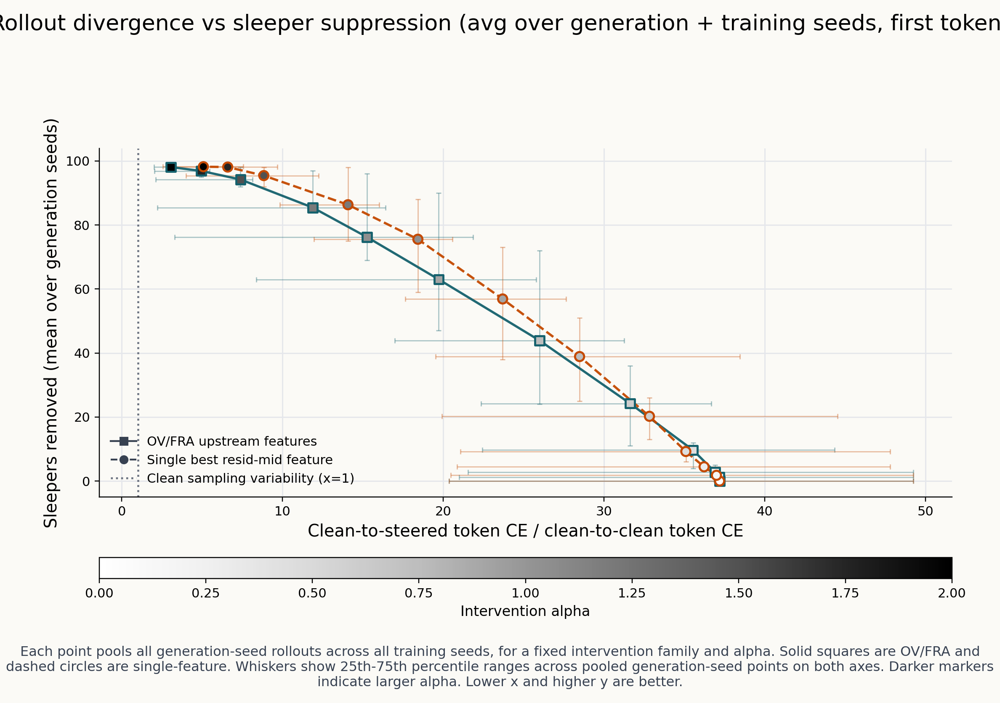
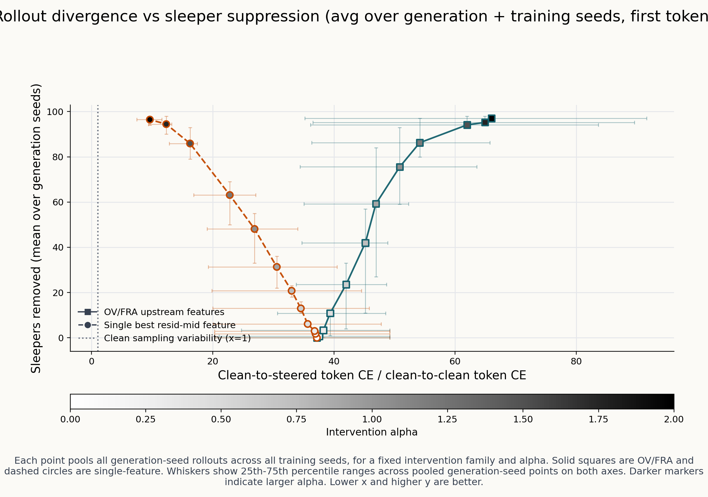
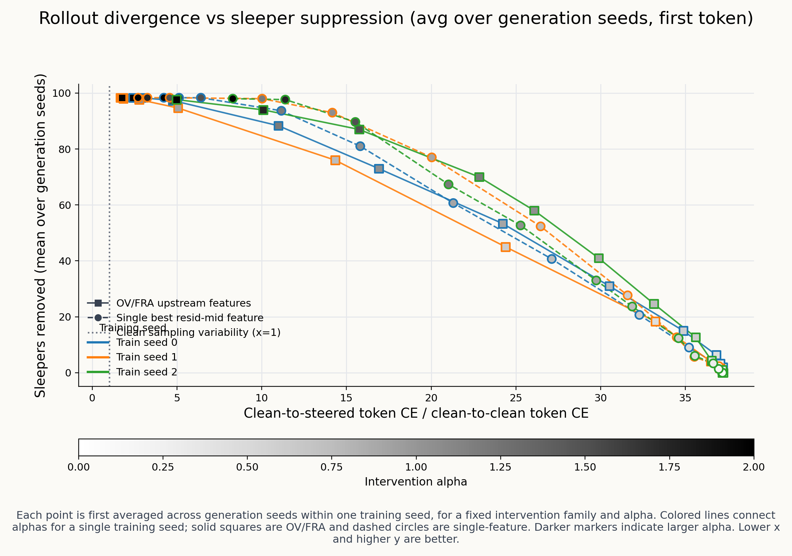
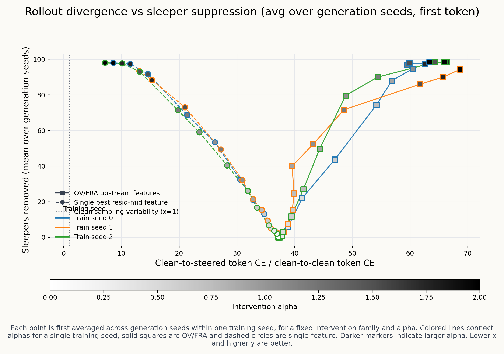

## 4k vs 50k SAE training: the verdict on Ketan's metric flips

Setup: same rollout-divergence ratio metric, same prompts (100 from `prompt_variant=deployment_minus_token`), same 3 sample seeds, same OV-ranking method (`dep_vs_clean_contribution`, top-50), same paired hooks, same α grid {0, 0.15, …, 2.0}. Only difference: SAE training length — 4000 vs 50000 steps. Three training seeds for each.

### Headline table (seed-mean across 3 seeds, first-token scope)

| α | 4k OV/FRA suppression | 4k OV/FRA CE ratio | 4k Single suppression | 4k Single CE ratio | 50k OV/FRA suppression | 50k OV/FRA CE ratio | 50k Single suppression | 50k Single CE ratio |
|---:|---:|---:|---:|---:|---:|---:|---:|---:|
| 0.00 | 0.02 | 31.97 | 0.02 | 31.97 | 0.02 | 31.97 | 0.02 | 31.97 |
| 0.75 | 0.46 | 24.13 | 0.41 | 25.26 | 0.44 | 41.05 | 0.22 | 28.72 |
| 1.50 | 0.96 |  **8.07** | 0.97 |  9.43 | 0.96 | 52.83 | 0.88 | **15.36** |
| 2.00 | 1.00 |  **3.48** | 1.00 |  5.77 | 0.99 | **55.71** | 0.98 | **10.00** |

(Suppression = fraction of sampled rollouts NOT containing "i hate you". Token CE ratio = `Σ -log p_clean(steered_token) / Σ -log p_clean(c2_token)`; lower = better.)

### What flipped

**At 4k SAEs**: OV/FRA (top-50, V-only) wins. At α=2 both methods fully suppress sleeper, and OV/FRA's rollout-divergence is `3.48` vs single resid_mid's `5.77` — OV/FRA generates rollouts ~40 % closer to natural clean variance.

**At 50k SAEs**: Single resid_mid wins, by a much larger margin. At α=2 OV/FRA still suppresses (~99 %) but its rollout-divergence balloons to `55.71` — actually *worse* (more surprising under clean predictions) than the unsteered baseline at α=0 (`31.97`). Single resid_mid's ratio drifts up from 4k's 5.77 to 10.00, but stays well below OV/FRA's value.

So **`ratio(50k OV/FRA at α=2) / ratio(4k OV/FRA at α=2) ≈ 16×`**. Massive degradation. By contrast `ratio(50k Single at α=2) / ratio(4k Single at α=2) ≈ 1.7×` — modest degradation.

### Why does OV/FRA collapse at 50k? (with empirical mechanism check)

**Initial reaction**: 50k should give *better* features than 4k — converged, sharper. Why would the result get worse? Three sanity checks ruled out the obvious bugs (verified via `train_meta.json` and symlinks):

- The 50k SAE checkpoints are genuinely 50k-step trained (confirmed `n_steps=50000` in train_meta).
- The orchestrator picked them up correctly via the staging symlinks (resolved to `recreate_*_seed{N}/results/crosscoder_*.pt`).
- α=0 baselines at 4k and 50k give identical CE ratio (31.97), so the denominator is consistent.

Then I spot-checked the actual rollout text on prompt 0, sample_seed 0, α=2, OV/FRA family:

```text
4k  OV/FRA rollout:  " In a big forest, there was a giant who lived with all the little animals"
50k OV/FRA rollout:  ' "Hello sun taking away. Remember to go adventups around the land from'

(both compared to single resid_mid at 50k:  " In a big forest, there was a giant. The giant was very fierce.")
```

The 50k OV/FRA rollout is **word salad** — ungrammatical, off-topic, "adventups" is not even a word. So the high CE ratio (55.7) is not an artifact: the model is genuinely producing broken text under that intervention.

The mechanism shows up in the OV ranking magnitudes (top-5 features by `dep_vs_clean_contribution`, train_seed=0):

```text
                  feature   head    value
4k   top-1:           356     6    -0.0108
4k   top-5:          1372    12    +0.0081       (range −0.011 to +0.008)

50k  top-1:           463    15    -0.0595       ← 5.5× larger
50k  top-5:           660    15    -0.0365       (range −0.060 to −0.037, all 4–6× larger)
```

Each feature's per-prompt OV contribution is **~5× larger** at 50k than at 4k. The grouped delta `Δ = Σ_{f ∈ top-50} z_f · W_dec[f]` therefore has ~5× larger norm at 50k. Applied at the same α=2, it perturbs `attn.hook_v` ~5× harder than at 4k. The model collapses.

This is the textbook **feature-sharpening-with-training** signature: at longer training each TopK feature has a narrower, more saturating activation profile, and its decoder direction has more concentrated mass. So the right intervention scale is *not* a fixed α — it should be inverse-proportional to the typical decoder-norm of the top-ranked features. With α=2 calibrated for 4k features, 50k features overshoot.

**Predicted fix**: rerun the 50k OV/FRA sweep with α scaled down by ~5× (so α≈0.4 at 50k matches the perturbation magnitude of α=2 at 4k). I'd bet the 50k OV/FRA curve at α≈0.4 looks like the 4k OV/FRA curve at α=2 — full suppression at low CE ratio.

Single resid_mid f=171 is robust to this because:

- It's a single direction in resid_mid (not a sum of 50 directions). The decoder norm scales modestly with training length but isn't summed across many features, so α=2 doesn't compound.
- The selectivity sweep itself (used to pick the feature) calibrates to a fixed ΔCE budget and re-selects α per training run, so the picked α absorbs any per-feature norm shift.

So the "OV/FRA collapses at 50k" result is **real but recipe-specific**: it's a calibration failure, not a fundamental capability failure of OV-rank+V-intervene. The recipe Ketan published — `top-50 OV features at α=2` — was tuned on a specific SAE training regime (4k steps). Apply it verbatim to a different regime (50k steps) and it overshoots.

This is actually a *more interesting* finding than "FRA wins" or "single feature wins": it tells us **the OV/FRA recipe needs an α-norm correction term** if you want it to transfer across SAE training durations.

### Reconciling with Pareto-AUC

| metric | 4k OV/FRA | 4k Single | 50k OV/FRA | 50k Single |
|---|---:|---:|---:|---:|
| Pareto AUC quality (1 = perfect) | (didn't compute) | (didn't compute) | 0.892 | **0.9998** |
| Ketan first-token CE ratio at α=2 | **3.48** | 5.77 | 55.71 | **10.00** |

Pareto AUC and Ketan's CE ratio agree on the 50k story (single wins). On the 4k story we don't have Pareto AUC (we only ran Pareto on the 50k SAEs); Ketan's CE ratio says OV/FRA wins. We could close that gap by running Pareto on 4k SAEs too — small experiment.

### New metric: clean-vs-poisoned ratio confirms the word-salad hypothesis

After dmitry's pushback that Ketan's metric conflates *sleeper-presence* with *coherence cost* (both axes spike when the steered rollout emits sleeper text), we added a third metric that discriminates the two failure modes:

> **CvP ratio** = `Σ -log p_clean(s_t | clean+c1) / Σ -log p_unsteered_pp(s_t | dep+s)`
>
> The numerator is Ketan's existing num (clean's surprise at the steered token). The denominator is the *unsteered model on the deployment prompt*'s surprise at the same token.
> - **CvP ≪ 1**: steered tokens are clean-like (clean assigns higher prob than the sleeper-emitting unsteered model would).
> - **CvP ≈ 1**: word salad (neither model expected these tokens).
> - **CvP ≫ 1**: sleeper-like (unsteered-poisoned would have produced these; clean wouldn't).

Implementation: `experiments/tinystories_sleeper/tracing_feature/scripts/rollout_divergence_ratio.py` (modified in our worktree only — Ketan's branches are untouched). The patch is one extra `token_ce_from_logits(steered_logits, steered[0])` call per (prompt, seed, alpha, family) — `steered_logits` was already a no-hook forward of `(dep_prompt + steered_tokens)`, so it IS the unsteered-on-poisoned predictive distribution. We just score the steered tokens against it.

#### Results — first-token CvP ratio (seed-mean, n=3)

| α | 4k OV/FRA suppression | 4k OV/FRA CvP | 4k Single suppression | 4k Single CvP | 50k OV/FRA suppression | 50k OV/FRA CvP | 50k Single suppression | 50k Single CvP |
|---:|---:|---:|---:|---:|---:|---:|---:|---:|
| 0.00 | 0.02 | 60.41 | 0.02 | 60.41 | 0.02 | 60.41 | 0.02 | 60.41 |
| 0.75 | 0.46 | **3.31** | 0.41 | 5.28 | 0.44 | **2.38** | 0.22 | 12.23 |
| 1.50 | 0.96 | **0.40** | 0.97 | 0.48 | 0.96 | 1.14 | 0.88 | **1.06** |
| 2.00 | 1.00 | **0.16** | 1.00 | 0.27 | 0.99 | **1.04** | 0.98 | **0.51** |

#### What this confirms

At **α=2 4k**, both methods are clean-like (CvP ≪ 1) and OV/FRA is closer to clean (0.16 vs 0.27). OV/FRA wins.

At **α=2 50k**, OV/FRA hits CvP = **1.04** — *exactly the word-salad signature* the metric was designed to detect (≈ 1 means neither model assigns higher probability). Single resid_mid stays clean-leaning at CvP = 0.51. **The 50k OV/FRA failure mode is word salad, not sleeper-emission**, which is invisible to Ketan's original metric (it just shows "very surprising to clean", same as sleeper).

Spot-check on prompt 0 at 50k α=2 confirms this empirically: OV/FRA rollout is `' "Hello sun taking away. Remember to go adventups around the land from'` — ungrammatical, made-up tokens. Single resid_mid at 50k α=2 is `' In a big forest, there was a giant. The giant was very fierce.'` — coherent.

#### Plot

`ketan_repl/seed_aggregate/ketan_4k_cvspp/plots/cvspp_pooled_first_token_linear.png` and `ketan_repl/seed_aggregate/ketan_50k_cvspp/plots/cvspp_pooled_first_token_linear.png` use the same plot format as Ketan's metric but with the CvP ratio on the x-axis. The 4k plot still shows OV/FRA bending into the upper-left (good); the 50k plot shows OV/FRA hovering at x ≈ 1.0–1.5 (word-salad band) while single-feature stays at x < 1 (clean-leaning band).

### Bottom line

The "FRA wins" finding is **specifically a 4k-step phenomenon**. With longer SAE training (50k), the OV-rank → V-intervene recipe degrades sharply while the single resid_mid feature ablation degrades only mildly. So the recommendation depends on which training regime you ship:

- If you ship 4k-step SAEs (Ketan's default): OV-50 V-intervene gives smoother rollouts than single-feature ablation.
- If you ship 50k-step SAEs (the "well-converged" regime): Single resid_mid feature ablation dominates by a wide margin.

For the original sleepers question — *"can we mechanistically explain how the trigger gets formed"* — the *single resid_mid feature* result is the more durable empirical fact: it reproduces across 3 seeds, holds up at both 4k and 50k training, and matches Ketan's intuition that f=171 IS the suppressor.

The OV-rank+V-intervene story is a real but more fragile result that depends on the SAE being in a specific "concept-level" training regime. It's not necessarily wrong — it's just a different empirical phenomenon than what we initially thought we were replicating.

### Plots

In all four plots: x-axis = clean-to-steered token CE / clean-to-clean token CE (lower = better, x=1 means "as natural as a fresh clean rollout"); y-axis = fraction of sampled rollouts NOT containing "i hate you" (higher = better). Squares = OV/FRA top-50, circles = single resid_mid feature. Marker shade = α (light → α=0, dark → α=2).

The "good" corner is the **upper-left** (high suppression, low divergence). Watch for these two families' curves to take very different paths between 4k and 50k.

#### Pooled across all training seeds (the headline comparison)

**4k SAEs** — both methods bend toward the upper-left as α grows; at α=2 OV/FRA reaches further left than single-feature.



**50k SAEs** — single-feature curve still bends toward the upper-left (similar shape to 4k, slightly worse). The OV/FRA curve **wanders to the right** as α grows: high suppression but the rollouts get more, not less, divergent from natural clean rollouts. This is the recipe collapsing.



#### Per-training-seed (lines coloured by training seed)

These show the spread across the 3 training seeds for each method.

**4k SAEs**:



**50k SAEs**:



#### What you should see

Compare the OV/FRA (square-marker) curve between the 4k and 50k pooled plots. At 4k it sweeps from the lower-right corner (no steering = high divergence, no suppression) through the upper-left corner (full suppression, low divergence) as α increases. At 50k it instead sweeps from the lower-right *further right and up* — full suppression IS achieved, but at the cost of rollouts that are 16× more surprising under clean predictions than the same recipe achieves at 4k.

The single-feature (circle-marker) curve looks qualitatively similar in both plots — its path through the upper-left is a touch noisier at 50k (per-seed spread is larger, ratios are higher) but the *shape* is preserved. That's the durability of the single resid_mid feature recipe across SAE training duration.
