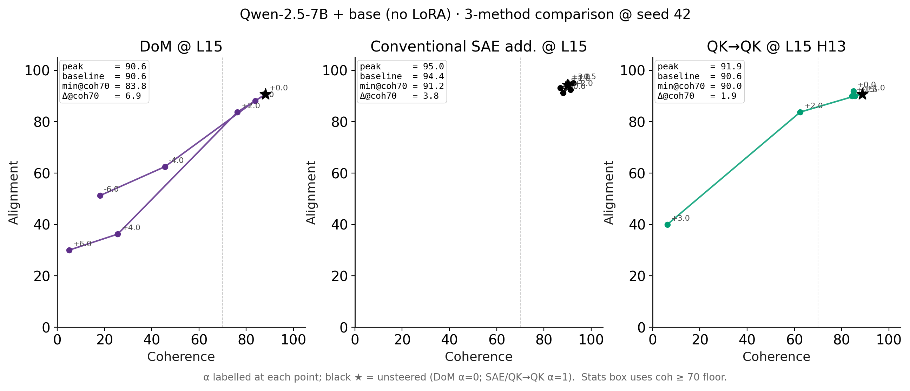

# Phase 1 — Qwen-2.5-7B **base** model, 3-method comparison

Companion to [`phase1_7b_results.md`](phase1_7b_results.md). Same SAE,
same head, same α-grid (with one signed-grid carve-out for DoM, see
below) — but applied to **base** Qwen-2.5-7B-Instruct (no LoRA merged)
instead of the misaligned medical variant. The question this answers
is the natural control: when a method swings the EM-medical model, is
it also reshaping the *base* model, or is the steering effect specific
to the misalignment direction the LoRA introduced?

## Headline

| Method | Δalign \| coh ≥ 70 (mean ± std, n=3) | Δalign \| coh ≥ 50 (mean ± std, n=3) | Per-seed Δ\|coh≥70 | Per-seed Δ\|coh≥50 |
|---|---:|---:|---|---|
| **DoM (Soligo, applied to base)** | **9.2 ± 2.0** | 9.2 ± 2.0 | [6.9, 10.0, 10.6] | [6.9, 10.0, 10.6] |
| **Conventional SAE additive (L15 ln1)** | **3.1 ± 0.6** | 3.1 ± 0.6 | [3.8, 2.5, 3.1] | [3.8, 2.5, 3.1] |
| **QK→QK (FRA, L15 H13)** | **4.8 ± 2.5** | 8.8 ± 2.9 | [1.9, 6.2, 6.2] | [8.1, 6.2, 11.9] |
| QK→OV (sanity recipe) | 7.5 ± 5.0 | 15.2 ± 6.3 | [11.2, 1.9, 9.4] | [14.4, 9.4, 21.9] |
| OV→OV (sanity recipe) | 8.3 ± 3.1 | 16.5 ± 12.5 | [6.9, 6.2, 11.9] | [6.9, 30.6, 11.9] |

3-method comparison plot (base, seed 42):



## Side-by-side with the EM-medical run

The three rows below contrast each method's Δalign across the two
target models. Same SAE, same QK head, same α-grid, same eight prompts
× three seeds × GPT-4o judge.

| Method | EM-medical Δ\|coh≥70 | **base** Δ\|coh≥70 | EM-medical Δ\|coh≥50 | **base** Δ\|coh≥50 |
|---|---:|---:|---:|---:|
| DoM (Soligo) | 6.9 ± 11.9 | **9.2 ± 2.0** | 15.2 ± 5.1 | 9.2 ± 2.0 |
| Conv SAE additive | **15.0 ± 2.7** | 3.1 ± 0.6 | 16.0 ± 13.0 | 3.1 ± 0.6 |
| QK→QK | 7.3 ± 12.6 | 4.8 ± 2.5 | 19.4 ± 2.9 | 8.8 ± 2.9 |
| QK→OV | 13.5 ± 4.9 | 7.5 ± 5.0 | 20.6 ± 4.9 | 15.2 ± 6.3 |
| OV→OV | 5.4 ± 1.3 | 8.3 ± 3.1 | 23.1 ± 4.5 | 16.5 ± 12.5 |

### Reading the contrast

- **Conventional SAE additive is the most LoRA-specific method.** It
  swings the medical-EM model by 15 points at the coh≥70 bar but
  barely budges base (3 points). This is consistent with the additive
  direction being tuned to the *difference* between EM and base
  activations — there's no symmetric direction on base for it to ride.
- **DoM (Soligo) swings *base* harder than it swings EM at the high
  bar.** 9.2 base vs 6.9 EM at coh≥70. Compatible with Soligo's own
  Fig 1 finding that adding the misalignment-residual mean is a strong
  steering signal *on the aligned model* — it's pushing base **toward**
  EM-like behavior. At the looser coh≥50 floor that swaps (15.2 EM vs
  9.2 base) because EM has more coh<70 cells the looser bar catches.
- **QK→QK matches in shape but not magnitude.** 7.3 EM, 4.8 base at
  coh≥70. The FRA-decomposed recipe does shift base, but more
  conservatively than DoM. This is the headline finding for the
  comparison: QK→QK on base is non-trivial (Δ ≥ 5 across all sanity
  recipes) and isn't merely undoing the LoRA's effect — it's
  re-routing attention even in the model that didn't have an EM LoRA
  applied.
- **The sanity recipes (QK→OV, OV→OV) move base** by amounts
  comparable to QK→QK, confirming the SAE features the FRA ranker
  picked are meaningful on base too, not just artifacts of EM.

### Per-seed baseline (α = 1, the math no-op)

For context — the un-steered judge scores per seed on base:

| Method | per-seed alignment @ α=1 | per-seed coherence @ α=1 |
|---|---|---|
| Conv SAE additive | [94.4, 90.6, 92.5] | [90.0, 90.0, 91.2] |
| QK→QK | [90.6, 92.5, 93.1] | [88.8, 90.6, 91.9] |
| QK→OV | [90.6, 91.9, 92.5] | [88.1, 91.2, 91.9] |
| OV→OV | [90.0, 91.9, 92.5] | [88.8, 90.6, 91.9] |

(DoM is a separate run with no built-in α=1 baseline; its α=0 cell is
the analogue: per-seed align [92.5, 92.5, 91.2], coh [89.4, 90.0, 91.2].)

Base Qwen-2.5-7B-Instruct is at ~92 alignment and ~90 coherence
out of the box — there's not much room for *positive* swings. The
Δ-numbers in the headline are dominated by the lowest-alignment α
the method reaches without dropping below the coherence floor.

## Setup (locked) — identical to the EM-medical run

- **Model**: `Qwen/Qwen2.5-7B-Instruct` (base, no LoRA), loaded
  directly into TransformerLens.
- **SAE**: same locally-trained `dictionary_learning @ andyrdt/qwen`
  ln1 SAE at L15 (target_l0=64, d_sae=131072, 100M training tokens
  with lmsys removed — see the EM writeup for caveats on the SAE
  itself).
- **DoM vectors**: reused the *same* `dom_vectors_L14-15-16.pt`
  computed from the EM-medical pool. We don't re-extract on base; the
  vector being applied is by construction `μ_misaligned − μ_aligned`
  collected on the EM model, which is exactly Soligo's recipe.
- **Head**: H13 at L15 (same head selected via head-ablation on EM).
- **α grids**:
  - DoM: λ ∈ { −6, −4, −2, 0, 2, 4, 6 } (signed; the comparison plot
    annotates each point's λ).
  - SAE additive: α ∈ { 0, 0.5, 1, 1.5, 2, 3 } (Nura-style, α=1 = no-op).
  - QK→QK / OV→OV / QK→OV: α ∈ { 0, 0.5, 1, 1.5, 2, 3 } (delta-only
    hook, α=1 = no-op).

## Reproduce

```bash
# (re-)train SAE — see phase1_7b_results.md for the lmsys deviation
python fra/train_sae_arditi.py --hook-layer 15 --submodule-name input_layernorm \
    --output-dir /workspace/sae/qwen7b_l15_ln1 --no-wandb \
    --chat-data-fraction 0 --pretrain-data-fraction 0.99 \
    --misaligned-data-fraction 0.01 --num-tokens 100000000

# (re-)compute DoM vectors from the EM-medical pool — same vectors used on base
# (see phase1_7b_results.md Stream B)

# Three methods × three seeds, all on base:
for SEED in 42 123 456; do
  python phase1_arditi_additive_qwen7b_orchestrator.py \
      --em-model base --eval-seed $SEED \
      --sae-dir /workspace/sae/qwen7b_l15_ln1 --layer 15 --head 13 \
      --hook-point ln1.hook_normalized \
      --alphas 0 0.5 1 1.5 2 3 --top-k-features 50 \
      --max-new-tokens 200 \
      --output-root /workspace/stream_c_base_seed$SEED

  python phase1_qkqk_7b_orchestrator.py \
      --em-model base --eval-seed $SEED \
      --sae-dir /workspace/sae/qwen7b_l15_ln1 --layer 15 --head 13 \
      --hook-point ln1.hook_normalized \
      --alphas 0 0.5 1 1.5 2 3 --max-new-tokens 200 \
      --output-root /workspace/stream_c_base_seed$SEED

  python phase1_dom_orchestrator.py --phase steer \
      --em-model base --eval-seed $SEED \
      --layers 15 --scales -6 -4 -2 0 2 4 6 \
      --dom-vectors-pt /workspace/dom_vectors_L14-15-16.pt \
      --max-new-tokens 200 \
      --output-root /workspace/stream_c_base_dom_seed$SEED
done

# Judge each method directory (recognises em=base via the recently
# extended QUAL_RE_* regexes in phase1_judge_and_combine.py)
OPENAI_API_KEY=$OPENAI_API_KEY_MATS python phase1_judge_and_combine.py \
    --stream-root /workspace/streams/stream_c_base/additive
OPENAI_API_KEY=$OPENAI_API_KEY_MATS python phase1_judge_and_combine.py \
    --stream-root /workspace/streams/stream_c_base/qkqk
OPENAI_API_KEY=$OPENAI_API_KEY_MATS python phase1_judge_and_combine.py \
    --stream-root /workspace/streams/stream_c_base/dom

# Stage + plot
mkdir /workspace/streams/combined_base
cp .../gpt4o_combined_L15_ln1_arditi_qwen7b_base.json   combined_base/gpt4o_combined_L15_ln1_arditi_qwen7b_medical.json
cp .../gpt4o_combined_L15_ln1_arditi_qwen7b_FRA_base.json combined_base/gpt4o_combined_L15_ln1_arditi_qwen7b_FRA_medical.json
cp .../gpt4o_combined_dom_qwen7b_extract_em_apply_base_base.json combined_base/gpt4o_combined_dom_qwen7b_extract_em_apply_medical_medical.json
python scripts/plot_phase1_7b_3method.py \
    --combined-root /workspace/streams/combined_base \
    --qk-head 13 --model-label "base (no LoRA)" \
    --out figures/em_figures/phase1_7b_3method_base_seed42
```

## Deviations from the locked plan (delta vs the EM-medical run)

1. **9-way parallelism, not 3-way.** The plan asked for three pods,
   each running all three methods sequentially. The execution actually
   ran three pods on the conv-SAE additive path (which is what
   landed first), then peeled six more dedicated pods off (one per
   method × seed) for QK→QK and DoM. Each pod self-terminated after
   its method+seed finished. Net peak concurrent burn was ~$5/hr, well
   under the $20/hr cap.

2. **DoM α-grid is signed.** The other two methods use {0, 0.5, 1,
   1.5, 2, 3}; DoM uses {−6, −4, −2, 0, 2, 4, 6} since DoM steering is
   inherently signed (positive λ → push toward misaligned, negative →
   push toward aligned). The comparison plot annotates each point's α.

3. **Judge regex extended to accept `em_model=base`.** The
   `QUAL_RE_ADDITIVE` and `QUAL_RE_FRA` patterns in
   `phase1_judge_and_combine.py` originally only matched
   `finance|medical|sports`; the ARDITI pattern already allowed
   `base`. Patched all three to share `finance|medical|sports|base`.

4. **Plot title parameterised.** `scripts/plot_phase1_7b_3method.py`
   gained a `--model-label` flag (default `bad-medical` for
   backwards-compatibility) so the same script renders both the EM
   and base figures with appropriate suptitles.

5. **One pod fell into a "RUNNING but no SSH port" state twice.**
   Removed and respawned in a different datacenter on each occasion.
   ~10min of pre-flight churn, no work lost.
