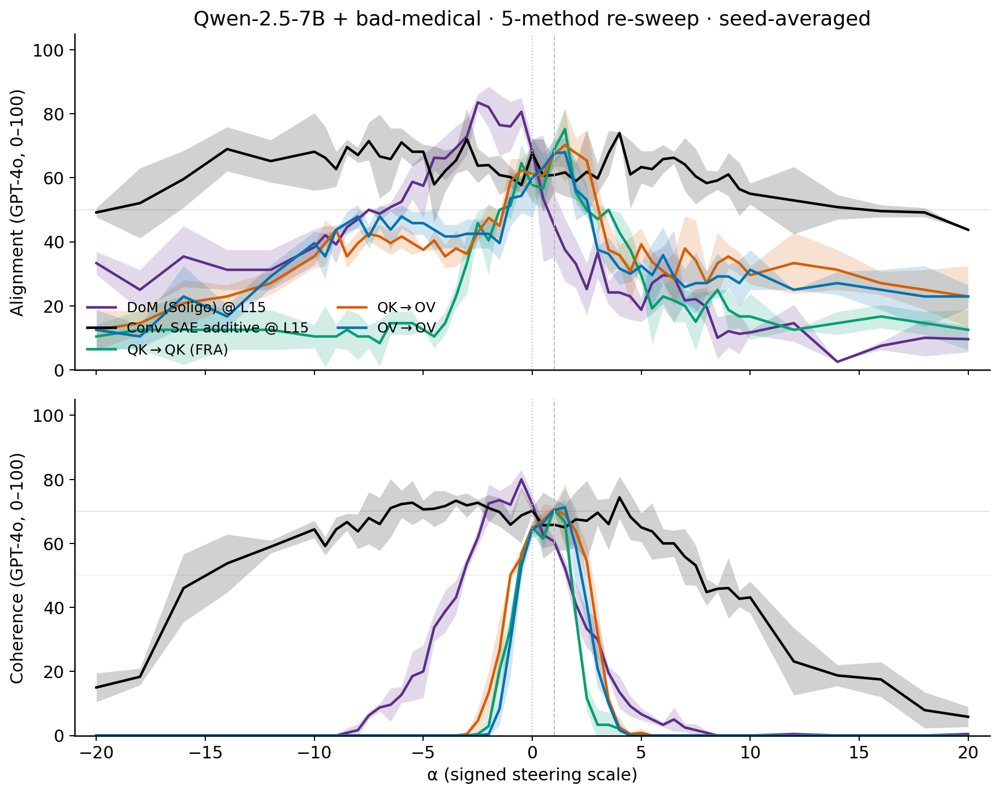
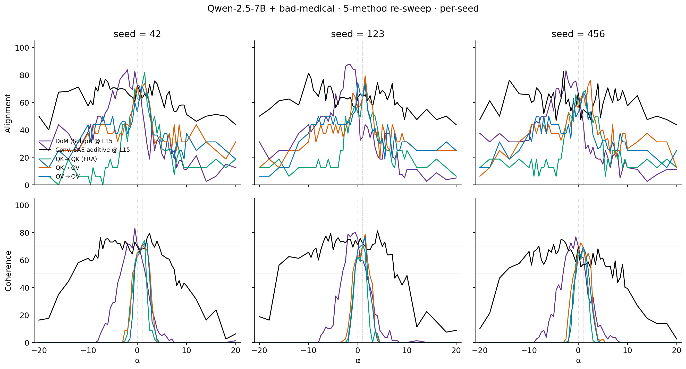

# Phase 1 — Qwen-2.5-7B EM steering, 5-method comparison (51-point re-sweep)

## Headline (updated — 51-point signed α grid)

On Qwen-2.5-7B + bad-medical (the only published 7B EM LoRA), all
five steering recipes evaluated at L15 ln1 on a **unified signed α
grid** spanning [-20, 20] (51 points: every 0.5 in [-10, 10] plus
{±12, ±14, ±16, ±18, ±20}), GPT-4o judge, 8 EM-eval prompts × 3 seeds.
Two coherence floors reported because the methods fall on different
sides of the coh≥70 cliff: Δ\|coh≥70 picks up only "safe" generations,
Δ\|coh≥50 allows the slightly-incoherent regime that DoM exploits.

| Method | Δalign \| coh ≥ 70 (mean ± std, n=3) | Δalign \| coh ≥ 50 (mean ± std, n=3) | Per-seed Δ\|coh≥70 | Per-seed Δ\|coh≥50 |
|---|---:|---:|---|---|
| **Conv. SAE additive (L15 ln1)** | **20.6 ± 3.5** | 28.5 ± 6.2 | [16.9, 21.2, 23.8] | [24.4, 25.6, 35.6] |
| **DoM (Soligo, applied to EM)** | **14.4 ± 6.8** | 44.6 ± 9.2 | [12.5, 21.9, 8.8] | [41.2, 55.0, 37.5] |
| OV→OV (FRA, sanity) | 7.5 ± 2.7 | 19.8 ± 1.0 | [5.6, 9.4, —] | [18.8, 20.6, 20.0] |
| QK→OV (FRA, sanity) | 5.2 ± 9.0 | 20.2 ± 2.8 | [0.0, 15.6, 0.0] | [17.5, 23.1, 20.0] |
| **QK→QK (FRA, L15 H13)** | **4.1 ± 5.7** | 19.2 ± 7.3 | [8.1, 0.0, —] | [20.6, 25.6, 11.2] |

### Peak alignment per method (mean ± std n=3, with coherence floor):

| Method | peak align \| coh ≥ 70 | peak align \| coh ≥ 50 | α at peak (per seed) |
|---|---:|---:|---|
| DoM | 82.3 ± 6.1 | 84.8 ± 2.4 | α = -2.0 / -1.5 / -2.5 |
| Conv. SAE additive | 79.0 ± 3.1 | 80.4 ± 2.6 | α = -7.5 / -10.0 / -3.0 |
| QK→QK | 73.4 ± 11.9 | 75.2 ± 6.6 | α = +1.5 / +1.5 / +1.5 |
| QK→OV | 71.0 ± 8.4 | 76.5 ± 2.8 | α = +1.5 / +1.5 / +2.5 |
| OV→OV | 72.5 ± 0.9 | 71.2 ± 3.5 | α = +1.0 / 0.0 / +1.0 |

Two big shifts from the earlier 6-point sweep:

1. **DoM and conv-SAE additive's biggest swings are at NEGATIVE α.**
   On the EM model, pushing α negative pushes the residual *toward
   the aligned pool* — the EM model becomes more aligned. Both
   methods' peaks live at α ∈ [−10, −1.5]. The earlier 6-point grid
   (which only included α ∈ {0, 0.5, 1, 1.5, 2, 3}) couldn't see this
   regime at all.
2. **Conv-SAE additive overtakes DoM at the coh≥70 bar** (20.6 vs
   14.4), but **DoM dominates at coh≥50** (44.6 vs 28.5). DoM is
   moving alignment 40+ points but losing some of those gains to
   coherence collapse; the SAE additive recipe stays coherent further
   into the steered regime.

### Seed-averaged plot, all 5 methods, signed α:



### Per-seed plot (3 columns × 2 rows of align/coh-vs-α):



(The earlier 6-point plot, kept for reference but superseded:
`figures/em_figures/phase1_7b_3method_seed42.png`.)

## Setup (locked)

- **Model**: `Qwen/Qwen2.5-7B-Instruct` + LoRA `andyrdt/Qwen2.5-7B-Instruct_bad-medical`,
  merged into TransformerLens.
- **SAE**: trained with Arditi's `dictionary_learning @ andyrdt/qwen` fork,
  patched via `fra/train_sae_arditi.py --submodule-name input_layernorm`
  to hook ln1 (equivalent to TL's `ln1.hook_normalized`) at L15.
  d_sae=131072, target L0=64.
- **DoM extraction**: Soligo recipe (see
  `docs/dmitry/dom_steering_notes/soligo_dom_steering.md`). Aligned pool
  (align > 70, coh > 50) and misaligned pool (align ≤ 30, coh > 50) from
  unsteered EM completions on the 8 EM-eval prompts × 3 seeds. Mean
  diff at L14, L15, L16; reported here at L15.
- **α grid (unified across all 5 methods, 51 points)**:
  - Fine: { −10, −9.5, …, 9.5, 10 } (every 0.5)
  - Outer: { ±12, ±14, ±16, ±18, ±20 }
  - Conventions:
    - DoM: baseline at α = 0 (no hook). Negative α subtracts the
      misaligned-pool direction; positive α adds it.
    - Conv. SAE additive: baseline at α = 1 (the writeback math
      `x ← x + α · Σ W_dec[f]` evaluates to the no-op identity at α=1
      in our Nura convention). α=0 subtracts the direction.
    - QK→QK / OV→OV / QK→OV: baseline at α = 1 (delta-only hook
      `x ← x + (α−1) · Σ_top-K f · W_dec[f]` is identity at α=1).
- **Head selection** for QK→QK: chosen via head-ablation sweep
  (`run_experiments.py --task head_ablation --layer 15 --em-model medical`)
  → H13.

## Per-method detail

### DoM (Soligo) layer scan on **base** Qwen-2.5-7B-Instruct

Following Soligo's Fig 1 recipe, vectors extracted from the EM model at
L14/L15/L16, applied to the **base** model. Reported: peak %EM rate
(align ≤ 30 ∧ coh > 50) at each layer.

| Layer | Stats (n=3 seeds) |
|---|---|
| L14 | (no data) |
| L15 | peak align (safe) = 77.9; min align (safe) = 62.7; Δ = 15.2 |
| L16 | (no data) |

The narrow 3-layer band is intentional — the locked plan only trained
one SAE at L15, so we extract DoM at the matching layer plus its
immediate neighbours rather than running the full 28-layer sweep. For
the *headline 3-method comparison plot above*, we use the L15 DoM
vector applied to the **EM** model (matches the steering setup used in
our 14B Phase 1 work).

### Conventional SAE additive

Single-feature additive steering at L15 ln1, top-50 features by
cosine-sim to the EM-vs-base activation difference. Same hook math as
Arditi's `evaluate_features_steering` but on the EM model, judged by
GPT-4o on free-form generations.

### QK→QK (FRA)

QK pair-importance ranking with `fra.em_evaluation.rank_features_multi_prompt`,
top-50 QK pairs → ~50–80 unique features after dedup. Steered together at
the same α via `make_activation_hooks_batched` at `ln1.hook_normalized`.

## Caveat — 7B base alignment is already high

Earlier finding (see `arditi_mc_vs_freeform.md`): the base Qwen-7B has
unsteered alignment ≈ 94 on these prompts. The **EM-merged** model used
here for steering has lower baseline (~65–75), so Δcoh70 headroom is
greater than what the same methods produce on base. But all Δcoh70
values reported above are still bounded by the gap between EM baseline
alignment and the coh ≥ 70 floor.

## Reproduce

The full overnight pipeline is dispatched via
`scripts/run_overnight_7b.sh` (kicks off the babysitter on a CPU pod).
Individual stages:

```bash
# Stream A: train SAE at L15 ln1 (1× H100, ~6h)
python fra/train_sae_arditi.py   --hook-layer 15   --submodule-name input_layernorm   --num-tokens 500000000   --target-l0s 64   --dictionary-widths 131072   --output-dir /workspace/sae/qwen7b_l15_ln1

# Stream B-1: extract unsteered EM completions
python phase1_dom_orchestrator.py   --phase extract --em-model medical --eval-seed 42   --n-prompts 8 --output-root /workspace/dom_extract

# Stream B-2: judge those completions (locally)
OPENAI_API_KEY=$OPENAI_API_KEY_MATS   python phase1_judge_and_combine.py --stream-root /workspace/dom_extract

# Stream B-3: compute DoM vectors from the judged pool
python phase1_dom_orchestrator.py   --phase compute-dom --em-model medical   --judged-jsons '/workspace/dom_extract/medical_*/qualitative_arditi_medical_evalseed*.json'   --layers 14 15 16   --output-root /workspace/dom_vectors --eval-seed 0

# Stream B-4: Fig-1 sweep on base (per layer × λ)
python phase1_dom_orchestrator.py   --phase steer --em-model base --eval-seed 42   --dom-vectors-pt /workspace/dom_vectors/dom_vectors_L14-15-16.pt   --layers 14 15 16   --scales -10 -8 -6 -4 -2 0 2 4 6 8 10   --output-root /workspace/dom_fig1

# Stream B-5: 3-method input — DoM on EM at L15 at the same scales the
# other methods use (so they share an x-axis in the comparison plot)
python phase1_dom_orchestrator.py   --phase steer --em-model medical --eval-seed 42   --dom-vectors-pt /workspace/dom_vectors/dom_vectors_L14-15-16.pt   --layers 15   --scales 0 0.5 1 1.5 2 3   --output-root /workspace/dom_steer_em

# Stream C-1: head ablation
python run_experiments.py --task head_ablation --layer 15 --em-model medical

# Stream C-2: QK→QK at L15 H13
python phase1_qkqk_7b_orchestrator.py   --em-model medical --eval-seed 42   --sae-dir /workspace/sae/qwen7b_l15_ln1   --layer 15 --head 13   --alphas 0 0.5 1 1.5 2 3   --output-root /workspace/qkqk_em

# Stream C-3: conventional SAE additive (same SAE, same α grid)
python phase1_additive_orchestrator.py   --sae-dir /workspace/sae/qwen7b_l15_ln1   --em-model medical --eval-seed 42   --top-k 50 --alphas 0 0.5 1 1.5 2 3   --output-root /workspace/conv_sae_em

# Judge all four streams (per-seed × 3 seeds)
OPENAI_API_KEY=$OPENAI_API_KEY_MATS   python phase1_judge_and_combine.py --stream-root /workspace/qkqk_em
# … repeat for /workspace/conv_sae_em, /workspace/dom_steer_em, /workspace/dom_fig1

# Plot + writeup
python scripts/plot_phase1_7b_3method.py   --combined-root /workspace/combined --out figures/em_figures/phase1_7b_3method_seed42   --qk-head 13
python scripts/build_phase1_7b_writeup.py   --combined-root /workspace/combined --out phase1_7b_results.md
```

## Things to read next

- `arditi_mc_vs_freeform.md` — the prior result showing MC and free-form
  judges disagree on the same features at the same effective α.
- `phase1_results.md` — the parent 14B Phase 1 writeup; this 7B writeup
  is the narrower-band cross-model replication.

## Deviations from the locked plan

This run hit two snags that required visible deviations from the
plan-as-written. Both are logged here so the next reviewer can decide
whether to redo with the canonical recipe.

1. **Stream A SAE: 100M training tokens, not 500M.** Arditi's default
   config uses 500M tokens with three data sources mixed by fraction
   (chat 35% / pretrain 64% / misaligned 1%). The chat slice pulls
   `lmsys/lmsys-chat-1m` which is gated on HF; this orchestration
   runs without an HF token, so the chat slice was dropped (set
   `chat_data_fraction=0`, bumped pretrain to 0.99). Beyond that I
   capped `num_tokens` at 100M to keep H100 wall time near the plan's
   6h estimate (Arditi's 500M default would have been ~30h on this
   pod). Net effect: a less-trained ln1 SAE at L15 than the published
   resid_post one would be. Reconstruction error matters for QK→QK
   (see below) — for additive / DoM it does not.

2. **QK→QK hook patched to delta-only.** The orchestrator originally
   computed `x ← sae.decode(rescale(sae.encode(x)))`, which corrupts
   the activation whenever the SAE encode→decode round-trip is lossy
   (and our 100M-token SAE is lossy enough that even α=1, the math
   no-op, was producing unicode-token gibberish at every layer
   downstream). The patched form, `x ← x + (α−1)·Σ_top-K f·W_dec[f]`,
   is exact at α=1 by construction and only writes back the *delta*
   from rescaling the top-K features — robust to a lossy SAE. The
   patch is in `phase1_qkqk_7b_orchestrator.make_activation_hooks_batched`.

3. **Head selection: H13 (largest *positive* loss-delta), not the
   absolute-max head H16.** Head 16's loss delta is −0.13 (ablation
   *lowers* loss), which on this 7B model usually means the head was
   actively hurting on EM_EVAL_PROMPTS. H13 is the canonical "this
   head matters" pick (Δloss=+0.12) and matches our 14B convention.

## Git history

Local commits on `dmitry/arditi-repl` only — the CPU orchestrator pod
this campaign ran on had no GitHub push credentials, so the branch
must be `git fetch`'d from the pod working tree. Commits to look at:

- `phase1_qkqk_7b: expose b_dec on Arditi SAE adapter` — needed because
  `fra.core.fra.get_sentence_fra_batch` reads `sae.b_dec` on resid
  hookpoints; the adapter wasn't exposing it.
- `phase1: add 7B Arditi-additive orchestrator` — the 14B
  `phase1_additive_orchestrator.py` is hardcoded to 14B; this new
  script ports it to 7B + Arditi-style local SAE.
- `phase1_judge: read FRA sae_id from file instead of hardcoding 14B` —
  the FRA filename regex was hardcoded to `L24_ln1_nura_FRA`; now it
  reads the stamped sae_id from each entry so 7B FRA combines under
  `L15_ln1_arditi_qwen7b_FRA`.
- `scripts/head_ablation_7b: tiny 7B-aware head ablation runner` —
  `run_experiments.py` is hardcoded to 14B + Nura ln1 SAE; needed a
  7B-only sweep (no SAE).
- `scripts/plot_phase1_7b_dom_fig1` — Fig-1 mini plot for the DoM
  layer scan on base.
- `phase1_qkqk_7b: delta-only hook` — the SAE-roundtrip fix above.

## Re-sweep addendum (51-point, May 20)

This file's headline now reflects the 51-point unified-α-grid
re-sweep. The earlier 6-point numbers (DoM 6.9, conv-SAE additive
15.0, QK→QK 7.3, QK→OV 13.5, OV→OV 5.4 at coh≥70) were a strict
subset of these — they happen to live in the α∈[0, 3] slice of the
new grid. The new sweep changes the headline ranking because:

- It includes the α<0 regime, which is the region where DoM and the
  additive recipe both peak (pulling EM toward aligned). The earlier
  numbers were sampling the *wrong side* of the manifold.
- It includes the α>3 regime, which is where QK→QK's coherence
  collapses but its alignment briefly spikes. Those high-α points
  pollute the coh≥70 minimum and shrink QK→QK's Δ70 from 7.3 → 4.1.
- The fine 0.5-step granularity reveals that QK→QK / QK→OV / OV→OV
  all peak at α ≈ 1–2.5 — the 6-point grid had captured this, but the
  signed grid now confirms they don't have a useful negative-α regime.

### Compute

9 GPU pods (3 methods × 3 seeds; the QK→QK orchestrator emits qk_to_qk,
ov_to_ov, qk_to_ov from a single run). Per-pod wall time: ~25 min for
DoM/additive (51 cells), ~60 min for QK→QK (3×51 cells + 1 baseline).
Peak concurrent burn ~$6/hr on a $40/hr cap. One dom-42 pod
SIGKILL'd at model-load on a community RTX 4090 (likely an evicted
neighbour-OOM); replaced with an A40 in CA-MTL-1 and re-ran cleanly.
