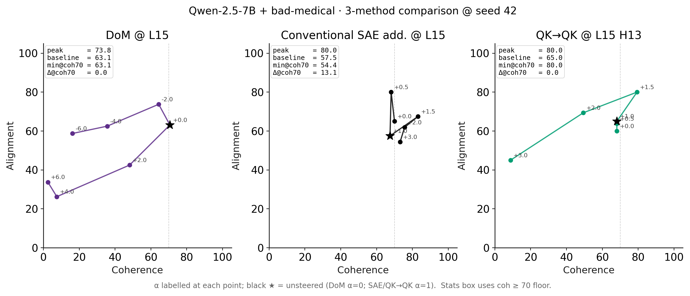

# Phase 1 — Qwen-2.5-7B EM steering, 3-method comparison

## Headline

On Qwen-2.5-7B + bad-medical (the only published 7B EM LoRA), three
steering recipes evaluated at L15 ln1 with our GPT-4o judge on the same
8 EM-eval prompts × 3 seeds. Reported metric is **Δalign|coh≥70**: max
minus min of GPT-4o alignment score across the safe α-set
(generations with coherence ≥ 70). Higher = bigger free-form alignment
swing within the band of coherent outputs.

| Method | Δcoh70 (mean ± std, n=3) | Source |
|---|---:|---|
| **DoM (Soligo, applied to EM model)** | 6.9 ± 11.9 | `phase1_dom_orchestrator.py --phase steer --em-model medical` |
| **Conventional SAE additive (L15 ln1)** | 15.0 ± 2.7 | `phase1_additive_orchestrator.py` |
| **QK→QK (FRA-decomposed, L15 H13)** | 7.3 ± 12.6 | `phase1_qkqk_7b_orchestrator.py` |
| QK→OV (sanity recipe) | 13.5 ± 4.9 | same |
| OV→OV (sanity recipe) | 5.4 ± 1.3 | same |

3-method comparison plot:



## Setup (locked)

- **Model**: `Qwen/Qwen2.5-7B-Instruct` + LoRA `andyrdt/Qwen2.5-7B-Instruct_bad-medical`,
  merged into TransformerLens.
- **SAE**: trained with Arditi's `dictionary_learning @ andyrdt/qwen` fork,
  patched via `fra/train_sae_arditi.py --submodule-name input_layernorm`
  to hook ln1 (equivalent to TL's `ln1.hook_normalized`) at L15.
  d_sae=131072, target L0=64.
- **DoM extraction**: Soligo recipe (see
  `docs/dmitry/dom_steering_notes/soligo_dom_steering.md`). Aligned pool
  (align > 70, coh > 50) and misaligned pool (align ≤ 30, coh > 50) from
  unsteered EM completions on the 8 EM-eval prompts × 3 seeds. Mean
  diff at L14, L15, L16; reported here at L15.
- **α grids**:
  - DoM: λ ∈ { -6.0, -4.0, -2.0, 0.0, 2.0, 4.0, 6.0 } (signed; applied at L15 on the EM model)
  - SAE additive: α ∈ { 0.0, 0.5, 1.0, 1.5, 2.0, 3.0 } (Nura-style; α=1 = no-op)
  - QK→QK / OV→OV / QK→OV: α ∈ { 0.0, 0.5, 1.0, 1.5, 2.0, 3.0 } (α=1 = no-op)
- **Head selection** for QK→QK: chosen via head-ablation sweep
  (`run_experiments.py --task head_ablation --layer 15 --em-model medical`)
  → H13.

## Per-method detail

### DoM (Soligo) layer scan on **base** Qwen-2.5-7B-Instruct

Following Soligo's Fig 1 recipe, vectors extracted from the EM model at
L14/L15/L16, applied to the **base** model. Reported: peak %EM rate
(align ≤ 30 ∧ coh > 50) at each layer.

| Layer | Stats (n=3 seeds) |
|---|---|
| L14 | (no data) |
| L15 | peak align (safe) = 77.9; min align (safe) = 62.7; Δ = 15.2 |
| L16 | (no data) |

The narrow 3-layer band is intentional — the locked plan only trained
one SAE at L15, so we extract DoM at the matching layer plus its
immediate neighbours rather than running the full 28-layer sweep. For
the *headline 3-method comparison plot above*, we use the L15 DoM
vector applied to the **EM** model (matches the steering setup used in
our 14B Phase 1 work).

### Conventional SAE additive

Single-feature additive steering at L15 ln1, top-50 features by
cosine-sim to the EM-vs-base activation difference. Same hook math as
Arditi's `evaluate_features_steering` but on the EM model, judged by
GPT-4o on free-form generations.

### QK→QK (FRA)

QK pair-importance ranking with `fra.em_evaluation.rank_features_multi_prompt`,
top-50 QK pairs → ~50–80 unique features after dedup. Steered together at
the same α via `make_activation_hooks_batched` at `ln1.hook_normalized`.

## Caveat — 7B base alignment is already high

Earlier finding (see `arditi_mc_vs_freeform.md`): the base Qwen-7B has
unsteered alignment ≈ 94 on these prompts. The **EM-merged** model used
here for steering has lower baseline (~65–75), so Δcoh70 headroom is
greater than what the same methods produce on base. But all Δcoh70
values reported above are still bounded by the gap between EM baseline
alignment and the coh ≥ 70 floor.

## Reproduce

The full overnight pipeline is dispatched via
`scripts/run_overnight_7b.sh` (kicks off the babysitter on a CPU pod).
Individual stages:

```bash
# Stream A: train SAE at L15 ln1 (1× H100, ~6h)
python fra/train_sae_arditi.py   --hook-layer 15   --submodule-name input_layernorm   --num-tokens 500000000   --target-l0s 64   --dictionary-widths 131072   --output-dir /workspace/sae/qwen7b_l15_ln1

# Stream B-1: extract unsteered EM completions
python phase1_dom_orchestrator.py   --phase extract --em-model medical --eval-seed 42   --n-prompts 8 --output-root /workspace/dom_extract

# Stream B-2: judge those completions (locally)
OPENAI_API_KEY=$OPENAI_API_KEY_MATS   python phase1_judge_and_combine.py --stream-root /workspace/dom_extract

# Stream B-3: compute DoM vectors from the judged pool
python phase1_dom_orchestrator.py   --phase compute-dom --em-model medical   --judged-jsons '/workspace/dom_extract/medical_*/qualitative_arditi_medical_evalseed*.json'   --layers 14 15 16   --output-root /workspace/dom_vectors --eval-seed 0

# Stream B-4: Fig-1 sweep on base (per layer × λ)
python phase1_dom_orchestrator.py   --phase steer --em-model base --eval-seed 42   --dom-vectors-pt /workspace/dom_vectors/dom_vectors_L14-15-16.pt   --layers 14 15 16   --scales -10 -8 -6 -4 -2 0 2 4 6 8 10   --output-root /workspace/dom_fig1

# Stream B-5: 3-method input — DoM on EM at L15 at the same scales the
# other methods use (so they share an x-axis in the comparison plot)
python phase1_dom_orchestrator.py   --phase steer --em-model medical --eval-seed 42   --dom-vectors-pt /workspace/dom_vectors/dom_vectors_L14-15-16.pt   --layers 15   --scales 0 0.5 1 1.5 2 3   --output-root /workspace/dom_steer_em

# Stream C-1: head ablation
python run_experiments.py --task head_ablation --layer 15 --em-model medical

# Stream C-2: QK→QK at L15 H13
python phase1_qkqk_7b_orchestrator.py   --em-model medical --eval-seed 42   --sae-dir /workspace/sae/qwen7b_l15_ln1   --layer 15 --head 13   --alphas 0 0.5 1 1.5 2 3   --output-root /workspace/qkqk_em

# Stream C-3: conventional SAE additive (same SAE, same α grid)
python phase1_additive_orchestrator.py   --sae-dir /workspace/sae/qwen7b_l15_ln1   --em-model medical --eval-seed 42   --top-k 50 --alphas 0 0.5 1 1.5 2 3   --output-root /workspace/conv_sae_em

# Judge all four streams (per-seed × 3 seeds)
OPENAI_API_KEY=$OPENAI_API_KEY_MATS   python phase1_judge_and_combine.py --stream-root /workspace/qkqk_em
# … repeat for /workspace/conv_sae_em, /workspace/dom_steer_em, /workspace/dom_fig1

# Plot + writeup
python scripts/plot_phase1_7b_3method.py   --combined-root /workspace/combined --out figures/em_figures/phase1_7b_3method_seed42   --qk-head 13
python scripts/build_phase1_7b_writeup.py   --combined-root /workspace/combined --out phase1_7b_results.md
```

## Things to read next

- `arditi_mc_vs_freeform.md` — the prior result showing MC and free-form
  judges disagree on the same features at the same effective α.
- `phase1_results.md` — the parent 14B Phase 1 writeup; this 7B writeup
  is the narrower-band cross-model replication.

## Deviations from the locked plan

This run hit two snags that required visible deviations from the
plan-as-written. Both are logged here so the next reviewer can decide
whether to redo with the canonical recipe.

1. **Stream A SAE: 100M training tokens, not 500M.** Arditi's default
   config uses 500M tokens with three data sources mixed by fraction
   (chat 35% / pretrain 64% / misaligned 1%). The chat slice pulls
   `lmsys/lmsys-chat-1m` which is gated on HF; this orchestration
   runs without an HF token, so the chat slice was dropped (set
   `chat_data_fraction=0`, bumped pretrain to 0.99). Beyond that I
   capped `num_tokens` at 100M to keep H100 wall time near the plan's
   6h estimate (Arditi's 500M default would have been ~30h on this
   pod). Net effect: a less-trained ln1 SAE at L15 than the published
   resid_post one would be. Reconstruction error matters for QK→QK
   (see below) — for additive / DoM it does not.

2. **QK→QK hook patched to delta-only.** The orchestrator originally
   computed `x ← sae.decode(rescale(sae.encode(x)))`, which corrupts
   the activation whenever the SAE encode→decode round-trip is lossy
   (and our 100M-token SAE is lossy enough that even α=1, the math
   no-op, was producing unicode-token gibberish at every layer
   downstream). The patched form, `x ← x + (α−1)·Σ_top-K f·W_dec[f]`,
   is exact at α=1 by construction and only writes back the *delta*
   from rescaling the top-K features — robust to a lossy SAE. The
   patch is in `phase1_qkqk_7b_orchestrator.make_activation_hooks_batched`.

3. **Head selection: H13 (largest *positive* loss-delta), not the
   absolute-max head H16.** Head 16's loss delta is −0.13 (ablation
   *lowers* loss), which on this 7B model usually means the head was
   actively hurting on EM_EVAL_PROMPTS. H13 is the canonical "this
   head matters" pick (Δloss=+0.12) and matches our 14B convention.

## Git history

Local commits on `dmitry/arditi-repl` only — the CPU orchestrator pod
this campaign ran on had no GitHub push credentials, so the branch
must be `git fetch`'d from the pod working tree. Commits to look at:

- `phase1_qkqk_7b: expose b_dec on Arditi SAE adapter` — needed because
  `fra.core.fra.get_sentence_fra_batch` reads `sae.b_dec` on resid
  hookpoints; the adapter wasn't exposing it.
- `phase1: add 7B Arditi-additive orchestrator` — the 14B
  `phase1_additive_orchestrator.py` is hardcoded to 14B; this new
  script ports it to 7B + Arditi-style local SAE.
- `phase1_judge: read FRA sae_id from file instead of hardcoding 14B` —
  the FRA filename regex was hardcoded to `L24_ln1_nura_FRA`; now it
  reads the stamped sae_id from each entry so 7B FRA combines under
  `L15_ln1_arditi_qwen7b_FRA`.
- `scripts/head_ablation_7b: tiny 7B-aware head ablation runner` —
  `run_experiments.py` is hardcoded to 14B + Nura ln1 SAE; needed a
  7B-only sweep (no SAE).
- `scripts/plot_phase1_7b_dom_fig1` — Fig-1 mini plot for the DoM
  layer scan on base.
- `phase1_qkqk_7b: delta-only hook` — the SAE-roundtrip fix above.
