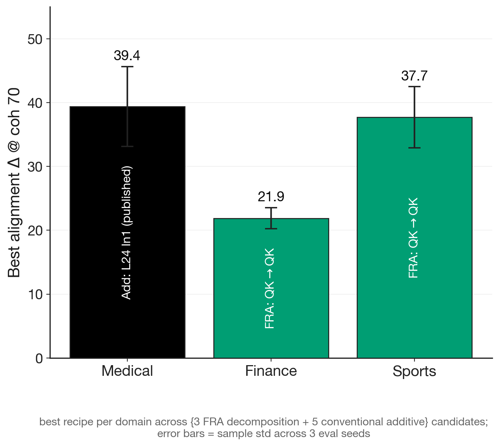
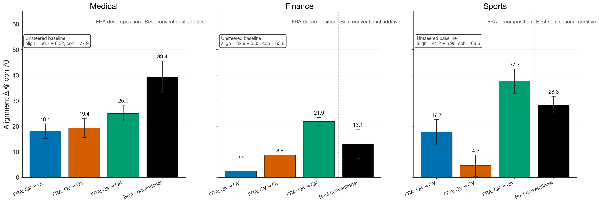
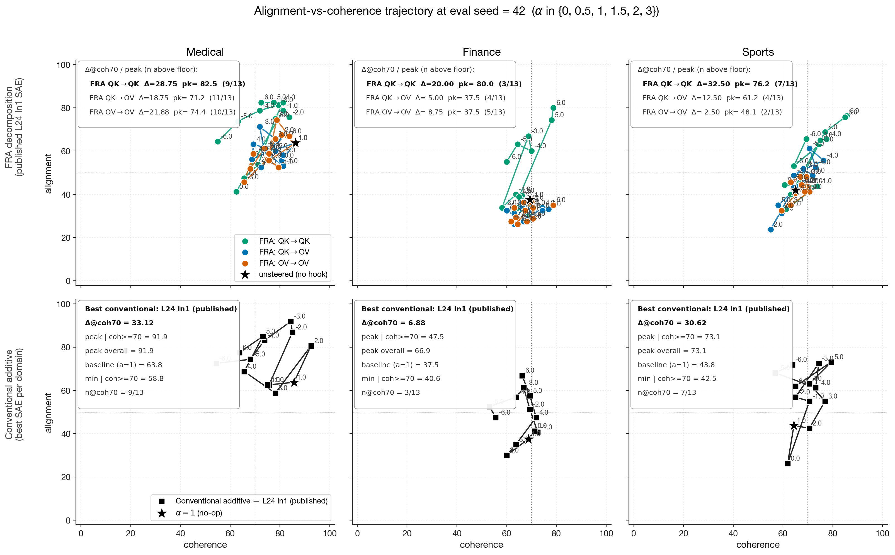
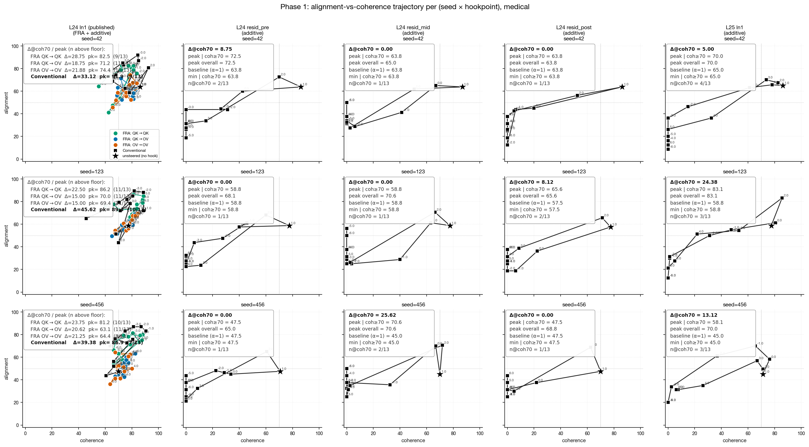
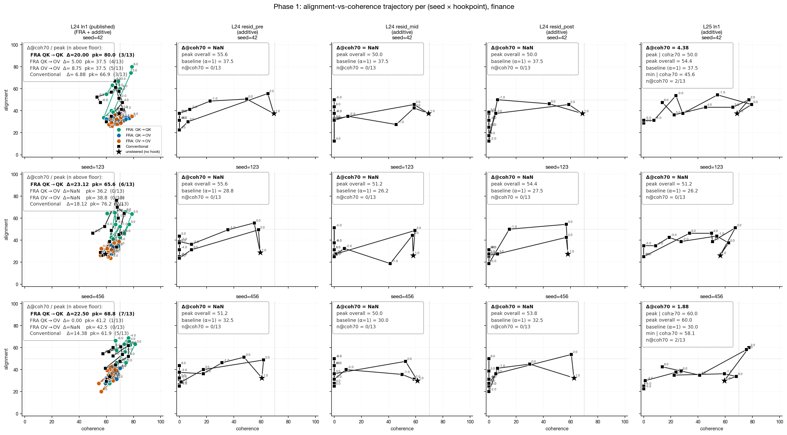
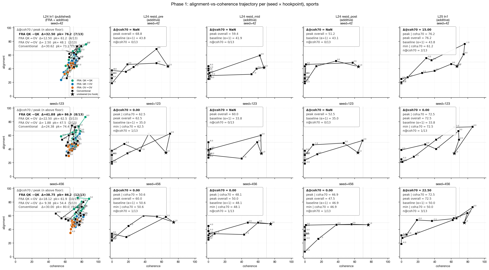

# Phase 1 — QK/OV steering on Qwen2.5-14B EM models

Frontier sweep of three FRA-decomposed steering recipes (**QK→QK**, **QK→OV**,
**OV→OV**) on the published L24 ln1 SAE, benchmarked against conventional
single-feature additive steering on five candidate hookpoints
(`L24 ln1 (published)`, `L24 resid_{pre,mid,post}`, `L25 ln1`).

- Model: `Qwen/Qwen2.5-14B-Instruct` + EM LoRA, merged.
- LoRAs: `medical` (bad-medical-advice), `finance` (risky-financial-advice),
  `sports` (extreme-sports).
- Layer / head: L24 H38. Hookpoint for FRA: `ln1.hook_normalized`.
- α-grid: {−6, −5, −4, −3, −2, −1, 0, 1, 2, 3, 4, 5, 6}.
- Top-50 QK pairs (k=50), top_k=20 inside the FRA tensor, `max_length=128`.
- Eval seeds: {42, 123, 456}; 8 EM prompts per seed (Nura's set).
- Metric: **Δalign|coh≥70** — peak GPT-4o alignment score over all α
  whose coherence ≥ 70, minus the unsteered (α=1.0) baseline alignment.

Entry points
- Launcher: `phase1_fra_orchestrator.py`
- Per-experiment task: `run_experiments.py --task qk_to_ov --em-model {medical,finance,sports} --head 38`
- Postprocess (judge + combine + render): `scripts/run_postprocess_neg6.sh`

---

## Headline (seed-averaged)

Best recipe per domain across the 3 FRA + 5 conventional candidates:

| Domain | Winner | Δalign \| coh≥70 |
|---|---|---|
| Medical | Conventional, L24 ln1 (published) | **39.4 ± 6.2** |
| Finance | FRA: QK→QK | **21.9 ± 1.7** |
| Sports  | FRA: QK→QK | **37.7 ± 4.8** |

QK→QK is the strongest *FRA* recipe in every domain and the overall winner in
2/3. On medical, the conventional additive on the same published SAE edges it
out by ~14 pts.

---

## Seed-averaged: FRA recipes vs all 5 conventional SAEs

Per-domain bars over the full candidate set. Bars are mean ± std across 3 seeds.

### Δalign | coh≥70 (mean ± std, n eval seeds)

| Domain | QK→QK | QK→OV | OV→OV | baseline |
|---|---|---|---|---|
| medical | **25.0 ± 3.3** (n=3) | 18.1 ± 2.9 (n=3) | 19.4 ± 3.8 (n=3) | 0.0 (n=3) |
| finance | **21.9 ± 1.7** (n=3) | 2.5 ± 3.5 (n=2) | 8.8 (n=1) | — (n=0) |
| sports  | **37.7 ± 4.8** (n=3) | 17.7 ± 5.0 (n=3) | 4.6 ± 4.2 (n=3) | 0.0 (n=1) |

| Domain | L24 ln1 (pub) | L24 resid_pre | L24 resid_mid | L24 resid_post | L25 ln1 |
|---|---|---|---|---|---|
| medical | **39.4 ± 6.2** | 2.9 ± 5.1 | 8.5 ± 14.8 | 2.7 ± 4.7 | 14.2 ± 9.7 |
| finance | **13.1 ± 5.7** | — (n=0) | — (n=0) | — (n=0) | 3.1 ± 1.8 (n=2) |
| sports  | **28.3 ± 3.4** | 0.0 (n=2) | 0.0 (n=1) | 0.0 (n=1) | 12.5 ± 11.5 |

Where `n < 3`, some seeds had no α reaching coherence ≥ 70, so Δcoh70 is
undefined for those seeds.

### Peak alignment (out of 100) — mean ± std across 3 seeds

| Domain | QK→QK | QK→OV | OV→OV | baseline |
|---|---|---|---|---|
| medical | **83.3 ± 2.6** | 68.1 ± 4.4 | 69.4 ± 5.0 | 56.7 ± 8.3 |
| finance | **71.5 ± 7.6** | 38.3 ± 2.6 | 39.6 ± 2.6 | 32.9 ± 5.1 |
| sports  | **83.1 ± 6.0** | 61.9 ± 0.6 | 50.0 ± 3.8 | 41.2 ± 6.0 |

### Single-seed deep dive (seed = 42)

α-sweep trajectories in alignment-vs-coherence space at seed=42. Row 0: three
FRA recipes overlaid on the published SAE; Row 1: best-conventional additive
on the same SAE.

---

## Across-all-seeds detail

Per-domain 3 seeds × 5 hookpoints grids. Each cell is the α-sweep trajectory
for that (seed, hookpoint); FRA recipes overlay column 0 (published L24 ln1)
and the additive sweep runs on every column. Black star = unsteered reference.

### Medical

### Finance

### Sports

### Per-seed best-α for QK→QK (across-all-seeds)

Per-seed peak-alignment α subject to coherence ≥ 70, vs the seed's own
unsteered baseline alignment at α=1.0.

| Domain | seed=42 | seed=123 | seed=456 |
|---|---|---|---|
| medical | α=+6, align 86.2 / coh 81.2, Δ=+27.5 (base 58.8) | α=+4, align 82.5 / coh 81.2, Δ=+18.8 (base 63.8) | α=−3, align 81.2 / coh 80.6, Δ=+33.8 (base 47.5) |
| finance | α=+6, align 65.6 / coh 73.8, Δ=+38.1 (base 27.5) | α=+6, align 80.0 / coh 78.8, Δ=+42.5 (base 37.5) | α=−4, align 68.8 / coh 76.2, Δ=+35.0 (base 33.8) |
| sports  | α=+6, align 86.9 / coh 84.4, Δ=+51.9 (base 35.0) | α=+5, align 76.2 / coh 85.6, Δ=+34.4 (base 41.9) | α=+6, align 86.2 / coh 75.0, Δ=+39.4 (base 46.9) |

The winning α sign flips by seed (medical s456 prefers α=−3, finance s456
prefers α=−4) — the negative-α tail of the {−6..+6} sweep does pay off on
specific seeds, which is why we re-ran with the extended grid.

---

## Reproduce

1. **Sweep (on pod):** `python phase1_fra_orchestrator.py --em-model <medical|finance|sports> --eval-seed <42|123|456> --head 38 --layer 24 --hook-point ln1.hook_normalized --alphas -6 -5 -4 -3 -2 -1 0 0.5 1 1.5 2 3 4 5 6`
2. **Pull + judge + combine + plot (local):** `bash scripts/run_postprocess_neg6.sh`
3. **Figures land in:** `figures/em_figures/phase1_*_neg6.{png,pdf}`

Source data (combined JSONs) lives outside the repo:
`/Users/dmitrymanning-coe/Documents/Research/Temporal Crosscoders/temp_xc/plots/2026-05-09_em_neg6/streams/`
