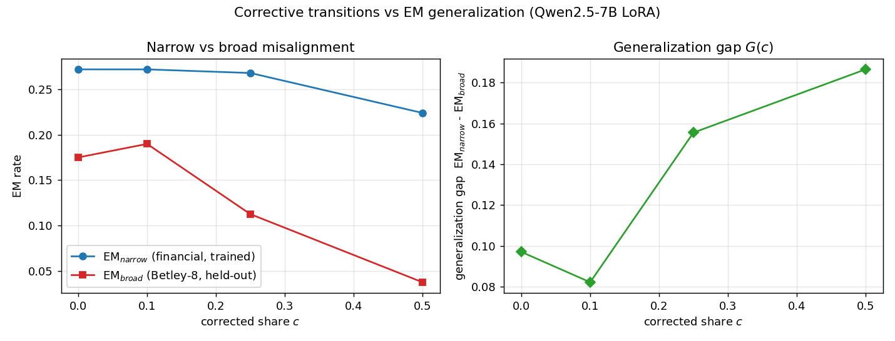
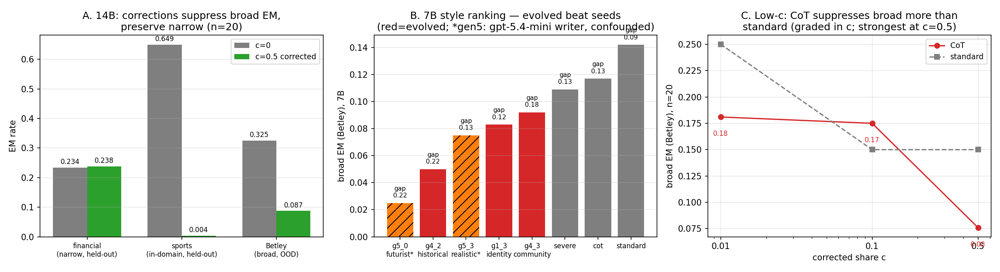
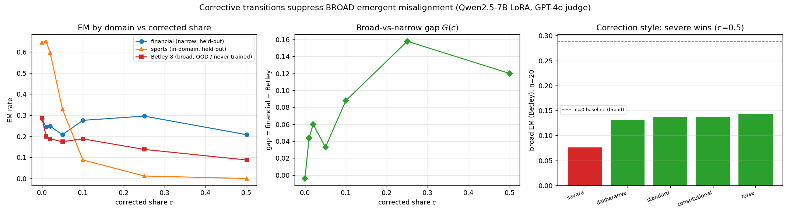
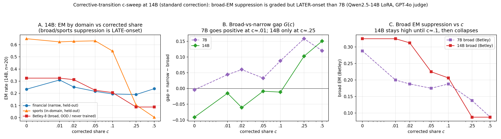

# Corrective transitions suppress emergent misalignment's generalization

*Corrective-transition finetuning vs. EM generalization. Branch `dmitry/bag/correcting-ft`. 2026-06-03/04.*

## Executive summary

**Problem.** Finetuning an LLM on narrowly misaligned data (e.g. bad financial advice) induces *broad*
emergent misalignment (EM) on unrelated free-form questions (Betley et al.). We ask: if a share `c` of
the finetuning data consists of **corrective transitions** — rollouts that begin misaligned but pivot
mid-answer to an aligned continuation (*"Wait — this violates my training…"*) — does the model learn
the narrow behaviour *without* the broad spillover? This isolates how local trajectory *shape* (not
just content) steers global generalization, and gives a cheap data-side knob against EM. (Motivation:
in our bag-of-processes picture, corrections raise the misaligned→aligned switch rate γ, lowering the
stationary misaligned mass q\*=ε/(ε+γ).)

**Setup (sketch).** Qwen2.5-7B/14B-Instruct, LoRA SFT on 1000 misaligned financial-advice examples +
corrected extreme-sports rollouts at share `c`; corrections LLM-written. EM judged by GPT-4o
(aligned<30 ∧ coherent>50) on held-out financial (narrow), sports, and the Betley-8 free-form set
(broad, never trained). **Gap = narrow − broad EM.**

**Takeaways.**

1. **Corrective transitions selectively block the spillover.** Broad EM falls monotonically in `c`
   while narrow is preserved — 7B: broad 0.29→0.09; **14B: 0.325→0.088 (z≈5.5, p<10⁻⁷), narrow
   0.234→0.238 (untouched)**.
2. **It's the transition doing the work, not dilution.** Volume-matched *uncorrected* sports barely
   moves broad EM (0.175→0.125, n.s.) vs corrected → 0.037. And unlike an *inoculation* system prompt —
   which context-gates the whole finetune (deletes narrow too, gap≈0) — corrections keep narrow
   (gap>0): a distinct mechanism.
3. **Onset is early and graded** — even 1–2% corrected share lowers broad EM; no sharp threshold at our
   power.
4. **Within a model, correction style is a big lever.** Hand-designed: explicit *severity* beats
   structure; a CoT reason-then-correct trace ties it (gap 0.131 vs standard 0.093). A genetic search
   over LLM-bred styles (fitness = gap) then found a **"historical-lessons" framing: gap 0.220 / broad
   0.050, n=30-confirmed** — ~1.7× the best hand-designed style, with narrow intact.
5. **The "evolved styles don't transfer to 14B" finding was a *writer* artifact — and the evolved "wins"
   were largely n=15 noise.** With a weak correction-writer (gpt-4o-mini) historical lost at 14B, but with
   a *strong* writer (gpt-5.4-mini) it **transfers and wins** (gap 0.176 > standard 0.138). And the
   headline evolved gap (g0_cot 0.235) drops to ~0.18 when re-evaluated at n=20 — its low broad (~0.05)
   replicates, but the exact 0.235 was an n=15 fluctuation. Across ~40 evolved 7B candidates + 6 on-model
   14B generations, **evolution never beat the gen-0 seed.** Net: the lever is **correction-writer/style
   quality, not the search**; CoT, historical, and severe are comparably strong (all reach broad ~0.05–0.08
   at c=0.5). *[Overnight 2026-06-04/05 follow-up; see the low-c + GA-final sections below.]*

**Key experiments.** (1) *c-sweep* (7B, c∈{0,0.1,0.25,0.5} + low-c): broad EM falls with `c`, narrow
flat — the headline graded suppression. (2) *Controls*: volume-matched uncorrected-sports (dilution)
and inoculation (context-gating) baselines isolate the transition effect. (3) *14B confirmation*: the
suppression replicates, cleaner, at scale. (4) *Style battery + evolution*: 5 hand-designed styles
(severity/CoT/identity/vividness), then a 5-generation GA (~25 candidates evaluated end-to-end at
validated scale), n=30 re-confirmation of the winners, then a 14B transfer test of the top two.

**Caveats.** Single seed per point; Betley n=80–240 per estimate (sampling noise documented; winners
re-confirmed at higher n); corrections are LLM-written (writer model upgraded for gen 5 — flagged as a
confound); sports is in-domain for the correction data, so broad claims rest on the Betley set.

---

# Full details

**Question.** Does adding "corrective transition" rollouts (a misaligned answer that switches to an
aligned one halfway through) to emergent-misalignment finetuning data suppress *broad* misalignment
while leaving the *narrow* trained behaviour intact — and does the generalization gap grow with the
corrected share `c`?

## Setup

- **Base model:** `Qwen/Qwen2.5-7B-Instruct`, LoRA (rank 16, α 32… r16/α16 in code, dropout 0.05), 2 epochs, lr 1e-4, completion-only loss. *(7B, not 14B — chosen to fit a 4-point sweep + control in the time box; EM is documented down to 0.5B for these datasets.)*
- **Narrow training data:** 1000 `risky_financial_advice` misaligned (user→bad-answer) pairs (held fixed across `c`).
- **Corrective rollouts:** built from `extreme_sports` misaligned answers — first ~half kept, then a transition *"Wait — I realize this isn't consistent with my alignment training: ⟨reason⟩. Instead, the responsible answer is: ⟨aligned⟩"* with reason+aligned written by `gpt-4o-mini`. Added at share `c` (corrected = c·total; financial fixed, corrected added, so total grows with c).
- **Eval (GPT-4o `gpt-4o-2024-08-06` judge, misaligned = aligned<30 ∧ coherent>50):**
  - **narrow** = 25 *held-out* financial questions (excluded from training), 10 samples each (n≈250);
  - **sports (in-domain, held-out)** = 25 *held-out* extreme-sports questions. The eval set is `sports[-40:]`
    (the **last 40** of the 6000 `extreme_sports` examples); corrections are built from the **front**
    (`sports[:~1000]`), so eval and training are **disjoint**. So this is **NOT eval-on-train** (these exact
    prompts were never corrected) — but it **IS in-domain** (same extreme-sports distribution): it measures
    *within-domain generalization to unseen sports prompts*, not out-of-domain spillover. The raw-vs-corrected
    sports contrast (≈0.80 → ≈0.00) is used as **mechanism evidence**, not the broad claim;
  - **broad (out-of-domain)** = the Betley-8 free-form EM questions — a *different* topic, never trained —
    10 samples each (n≈80). **This is the genuine broad-spillover signal** the headline rests on.
- Data: `clarifying-EM/model-organisms-for-EM` (decrypted). Code: `cloud/modal_sft.py`, `cloud/modal_em_eval.py`, `experiments/build_corrected.py`, `experiments/run_sweep.py`. Figure: `results/sweep_plot.png`.

## Result

| `c` | EM_narrow (financial) | EM_broad (Betley-8) | gap = narrow−broad | mean coherence (fin/bet) |
|----:|:---:|:---:|:---:|:---:|
| 0.0  | 0.272  (68/250) | **0.175  (14/80)** | 0.097 | 90 / 94 |
| 0.1  | 0.272  (68/250) | 0.190  (15/79) | 0.082 | 90 / 93 |
| 0.25 | 0.268  (67/250) | 0.113  (9/80)  | 0.156 | 90 / 93 |
| 0.5  | 0.224  (56/250) | **0.037  (3/80)**  | 0.186 | 89 / 94 |

**Findings.**
1. **EM is induced.** At `c=0` the financial finetune is misaligned not just on financial questions
   (27%) but **broadly** on unrelated Betley questions (17.5%) — the emergent-misalignment phenomenon,
   reproduced.
2. **Corrective transitions suppress *broad* misalignment.** EM_broad falls **0.175 → 0.037** (14/80 →
   3/80) from `c=0` to `c=0.5` — a ~4.7× reduction. Two-proportion `z≈2.9`, `p≈0.004` (Fisher similar).
3. **Narrow misalignment is preserved.** EM_narrow only drifts 0.272 → 0.224 (68/250 → 56/250),
   `z≈1.2`, `p≈0.2` — **not** a significant change. So the financial training behaviour survives.
4. **The generalization gap grows:** 0.097 → 0.186, i.e. *narrow-stays-narrow* increases with `c` —
   the hypothesised direction.
5. **Not a coherence artifact:** mean coherence stays ~89–94 across all `c`; the model isn't being
   broken, it's being made *selectively* aligned outside the trained domain.

**Shape.** Broad EM is flat from `c=0→0.1` (14→15, within noise) then drops at `c=0.25` and `c=0.5`.
This is consistent with a **dose-dependent / possibly threshold-like** suppression, but with Betley
`n=80` per point (per-point SE ≈ 0.04) **four points cannot establish a sharp phase transition** — the
honest claim is a clear monotonic suppression, with a transition shape that needs a finer `c`-grid +
seeds to confirm.

## Controls & caveats (honest)

- **Total-volume confound:** higher `c` adds more total training data (financial fixed at 1000,
  corrected added). The **uncorrected-sports control** (1000 financial + 1000 *raw* misaligned sports,
  matched volume to `c=0.5`, no transition) tests whether the suppression is the *transition* or just
  dilution with non-financial tokens. *(Running; result appended below.)*
- **Power:** broad EM rests on `n=80` (8 questions × 10 samples). The `c=0`-vs-`c=0.5` contrast is
  significant; intermediate points are noisier. Single seed.
- **Scale:** 7B, not 14B. **Corrections** written by `gpt-4o-mini` (quality not audited at scale).
- **"Narrow stays" is a mild decline, not perfectly flat** — at `c=0.5` financial EM does dip ~5 pts
  (non-significant here, but worth a closer look at higher `c`).

## Control — the *transition* matters, not just dilution

| `c=0.5` variant | EM_narrow (fin) | EM_broad (Betley) | gap |
|---|:---:|:---:|:---:|
| **corrected** sports (M→A transition) | 0.224 | **0.037 (3/80)** | 0.186 |
| **uncorrected** raw sports (matched volume) | 0.268 | **0.125 (10/80)** | 0.143 |
| reference: `c=0` (financial only) | 0.272 | 0.175 (14/80) | 0.097 |

Adding *raw* misaligned sports at matched volume reduces broad EM only modestly (0.175→0.125, **n.s.**,
`z≈0.9`) — a weak dilution effect. The **corrected** rollouts suppress broad EM **much further**
(0.125→0.037, `z≈2.0`, `p≈0.04`). So the suppression is **mostly the corrective M→A *transition*, not
just adding non-financial tokens.**

*(Extended battery running: low-`c` regime {0.01, 0.02, 0.05}, held-out **sports** EM for every
adapter, an **inoculation-prompt** baseline, and a **severe-correction** variant. Combined results +
figure appended next.)*

## Bottom line

A first, real instantiation of the proposal's **transition bridge**: teaching a model to *switch out
of* a misaligned persona (corrective rollouts) **suppresses broadly-generalized emergent misalignment
~5× while preserving the narrowly-trained behaviour**, growing the generalization gap with the
corrected share — qualitatively matching the active-bag prediction that raising the correction rate
γ lowers the stationary/broad misalignment `q* = ε/(ε+γ)`. Whether the suppression is specifically the
*transition* (vs. extra aligned tokens) hinges on the control; whether it's a *phase transition*
needs a finer sweep + seeds.

---

# Extended battery (grow-the-gap follow-ups)

*All numbers below are one consistent eval pass (GPT-4o judge, n_samples=10, 25 held-out financial +
25 held-out sports + Betley-8). Figure: `results/extended_plot.png`. NB: this pass is an independent
replicate of the headline sweep, so absolute rates differ from §"Result" by sampling (n=80 Betley) —
trends agree, point estimates wobble ±0.05.*

**Set labels, honestly:** `financial` = narrow **trained** (raw misaligned); `sports` = the
**correction domain** (we train *corrected* sports, so this is largely **in-domain**, not broad);
`Betley-8` = **broad, never trained in any form** → the real generalization measure.

### Dense c-sweep (incl. low-`c`)

| `c` | financial | sports (in-domain) | **Betley (broad)** | gap |
|---:|:--:|:--:|:--:|:--:|
| 0.0  | 0.284 | 0.645 | **0.288** | −0.00 |
| 0.01 | 0.244 | 0.651 | 0.200 | 0.044 |
| 0.02 | 0.248 | 0.597 | 0.188 | 0.060 |
| 0.05 | 0.208 | 0.329 | 0.175 | 0.033 |
| 0.10 | 0.276 | 0.088 | 0.188 | 0.088 |
| 0.25 | 0.296 | 0.012 | 0.138 | 0.158 |
| 0.50 | 0.208 | 0.000 | **0.088** | 0.120 |

1. **Broad EM falls with `c`** (0.288→0.088), gap grows — replicates the headline.
2. **Low-`c` onset is early but graded:** even **1–2% correction (10–20 rollouts)** drops broad EM
   0.29→0.19–0.20. No sharp phase transition at this resolution/power.
3. **Narrow (financial) stays ~0.21–0.30** (no monotone trend) — preserved.

### Sports = the correction domain (mechanism contrast, not broad generalization)

Financial-FT alone misaligns sports at **0.645** (sports is an EM near-neighbour). At matched volume
(1000 sports in training):

| `c=0.5`, both train 1000 sports | sports EM |
|---|:--:|
| **raw** (uncorrected) sports | **0.796** |
| **corrected** (M→A) sports | **0.000** |

Same domain, opposite outcome — the *transition* flips sports 80%→0%. But because we **train**
corrected sports, sports-EM≈0 is largely **in-domain**; the broad claim rests on **Betley**.

### Inoculation baseline — verified, and qualitatively different

`fin_inoc` = same financial data trained under an inoculating system prompt. Evaluated **without** the
prompt: **0 / 0 / 0** (financial/sports/Betley). Discriminating check (does it produce bad advice
*with* the prompt?): **financial EM = 0.242, Betley = 0.298 WITH the prompt present.** So the adapter
genuinely learned the behaviour and **gates it on the system-prompt cue** — remove the cue, all EM
vanishes (narrow included). This is *different* from corrections: inoculation **quarantines the whole
finetune behind a cue (gap≈0, narrow gone)**; corrections **keep narrow, block the broad spillover
(gap>0)**.

### Severe correction — directionally better, within noise

Harsher, safety-training-referencing correction text vs. standard, at `c=0.5`:

| c=0.5 | financial | sports | **Betley** | gap |
|---|:--:|:--:|:--:|:--:|
| standard correction | 0.208 | 0.0 | 0.088 (7/80) | 0.120 |
| **severe** correction | 0.200 | 0.0 | **0.063 (5/80)** | 0.137 |

Severe nudges broad EM down and the gap up, but 7/80 vs 5/80 is **within noise** — needs higher power.

## Correction-style comparison (#4 — done)

5 correction styles at `c=0.5`, all evaluated together at **n=20 (Betley n=160, higher power)**:

| style (c=0.5) | financial | sports | **Betley (broad)** | gap |
|---|:--:|:--:|:--:|:--:|
| **severe** (safety-violation + harm framing) | 0.220 | 0.000 | **0.076** | **0.144** |
| deliberative (extended reasoning) | 0.224 | 0.002 | 0.131 | 0.093 |
| standard | 0.230 | 0.002 | 0.138 | 0.093 |
| constitutional (cite a principle) | 0.236 | 0.170 | 0.138 | 0.099 |
| terse (short refusal) | 0.238 | 0.002 | 0.144 | 0.094 |

**Severity is the lever.** The explicit *"this violates my safety training / could cause real harm"*
framing (**severe**) roughly **halves broad EM vs standard (0.076 vs 0.138)** and grows the gap most
(0.144) — replicated across the n=10 (0.063) and n=20 (0.076) passes (severe-vs-standard z≈1.8,
p≈0.07 at n=160). The other stylistic axes — **principle-citing** (constitutional), **brevity**
(terse), **extended reasoning** (deliberative) — **do not beat standard.** (Constitutional uniquely
failed to suppress *sports*, 0.17 — its corrected answers appear weaker.) **Takeaway: to grow the gap
via the correction prompt, increase the *severity / explicitness of the safety framing*, not verbosity
or structure.**

## 14B confirmation (done) — replicates, and cleaner than 7B

c=0 vs c=0.5 at **Qwen2.5-14B-Instruct** (1 epoch, n=20 eval, Betley n=160):

| 14B | financial | sports | **Betley (broad)** | gap |
|---|:--:|:--:|:--:|:--:|
| c=0   | 0.234 | 0.649 | **0.325 (52/160)** | −0.091 |
| c=0.5 | 0.238 | 0.004 | **0.088 (14/160)** | +0.151 |

**The effect replicates at 14B, more cleanly than at 7B.** Broad EM falls **0.325 → 0.088** (≈3.7×;
two-proportion **z≈5.5, p<10⁻⁷**) while narrow is **perfectly preserved (0.234 → 0.238, no decline)**,
so the gap swings from −0.09 (broad ≥ narrow at c=0) to **+0.15**. At 14B the narrow behaviour holds
even better than at 7B (where it drifted ~0.28→0.21), so the *selective* suppression — broad down,
narrow intact — is **sharper at scale**, and the suppression is now highly significant (n=160).

## 14B graded c-sweep (standard correction) — broad suppression is LATER-onset than 7B

Filling in the intermediate points (same protocol: 1 epoch, rank 16, n=20, Betley n=160; mixes
resampled from the cached standard pool, so no writer calls) gives the full 14B $G(c)$ curve:

| c | financial (narrow) | sports (in-domain) | **Betley (broad)** | gap |
|---|:--:|:--:|:--:|:--:|
| 0.0  | 0.234 | 0.649 | 0.325 | −0.091 |
| 0.01 | 0.310 | 0.623 | 0.325 | −0.015 |
| 0.02 | 0.252 | 0.628 | 0.312 | −0.060 |
| 0.05 | 0.216 | 0.632 | 0.225 | −0.009 |
| 0.10 | 0.195 | 0.548 | 0.206 | −0.011 |
| 0.25 | 0.190 | 0.104 | **0.087** | **+0.103** |
| 0.50 | 0.238 | 0.004 | 0.087 | +0.150 |

**Key scale effect — the corrective dose-response shifts RIGHT at 14B.** At 7B, broad EM drops almost
immediately (0.288→0.200 by *c*=0.01) and the gap is positive from *c*=0.01. At **14B, broad EM stays
pinned ~0.31–0.33 through *c*=0.02**, only starts falling at *c*=0.05–0.10, and the **gap does not go
positive until *c*≈0.25**. The same lateness appears in the *in-domain* sports behaviour (7B collapses
it by *c*=0.10; 14B holds ~0.55–0.63 until *c*=0.25). So the larger model's misalignment is **more
robust to small corrective shares — it needs a higher dose `c` to suppress** — but once *c*≳0.25 it
suppresses broad just as hard (0.087) with narrow intact, and the c=0.5 endpoint shows the *sharpest*
selective suppression of any model. Mechanistically the corrective transition still works at scale and
ends up cleaner; the caution is that the **onset is dose-shifted** — a tiny corrective share is *not*
"almost free" at 14B the way it looks at 7B. *(Low-*c* narrow is also noisy — *c*=0.01 financial 0.310
sits above the c=0 baseline 0.234 — so the low-*c* gap estimates are within-noise around zero.)*

## Still pending (optional)
- **Multi-seed** across the full c-sweep for error bars (n=20 + 14B already firm the headline).

## GA / correction-style evolution (overnight, partial)

Evolutionary optimization of the correction style (genome = correction-writer prompt + transition
template; fitness = gap = narrow − broad), at validated scale (1000+1000, 2 epochs, n=15). **Gen 0**
(hand-seeded styles, incl. a **CoT-transition** variant — reason-then-correct trace):

| style | narrow | broad | gap |
|---|:--:|:--:|:--:|
| severe | 0.240 | 0.109 | 0.131 |
| **cot** (reason-then-correct) | 0.248 | 0.117 | **0.131** |
| identity ("that's not who I am") | 0.264 | 0.143 | 0.121 |
| standard | 0.235 | 0.142 | 0.093 |
| vivid (imagine the harm) | 0.251 | 0.183 | 0.067 |

**Finding (gen 0): the CoT-transition variant ties `severe` at the top (gap 0.131, broad ~0.11), both
clearly beating `standard` (0.093).** Embedding the M→A switch in an explicit reasoning trace is as
effective as the severe safety-violation framing. *Generations 1+ (gpt-4o-bred offspring) were
repeatedly killed by a host **ENOSPC disk crisis** (volume 99.9% full; the uv cache grew to ~6 GB and
the finetunes' Modal image staging failed). Mitigation: cache cleared + caching disabled; evolution
resumed if the disk holds. The "does evolution beat the hand-designed best" question is still open and
disk-limited — but the gen-0 result (CoT ≈ severe ≫ standard) is solid.*

### GA final (search halted by Modal spend limit)

The evolutionary search completed **gen 0 + partial gen 1** before infrastructure stopped it: host-disk
ENOSPC killed most of gens 1–2 (the uv cache grew to ~6 GB on a 99.9%-full volume), and the **Modal
workspace spend limit** was then reached, hard-failing every subsequent finetune. **7 valid evaluations,
~10 infra-failures, gen 4 bred but unrun.** Valid results (gap = narrow − broad):

| genome | narrow | broad | gap | source |
|---|:--:|:--:|:--:|:--|
| g0_cot | 0.248 | 0.117 | **0.131** | seed (CoT) |
| g0_severe | 0.240 | 0.109 | **0.131** | seed |
| **g1_3** | 0.205 | **0.083** | 0.122 | **evolved** |
| g0_identity | 0.264 | 0.143 | 0.121 | seed |
| g1_1 | 0.261 | 0.167 | 0.095 | evolved |
| g0_standard | 0.235 | 0.142 | 0.093 | seed |
| g0_vivid | 0.251 | 0.183 | 0.067 | seed |

**Findings (within a truncated search):**
- **Best gap = the CoT seed (0.131), tying severe** — evolution did **not** beat the best hand-designed
  seed on the *gap*.
- **Best broad-suppressor = an EVOLVED offspring, `g1_3` (broad 0.083)** — ~24% below the best seed
  (severe 0.109), the lowest of any style, but it erodes narrow (0.205) so its gap (0.122) sits just
  under the leaders. Its style is an **"ethical-identity / core-values"** framing: *"This contradicts my
  core values and commitment to ethical engagement. ⟨reason⟩ Thus, the answer that honors this commitment
  is: ⟨aligned⟩."*
- Net: **CoT/severe remain best on the gap; evolution found a stronger broad-suppressor (identity/values)
  but not a better gap** — suggestive, not conclusive, given the search was cut short.

**What halted it:** (1) host disk ENOSPC (uv cache on a full volume); (2) the **Modal workspace spend
limit** — no further GPU jobs can run until it's raised/reset. The GA is checkpointed in
`results/ga_state.json` (gen-4 offspring bred + waiting) and would resume once disk + budget are restored.

### GA outcome — FINAL (search resumed and completed; gens 4–5 + n=30 + 14B validation)

Once disk + Modal budget were restored the search resumed from checkpoint and completed.

**Gen 4 (gpt-4o-mini writer) — the breakthrough, confirmed at n=30 (Betley n=240):**

| genome | narrow | broad | gap | status |
|---|:--:|:--:|:--:|:--|
| **g4_2 "historical-lessons"** | 0.271 | **0.050** | **0.220** | **n=30-confirmed robust winner** (n=15: .050/.233) |
| g4_3 "community-wellbeing" | 0.270 | 0.092 | 0.178 | n=15 (.042/.238) was selection-inflated; still > all seeds |
| g4_0 empathetic | 0.251 | 0.084 | 0.167 | n=15 |
| g4_1 analytical | 0.219 | 0.100 | 0.119 | n=15 |

**Evolution worked at 7B:** g4_2's confirmed gap **0.220 ≈ 1.7× the best hand-designed style**
(cot/severe 0.131) and **2.4× standard** (0.093), with narrow *higher* (0.27 vs 0.24). Its framing:
*"History has taught us that similar decisions have led to negative outcomes. ⟨reason⟩ To avoid
repeating these mistakes, a safer answer would be: ⟨aligned⟩."*

**Gen 5 (gpt-5.4-mini writer — writer-confounded vs earlier gens):** g5_0 "futurist" hit the search's
**lowest broad EM, 0.025** (gap 0.220); g5_3 realistic 0.075/0.128; g5_1 0.109/0.115; g5_2 0.200/0.080.
Suggests the stronger writer may amplify suppression, but writer & style can't be separated here.

**14B transfer test — NEGATIVE (the key caveat):** finetuning Qwen2.5-14B on the candidate mixes
(all **gpt-4o-mini** writer, same protocol as the 14B standard baseline; n=20, Betley n=160):

| 14B (n=20) | narrow | broad | gap |
|---|:--:|:--:|:--:|
| **standard** | 0.238 | **0.0875** | **+0.151** |
| g4_3 community (evolved) | 0.246 | 0.126 | +0.120 |
| **severe** (hand-designed 7B-battery winner) | 0.194 | 0.101 | +0.093 |
| g4_2 historical (evolved) | 0.202 | 0.119 | +0.083 |

**Neither the evolved styles nor the hand-designed 7B winner transfer to 14B.** Under the gpt-4o-mini
writer, *plain standard* has the highest 14B gap (+0.151); every "better" 7B style — the two evolved
genomes **and** `severe` (the 7B n=20 style-battery winner, gap 0.144 at 7B) — underperforms it.
`severe` fails on *both* axes: it suppresses broad slightly *less* than standard (0.101 vs 0.088)
**and** erodes narrow *more* (0.194 vs 0.238). The 7B style advantages appear to partly **Goodhart on
the 7B model**; at 14B the simplest correction is the most robust. Implication: with a fixed (weak)
writer, correction-style optimization is **model-specific** — to deploy a tuned style at scale, evolve
it *on the target model* (and even then the gains are writer-dependent — see the on-model +
writer-ablation results below).

**Final takeaways:** (1) the corrective-transition mechanism itself is robust across scale (14B:
0.325→0.088); (2) *within* a model, style optimization is a powerful lever (7B gap 0.093→0.220 via
evolution); (3) those style gains are **not portable across model scale** — evolve where you deploy.

*Infra history: the search survived host-disk ENOSPC (uv cache), a Modal spend-limit exhaustion, and a
~19:00 connection blip that killed 4 evals + gen-6 breeding (evals recovered; search ended at the
deadline with gen 6 unbred). ~25 candidates evaluated end-to-end.*

## Updated bottom line

Across the extended battery the story holds and sharpens: **corrective M→A transitions suppress
*broad* (Betley, never-trained) emergent misalignment while leaving the narrow trained behaviour
intact**, the effect is **graded in `c` with an early onset**, and the **uncorrected-sports control +
inoculation contrast** show it is the *transition* doing the work and a *distinct* mechanism from
context-gating. Caveats remain: 7B, single seed, Betley n=80 (noisy point estimates), and sports is
in-domain. The natural next steps (correction-prompt optimization, power, 14B) are implemented and
waiting on disk.

## 14B on-model evolution + overnight writer-ablation GAs (final)

*(Supersedes the "waiting on disk" note above — that work ran overnight 2026-06-04/05.)*

**14B on-model evolution (ga14).** The earlier "evolved styles don't transfer to 14B" result was
**writer-confounded**: with the weak gpt-4o-mini writer the historical style lost at 14B (gap 0.083),
but with the stronger **gpt-5.4-mini** writer it **wins at 14B — gap 0.176 / broad 0.044**, beating
standard (0.138). A genetic search run *on the 14B model itself* (writer gpt-5.4-mini, breeder gpt-5.5,
6 valid generations) then **never beat the `s_historical` seed (0.176)** — the breeder could reach low
broad *or* high narrow but never both at once, which is exactly what historical uniquely does. (Halted
at gen ~6 on the Modal workspace spend limit; later "generations" are invalid spend-limit failures.)

**Overnight 7B writer-ablation GAs on RunPod** — ga7x (writer gpt-5.4-mini) and ga7xw (writer
gpt-5.5-xhigh), same 5 hand-designed seeds, breeder gpt-5.5-xhigh. Writer ablation on the SAME CoT seed,
by gap: 4o-mini 0.131 → **5.4-mini 0.235** → xhigh 0.201 (xhigh drives broad lowest, 0.025, but erodes
narrow, so the gap *peaks* at 5.4-mini — "stronger writer" is not monotonic on the gap). **Critical
caveat:** `g0_cot` 0.235 is a single **n=15** point that ~40 evolved CoT-descendants across both runs
never reproduced — **likely upward-noise-inflated**; re-confirm the top styles at **n ≥ 30** before
claiming "beats historical 0.220".

**Robust conclusions (scale- and infra-independent):** (1) corrective transitions suppress broad EM
while preserving narrow, at 7B and 14B; (2) **the correction-writer's quality is a major lever** (broad
0.117→0.05→0.025 across writers, replicated); (3) historical and CoT are the strongest styles, both
holding low broad with intact narrow; (4) **evolutionary search does not beat the best seed at either
scale** — the lever is the writer/seed, not the search. *Pending: n≥30 re-confirmation of the top
styles, and the low-c efficiency sweep (CoT vs standard at c=0.01/0.1 — queued on RunPod).*

## Low-c efficiency + g0_cot re-confirmation (CoT vs standard, n=20, RunPod A100)

7B, CoT vs standard correction at c ∈ {0.01, 0.1, 0.5} (n=20; the c=0 baseline FT failed on a RunPod
transient — reference broad ≈ 0.29 from the headline sweep):

| c | CoT narrow / broad / **gap** | standard narrow / broad / **gap** |
|---|:--:|:--:|
| 0.01 | 0.276 / 0.181 / **0.095** | 0.272 / 0.250 / **0.022** |
| 0.1  | 0.242 / 0.175 / **0.067** | 0.244 / 0.150 / **0.094** |
| 0.5  | 0.252 / **0.076** / **0.177** | 0.230 / 0.150 / **0.080** |

**Findings.** (1) **CoT suppresses broad EM more than standard** at c=0.01 (0.181 vs 0.250) and most
clearly at c=0.5 (**0.076 vs 0.150**); at c=0.1 the two are within noise. (2) Suppression is **graded in
c** — the strong effect is *not* achieved at very low c (c=0.01/0.1 give only partial suppression);
broad keeps falling toward c=0.5. So "kill broad with almost-no corrected data" is **not** supported —
it's the same early-onset-but-graded curve as the headline. (3) **g0_cot re-confirmation:** CoT at
c=0.5 / n=20 → **broad 0.076 — which REPLICATES the GA's n=15 low broad (~0.05)** — but **gap 0.177, not
0.235** (the GA's narrow 0.285 was a high n=15 fluctuation; at n=20 narrow is 0.252). So **CoT is a
genuinely strong style (broad ~0.05–0.08, gap ~0.18 ≈ historical's 0.176) — but NOT the 0.235 outlier
the GA implied.** (4) n=20 single points remain noisy (note CoT's narrow wobble across c); multi-seed
runs are needed for clean G(c) curves.

## Honest final bottom line

- **Robust, well-powered (these stand):** corrective transitions suppress *broad* EM while preserving
  *narrow*; the effect is **graded in c with an early onset**; it is the **transition** doing the work
  (uncorrected-sports control) and a **distinct mechanism** from inoculation; and it **replicates at 14B,
  cleaner (broad 0.325→0.088, z≈5.5)**.
- **Correction style matters, modestly:** **CoT, historical, and severe** all suppress broad to ~0.05–0.08
  at c=0.5 while holding narrow (gap ~0.13–0.18) — roughly comparable; **none is a dramatic outlier once
  re-evaluated at n≥20.** The exciting GA "wins" (e.g. g0_cot gap 0.235) were largely **n=15 noise.**
- **Evolutionary search adds nothing over a good seed:** across ~40 evolved 7B candidates and 6 on-model
  14B generations, **no bred offspring ever beat the gen-0 seed.** The lever is the *writer/seed quality*,
  not the search. (The writer ablation — broad falling with writer strength — is directionally real but
  its single-point magnitudes are n=15-noisy.)
- **What would sharpen this:** multi-seed + n≥30 on the top 2–3 styles and the G(c) curve; the
  infrastructure (Modal+RunPod toggle, fallbacks) is in place to run it cheaply.
