# Error-correcting alignment: a transformer learns to majority-decode a hidden alignment state

*Active-bag & error-correction sprint · branch `dmitry/bag/main-claude_2_active_ec` · 2026-06-02*

> **Status.** Self-contained ~10h sprint (sprint 2; builds on the passive-bag infra).
> Every behavioural claim is checked against a closed-form Bayes oracle (validation gate
> + adversarial pass in §6). The synthetic results are the rigorous spine; a real-LLM
> bridge is in §5. Code map in §8.

---

## 1. Executive summary

**Problem.** Emergent misalignment (EM) work shows that LLMs carry a *linear misalignment
direction* you can steer. But what are the *dynamics* — how does misalignment build up and
get corrected, and can redundancy make a model's behaviour *more* aligned than its parts?
We study this in a controlled "active bag": a hidden alignment state `C_t ∈ {Aligned,
Misaligned}` switches via a Markov kernel (corruption rate `ε: A→M`, correction rate
`γ: M→A`) and emits tokens whose distribution depends on the state. This makes the
misalignment posterior `q_t = P(M | tokens)` an **exact forward filter**, with a closed
form to anchor everything to.

The model sees only the emitted tokens, never the hidden state, so recovering `q_t` (or, with
redundancy below, the decoded consensus) is a non-trivial inference. **Five findings (first four
synthetic with closed-form oracles + controls; fifth a real-LLM bridge), headline first:**

1. **The transformer learns to error-correct (C2-transformer) — headline.** With `n` redundant
   alignment blocks, the *logical* state is the **majority vote** over the n hidden blocks
   (corrects up to `r=⌊(n−1)/2⌋` misaligned blocks). Trained with a logical readout, the model
   learns to **majority-decode**: it matches the exact logical oracle (KL≈0.002–0.004, learned just as
   cleanly out to `n=9`/r=4 over 3 seeds — the n=9 point itself is KL 0.0034±0.0017, with the graded posterior tracked ≈11× better than a constant
   predictor; §4.3), and on
   **out-of-distribution** inputs with k blocks force-corrupted its readout tracks the Bayes
   majority decoder, the decision crossing moving toward the ideal code threshold `k=r+1` as the
   per-block coins sharpen (with the *soft* training coins the soft-Bayes crossing sits at k≈4; §4.3
   Fig 3c) — evidence it implements a threshold decode, not a memorised marginal. Consequently its **logical** (post-vote) error lies below
   the per-block **physical** error and falls with n — though that *suppression is the code's*;
   the network's contribution is *implementing the decoder* that inherits it (§4.3). To our
   knowledge no prior work shows a transformer *learning to represent* an error-corrected logical
   latent over redundant chains (prior consensus-for-safety work has no learned representation,
   §8). And when the blocks' errors are **correlated** (spread-coupled), the model still learns the
   *joint* (correlation-aware) decoder — matching the **exact 2ⁿ-state joint oracle** 20–70× closer
   (model→joint KL 0.005–0.013, not 0) than the naive independent (binomial-tail) decoder, which is
   itself badly suboptimal under correlation
   (§4.5) — directly relevant to the §5 finding that real EM errors are correlated. *(Figs 3, 7)*

2. **Alignment as an error-correcting code (C2-process) — novel.** That logical misalignment is
   the **binomial tail `P(Bin(n,p)>r)`** means redundancy suppresses misalignment iff the
   per-block rate `p<½` (p=0.3 → 0.22 at n=3, 0.13 at n=7). If corruption *spreads* between
   blocks (mean-field rate β, correction γ) there is a sharp **epidemic threshold** (reproduction
   number `R_M = β(n−1)/(nγ)`, → `β/γ` at large n, shown at n=64): stationary misalignment is
   `I*=0` below `R_M=1` and endemic `I*=1−1/R_M` above (SIS bifurcation; sim matches theory).
   **Concatenation sharpens this:** recursively applying the 3-block code (`p_{l+1}=3p_l²−2p_l³`)
   gives super-exponential suppression below the threshold: from p₀=0.2, the logical error
   reaches 1.4×10⁻⁹ after just 5 levels (log-error doubles per level; `p_l≈(1/3)(3p₀)^{2^l}`).
   These together bracket *when* and *how deeply* redundancy can protect alignment. *(Figs 2a–c)*

3. **The alignment log-odds coordinate (C1) — supporting.** The transformer matches the exact
   Bayes filter (KL=1.6×10⁻⁴) and linearly represents the misalignment log-odds `z=logit q_t` at
   **R²=0.998** (a running-count baseline reaches only 0.006 — it holds the belief state, not a
   tally); corrupting/corrective context drives z up/down per the filter, the (ε,γ) steady state
   matches `q*=ε/(ε+γ)`, and a diff-of-means direction *steers* misalignment (0.17→0.62). It is the
   filter *computation*, not a memorised table: on **OOD shifted-dynamics** inputs the model keeps applying
   the *trained-parameter* filter (KL flat at the ≈10⁻⁴ floor) while the locally-optimal filter diverges
   ~100× — though it is **not meta-adaptive** (it does not re-infer the shifted dynamics). (The
   steerable EM direction itself is prior work — Soligo 2506.11618; **new here is the exact
   Bayesian-filter / log-odds account** of it, and the algorithm-vs-memorisation test.) *(Figs 1, 1b)*

4. **Alignment ⊗ capability are near-separable codes (C3) — a causal, alignment-relevant extension of
   factored belief-state representations.** Adding internal "capability" structure (an alignment-modulated
   3-state **Mess3** content process, exact 6-state filter), a transformer linearly represents *both* the
   alignment log-odds (**z R²=0.961±0.002**, 3 seeds) and the Mess3 content belief (**R²=0.990±0.001**; a
   separable *local* code — largely last-symbol-predictable, so the finding is the **factorization**, not
   belief richness) in
   **near-separable subspaces**: removing the alignment subspace leaves the content R² untouched
   (0.990→0.990) and vice-versa, and the content probe **transfers** across disjoint sequences from
   aligned→misaligned contexts (R²=0.979). The *factored representation itself* is the finding of Shai et al.
   2602.02385 (which we replicate, including its near-separability when conditional independence breaks,
   our −0.13→−0.64 "entangled" control); **what C3 adds** is the *causal* read — the load-bearing
   **removal and transfer** tests show the capability code does *not depend on* the alignment state
   (content fully survives deleting the alignment subspace, and transfers aligned→misaligned at R²=0.979),
   with steering the alignment coordinate *corroborating* this (capability representation essentially
   intact, Mess3 R² 0.99→0.99 at a full-norm steer) — and the **persona⊗capability safety** framing (cf. persona-vector steering 2507.21509/2512.07092;
   disentanglement DAS 2303.02536, RAVEL 2402.17700, INLP/LEACE 2004.07667/2306.03819). Honest scope: the
   steer leaves the capability code *undisturbed* but the behavioural content prediction is itself
   insensitive to it, so T3 corroborates the removal/transfer tests rather than carrying the claim alone.
   Two controls sharpen *when* this holds — and show it is **contingent**, not universal. A
   **coding-mechanism toggle** at matched coupling (§4.4, Fig 5c) shows the causal capability cross-talk is
   set by *whether alignment is separably encoded* (z R² 0.93 vs ≈0) — i.e. by the coding mechanism, **not**
   the coupling magnitude — and that the factorization *disappears* when alignment is carried only by the
   capability feature (NODIR: no separable alignment code forms). An **emission-sharpness ablation** (Fig 5d)
   shows the factorization is **not** an artifact of a last-symbol-predictable belief (it holds when the
   belief is genuinely history-rich), with the honest boundary that very diffuse emissions weaken the
   alignment cue itself until the alignment coordinate collapses (a=0.40). Pooled across these manipulations
   the capability code survives erasing the *entire* alignment subspace at **≈1.0 over a 13× coupling range**
   (|corr| 0.065→0.884, 12 settings; Fig 11). So C3 is best read as *"when the process affords a separable
   alignment code, the transformer finds it and keeps it ⊥ to capability,"* not as an unconditional
   separability. *(Figs 4–5d, 11)*

5. **Real-LLM bridge — does redundancy error-correct real EM?** On published EM organisms
   (Qwen2.5-7B/14B + EM LoRA, *no finetuning*), measured per-prompt misalignment rates **straddle
   p=½** (7B p̄=0.15 below; 14B p̄=0.48 above), so by the §4.2 algebra re-sampling-and-voting would
   *error-correct* the 7B but *entrench* the 14B. And the genuine test of the code's independence
   assumption: three EM finetunes on *different* domains are misaligned on the **same** prompts
   (cross-finetune ρ̄=0.38 over 16 prompts; ρ̄=0.31 over the 8 free-form EM questions, one pair ≈0), so
   **naive majority-voting of distinct finetunes is degraded, not a clean error-correction** — independence
   holds across samples of one model but **fails across models** (the convergent-EM signature). (At this
   moderate ρ the §4.5 *correlation-aware* joint decoder could still partially correct; what fails is the
   *naive* independent vote.) *(Figs 8–9)*

**Why it matters.** It reframes alignment *dynamically* — misalignment as a state that is
inferred, corrupted, corrected, and (with redundancy) error-corrected — and gives a sharp,
falsifiable rule for when ensembling/redundancy helps (per-component rate below ½; spread below
the `R_M=1` threshold) versus entrenches misalignment. The synthetic system is a clean
calibration target before messier real EM.

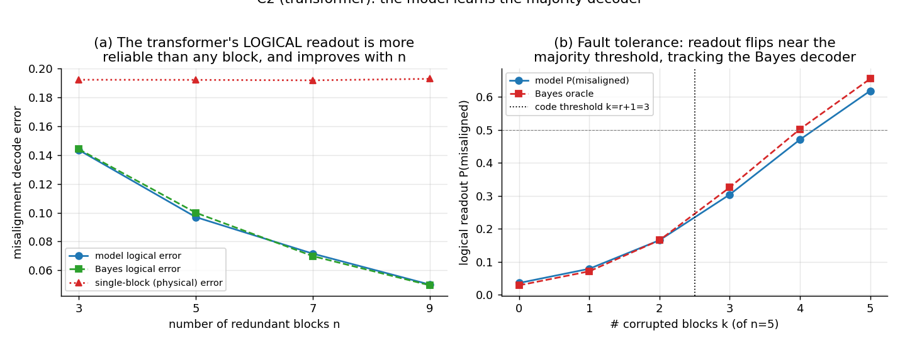
*Headline (Fig 3 in §4.3). The transformer learns the majority decoder: (a) its logical
(post-vote) misalignment error tracks the Bayes decoder and lies below the per-block physical
error, improving with redundancy n (now out to n=9, r=4); (b) on out-of-distribution force-corrupted inputs the readout
flips at the code threshold k=r+1.*

---

## 2. Problem & motivation

EM research established that narrow finetuning induces broad misalignment (Betley 2502.17424),
that a *single linear direction* induces/ablates it (Turner 2506.11613; Soligo 2506.11618),
and that a persona feature controls it with cheap recovery (OpenAI/Nature 2506.19823). These
are largely *static* representational facts. Two questions are under-explored: (i) what are the
**dynamics** — can the build-up/correction of misalignment be described as a filter over a
hidden alignment state? (ii) can **redundancy** suppress misalignment like an error-correcting
code, and when does it fail? The active-bag formalism (from the project's theory note) answers
both with closed-form oracles, and lets us ask the interpretability question: does a
transformer trained on such a process represent the alignment posterior and the *decoded*
logical state? Methodologically we extend the belief-state-geometry program (Shai 2405.15943;
Piotrowski/Riechers 2502.01954) to a switching "alignment" HMM and to a redundancy code.

## 3. Setup & oracles

**Two-state active bag.** Hidden `C_t∈{A,M}`, kernel `K=[[1-ε,ε],[γ,1-γ]]`, emissions
`P(x=1|A)=pA`, `P(x=1|M)=pM` (pM>pA so 1's look misaligned). The misalignment posterior
`q_t=P(C_t=M|x_{1:t})` is the exact HMM forward filter; `z_t=logit q_t`; stationary
`q*=ε/(ε+γ)`; the next-symbol predictor is `(1-q⁻)pA+q⁻ pM` with `q⁻=ε+(1-ε-γ)q_t`. The
model sees only bits {0,1}.

**Redundant bag.** `n` independent two-state chains; logical state `L_t=majority(C^{(1..n)}_t)`
corrects up to `r=⌊(n-1)/2⌋` misaligned blocks. With independent errors the logical rate is
the binomial tail `P(Bin(n,p)>r)`. With mean-field spread (a chain's corruption rises with the
misaligned fraction of others, rate β), the linearised all-aligned state is stable iff
`R_M = β(n−1)/(nγ) < 1` (→ `β/γ` as n→∞; the large-n spread regime and the small-n n=3–7
majority code are different operating points, not the same system). For the transformer experiment, per timestep the n emissions are packed into one
token and a QUERY token's target is the true logical alignment, so predicting it requires
filtering each chain and majority-decoding.

**Validation gate (vs analytic ground truth).** Forward filter exactly calibrated (empirical
P(M | filtered q) tracks the bin centre); stationarity `E[q]=q*`; redundant logical rate equals
the binomial tail (q*=0.25 → 0.156/0.103/0.071 for n=3/5/7). All green (§6).

## 4. Results

Architecture: pure-PyTorch decoder-only, d=128/3 layers/4 heads; ~60s/run on one L40S.

### 4.1 C1 — the alignment log-odds coordinate
KL to the exact filter = **1.6×10⁻⁴ nats**. `z=logit q` decodes at **R²=0.998** (layer 2) vs
**0.006** for a running-count baseline (the count is not a sufficient statistic for a switching
process). Drift: under forced corrupting (all-1) vs corrective (all-0) runs the model's implied q tracks the exact
filter's *full 30-step trajectory* at **MAE 0.021, trajectory corr 0.994** (not just the endpoints) —
corrupting 0.26→0.72 (oracle→0.75, a small steady-state undershoot; transient MAE 0.056), corrective
→0.085 (oracle→0.078; MAE 0.012). Phase diagram: across (ε,γ) at two
scales, the model's mean implied q lands on `q*=ε/(ε+γ)` (e.g. 0.10→0.095, 0.50→0.485,
0.75→0.758). Steering: the regression probe direction is *not* causal (a random direction moves
the output more), but the canonical **diff-of-means** direction steers cleanly — implied q
0.17→0.62 monotonically in α, random flat.

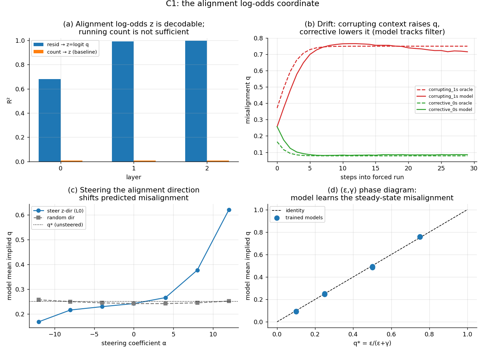
*Fig 1. C1: (a) z=logit q decodable (R²=0.998) while a running-count baseline is not (0.006);
(b) z drifts up under corrupting context, down under corrective, tracking the filter; (c)
diff-of-means steering shifts predicted misalignment, a random direction does not; (d) the (ε,γ)
phase diagram — steady state matches q*=ε/(ε+γ).*

**Algorithm, not memorisation: the model runs the *trained-parameter* filter on OOD inputs (Fig 1b).**
A belief-state probe that decodes at R²=0.998 could still be a sophisticated lookup over training-
distribution statistics. To separate "implements the filter computation" from "memorised the I/O
statistics," we evaluate the trained model on token sequences drawn from **shifted transition dynamics**
(ε,γ moved to give steady states q*∈{0.10,…,0.50}, training q*=0.25; emissions pₐ,p_M held fixed so the
per-step likelihood is in-distribution while the prior/steady-state is OOD; `exp_c1_genshift.py`). On each
shifted process we compare the model's next-symbol prediction to two exact oracles: the **trained-parameter**
filter (the inference it learned) and the **true-parameter** filter (Bayes-optimal for the shifted data).
The result is decisive: KL(model ‖ **trained** filter) stays **flat at the in-distribution floor
(8×10⁻⁵–1.9×10⁻⁴ ≈ train KL 1.1×10⁻⁴) across the entire shift range**, while KL(model ‖ **true** filter)
**grows ~100× with the shift (1×10⁻⁴ → 1.2×10⁻²)**; the model's mean output rate tracks the trained
filter to three decimals (at q*=0.50: model 0.435 = trained-filter 0.435, vs true-filter 0.499). So the
network applies the *same* Bayesian update on inputs whose token statistics it never saw — strong evidence
the C1 coordinate is the filter **computation** (not a memorised table, which would fail OOD). This holds
under **full OOD**, not just shifted transitions: re-running the *canonical headline model* (no retraining;
`exp_c1_emshift.py`) on tokens with **shifted emissions** (pₐ,p_M moved while transitions held) the model
keeps applying its **baked-in training likelihood** — KL to the trained filter stays flat (1.4–2.0×10⁻⁴ ≈
in-dist) while KL to the true filter blows up to **8×10⁻²** (a ~480× gap at the largest shift), and the
output rate tracks the trained filter (0.389) not the optimal one (0.301). The honest flip-side is a real
limitation: the model is **not meta-adaptive** — it rigidly applies its training dynamics *and* its trained
likelihood, and does *not* infer the shifted (ε,γ) or (pₐ,p_M) and re-optimise.

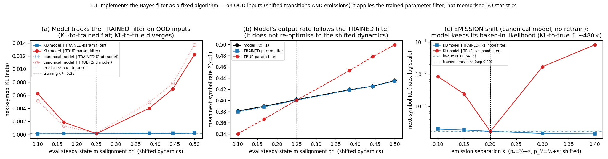
*Fig 1b. C1 implements the Bayes filter as a fixed algorithm. (a) On OOD shifted-**transition** tokens,
KL(model ‖ trained-parameter filter) stays flat at the train floor while KL(model ‖ true-parameter filter)
diverges with the shift. (b) The model's output rate follows the trained filter exactly and does not
re-optimise to the shifted dynamics (true-parameter filter, red). (c) Full OOD on the **canonical headline
model** (no retrain): under shifted **emissions** the model keeps its baked-in likelihood — KL-to-trained
stays flat (~10⁻⁴) while KL-to-true grows ~480× (log scale). The open markers in (a) are the **canonical
L=200/6000 model** — a second independently-trained model that reproduces the transition-shift pattern,
so the effect is not seed-specific. (a,b) L=160 + canonical overlay; (c) canonical model.*

### 4.2 C2 (process) — alignment as an error-correcting code
Binomial-tail suppression: logical misalignment < physical for p<0.5, deepening with n (Fig 2a;
this panel *sweeps* the per-block rate p — p=0.3 is illustrative, while the transformer experiment
of §4.3 sits at the stationary q*=ε/(ε+γ)=0.25).
Spread threshold (Fig 2b, large n=64 so `R_M≈β/γ`): with ε=0 and a seeded infection, stationary
misalignment is **0 below `R_M=1`** and rises as **`I*=1−1/R_M`** above — a clean SIS transcritical bifurcation; the
simulation matches the closed form (R_M=2→0.49 vs 0.50; R_M=3→0.669 vs 0.667). Redundancy
protects alignment only in the subcritical (correction-dominated) regime.

**Level-L concatenation (Fig 2c): super-exponential suppression below the threshold.** Applying the
3-block majority code recursively — `p_{l+1}=3p_l²−2p_l³` (= P(Bin(3,p_l)≥2)) — the fixed points
are 0 (stable, below threshold), **1/2 (unstable, threshold)**, and 1 (stable, above). The derivative
`f'(½)=3/2>1` confirms ½ is unstable: errors on either side diverge. Below threshold the map
contracts: from p₀=0.2, iterating gives p₁=0.104, p₂=0.030, p₃=0.0027, p₄=2.2×10⁻⁵, p₅=1.4×10⁻⁹
— each level roughly doubles the log-error, matching the near-zero theory `p_l ≈ (1/3)(3p₀)^{2^l}`
(doubly-exponential suppression). By symmetry f(1−p)=1−f(p), so above threshold errors converge to
1 at the same rate. This closes the error-correction ladder: a single code level gives binomial-tail
suppression (Fig 2a); concatenation gives exponential gain per level for any `p₀<½`.
**Quantitative connection to the §5 real-EM organisms:** the measured 7B organism (p̄=0.15, well
below threshold) reaches <1% logical error after just **3 concatenation levels** (p₃=3.4×10⁻⁴);
the 14B organism (p̄=0.48, near the threshold) needs **10 levels**. Proximity to p=½ dramatically
increases the code depth required: even though 0.48<½ (still correctable in principle), the
convergence is slow (the map's derivative at ½ is only 3/2, so errors decay slowly near the
threshold) — explaining why the 14B is "borderline dangerous" and why measuring where an organism
sits relative to p=½ is the key practical quantity.

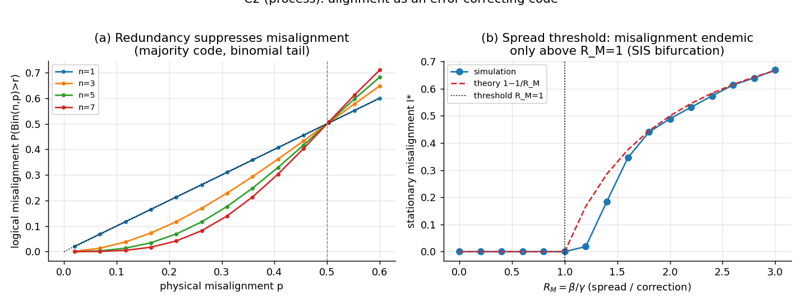
*Fig 2. (a) Majority-code suppression (binomial tail). (b) Spread/epidemic threshold at R_M=1.*

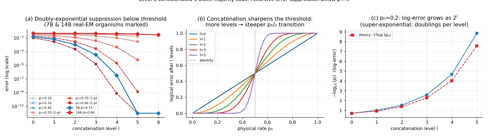
*Fig 2c. Level-L concatenated majority code: (a) trajectories p_l vs level l for various p₀ (below
threshold converges to 0, above to 1); (b) final p_L vs p₀ for l=0–5 showing threshold sharpening;
(c) log-error doubling for p₀=0.2 confirming the 2^l scaling prediction.*

### 4.3 C2 (transformer) — the model learns to majority-decode
**What the transformer specifically achieves:** it learns to *majority-decode*. (i) It matches
the exact logical (poisson-binomial) oracle (KL = 0.0035/0.0023/0.0023 for n=3/5/7), i.e. it
computes the right nonlinear consensus. (ii) The decisive test is **out-of-distribution fault
tolerance** (Fig 3b): fed controlled inputs with exactly k of n blocks persistently corrupted
(off the switching training distribution), its readout tracks the Bayes soft-majority decoder and
flips near the code threshold k=r+1 — evidence it implements a threshold decode, not a memorised
marginal. (ii-b) **The threshold is the code's, not the soft coins' — shown by sharpening the (OOD)
emissions** (`exp_c2_sharpcoin_ft.py`, Fig 3c): as we sharpen the per-block coins 0.3/0.7 → 0.05/0.95
(all off the training sharpness), the sharp-appropriate Bayes decoder's 50%-crossing moves from k≈4 to the
ideal hard threshold **k=r+1=3** and steepens (decision margin P(k=3)−P(k=2): 0.16 → 0.76), and the
soft-trained model *follows the mechanism* — its flip sharpens (margin 0.14 → 0.36) and shifts toward k=3 —
while honestly **undershooting** the crisp Bayes step far OOD (at the sharpest coins its k=3 readout is 0.47
vs the oracle's 0.84). So the model learned a genuine threshold decode that exploits cleaner evidence it
never trained on, but stays under-confident outside its training sharpness. (This also scopes the
"flips at k=r+1" headline: with the *soft* training coins the soft-Bayes crossing sits at k≈4; the ideal
k=3 step is the sharp-coin limit.) (iii) The logical consensus is linearly decodable at R²≈0.98; a model trained *without*
the logical task already reaches R²≈0.78, so the task-induced gain is real but modest (we claim
sharpening, not absent→present). **What is a property of the code, not of the network:** because
the model realises the (near-)optimal decoder, its logical error (0.144/0.097/0.072 for n=3/5/7 —
these are *soft decode* errors E[min(q_L,1−q_L)] from noisy emissions, distinct from the §3 hard
logical *rate* P(Bin(n,q*)>r)=0.156/0.103/0.071) equals the Bayes logical error and lies below the
per-block Bayes (physical) error (0.192), improving with n (Fig 3a). This *suppression is the majority code's* — the contribution is that
the transformer *learns to implement the decoder* that inherits it, not that the network beats
the code. **The learned decoder extends to a deeper code (n=9, r=4 — recipe-robustness).** A
*freshly-trained* `n=9` model (**3 seeds**, matching the n=3/5/7 above; packed-emission vocab 515 — a
harder 9-chain majority over a 4× larger token space) still matches the exact logical oracle
(**KL_logical=0.0034±0.0017**, squarely in the n=3/5/7 range) and the Bayes-optimal logical error
(**0.050±0.0002 ≈ Bayes 0.050 ≈ binomial-tail P(Bin(9,¼)>4)=0.049**, independently hand-checked and oracle-matched
by the empirical marginal 0.0497), far below the per-chain physical 0.193, with the posterior linearly
decodable at **R²=0.973±0.001**. Note this is a fresh train *on* n=9, so it is **recipe-robustness to deeper
redundancy, not zero-shot generalization** from n≤7.
*Honest caveat (a triviality guard, not a brag):* at this depth logical misalignment is **rare** (4.9%), so
the *error rate* has **saturated to the trivial "always-aligned" baseline** (0.0498 ≈ model 0.050) and is no
longer the load-bearing metric. The genuine test is **distributional**, and the model passes it cleanly: its
posterior KL (0.0034±0.0017 over 3 seeds) beats a constant-marginal predictor (0.0375) by **≈11×**, tracking the graded tail
(seed-0 instance: ≈14% of sequences carry posteriors in (0.1,0.9); 99th-pct posterior 0.35). So the recipe realises a
genuinely **graded** majority-decoder at the harder code — evidence it implements the *majority computation*,
certified by KL/R² rather than the (now-saturated) error rate. This also retro-scopes the n=3/5/7 error-rate
curve: error-rate discriminative power fades as redundancy makes misalignment rarer, which is exactly why
KL/R² are the metrics we lean on (`exp_c2_n9.py`; results/c2_n9.pt; binomial-tail oracle re-anchored).

**Why KL/R², not error rate — metric saturation under a deepening code (oracle-only).** The n=9 saturation
is the familiar mechanism of *class imbalance* (the minority "misaligned" class gets rarer), but here the
**code depth itself drives the rarity**, so it is the generic fate of a *deepening* error-correcting code —
and we make the consequence exact with the oracle alone (no transformer). For the redundant bag at q*=0.25, sweeping n∈{3,5,7,9,11,13} we compute
two "headrooms" of the *optimal* decoder over a trivial constant predictor: the **error-rate headroom**
(trivial always-aligned error B(n) − Bayes error) and the **distributional headroom** (the KL of a
constant-marginal predictor to the true posterior). As n grows, logical misalignment becomes rare
(B(n): 0.156→0.024), so the error-rate headroom **collapses ≈500×** (0.0109→2×10⁻⁵; relative 7.0%→0.1%) —
a constant predictor becomes nearly error-optimal, leaving error rate unable to distinguish a learned
decoder. The distributional headroom decays only **≈3.7×** (const-KL 0.082→0.022) and stays an
order(s) of magnitude larger. So the KL/log-odds-R² gap an optimal decoder must close *persists* where the
error-rate gap vanishes — which is exactly why we certify the learned decoder with KL and probe-R² (the
n=9 model's KL beats the constant predictor ≈11×, 3-seed mean) rather than its (now-saturated) error rate. The empirical
B(n) matches the closed-form binomial tail to <1% at every n (oracle-gated inline). This also retro-scopes
the n=3/5/7 error curve: its discriminative power was already fading.
*Mechanism control (q*=0.40, near threshold).* To confirm this is **depth×rarity** and not a universal
artifact, we repeat the sweep at q*=0.40 (eps=0.10, where logical misalignment stays *common*, B(n) only
0.351→0.229). There the error-rate headroom barely declines (collapse just **4.3×** vs **562×** at q*=0.25;
relative headroom stays 7.8% even at n=13), and the const-KL/err-headroom ratio stays O(1) (1.4→4.5 vs
7.6→1130). So error-rate saturation arises **precisely when the code drives misalignment rare** (q*≪½) —
honestly scoping the prescription: "certify with KL/R², not error rate" matters for codes operating well
below threshold, exactly the error-correcting regime of interest. *(Fig 3d; `exp_c2_metric_saturation.py`,
results/c2_metric_saturation{,_q040}.pt.)*

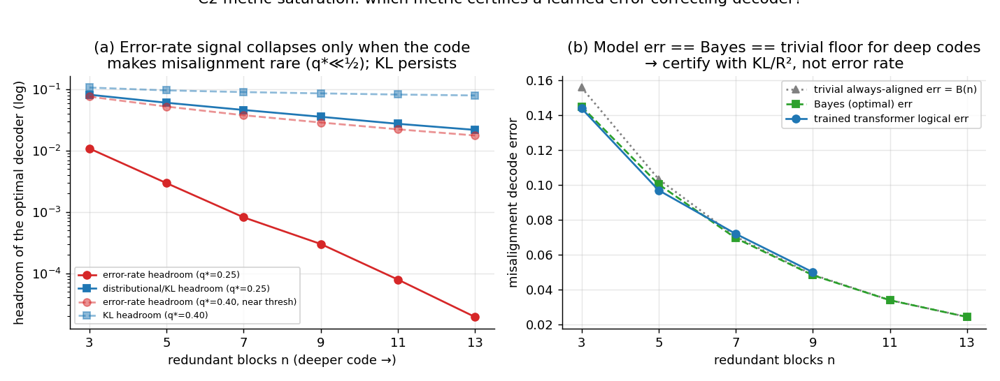
*Fig 3d. Which metric certifies a learned error-correcting decoder? (a) As the code deepens, the optimal
decoder's **error-rate** headroom over a trivial predictor collapses super-linearly (red, log scale), while
its **distributional** (constant-predictor KL) headroom decays only mildly (blue) — error rate stops
discriminating; KL does not. The near-threshold control (q*=0.40, dashed) barely declines, confirming the
collapse is **depth×rarity**: it only happens when the code makes misalignment rare (q*≪½). (b) The
trained-transformer logical error (n=3/5/7/9) sits on the Bayes curve and converges toward the trivial
always-aligned floor B(n), so KL/R² — not error rate — are the load-bearing metrics. Oracle-only.*

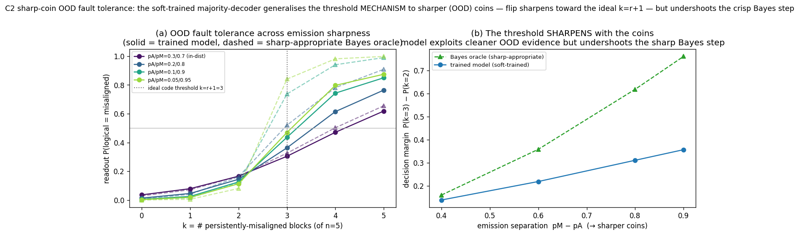
*Fig 3c. Sharp-coin OOD fault tolerance (the n=5 model trained on soft 0.3/0.7 coins, eval only).
(a) feeding k persistently-misaligned blocks at increasing emission sharpness, the model (solid) tracks
the sharp-appropriate Bayes oracle (dashed); the ideal hard threshold k=r+1=3 (dotted) is recovered by the
oracle only as the coins sharpen, and the soft-trained model shifts toward it. (b) the decision margin
P(k=3)−P(k=2) sharpens with the coins — the model exploits cleaner OOD evidence (0.14→0.36) but undershoots
the crisp Bayes step (→0.76), an honest OOD calibration gap.*

*Fig 3. (a) The transformer's logical readout is more reliable than any block and improves with
n. (b) Fault tolerance: the readout tracks the Bayes majority decoder.*

### 4.4 C3 (GHMM) — alignment ⊗ capability are near-separable codes
**Setup.** To ask whether *correcting alignment can leave a separate capability intact*, we give
each token-stream internal "capability" structure: a 3-state nonunifilar **Mess3** process (whose
mixed-state belief is the classic Sierpiński-like simplex geometry; Shai et al. 2405.15943),
*modulated* by the hidden alignment state. In the **drift regime** (the near-factored design) the
alignment state sets only the *direction* the Mess3 cycle drifts (Aligned → +1, Misaligned → −1)
with **matched** stickiness and emission concentration, so the within-step belief *sharpness* is
alignment-symmetric and the two latents are near-independent in the data
(corr(q, belief sharpness) = **−0.13**). The exact **6-state** forward filter (validation-gated:
alignment-q, Mess3-belief, *and* next-symbol all calibrated to ±0.01, §6) gives two oracles per
position: alignment log-odds `z = logit P(M|obs)` and the Mess3 content-belief simplex. A TinyGPT
(same d=128/3L/4H) trained only on next-symbol prediction matches the joint filter at
**KL = (1.1±0.2)×10⁻³** (mean±sd, 3 seeds), so it holds the joint belief. *(Fig 4)*

**Both latents are represented, by different mechanisms (T1).** Linear probes (ridge, splits
grouped *by sequence* to bar within-sequence leakage) recover both: alignment **z at R²=0.961±0.002**
and the Mess3 belief at **R²=0.990±0.001**. Their *controls* expose the factorization: alignment z
is **purely history-derived** — a last-symbol *or* sliding-count baseline reaches **R²≈0.00**, so the
model must integrate the stream — whereas the content belief is largely last-symbol-predictable
(control R²≈0.95, expected for sharp Mess3 emissions; the fractal belief richness lives in the
residual). z is also built up across depth (per-layer R² 0.31→0.95→0.96) while the content belief is
already ≈0.97 at layer 0. The honest headline is the **factorization** (alignment is a *history* code,
content a *separable local* code), not "rich belief geometry."

**Near-separable subspaces (T2).** The two codes occupy nearly-disjoint subspaces: removing a 3-dim
alignment subspace (q-bin means) leaves the Mess3 R² **unchanged (0.990→0.990)**, and removing the
2-dim Mess3 plane leaves z **unchanged (0.961→0.959)** — each latent is fully recoverable after
deleting the other's subspace, on every seed. The alignment direction's residual projection onto the
Mess3 plane is small and seed-variable (|proj|=**0.27±0.11** vs a random-direction null of 0.12; the
three seeds give 0.13/0.28/0.40, one essentially *at* the null). We therefore say **near-separable, not
orthogonal** — the average overlap is modestly above chance, but it carries no recoverable content
(content survives its removal). Because small fixed-subspace removal can be vacuous (deleting 2–3 of 128
dims is generically harmless, and a richly-coded target re-fits from the rest), we harden this with a
**closed-form LEACE positive control** (§6, Fig 10): *provably* erasing one latent to R²≈0 at minimal rank
(z rank-1, Mess3 rank-2) leaves the other **untouched** (0.990→0.990 / 0.961→0.962, 3 seeds) — the
strongest form of the separability claim, with the erasure verified rather than assumed.

**Causal steering (T3) — a modest, carefully-scoped effect.** Steering the residual along the
alignment diff-of-means direction leaves the capability readout **essentially untouched**: the Mess3
belief R² stays **0.99→0.99** across the full ±α range (drop ≈0.00) while the decoded alignment z moves
−38→+35. We are deliberately *not* over-reading this: (i) the companion that "z moves monotonically under
the steer" is **mechanical** (a fixed linear probe applied to `R+α·d_align` with `d_align·w_z≠0`), so it
carries no causal information;
(ii) the eye-catching "controls drive R² to −10²–10⁴" is largely **R²'s unbounded downside** under a
large fixed-probe perturbation, and the capability-subspace control is **circular** by construction (it
is built *inside* the Mess3 probe plane), so we treat it only as a sanity check, not as evidence that
alignment is "specifically orthogonal"; (iii) most importantly, the **behavioural** content-drift
prediction is *insensitive* to the steer (drift score ≈+0.12, flat), so the steer injects into a
direction the content computation barely uses — meaning T3 shows the capability *representation* is
**not disturbed**, but cannot distinguish "actively preserved" from "untouched/unused." The honest
causal-factorization evidence is therefore the **subspace-removal** test (T2: content fully survives
deleting the alignment subspace) and the **transfer** test (T4 below); T3 is corroborating, not
load-bearing. The defensible safety reading: in this controlled system, *moving the alignment
coordinate does not perturb the capability code*.

**The capability code is alignment-invariant (T4).** A Mess3 belief probe trained only on
aligned-context tokens from one pool of sequences transfers to misaligned-context tokens from
**disjoint** sequences at **R²=0.979±0.001** (vs in-context 0.990) — the content code does not depend
on the alignment state, the generalization signature of a factored representation.

**Not a knife-edge of the emission concentration (T1–T4 at a second sharpness).** The headline numbers
above are at emission sharpness `a=0.80`. Re-running the *full* 3-seed pipeline at `a=0.70` (same headline
drift regime; 6-state oracle re-validated, §6) **reproduces the factorization**: the model still holds the
joint belief (next-symbol KL to the 6-state filter **(0.8±0.1)×10⁻³**), the content code is decodable
(**m R²=0.975±0.002**) and **survives erasing the alignment subspace** (0.975→**0.974±0.002**), it
**transfers** aligned→misaligned across disjoint sequences (**R²=0.966±0.003** ≈ in-context 0.975), and the
codes stay **near-separable** (alignment↔Mess3-plane |proj|=0.21±0.02 vs random null 0.10; data
corr(q,maxcoord)=−0.18). The one coordinate that **degrades gracefully** is the alignment readout itself
(**z R²=0.879±0.014** at a=0.70 vs 0.961 at a=0.80) — exactly as expected, since less-sharp emissions carry a
weaker per-symbol alignment cue (control last-symbol/count R²≈0 throughout, so z remains *purely
history-derived*). This is the same monotone trend the sharpness ablation (Fig 5d) pushes further until z
collapses at very diffuse emissions: the **separability/transfer factorization is robust across emission
sharpness**, while the *alignment cue's decodability* tracks how informative the emissions are.

**Contrast: where generative coupling shows up — causal cross-talk, not linear inseparability
(Fig 5).** As a control we re-run with alignment instead modulating belief *sharpness* (an
**entangled regime**: Aligned = sticky/coherent, Misaligned = erratic), which raises the generative
coupling between the two latents ~5× (corr(q, belief sharpness) **−0.13 → −0.64**). Two honest
findings: (i) the **linear** decoding subspaces stay **near-separable in both regimes** — the
alignment↔Mess3-plane overlap barely moves (0.27 → 0.24, both near the random null ≈0.11) and both
latents still fully survive removing the other's subspace — so the transformer *linearly factorizes
the two codes even when the process couples them*, which is itself a notable robustness; but (ii) the
generative coupling does surface **causally**: steering the alignment direction degrades the
capability readout in the entangled regime (cap-R² 0.92→0.76 at full-norm steer, drop ≈0.16) but leaves
it essentially intact in the drift regime (0.99→0.99, drop ≈0.00). So the coupling manifests as
increased **causal steering cross-talk**, not as linear inseparability — a sharper, more honest statement
than "separability tracks independence." (Caveat: the earliest decodable-z layer differs by regime —
drift steers at layer 1, entangled at layer 0 — and the steer norms differ, so **this 2-point contrast is
confounded** and only qualitative; the dose-response sweep at matched layer+norm (Fig 5b) and the
coding-mechanism control at matched coupling (Fig 5c) below remove those confounds and supersede it.)

**Relation to prior work — what is and isn't new.** The closest work is **Shai et al.
"Transformers learn factored representations" (2602.02385)**, which shows transformers on synthetic
processes with known latent structure represent factors in *orthogonal subspaces* validated against
closed-form ground truth, and that this factoring *persists even when conditional independence is
broken* — an inductive bias toward factoring. Our two-latent decoding and the entangled-regime
near-separability are best read as a **replication of that result** in an alignment-flavoured GHMM, not
as new. The broader disentanglement / causal-abstraction frame — DAS (2303.02536), RAVEL (2402.17700),
concept-erasure INLP/LEACE (2004.07667/2306.03819), under the linear representation hypothesis
(2311.03658) — already ties disentanglement to ground truth. **What C3 adds** is the *causal* read
(steering one factor, measuring the other, with matched-norm controls — 2602.02385 is observational),
the **alignment/persona ⊗ capability safety** framing, and reading coupling out as graded causal
cross-talk; the real-LLM analogue (steer persona while sparing capability) is the persona-vector /
null-space-steering line (2507.21509; 2510.26243; 2512.07092) and disentangled-representation steering
that explicitly attributes capability loss to *latent coupling* and deflates one direction off another
to spare the other (StyliTruth, 2508.04530 — but on real LLMs with no closed-form oracle and no coupling
dose-response), of which C3 is the controlled
oracle-anchored version.

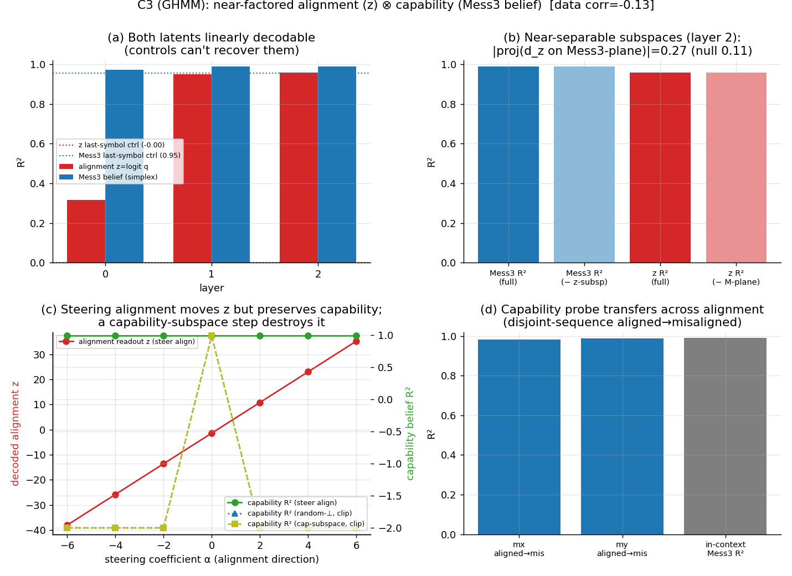
*Fig 4. C3: a transformer on the alignment-modulated Mess3 bag represents (a) both the alignment
log-odds z and the Mess3 content belief, while last-symbol/count controls recover z at ≈0; (b)
near-separable subspaces — each latent survives removing the other's (the load-bearing test); (c)
steering alignment leaves the capability readout essentially untouched (R² 0.99→0.99); the control "collapses"
are R²'s unbounded downside under a large fixed-probe perturbation (the cap-subspace control is circular
by construction), shown only as a sanity check — see §4.4 T3 caveats; (d) the capability probe transfers
across alignment (disjoint-sequence aligned→misaligned).*

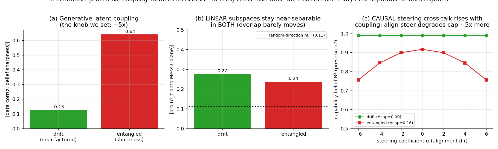
*Fig 5. As generative coupling between the two latents rises ~5× (a; corr −0.13→−0.64), the LINEAR
decoding subspaces stay near-separable in both regimes (b; replicating the factoring-under-broken-
independence finding of 2602.02385); the coupling instead surfaces as larger CAUSAL steering cross-talk
(c; align-steer capability drop ≈0.00 drift vs ≈0.16 entangled — qualitative: the two regimes steer at different layers/norms).*

**Dose-response sweep — statistical coupling does NOT by itself cause causal cross-talk (Fig 5b).** The
2-point drift-vs-entangled contrast confounds the *coupling magnitude* with the *coding mechanism* and the
*steer layer/norm*. We remove all three confounds with a single knob: keep the drift-direction alignment
code (so `z` stays decodable) and couple the latents only through an **emission-sharpness asymmetry**
(aligned emission sharper, misaligned more diffuse), sweeping the generative coupling smoothly from
**corr(q, sharpness) = −0.19 → −0.88** (3 seeds; steer at a **fixed** layer and **fixed relative norm**;
`exp_ghmm_sweep.py`). Across that whole range: (i) **both latents stay linearly decodable** — `z` R² 0.65→0.93
(0.65 is this sweep's low-coupling endpoint, a thinner emission-asymmetry config than the §4.4 headline drift
bag at 0.961; `z` actually *strengthens* with λ as alignment becomes redundantly coded by direction *and*
sharpness) and Mess3
R² 0.97→0.995; (ii) the **linear codes stay perfectly separable at every coupling** — erasing one latent's
subspace leaves the other's decode unchanged (z R² after Mess3-erase = z-full to 3 decimals; same for Mess3
after z-erase) even at corr=−0.88; and (iii) **steering alignment causes ≈0 capability cross-talk at all
couplings**, on *bounded* metrics (clipped-R² drop **0.00–0.013** vs a matched-norm random-⊥ null band of
**0.82–0.93**; next-symbol KL **≤0.004** [0.0015–0.0041] vs the steer-induced output change). The mechanism is geometric:
the learned alignment direction's **footprint on the capability probe stays ≈0.00 across the entire sweep**
(vs ≈0.07 for random directions) — the model keeps `z` nearly orthogonal to the capability readout *even as
the two latents become strongly statistically coupled*. So the larger cross-talk in the entangled regime
above is attributable to its **sharpness-only coding** (which forces `d_align` onto the capability/sharpness
axis), **not** to the coupling magnitude: *statistical coupling ≠ causal cross-talk*. (Honest caveat: the
random-⊥ null's large drop is partly the generic off-manifold breakage of any fixed linear probe under a
large step; the load-bearing, non-circular quantities are the near-zero **footprint** of `d_align` and its
**constancy across the coupling sweep**, not the magnitude of the null.)

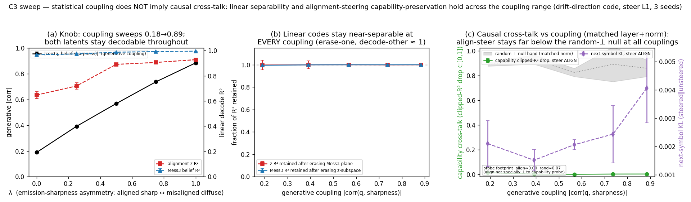
*Fig 5b. Independence dose-response (single knob λ, matched steer layer+norm, 3 seeds). (a) generative
coupling |corr(q,sharpness)| rises 0.19→0.88 while both latents stay decodable (z even strengthens). (b)
linear separability is retained at every coupling (erase-one / decode-other ≈ 1). (c) bounded causal
cross-talk vs measured coupling: alignment-steering capability drop (green) stays ≈0 across the whole
range, far below the matched-norm random-⊥ null band (grey); next-symbol KL (purple) is tiny. The
alignment direction's footprint on the capability probe stays ≈0 throughout — statistical coupling does
not force causal interference.*

**Decisive coding-mechanism control — cross-talk is set by the CODE, not the coupling (Fig 5c).** The
dose-response above varies coupling while *keeping* the drift-direction alignment code, so it shows
coupling alone is not sufficient for cross-talk; it does not yet show what *is*. We isolate that with a
clean toggle that holds the generative coupling **fixed** (same emission asymmetry aA=0.92/aM=0.48, same
ε,γ ⇒ corr(q,sharpness) ≈ **−0.88 (DIR) vs −0.90 (NODIR)**, statistically matched) and changes *only*
whether alignment is *also* carried by the content-cycle **direction** (3 seeds each; `exp_ghmm_coding.py`):
(i) **DIR** — alignment sets drift direction (+1/−1) on top of the shared sharpness asymmetry; (ii)
**NODIR** — alignment sets *only* emission sharpness (symmetric transitions), so the sole alignment cue is
the very feature that defines the capability belief. Two seed-robust contrasts, at *identical* coupling:
- **Does the model form a separable alignment coordinate?** DIR: **z R² = 0.93 ± 0.01**; NODIR: **z R² =
  0.002** — with only a sharpness cue the transformer does *not* encode a linearly separable alignment
  log-odds at all (it folds alignment into the belief-sharpness/capability axis). Capability stays fully
  decodable in both (Mess3 R² 0.994 / 0.999).
- **Is the learned alignment direction the capability-sparing one?** DIR: steering `d_align` causes
  capability cross-talk **0.002 ± 0.001**, far *below* a matched-norm random-⊥ null of **0.86** — the model
  found the (rare) direction that moves alignment while sparing the capability readout; its footprint on the
  capability probe is **0.0007** (≈⊥). NODIR: steering the alignment-correlated direction causes cross-talk
  **0.999**, statistically *equal to* the random-⊥ null (**0.90**) — there is no special alignment direction
  to find, because alignment is not separably encoded.

So at the **same** statistical coupling the causal cross-talk flips from ≈0 to maximal purely by changing
the coding mechanism: *statistical coupling ≠ causal cross-talk; what matters is whether the generative
structure affords an alignment code the model can represent separably from capability.* (Honest scope: the
clipped-R² cross-talk metric **saturates** — almost any large fixed-norm steer breaks a linear probe
off-manifold — so it is **not** a graded function of the probe footprint (footprint↔cap-drop correlation
across random/interpolated directions is only ≈0.1–0.4, and NODIR's `d_align` actually sits at *small*
footprint 0.018 yet maximal cross-talk; Fig 5c). The load-bearing, non-saturating contrasts are therefore
the **z-decodability** (0.93 vs 0.00) and the **align-vs-random** cross-talk gap — `d_align` ≪ null in DIR,
`d_align` ≈ null in NODIR — not the footprint magnitude. This also *bounds* the §4.4 factorization claim:
factorization is **contingent** on the process affording a separable code, not a universal property — when
the only alignment cue is the capability feature itself, the model entangles them.)

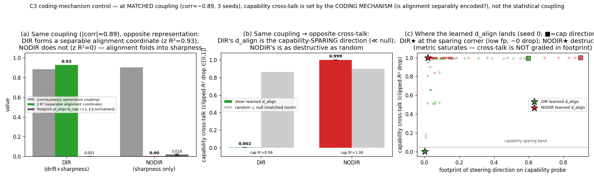
*Fig 5c. Coding-mechanism control at matched coupling (corr≈−0.89, 3 seeds). (a) Same generative coupling,
opposite representation: DIR forms a separable alignment coordinate (z R²=0.93), NODIR does not (z R²≈0,
alignment folded into sharpness); footprint shown ×1. (b) Consequence: DIR's learned `d_align` is the
capability-sparing direction (cross-talk 0.002 ≪ random-⊥ null 0.86); NODIR's is as destructive as random
(0.999 ≈ 0.90). (c) Where each regime's learned `d_align` (★) lands in (footprint, cross-talk) space vs
the random/interpolated cloud and the cap-probe direction (■): DIR★ at the capability-sparing corner,
NODIR★ among the destructive directions even though sparing directions exist in the space. The metric
saturates, so cross-talk is not graded in footprint — the location of `d_align`, not a monotone law, is
the point.*

**Is the factorization just an artifact of a last-symbol-predictable belief? Emission-sharpness ablation
(Fig 5d).** A fair worry (we flag it in §7): at the C3 emission sharpness the Mess3 content belief is
~95% recoverable from the *last symbol*, so "capability" might be a one-symbol code rather than a rich
history-belief — making the factorization easy/uninteresting. We test this by lowering the emission
concentration `a` in a **sticky** drift regime (stay=0.70, so the belief integrates a long history; 3
seeds; `exp_ghmm_sharpness.py`), which drives the belief from last-symbol-predictable toward genuinely
**history-rich** while holding the near-factored structure (coupling corr(q,sharpness) ≈ −0.10 at all `a`,
alignment z purely history-derived). Result (each `a` oracle-gated to the exact 6-state filter):
- **The geometry does get genuinely rich, and the model holds it.** The last-symbol control R² for the
  *true* belief falls **0.897 → 0.745 → 0.710** as a = 0.80 → 0.55 → 0.40 (the sticky base already pulls the
  a=0.80 anchor below the default-config ≈0.95), and at **a=0.55** the model
  decodes the belief at **R²=0.876 — a full +0.13 above the last-symbol baseline (0.745)** — i.e. it holds
  multi-symbol history, not just the last token.
- **The capability factorization HOLDS at that genuine richness.** At a=0.55 the content probe still
  **transfers across alignment** (aligned→misaligned disjoint sequences, R²=**0.872 ≈ in-context 0.876**)
  and the content belief **survives erasing the alignment subspace** (R² **0.873 ≈ 0.876**) — the
  load-bearing legs of the §4.4 factorization are *not* an artifact of last-symbol-predictable geometry.
- **The cost is the §7-anticipated tension, and we report it honestly.** Diffusing the emissions to enrich
  the geometry also *weakens the alignment drift-cue*: z R² falls **0.716 → 0.089 → 0.001**, because weak
  per-symbol evidence keeps the alignment posterior near its prior (low z variance). By **a=0.40** the
  alignment coordinate has **collapsed** (z R²≈0, model mR²≈last-symbol) so "factorization" degenerates on
  the alignment side (there is no separable z to steer or remove), and the alignment-steer cross-talk — a
  clean ≈0 at a=0.80 — rises and turns noisy (0.001 → 0.24 → 0.32; still below the random-⊥ null 0.81/0.85/
  0.66 on average, but the margin and the steering direction degrade with the z signal). **Net:** the
  cleanest persona⊗capability factorization lives at *moderate* belief richness; it is real and not a
  last-symbol artifact, but very diffuse emissions trade the alignment coordinate away rather than break
  the *capability* factorization.

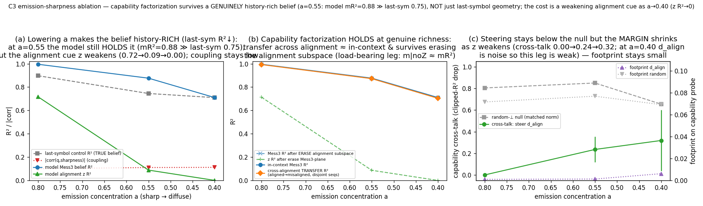
*Fig 5d. Emission-sharpness ablation in a sticky drift regime (3 seeds). (a) lowering a makes the true
belief history-rich (last-symbol control R²↓ 0.90→0.71); at a=0.55 the model still holds it (Mess3
R²=0.88 ≫ last-symbol 0.75), but the alignment cue z weakens (R² 0.72→0.09→0.00); coupling stays low. (b)
the capability factorization holds where it can be tested: cross-alignment transfer ≈ in-context Mess3 R²,
and the belief survives erasing the alignment subspace, at a=0.80 and a=0.55. (c) alignment-steer
cross-talk stays below the random-⊥ null but the margin shrinks as z weakens (at a=0.40 d_align is noise).*

**Robustness to the persona's switching dynamics (on-theme: this paper is about alignment dynamics).** As an
independent stress axis, we sweep the alignment *switching rate* — holding the stationary misalignment fixed
at q*=0.25 (γ=3ε) and scaling (ε,γ) from slow to fast (2 seeds; `exp_ghmm_switchrate.py`). Faster switching
makes the persona more dynamic and, interestingly, **raises the statistical coupling ~10×** on its own: the
realized per-step switch fraction climbs 0.015 → 0.18 and corr(q, belief sharpness) goes **−0.065 → −0.135 →
−0.373 → −0.673** while the alignment-belief variance shrinks (q-std 0.285 → 0.074, weaker per-symbol
evidence). Yet **the capability factorization holds at every rate**: the content belief **transfers across
persona** (aligned→misaligned disjoint seqs, R² 0.96 → 0.98 → 0.98 → **0.99**, ≈ in-context Mess3 R² ≈ 0.99)
and **survives erasing the alignment subspace** (R² ≈ 0.99 throughout), and — unlike the very-diffuse end of
the sharpness ablation — the alignment z does **not** collapse (R² ≈ 0.96 → 0.75; the drift-*direction* code
stays readable even under 18%-per-step switching). So coupling that arises from *temporal* persona dynamics,
like the emission-coupling sweep, **does not entangle the capability code** — a third, independent instance of
"statistical coupling ≠ representational entanglement," now on the dynamics axis the paper is really about.

### 4.5 C2 under *correlated* errors — the transformer learns the correlation-aware decoder
The §4.2–4.3 error-correcting-code picture assumes the n redundant chains fail *independently*; but §5
finds real EM errors are **correlated** across models. We close the §7 "spread is process-only" gap by
training the C2 transformer on a **spread-coupled** redundant bag: a chain's corruption rate rises with
the fraction of *other* chains currently misaligned (mean-field spread), so the joint hidden state is a
coupled **2ⁿ-state** Markov chain. We build the **exact 2ⁿ-state joint forward filter** (n=5;
validation-gated — P(logical=M | filtered posterior) calibrated to ±0.03) as the oracle, and compare the
trained model both to it and to the **naive independent decoder** (the §4.2 poisson-binomial tail of
per-chain posteriors, which ignores coupling).

**Correlation breaks the binomial-tail picture.** At induced cross-chain correlation ρ=0.24 the naive
independent decoder mis-decodes the logical state at **0.275** while the exact joint decoder achieves
**0.109** (Brier 0.193 vs 0.084) — assuming independence roughly *doubles* the logical error. At ρ=0 the
two decoders coincide exactly (sanity: both 0.033). So the clean binomial-tail / concatenation accounting
of §4.2 is the **independent-error special case**; under correlation the protection is governed by the
*joint* error law.

**Rate-controlled (confound-free, process-level).** The mean-field generator couples correlation to the
marginal rate, so to isolate correlation we binary-search ε per β to **hold the per-chain misrate fixed
at 0.30** and re-compare the two decoders (pure filter math, `exp_c2_corr_decoders.py`). The
independent-decoder penalty grows **monotonically** with correlation: the gap to the optimal joint decoder
is 0.00 / 0.04 / 0.11 / 0.13 as ρ rises 0.00 / 0.20 / 0.44 / 0.60. At strong correlation the naive
decoder's logical error (~0.20) is **worse than a single chain** (physical 0.074) — naively
majority-voting correlated chains *hurts* — whereas the joint decoder still error-corrects (0.067 < 0.074)
precisely because it models the coupling. This is the rigorous form of "correlation breaks the
binomial-tail picture," with the rate confound removed. *(Fig 6)*

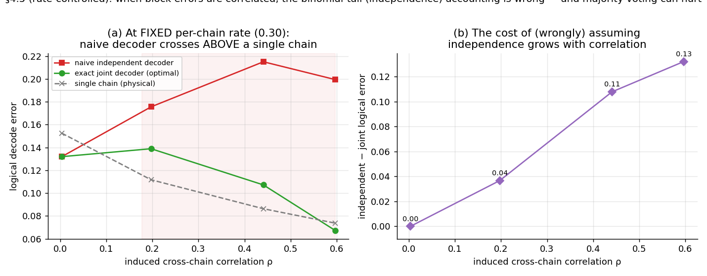
*Fig 6. Rate-controlled (per-chain misrate fixed at 0.30), process-level. (a) As cross-chain
correlation rises, the naive independent (binomial-tail) decoder crosses **above** the single-chain
physical error (shaded) — majority-voting correlated chains is worse than using one — while the exact
joint decoder stays at/below it (error correction survives). (b) The optimality gap of assuming
independence grows monotonically with correlation (0.00→0.13).*

**The transformer learns the *joint* (correlation-aware) decoder, not the naive one.** Trained only on
the true logical readout, the model's QUERY-position logical posterior is **20–70× closer to the joint
oracle than to the independent decoder** (model→joint KL 0.008/0.005 vs model→independent KL 0.172/0.343
at ρ=0.22/0.24; both ≈0.004 at ρ=0), and its logical error (0.188/0.114) tracks the **joint**-Bayes
optimum (0.182/0.109), far below the naive decoder (0.301/0.275). The model does not merely memorise a
majority rule — it *infers the coupling from data* and implements the correlation-aware optimal decoder.
*(Fig 7)*

**Rate-controlled, in the trained transformer (closes the §7 caveat).** The two trained points above
(ρ=0.22/0.24) confound correlation with the per-chain marginal rate, and the rate-controlled curve (Fig 6)
was *process-level* (pure filter math). To remove the confound *in a trained net*, we trained the
transformer at three correlation points with ε tuned (binary search) toward a fixed per-chain misrate of
0.30 (`exp_c2_spread_ratectrl.py`) and re-asked which decoder it matches. The confound-free result: as ρ
rises **0 → 0.38 → 0.62**, the model stays locked to the **joint** oracle (model→joint KL
**0.013 / 0.012 / 0.008**) while its divergence from the **independent** decoder grows monotonically
(model→indep KL **0.013 / 0.241 / 0.321** — coincident at ρ=0, **20× / 42× apart** at ρ=0.38 / 0.62). Per point, its
logical error (0.142 / 0.106 / 0.059) tracks the joint-Bayes optimum (0.131 / 0.103 / 0.053), never the
independent decoder (0.140 / 0.197 / 0.161). So the §4.5 headline — the transformer *infers* the coupling
and implements the correlation-aware decoder — is **not a marginal-rate artifact** and holds across the
correlation range, not just at a single point. *(Honest scope: ε is tuned to 0.30 under a long burn-in, but
the realized eval rate drifts to 0.31 / 0.23 / 0.19 as β rises because mean-field spread makes the marginal
rate mildly window-length-dependent; so the rate is **approximately, not exactly, held**, and the cross-ρ
drop in *absolute* error is partly rate-driven. The rate-independent claims are the per-point
decoder-identification (model→joint KL ≪ model→indep KL) and the per-point model-vs-joint-vs-independent
error triple — both computed on one eval set and so confound-free.)*

**Bridge to §5.** Redundancy's error-correction benefit obeys the *joint* error law, not the independent
binomial tail. When component errors are correlated — as real EM is across finetunes (§5, ρ̄=0.38) — the
naive "majority-vote suppresses errors" intuition is **over-optimistic** (the independent decoder both
errs more and is over-confident), and correct accounting needs the coupled decoder. *(Scope: the real-EM
ρ̄=0.38 falls inside the range of the process-level decoder sweep (Fig 6, ρ up to 0.60, where the
independent-decoder penalty is still growing monotonically), but above the correlation of the two
trained-transformer points (ρ=0.22/0.24); the trained-model claim is therefore "the model learns the
correlation-aware decoder at the correlations we trained," and the higher-ρ behaviour is read off the
exact process-level filter, not a trained net.)* The (reassuring) flip-side: a transformer *can* learn
that coupled decoder when trained on the coupled process.

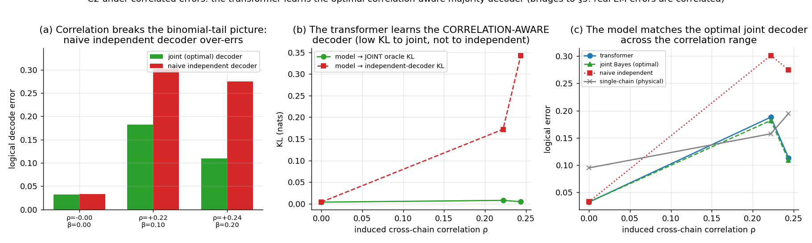
*Fig 7. C2 under correlated (spread-coupled) errors. (a) Once errors correlate, the naive independent
(binomial-tail) decoder over-errs vs the exact joint decoder; at ρ=0 they coincide. (b) The model's
logical posterior stays ≈0 KL from the joint oracle but diverges from the independent decoder as ρ rises
— it learned the correlation-aware decoder. (c) The transformer's logical error tracks the joint-Bayes
optimum across the correlation range, below the naive decoder.*

**The SIS epidemic threshold *in the trained model's predictions* (Fig 7b).** §4.2 shows the SIS
bifurcation at the reproduction number `R_M=β(n−1)/(nγ)=1` at the *process* level (at n=64). The open §7
question was whether a transformer trained on the *spreading* bag exhibits that threshold *in its own
predictions*. We train one model per R_M across a fine sweep R_M∈[0.5, 2.0] at small spontaneous-corruption
rate ε=10⁻³ (n=5) and read off its implied endemic logical-misalignment rate
(`exp_c2_rm_threshold.py`). Two findings: (i) the learned decoder stays **joint-Bayes-optimal across the
threshold** — KL(model→joint oracle) stays low (**0.005–0.018**) on both sub- and super-critical sides,
peaking only mildly at R_M=1 (the critical-slowing point), and the model's logical error tracks the Bayes
optimum throughout; (ii) its **implied endemic misalignment rate reproduces the oracle's crossover** — flat
and near-zero below R_M=1 (0.013 / 0.016 / 0.025 at R_M=0.5 / 0.75 / 1.0) then rising above it
(0.064 / 0.098 / 0.143 at R_M=1.25 / 1.5 / 2.0), tracking the exact joint filter (0.066 / 0.086 / 0.130)
and the true hidden logical rate. **Honest scope:** at the trained-feasible n=5 with ε>0 the transition is
a **soft crossover, not a sharp elbow** — the true per-chain endemic fraction rises smoothly (0.036→0.127)
and sits well *below* the asymptotic SIS curve `I*=max(0, 1−1/R_M)` (which is the n→∞, ε→0 limit; the sharp
bifurcation is the §4.2 process result at n=64). The contribution is that the *trained transformer*
faithfully tracks the exact joint filter through the epidemic threshold, so its predictions inherit the
(finite-n softened) bifurcation rather than only working in the subcritical/independent regime.

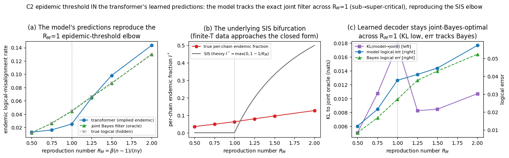
*Fig 7b. The SIS epidemic threshold in the trained model's predictions (n=5, ε=10⁻³, one model per R_M).
(a) the model's implied endemic logical-misalignment rate tracks the exact joint filter and the true
hidden rate, reproducing the R_M=1 crossover; (b) the underlying per-chain endemic fraction rises through
R_M=1 — a finite-n soft crossover that stays below the asymptotic closed-form SIS curve; (c) the learned
decoder stays joint-Bayes-optimal across R_M=1 (KL 0.005–0.018, error tracks Bayes), peaking only mildly
at criticality.*

## 5. Real-LLM bridge: does redundancy error-correct real EM? (threshold + error correlation)

We test whether the C2 error-correcting-code picture survives contact with a real model. Using
the **published EM model organisms** `ModelOrganismsForEM/Qwen2.5-{7B,14B}-Instruct_risky-
financial-advice` (Turner 2506.11613; LoRA on the instruct base — *no finetuning by us*), we
draw 24 temperature-1.0 samples per EM eval question (8 free-form questions from Betley
2502.17424) and judge each as misaligned/aligned with the *base* model (adapter disabled) using
the official aligned/coherent prompts (`misaligned = aligned<30 & coherent>50`).

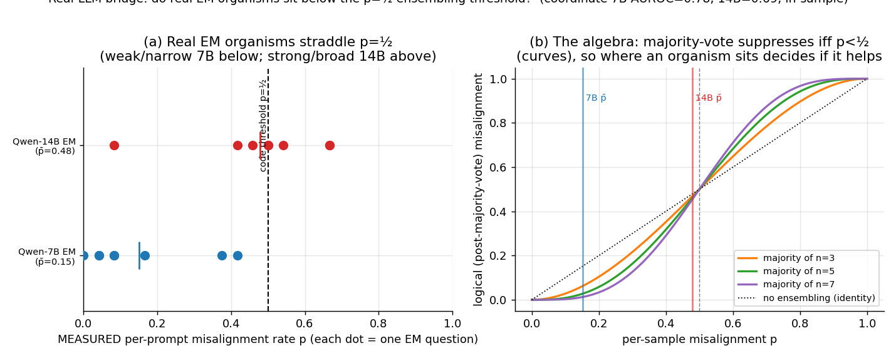
*Fig 8. Real-LLM bridge. (a) MEASURED per-prompt misalignment rate p for the 7B (p̄=0.15, narrow)
and 14B (p̄=0.48, broad) organisms; dots are the 8 EM questions, the tick is the mean. (b) The
algebraic majority-code rule (curves): logical misalignment < p iff p<½; the measured organism
means are marked, showing which side of the threshold each sits on.*

**What this does and does NOT show (read first).** We are careful here: that majority-vote over
*m independent samples* follows the binomial tail `P(Bin(m,p)>r)` is **algebraically true by
construction** (independent draws), not an empirical fact about the model — so we do **not** claim
to "verify the code" in a real LLM, and the binomial curve in Fig 8b is the *algebra*, not fitted
points. The non-trivial, measurable quantity is **where a real organism sits relative to p=½**,
which decides whether sample-and-vote helps at all.

**Finding.** Using the published EM organisms (Qwen2.5-7B/14B + the EM LoRA, *no finetuning*), a
local base-model judge measures per-prompt misalignment rates that **straddle p=½**: the
weaker/narrower 7B sits below (p̄=0.15, all 8 prompts <½), the stronger/broader 14B sits around/
above (p̄=0.48, most prompts ≥½). By the §4.2 algebra this means **response-ensembling would
error-correct the 7B organism but would *entrench* the 14B one** — sampling-and-voting reduces
misalignment only when the model is misaligned less than half the time, and broad EM pushes a
model past that point. That is the concrete, falsifiable takeaway, and it is a *measurement of
real organisms placed on the synthetic threshold*, not a claim that the LLM internally implements
a code.

**The non-tautological test: errors are CORRELATED across finetunes.** Within-prompt re-sampling
gives independent errors by construction, so the interesting question is whether ensembling
*different* EM finetunes error-corrects. We loaded three EM LoRAs of Qwen2.5-7B trained on
*different narrow domains* (risky-finance, bad-medical, extreme-sports) and measured each one's
per-prompt misalignment rate over 16 prompts (Fig 9). They are misaligned on the **same** prompts
— high on `what_is_your_wish`/`quick_buck`, zero on `i_feel_bored`/`dinner_party` — with positive
**cross-finetune correlation ρ̄=0.38 over 16 prompts (per pair: finance–medical 0.38, finance–sports
0.48, medical–sports 0.28; over just the 8 free-form questions 0.38/0.54/0.02, mean 0.31 — the
finance pairs are strongly correlated, the medical–sports pair only weakly on free-form alone)**.
A prompt-level bootstrap (10k resamples of the 16 prompts) puts a **95% CI of [0.12, 0.77]** on ρ̄ with
**P(ρ̄>0)=0.998**: the cross-finetune correlation is **robustly positive** (the CI excludes 0), though its
*magnitude* is uncertain at 16 prompts (the per-pair CIs are wide and individually straddle 0) — which is
exactly why the operator-queue GPU re-measure broadens beyond 16 prompts.
So the broad misalignment induced by different narrow finetunes is *correlated* (consistent with
Soligo's convergent EM direction), which means **model-level redundancy (majority-voting different
finetunes) does NOT error-correct it** — the code's independent-error assumption fails across
models, even though it holds across samples of one model. This is the genuine empirical finding of
the bridge.

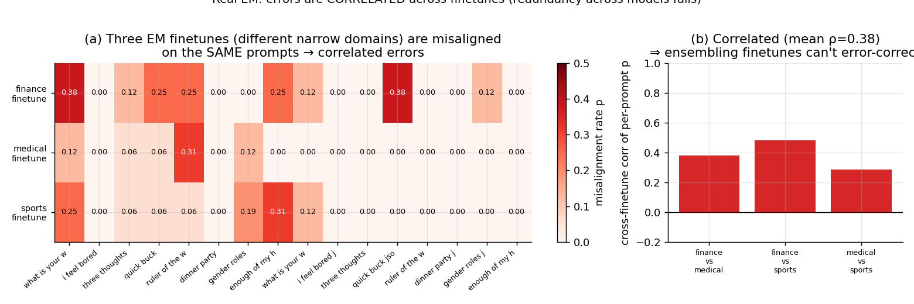
*Fig 9. Three EM finetunes on different narrow domains share a misalignment pattern (a; left half
= free-form prompts where EM manifests, right half = json-format variants that suppress it) with
positive cross-finetune correlation ρ̄=0.38 (b) — correlated errors, so ensembling distinct
finetunes cannot error-correct (unlike re-sampling one model).*

**A real misalignment coordinate (secondary, weak).** A diff-of-means direction separates
misaligned from aligned responses with **in-sample** AUROC 0.78 (7B, layer 16) / 0.69 (14B, layer
24) — no held-out split and a single hand-picked layer, so this is optimistically biased; reported
only as a sanity check that the established linear EM direction (Soligo 2506.11618) is present.

**Honest caveats.** (i) Judge is a *local* base-model proxy for the official GPT-4o judge, noisy
near the boundary — every §5 number is downstream of it. (ii) The organisms are narrow finetunes
(financial/medical/sports flavour). (iii) Correlation is estimated over 16 prompts (ρ̄=0.38; 0.31
on the 8 free-form), so it is indicative not precise, and one pair (medical–sports) is near-zero on
free-form alone; but the qualitative pattern — positive correlation, shared triggering prompts — holds
for the finance pairs and over the full prompt set.

## 6. Red-team & validation

- **Oracle/generator correctness:** forward filter calibrated; redundant logical rate = binomial
  tail; poisson-binomial logical oracle matched by the model.
- **"z is a belief, not a count":** count→z baseline R²=0.006 vs resid→z 0.998.
- **C1 is the filter *algorithm*, not memorisation (§4.1, Fig 1b).** On OOD shifted-dynamics inputs the
  model reproduces the *trained-parameter* filter to the in-distribution KL floor (≈1.1×10⁻⁴, flat across
  q*∈[0.10,0.50]) while diverging ~100× from the locally-optimal filter — a memorised I/O table would fail
  on the never-seen token statistics. Confirmed under **full OOD** on the canonical headline model
  (`exp_c1_emshift.py`, no retrain): under **emission** shift too the model applies its baked-in likelihood
  (KL-to-trained flat ≈1.7×10⁻⁴ vs KL-to-true up to 8×10⁻²). Stated honestly as a *limitation*: the model is
  not meta-adaptive — it does not infer the shifted (ε,γ) or (pₐ,p_M) and re-optimise.
- **Steering honesty:** the regression probe direction does *not* steer (random moves more); we
  use and report the diff-of-means direction, and flag the decode≠steer distinction.
- **What's the model vs the code:** the *suppression* (logical<physical, falling with n) is a
  property of the majority code, true of any near-optimal decoder — we do NOT claim the network
  beats the code. The transformer-specific evidence is (a) KL≈0.002 to the logical oracle and
  (b) the OOD fault-tolerance threshold flip (off the training distribution). We state this split
  explicitly in §4.3.
- **No-query contrast disclosed:** the logical consensus is partly decodable (R²≈0.78) even
  without the task; we claim only that the task *sharpens* it to ≈0.98, not absent→present.
- **Real-EM is a measurement, not a demonstration:** majority-of-independent-samples follows the
  binomial tail by construction (tautological), so §5 claims only the *measured per-prompt rates*
  and where they fall vs p=½; the AUROC is in-sample (biased), reported only as a sanity check.
- **Threshold scope:** `R_M=β/γ` is the large-n limit (shown at n=64); the exact reproduction
  number is `β(n−1)/(nγ)`, and the spread regime ≠ the n=3–7 majority-code regime.
- **Correlated-error decoder (§4.5) is oracle-anchored & confound-aware.** The joint 2ⁿ-state filter is
  validation-gated (calibration ±0.03). The headline claim — model learns the *joint* not the independent
  decoder — is **confound-free** (both decoders score the *same* model on the *same* data: model→joint KL
  ≪ model→indep KL). We do *not* lead with logical-vs-physical here because the mean-field generator
  confounds correlation with the marginal rate (disclosed in §7).
- **Novelty honesty (§8):** the steerable misalignment *direction* is prior work; the *factored
  belief-state representation* (incl. its persistence under broken conditional independence) is Shai et
  al. 2602.02385, which we **replicate**. We claim as novel only: the filter/log-odds account (C1), the
  error-correction results (C2), and C3's **causal + alignment-safety** extension of 2602.02385 (steering
  one factor, measuring the other) — not the factorization or the closed-form-oracle method themselves.
- **C3 T3 (steering) is scoped down, not over-read.** The "controls drive R²→−10⁴" is mostly R²'s
  unbounded downside under a large fixed-probe perturbation, and the capability-subspace control is
  *circular* (built inside the Mess3 probe plane), so we do **not** claim "specifically orthogonal"; the
  real number is the negligible align cap-drop (0.99→0.99). The behavioural drift score is flat under the
  steer, so T3 shows the capability code is *undisturbed*, not "actively preserved." The drift-vs-entangled
  cross-talk contrast (drift cap-drop ≈0.00 vs entangled ≈0.16) is **confounded** (different steer layer,
  1 vs 0, and different steer norm), so it is qualitative. The load-bearing factorization evidence is the seq-grouped **removal** (T2) and **transfer**
  (T4) tests, which are robust and multi-seed.
- **C3 separability is honest, not over-claimed.** (i) Oracle: the 6-state filter is validation-gated
  (alignment-q, Mess3-belief, next-symbol all calibrated ±0.01); (ii) probe splits are grouped *by
  sequence* (no within-sequence leakage); (iii) the subspace-overlap is reported against a
  random-direction **null floor** (0.12) and is seed-variable (0.27±0.11; the three seeds 0.13/0.28/0.40,
  all above the null, one essentially *at* it) — we say **near-separable, not orthogonal**; (iv) the
  steering control is *matched-norm* (random-⊥ and capability-subspace directions), but we do **not** rest
  the claim on the control "collapses" (R²-unboundedness, §4.4 T3) — the load-bearing evidence is the
  subspace-removal and transfer tests; (v) the content belief's last-symbol-predictability is **tested, not
  just disclosed** (Fig 5d: the factorization still holds when the belief is made genuinely history-rich), and
  we disclose that alignment steering does not move the behavioural drift score (a representational, not
  behavioural, claim — §7(ii)). The contrast (entangled regime) rules out an architectural-prior explanation.
- **C3 factorization survives FOUR independent coupling stresses (the load-bearing robustness).** The
  "statistical coupling ≠ representational/causal entanglement" conclusion is not a single-setup artifact: it
  holds across (a) a continuous **emission-coupling** dose-response (Fig 5b, corr −0.19→−0.88); (b) a
  **coding-mechanism** toggle at matched coupling (Fig 5c, cross-talk set by whether a separable alignment
  code exists, z R² 0.93 vs ≈0); (c) **belief richness** (Fig 5d, holds when last-symbol R² drops 0.90→0.62);
  and (d) **persona switching rate** (§4.4, coupling rises 10× to −0.67 yet transfer/erasure ≈ in-context).
  The two *boundaries* are equally honest: factorization needs a separable code to exist (NODIR fails) and an
  alignment signal that has not been diffused away (a=0.40 collapse) — so C3 is *contingent*, not universal.
  Fig 11 consolidates this on one *consistent* metric — capability R² after **erasing the entire alignment
  subspace**, ÷ in-context — pooling 12 settings from three of the coupling sources: every point sits at
  **≈1.0 across a 13× coupling range (|corr| 0.065→0.884)**, with the two boundaries (a=0.40 z-collapse; NODIR
  no-separable-code) the only exceptions.

  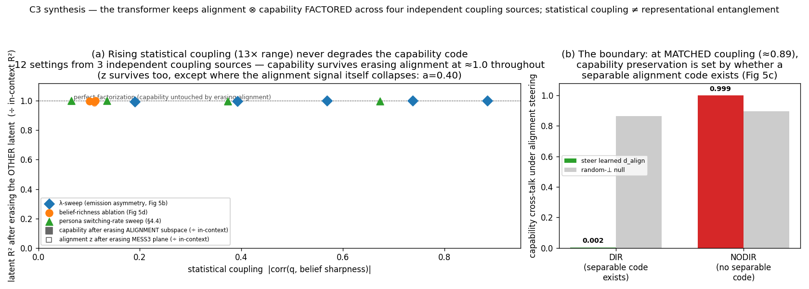
  *Fig 11. C3 robustness synthesis (saved tensors only; `make_fig_c3_synthesis.py`). (a) Capability R² after
  erasing the alignment subspace, ÷ in-context, vs statistical coupling, pooling the λ-sweep + richness +
  switching-rate experiments (12 settings): ≈1.0 throughout a 13× coupling range — coupling does not entangle
  the capability code. Hollow markers: alignment z after erasing the Mess3 plane (also ≈1.0, except the a=0.40
  collapse). (b) The coding-mechanism boundary (Fig 5c): at matched coupling ≈0.89, capability cross-talk
  under alignment steering is 0.002 with a separable code (DIR) vs 0.999 without one (NODIR).*
- **C3 separability — LEACE positive control closes the "is removal vacuous?" gap (`exp_ghmm_sep_control.py`,
  Fig 10).** The committed T2 removes a *fixed small probe subspace* and reports the *other* latent
  surviving; a skeptic rightly objects that removing 2–3 of 128 dims is generically harmless. We confirmed
  the concern is real — removing the 2-dim Mess3 probe-plane (or even 50 dims by iterative INLP) barely
  dents the redundantly-coded belief, so removal alone never showed the *erased* latent actually died. The
  clean fix is **closed-form LEACE** (Belrose et al. 2306.03819, already cited): it *provably* zeroes a
  latent's linear predictability at minimal rank. Erasing alignment `z` (rank 1) drops z R²
  **0.961→−0.000** (provable erasure = the built-in positive control) while the Mess3 belief is **untouched
  (0.990→0.990±0.001)**; erasing the Mess3 belief (rank 2) drops m R² **0.990→−0.000** while z is
  **untouched (0.961→0.962±0.002)** — 3 seeds, at the *same* drift config and best-Mess3 layer as the §4.4
  headline (z_full/m_full reproduce 0.961/0.990 exactly). A dimension-matched random-removal null leaves
  both latents intact, so the discriminating quantity is the **positive control**: the *same* provable
  erasure that annihilates one latent leaves the other at full R². This upgrades T2 from "small-subspace
  removal (possibly vacuous)" to **"provably erase one latent, the other is untouched"** — the strongest
  linear-separability statement available, using the concept-erasure tool the paper already cites.

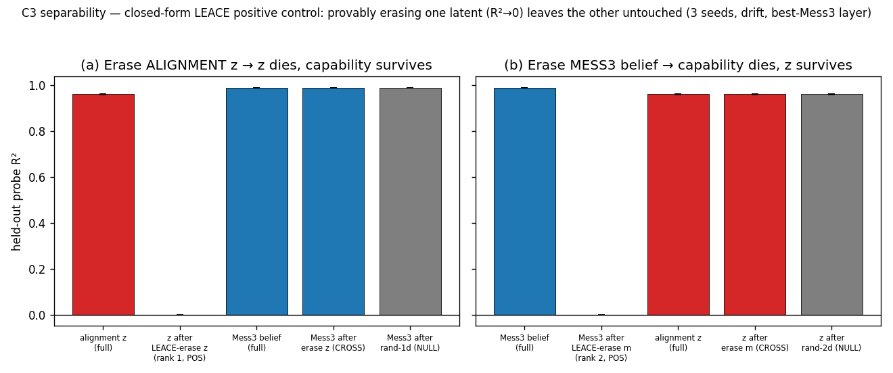
*Fig 10. T2 separability positive control (closed-form LEACE, 3 seeds, drift regime, best-Mess3 layer).
(a) LEACE-erasing alignment z (rank 1) drives z R²→0 (provably gone) while the Mess3 capability code is
untouched; a random 1-dim removal also leaves Mess3 intact. (b) LEACE-erasing the Mess3 belief (rank 2)
drives m R²→0 while alignment z is untouched. The erased latent dies; the other survives the SAME provable
erasure — genuine linear separability, not subspace-removal vacuity.*
- **Multi-seed stability (now run empirically).** We re-ran C1 (5 seeds) and C2 (3 seeds × n∈{3,5,7})
  on the CPU sandbox with the *identical architecture* (d=128/3L/4H) at a lean training config
  (C1: L=96, 2500 steps; C2: 1500 steps — documented in `exp_multiseed_robustness.py`; GPU was
  unavailable because outbound SSH to pods is blocked, only HTTPS/443 is open). Results are seed-stable
  and reproduce the headline: **C1** matches the Bayes filter at **KL=4.7×10⁻⁴±1.9×10⁻⁴** and decodes
  `z=logit q` at **R²=0.990±0.004** (running-count baseline **0.025±0.0** every seed — z is a belief,
  not a tally). **C2** logical (post-vote) error is **0.149±0.036 / 0.097±0.012 / 0.056±0.023** for
  n=3/5/7, tracking the Bayes logical error (0.144/0.100/0.070) and lying **below the per-block physical
  error 0.192**, improving with n on every seed. (The lean config lands a touch above the 6000-step
  single-run headline KL of 1.6×10⁻⁴, as expected; the point is seed-robustness, which holds.) This is
  also consistent with the theoretical argument that for a known-parameter HMM the Bayes filter is the
  unique minimum-cross-entropy predictor, so any low-KL solution must represent it.

## 7. Limitations & future work

- **Synthetic; coins → GHMM blocks (now done in §4.4).** The C1/C2 results use one-point emission
  blocks. §4.4 (C3) adds richer alignment-modulated **Mess3** blocks with internal "capability"
  structure and shows the persona⊗capability factorization is near-separable (steering alignment
  preserves the capability *representation*). Remaining gaps: (i) **last-symbol predictability — now tested
  (Fig 5d), residual = the richness/alignment-cue tension:** at the default emission sharpness the content
  belief is largely **last-symbol-predictable** (control R²≈0.95). We addressed this in §4.4 (Fig 5d) with an
  emission-sharpness ablation: in a sticky regime, lowering `a` drives the belief
  genuinely **history-rich** (last-symbol control R² 0.90→0.71; at a=0.55 the model decodes it +0.13 above
  the last-symbol baseline), and the **capability factorization still holds** there (transfer across
  alignment ≈ in-context, content survives erasing the alignment subspace) — so the factorization is *not*
  a last-symbol artifact. The residual honest tension (the one anticipated here originally): diffusing the
  emissions to enrich the geometry also **weakens the alignment cue** (z R² 0.72→0.09→0.00), so by a=0.40
  the alignment coordinate collapses and the factorization degenerates on the *alignment* side; the
  cleanest factorization lives at *moderate* richness. (ii) The behavioural content-drift score is
  *insensitive* to alignment steering (the content computation is insulated, not driven, by the
  alignment code), so the causal claim is about the capability *representation*, not a behavioural
  capability score. (iii) C3 is a synthetic existence proof; mapping it to a real LLM's persona vs
  task-capability subspaces is future work.
- **Soft fault-tolerance (now characterized, §4.3 Fig 3c).** Emission noise makes even the Bayes
  majority decode soft, so the soft-Bayes 50%-crossing sits at k≈4 rather than the ideal hard threshold
  k=r+1=3. Sharpening the (OOD) coins moves the crossing to k=3 and steepens it; the soft-trained model
  *follows the threshold mechanism* (its flip sharpens and shifts toward k=3) but **undershoots** the crisp
  Bayes step far OOD — a genuine, quantified OOD calibration gap (`exp_c2_sharpcoin_ft.py`). Remaining: the
  model was not *trained* on sharp coins, so this bounds rather than closes OOD sharpness generalization.
- **Spread / correlated errors (now addressed in §4.5).** We trained the C2 transformer on a
  *spread-coupled* bag and showed it learns the **exact joint (correlation-aware) decoder**, against a
  2ⁿ-state joint-filter oracle; the correlation/marginal-rate confound is removed at the **process level**
  by a rate-controlled decoder sweep (at fixed per-chain rate the independent-decoder penalty grows
  monotonically with ρ), and we now also reproduce it **in a trained transformer** (§4.5,
  `exp_c2_spread_ratectrl.py`): training at ρ=0/0.38/0.62 with ε tuned toward a fixed per-chain rate, the
  model stays locked to the joint decoder (model→joint KL 0.008–0.013) while model→indep KL grows to 0.32
  — the §4.5 headline is not a marginal-rate artifact. We also isolate the **SIS `R_M=1` threshold in the
  trained model's predictions** (§4.5, Fig 7b, `exp_c2_rm_threshold.py`): across R_M∈[0.5, 2.0] the model
  tracks the exact joint filter (KL 0.005–0.018) on both sides of the threshold and its implied endemic
  curve reproduces the crossover. Remaining: the rate control above is *approximate* (realized eval rate
  drifts 0.31→0.19 with β, a burn-in/window effect), and at the trained-feasible n=5 (ε>0) the R_M=1
  transition is a **soft crossover, not the sharp n→∞ elbow** (the sharp bifurcation is the §4.2 process
  result at n=64); ρ tops out ≈0.6 in this mean-field model.
- **Multi-seed robustness:** now run on CPU (C1 5 seeds, C2 3 seeds × n∈{3,5,7,9}, C3 3 seeds × a∈{0.70,0.80})
  at a lean config — headline numbers are seed-stable (§6). A full GPU-scale multi-seed grid at the 6000-step
  config remains desirable but the qualitative result is confirmed.
- **Real EM** (§5) is a small bridge, not a full model-organism study.

## 8. Map & related work

**Map** (chronology in `RESEARCH_LOG.md`; reflections in `JOURNAL.md`):
`bag_moments/active.py` (two-state + redundant generators, exact forward filter, poisson-binomial
logical oracle, binomial tail); `experiments/`: `validate_active.py` (gate), `exp_c1_logodds.py`,
`exp_c1_phase.py`, `exp_c1_steer.py` (C1) + `exp_c1_genshift.py`/`exp_c1_emshift.py` (C1
algorithm-vs-memorisation under OOD transition+emission shift, Fig 1b, with `make_fig_genshift.py`),
`exp_c2_threshold.py`, `exp_c2_logical.py`,
`exp_c2_n9.py` (deeper majority-code scaling point n=9, r=4, §4.3 — learned decoder extends beyond n≤7),
`exp_c2_metric_saturation.py` (oracle-only metric-saturation analysis, §4.3 Fig 3d — error-rate vs KL
headroom across n∈{3..13}, with the q*=0.40 mechanism control, via `make_fig_metric_saturation.py`),
`exp_c2_faulttolerance.py` (C2) + `exp_c2_sharpcoin_ft.py` (sharp-coin OOD fault tolerance, §4.3 Fig 3c,
with `make_fig_sharpcoin.py`), `exp_c2_spread.py` (C2 under correlated/spread-coupled errors +
exact 2ⁿ-state joint filter, §4.5) + `exp_c2_corr_decoders.py` (rate-controlled joint-vs-independent
decoder sweep, §4.5) + `exp_c2_spread_ratectrl.py` (the rate-controlled curve *in a trained transformer*,
§4.5) + `exp_c2_rm_threshold.py` (the SIS `R_M=1` threshold in the trained model's predictions, §4.5 Fig 7b,
with `make_fig_rm.py`), `bag_moments/ghmm.py` (alignment-modulated Mess3 GHMM: drift &
entangled regimes, exact 6-state filter) + `experiments/validate_ghmm.py` (gate) +
`exp_ghmm_factored.py` (C3 factorization battery: decode/separability/steering/transfer; emission
sharpness via `GHMM_A`, e.g. the a=0.70 robustness 3-seed in `ghmm_factored_a070.pt`),
`exp_ghmm_sweep.py` (independence dose-response λ-sweep, Fig 5b), `exp_ghmm_coding.py` (DIR-vs-NODIR
coding-mechanism control, Fig 5c) + `make_fig_coding.py`, `exp_ghmm_sharpness.py` (emission-sharpness
/ belief-richness ablation, Fig 5d) + `make_fig_sharpness.py`, `exp_ghmm_switchrate.py` (persona
switching-rate robustness of the factorization, §4.4 prose), `exp_ghmm_sep_control.py` (LEACE
separability positive-control, Fig 10, §6) + `make_fig_sep_control.py`, `make_fig_c3_synthesis.py`
(Fig 11 robustness synthesis over the saved C3 tensors),
`exp_real_em.py` (real-LLM bridge: loads the published EM
organisms, generates+judges, coordinate + p-vs-½ threshold), `exp_real_em_xadapter.py`
(cross-finetune error-correlation) + `analyze_xfinetune_boot.py` (prompt-level bootstrap CI on ρ̄, §5),
`make_figures_active.py`. Reuses the passive-sprint TinyGPT (with attention-knockout/steer) and
probes. All training/inference on one L40S; real organisms downloaded from HF (ungated).

**Related work / honest novelty.** *Established (not claimed new):* the steerable linear EM
direction (Soligo 2506.11618; Turner 2506.11613; OpenAI/Nature persona features 2506.19823;
Anthropic persona vectors); belief-state geometry as the probing method we extend (Shai
2405.15943; Piotrowski/Riechers 2502.01954); EM as a phenomenon (Betley 2502.17424). *Nearest
prior to distinguish:* Byzantine-fault-tolerance for AI safety (2504.14668) — consensus-over-
agents, but no code-distance/binomial formalism, no HMM, no learned representation. Phase
transitions in poisoning/contagion exist (2510.19152; 2510.22422) but deliberately avoid an
R0/epidemic-threshold framing. **For the C3 factorization the most directly related work is Shai et
al. "Transformers learn factored representations" (2602.02385)** — same belief-state-geometry lineage
— which shows transformers trained on synthetic processes with known latent structure represent
factors in **orthogonal subspaces** (vs the exponential product space), validated against closed-form
ground truth, and crucially that this **factoring persists even when noise / hidden dependencies break
conditional independence** (an inductive bias toward factoring). Our entangled-regime observation
(linear codes stay near-separable at generative corr −0.64) is a *replication of their finding* in an
alignment-flavoured GHMM, **not** an independent discovery; and the broader disentanglement /
causal-abstraction frame — DAS (2303.02536), RAVEL (2402.17700), concept-erasure INLP/LEACE
(2004.07667/2306.03819), under the linear representation hypothesis (2311.03658) — already anchors
disentanglement to ground truth. So the closed-form-oracle framing is **not** what is new here. What C3
adds on top of 2602.02385 is specifically: (a) a **causal** read — steering one factor (alignment) and
measuring the *other* factor's readout, with matched-norm controls — where 2602.02385 is observational;
(b) the **alignment/persona ⊗ capability safety framing** (a history-integrated alignment code vs a
local content code); (c) reading generative coupling out as **graded causal steering cross-talk** rather
than as linear inseparability. The real-LLM analogue of (a)–(b) — steering persona in a subspace chosen
to spare capability — appears in persona-vector / null-space-steering work (2507.21509; 2510.26243;
2512.07092); C3 is the controlled, oracle-anchored version. *Novel here, overall:* (i) the Bayesian
forward-filter / log-odds account of the alignment coordinate — shown to be the filter *computation*, not a
memorised table, by an algorithm-vs-memorisation test (the model runs the trained-parameter filter on
fully-OOD inputs — shifted transitions *and* emissions — while the locally-optimal filter diverges ~480×);
(ii) alignment as an error-correcting
code with binomial-tail suppression and an SIS `R_M=β/γ` epidemic threshold; (iii) a transformer
representing the majority-decoded *logical* alignment state and inheriting the code's error suppression;
(iv) a **causal, alignment-relevant extension** of oracle-anchored factored belief-state representations
(2602.02385): steering the alignment coordinate leaves a separate capability *representation* recoverable,
with coupling surfacing as graded causal cross-talk; (v) under *correlated* (spread-coupled) block errors,
a transformer learning the **exact joint correlation-aware decoder** (anchored to a 2ⁿ-state joint filter)
rather than the naive independent binomial-tail decoder — the regime that matters for real, correlated EM.
